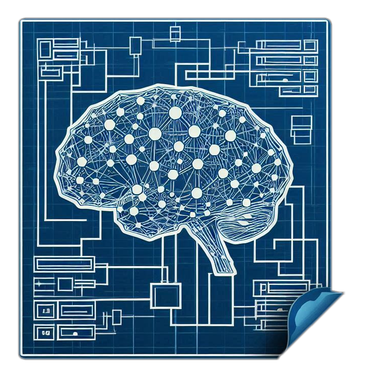
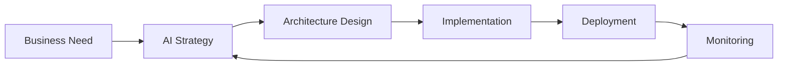
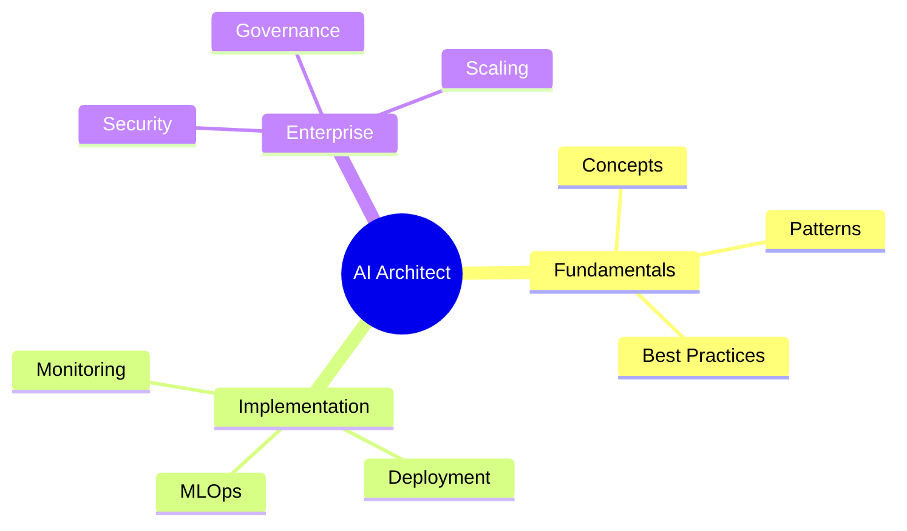

# Introduction

{: width="300px"}

# Embarking on Your AI Architecture Journey

Welcome to the **AI Architect Handbook** - your definitive guide to mastering the art and science of AI systems architecture. Created and open-sourced by Inference Institute, this comprehensive resource empowers architects and developers to craft robust, scalable, and ethical AI solutions.

## Our Mission

We're here to transform complex AI architectural concepts into actionable insights:

- 🎯 Decode enterprise-grade AI system design
- 🔄 Master MLOps and continuous learning pipelines
- 🏗️ Build resilient, scalable AI infrastructures
- 🤝 Foster collaborative AI development practices

## Core Knowledge Domains

The handbook navigates through critical areas:

### Foundation Layer
- AI/ML fundamentals
- Distributed systems architecture
- Data engineering patterns
- Model orchestration frameworks

### Implementation Layer
- MLOps & DevOps integration
- Scalable infrastructure designs
- Model serving architectures
- Performance optimization

### Enterprise Layer
- Governance frameworks
- Security protocols
- Cost optimization
- Compliance standards

## Perfect For

- 🏛️ Solution Architects designing next-gen AI systems
- 🔬 ML Engineers building production pipelines
- 🛠️ DevOps specialists managing AI infrastructure
- 📊 Technical Leaders steering AI initiatives

## Navigation Guide

## Join Our Community

This is a living document, evolving with the rapid pace of AI advancement. Your expertise and insights can help shape the future of AI architecture. Join us on GitHub to contribute.

Let's architect the future of AI, together. 🚀