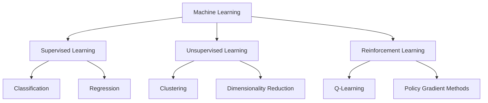
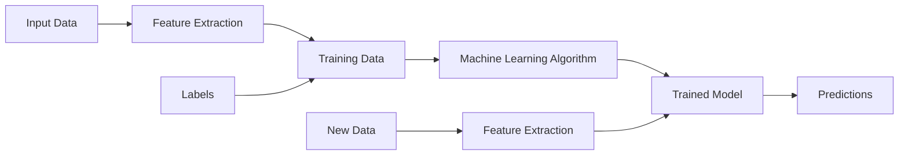
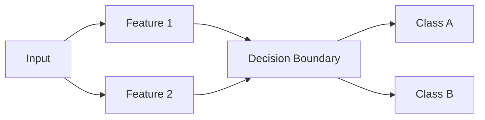
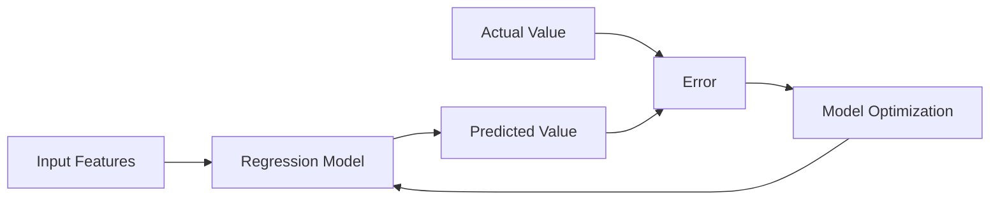
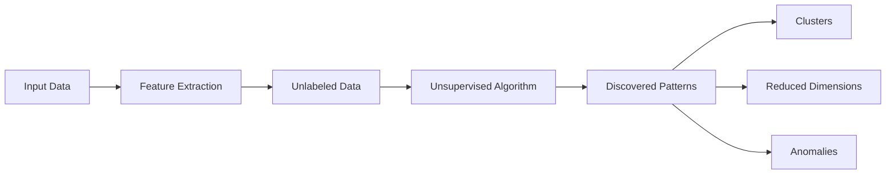
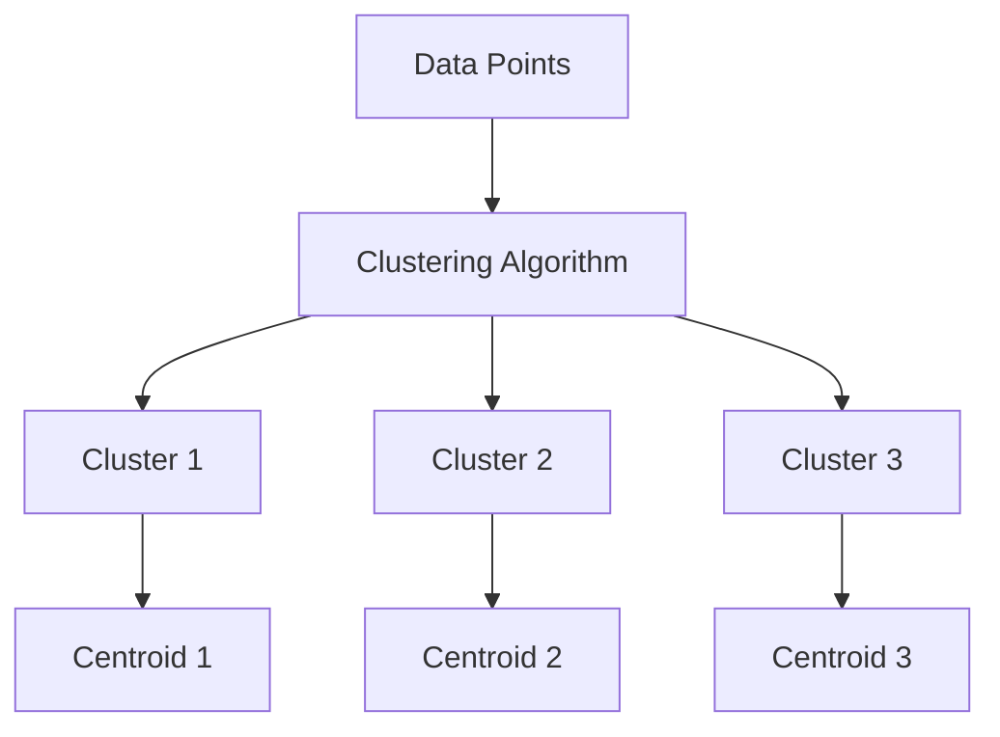
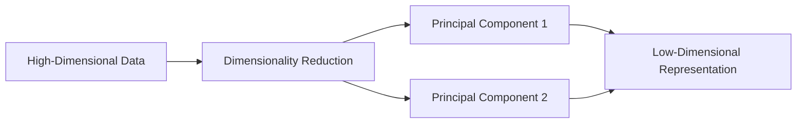
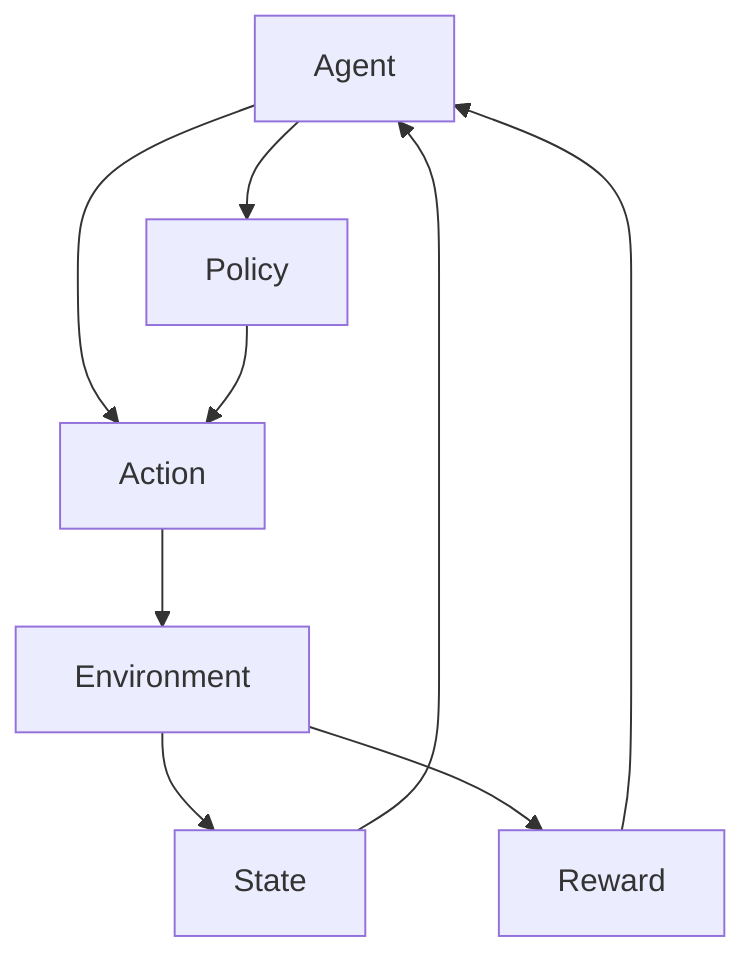
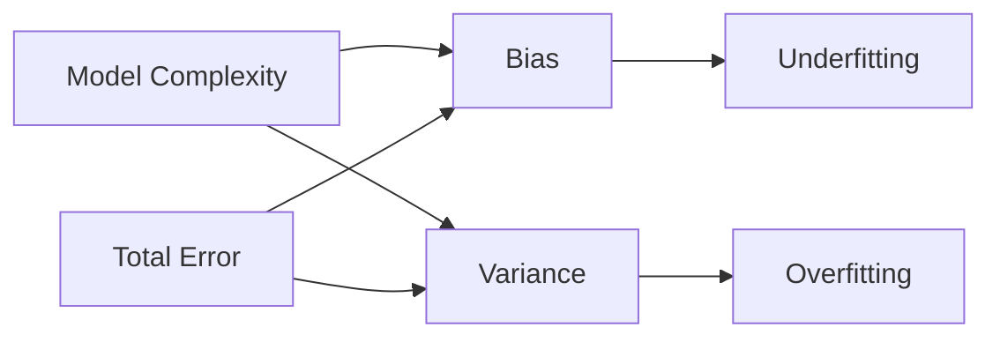

# Machine Learning Basics

## Introduction to Machine Learning

Machine Learning (ML) is a transformative field within Artificial Intelligence that empowers computers to learn from data and improve their performance over time without explicit programming. At its core, ML is about recognising patterns and making intelligent decisions based on experience.

### Key Characteristics of Machine Learning:

1. Data-driven: ML models learn from examples rather than following pre-programmed rules.
2. Adaptive: They improve their performance with more data and experience.
3. Automated: Once trained, ML models can make predictions or decisions with minimal human intervention.
4. Generalizable: Well-designed ML models can perform well on new, unseen data.

### When to Use Machine Learning:

- Complex problems where traditional algorithms fall short
- Tasks requiring adaptability to changing environments
- Scenarios with large amounts of data that humans can't process efficiently
- Problems where patterns are not immediately apparent to human observers

## Types of Machine Learning

Machine learning approaches can be categorized into three main types, each suited to different kinds of problems and data availability.

### Supervised Learning

In supervised learning, the algorithm learns from labelled data, where both input features and corresponding output values are provided. It's like learning with a teacher who provides the correct answers.

#### When to Use Supervised Learning:

- When you have a clear target variable to predict
- When you have a labelled dataset
- For problems where you need to make specific predictions or classifications

#### Classification

Classification is used when the output variable is a category or class. The model learns to assign input data to predefined categories.

Examples:

- Email Spam Detection: Classifying emails as spam or not spam
- Medical Diagnosis: Predicting whether a patient has a certain disease based on symptoms
- Credit Risk Assessment: Determining if a loan applicant is likely to default

Real-world Application: 

In fraud detection for credit card transactions, a classification model could be trained on historical transaction data, learning to distinguish between legitimate and fraudulent transactions based on features like transaction amount, location, and time.

#### Regression

Regression is used when the output variable is a continuous value. The model learns to predict a numerical value based on input features.

Examples:

- House Price Prediction: Estimating the price of a house based on features like size, location, and age
- Sales Forecasting: Predicting future sales based on historical data and other relevant factors
- Temperature Prediction: Forecasting temperature based on various meteorological data

Real-world Application:

In the renewable energy sector, regression models can predict solar panel energy output based on factors like time of day, weather conditions, and panel characteristics, helping optimize energy grid management.

### Unsupervised Learning

Unsupervised learning deals with unlabelled data. The algorithm tries to find patterns or structures in the data without predefined outputs. It's like learning without a teacher, trying to make sense of the data on its own.

#### When to Use Unsupervised Learning:

- When you want to discover hidden patterns in data
- When you don't have labelled data
- For exploratory data analysis and feature learning

#### Clustering

Clustering groups similar data points together based on certain characteristics. It's useful for discovering inherent groupings in data.

Examples:

- Customer Segmentation: Grouping customers with similar buying behaviors
- Document Clustering: Organizing large sets of texts or documents into topics
- Anomaly Detection: Identifying unusual patterns in data, useful for fraud detection or system health monitoring

Real-world Application:

In retail, clustering can be used to segment customers based on purchasing history, demographics, and browsing behavior. This segmentation can then inform personalized marketing strategies and inventory management.

#### Dimensionality Reduction

Dimensionality reduction techniques aim to reduce the number of input variables in a dataset while retaining most of the important information.

Examples:

- Image Compression: Reducing the size of images while maintaining quality
- Noise Reduction: Removing irrelevant features from data
- Visualization: Reducing high-dimensional data to 2D or 3D for visualization

Real-world Application:

In genomics, dimensionality reduction techniques like PCA can be used to analyze large-scale genetic data, helping identify key genetic variations associated with certain traits or diseases.

### Reinforcement Learning

Reinforcement learning involves an agent learning to make decisions by taking actions in an environment to maximize a reward. It's like learning through trial and error.

#### When to Use Reinforcement Learning:

- For sequential decision-making problems
- When the goal is to optimize a long-term objective
- In scenarios where the environment can be simulated

Examples:

- Game Playing AI: Learning to play complex games like chess or Go
- Robotics: Teaching robots to navigate and manipulate objects
- Resource Management: Optimizing resource allocation in computer systems

Real-world Application:

In autonomous vehicles, reinforcement learning can be used to develop driving policies that adapt to various traffic conditions and road types, optimizing for safety, efficiency, and passenger comfort.

## Key Concepts in Machine Learning

### Features and Labels

- Features: Input variables or attributes used to make predictions. They are the characteristics of the data that the model uses to learn patterns.
- Labels: Output variables or target values we're trying to predict (in supervised learning). They are the "answers" that the model is trying to predict.

Example:

In a house price prediction model:

- Features might include square footage, number of bedrooms, location, age of the house
- The label would be the price of the house

### Training, Validation, and Test Sets

Properly splitting your data is crucial for developing reliable machine learning models:

| Dataset | Purpose | Typical Split | Description |
|---------|---------|---------------|-------------|
| Training Set | Used to train the model | 60-80% | The largest portion of the data, used to teach the model the underlying patterns |
| Validation Set | Used to tune hyperparameters and evaluate model during training | 10-20% | Used to provide an unbiased evaluation of the model fit on the training dataset |
| Test Set | Used to evaluate the final model performance | 10-20% | Provides the final evaluation of the model. Should only be used once the model is completely trained |

Best Practice: Always keep your test set completely separate and only use it for the final evaluation to get an unbiased estimate of your model's performance on new data.

### Model Evaluation Metrics

Choosing the right evaluation metric is crucial and depends on the specific problem you're solving:

#### Classification Metrics

- Accuracy: Proportion of correct predictions (both true positives and true negatives) among the total number of cases examined.
- Precision: Proportion of true positive predictions among all positive predictions.
- Recall: Proportion of true positive predictions among all actual positive cases.
- F1 Score: Harmonic mean of precision and recall, providing a single score that balances both metrics.
- ROC AUC: Area Under the Receiver Operating Characteristic curve, measuring the model's ability to distinguish between classes.

When to use which:

- Accuracy: Good for balanced datasets, but can be misleading for imbalanced ones.
- Precision: Use when the cost of false positives is high (e.g., spam detection).
- Recall: Use when the cost of false negatives is high (e.g., disease detection).
- F1 Score: Use when you need to balance precision and recall.
- ROC AUC: Good for evaluating the model's ability to discriminate between classes, especially useful for imbalanced datasets.

#### Regression Metrics

- Mean Squared Error (MSE): Average of the squared differences between predicted and actual values.
- Root Mean Squared Error (RMSE): Square root of MSE, in the same unit as the target variable.
- Mean Absolute Error (MAE): Average of the absolute differences between predicted and actual values.
- R-squared (R²): Proportion of the variance in the dependent variable that is predictable from the independent variable(s).

When to use which:

- MSE/RMSE: Use when large errors are particularly undesirable. RMSE is more interpretable as it's in the same unit as the target variable.
- MAE: Use when you want to treat all errors equally, regardless of their magnitude.
- R-squared: Use to understand how well your model explains the variability of the target variable.

### Bias-Variance Tradeoff

The bias-variance tradeoff is a fundamental concept in machine learning that deals with the model's ability to generalize to new, unseen data.

- High Bias (Underfitting): Model is too simple, fails to capture important patterns in the data
    - Signs: Poor performance on both training and test data
    - Solution: Increase model complexity, add more relevant features

- High Variance (Overfitting): Model is too complex, captures noise in the data
    - Signs: Excellent performance on training data, poor performance on test data
    - Solution: Simplify the model, use regularization techniques, gather more training data

The goal is to find the sweet spot that minimizes both bias and variance, resulting in a model that generalizes well to new data.

### Regularization

Regularization techniques help prevent overfitting by adding a penalty term to the loss function:

- L1 Regularization (Lasso): Adds absolute value of magnitude of coefficient as penalty term. Can lead to sparse models (feature selection).
- L2 Regularization (Ridge): Adds squared magnitude of coefficient as penalty term. Encourages smaller, distributed weights.
- Elastic Net: Combination of L1 and L2, benefiting from both approaches.

When to use:

- L1: When you suspect many features are not relevant
- L2: When you want to prevent any feature from having a very high weight
- Elastic Net: When you want a balance between feature selection and weight distribution

## Feature Engineering and Selection

Feature engineering is the process of creating new features or transforming existing ones to improve model performance. It's often considered more of an art than a science and can significantly impact model performance.

### Feature Scaling

Feature scaling is crucial when your features have different scales. It ensures that all features contribute equally to the model.

- Standardization (z-score normalization): Scales features to have zero mean and unit variance.
    - When to use: When you want your features to be normally distributed and when outliers are not a concern.

- Min-Max Scaling: Scales features to a fixed range, usually 0 to 1.
    - When to use: When you need values in a bounded interval and when the distribution is not Gaussian or unknown.

- Robust Scaling: Uses statistics that are robust to outliers.
    - When to use: When your data contains many outliers.

### Encoding Categorical Variables

Many ML algorithms require numerical input, so categorical variables need to be encoded:

- One-Hot Encoding: Creates binary columns for each category.
    - When to use: When there's no ordinal relationship between categories.

- Label Encoding: Assigns a unique integer to each category.
    - When to use: When there's an ordinal relationship between categories.

- Target Encoding: Replaces categorical variable with the mean of the target variable for that category.
    - When to use: When you have high cardinality categorical variables and want to leverage the target variable information.

### Feature Selection Techniques

Not all features are equally important. Feature selection helps identify the most relevant features:

- Filter Methods: Use statistical measures to score the correlation or dependence between input features and target variable.
    - Example: Correlation coefficient, chi-squared test
    - When to use: As a preprocessing step, computationally efficient for large datasets

- Wrapper Methods: Use a predictive model to score feature subsets.
    - Example: Recursive feature elimination
    - When to use: When you want to find the best performing features for a specific model

- Embedded Methods: Perform feature selection as part of the model training process.
    - Example: Lasso regularization, decision tree importance
    - When to use: When you want to combine feature selection with model training

Best Practice: Always perform feature selection after splitting your data into train and test sets to avoid data leakage.

## Model Training and Optimization

### Gradient Descent

Gradient descent is an optimization algorithm used to minimize the loss function during model training. It works by iteratively moving in the direction of steepest descent as defined by the negative of the gradient.

Types of Gradient Descent:
1. Batch Gradient Descent: Computes the gradient using the whole dataset.
   - When to use: For smaller datasets, when computing the cost function for the entire dataset is feasible.

2. Stochastic Gradient Descent (SGD): Computes the gradient using a single sample.
   - When to use: For larger datasets, when you need to start improving before processing the entire dataset.

3. Mini-batch Gradient Descent: Computes the gradient using a small batch of samples.
   - When to use: Most common in practice, balances the efficiency of batch gradient descent with the robustness of stochastic gradient descent.

### Hyperparameter Tuning

Hyperparameters are parameters that are not learned from the data but set prior to training. Proper tuning can significantly improve model performance.

Techniques for finding the best hyperparameters:

- Grid Search: Exhaustively searches through a predefined set of hyperparameters.
  - When to use: When you have a small hyperparameter space and enough computational resources.

- Random Search: Randomly samples from the hyperparameter space.
  - When to use: When you have a large hyperparameter space and limited computational resources.

- Bayesian Optimization: Uses probabilistic model to select the most promising hyperparameters to evaluate.
  - When to use: When evaluating hyperparameters is computationally expensive and you want to find good hyperparameters with fewer evaluations.

Best Practice: Always perform hyperparameter tuning using cross-validation to ensure that your tuning generalizes well.

## Challenges in Machine Learning

1. Overfitting and Underfitting: Balancing model complexity with generalization ability.
2. Imbalanced Datasets: When some classes are much more frequent than others, leading to biased models.
3. Curse of Dimensionality: As the number of features increases, the amount of data needed to generalize accurately grows exponentially.
4. Lack of Quality Data: Real-world data is often noisy, incomplete, or biased.
5. Interpretability vs Performance: More complex models often perform better but are harder to interpret.
6. Scalability and Computational Resources: Training large models or working with big datasets requires significant computational power.

## Emerging Trends in Machine Learning

1. AutoML (Automated Machine Learning): Automating the process of applying machine learning to real-world problems.
2. Federated Learning: Training models on distributed datasets without exchanging the data itself.
3. Few-shot and Zero-shot Learning: Ability to learn from very few examples or even no examples of a particular class.
4. Explainable AI (XAI): Developing methods to make AI decisions more interpretable and transparent.
5. Edge AI and TinyML: Deploying ML models on edge devices with limited computational resources.

## Best Practices in Machine Learning

1. Start with a clear problem definition: Understand what you're trying to achieve before jumping into modeling.
2. Collect and preprocess high-quality data: The quality of your data significantly impacts your model's performance.
3. Perform thorough exploratory data analysis: Understand your data before modeling.
4. Choose appropriate evaluation metrics: Align your metrics with your business objectives.
5. Use cross-validation for model evaluation: Ensures your model generalizes well to unseen data.
6. Regularize models to prevent overfitting: Helps in building models that generalize well.
7. Interpret and explain model predictions: Understand why your model is making certain predictions.
8. Monitor model performance in production: Models can degrade over time as data distributions change.
9. Continuously update and retrain models: Keep your models up-to-date with new data.
10. Stay updated with the latest research and techniques: The field of ML is rapidly evolving.

## Conclusion

> Machine learning is a powerful tool for solving complex problems and making data-driven decisions. 

By understanding the fundamentals, algorithms, and best practices outlined in this guide, you'll be well-equipped to tackle a wide range of machine learning projects. Remember that mastering machine learning is an ongoing journey, requiring continuous learning and practical application. As you apply these concepts, always consider the ethical implications of your work and strive to develop AI systems that are fair, transparent, and beneficial to society.