# Deep Learning and Neural Networks

## Introduction

Deep Learning is a subset of machine learning that uses artificial neural networks with multiple layers (deep neural networks) to model and process complex patterns in data. It has revolutionized fields such as computer vision, natural language processing, and speech recognition.

## Fundamental Concepts

### Artificial Neural Networks

Artificial Neural Networks (ANNs) are computing systems inspired by biological neural networks. They consist of interconnected nodes (neurons) organized in layers.

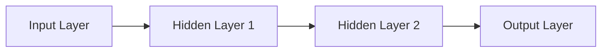

### Neurons and Activation Functions

Each neuron receives inputs, applies weights, adds a bias, and then passes the result through an activation function.

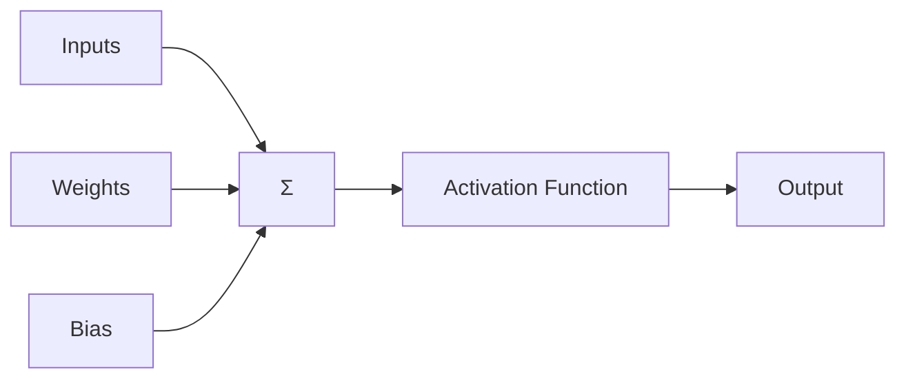

Common activation functions:

- **ReLU (Rectified Linear Unit)**: Used in hidden layers, helps with vanishing gradient problem
- **Sigmoid**: Used in binary classification output layers
- **Tanh**: Similar to sigmoid but zero-centered, often used in hidden layers
- **Softmax**: Used in multi-class classification output layers

### Backpropagation and Gradient Descent

Backpropagation is the algorithm used to train neural networks by adjusting weights based on the error gradient.

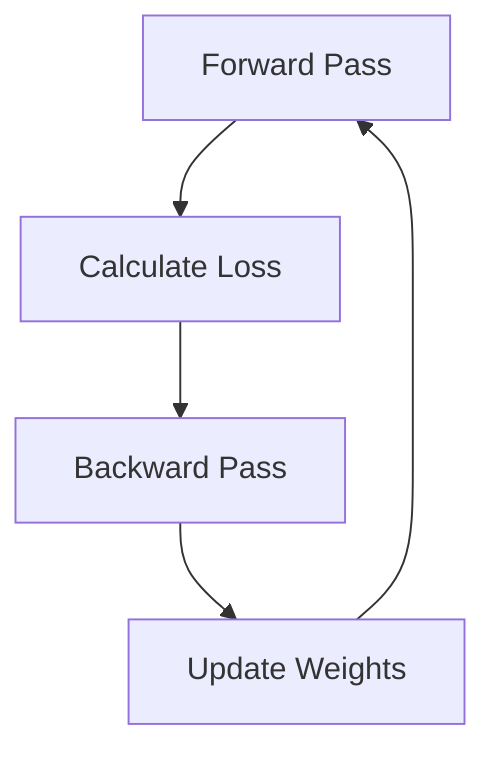

## Types of Neural Network Layers

### Dense (Fully Connected) Layers

Dense layers connect every neuron in one layer to every neuron in the next layer.

When to use:

- For non-sequential data
- As the final layers in many network architectures
- When you need to learn global patterns in the data

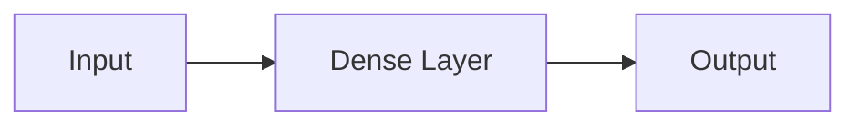

### Convolutional Layers

Convolutional layers apply filters to input data, often used in image processing tasks.

When to use:

- For grid-like data (e.g., images, time series)
- When you need to detect local patterns or features
- In early layers of image processing networks

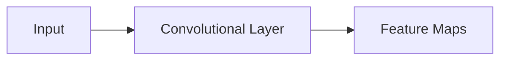

### Pooling Layers

Pooling layers reduce the spatial dimensions of the data, often used after convolutional layers.

When to use:

- To reduce computational complexity
- To make the network more robust to small translations in the input

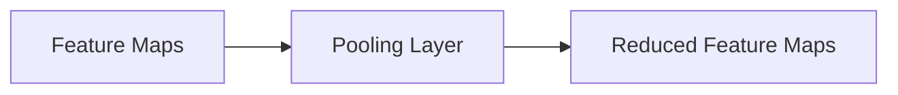

### Recurrent Layers

Recurrent layers maintain an internal state, making them suitable for sequential data.

When to use:

- For sequential data (e.g., time series, text)
- When the order of data points matters
- When you need to capture long-term dependencies

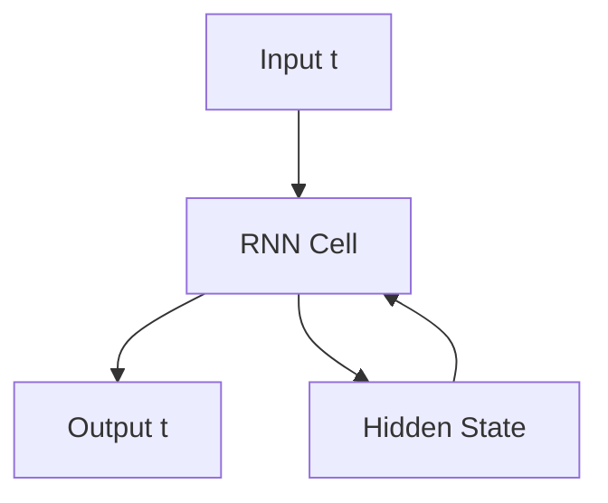

### LSTM and GRU Layers

Long Short-Term Memory (LSTM) and Gated Recurrent Unit (GRU) layers are advanced recurrent layers designed to better capture long-term dependencies.

When to use:

- For long sequences where standard RNNs struggle
- When you need to capture both long-term and short-term patterns
- In language modeling or speech recognition tasks

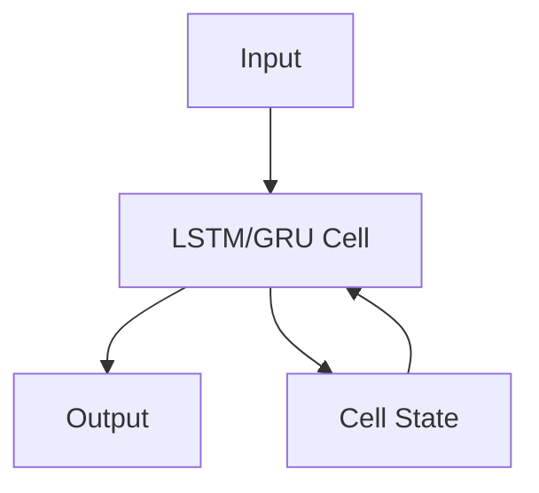

### Embedding Layers

Embedding layers transform discrete inputs (like words or categories) into dense vectors.

When to use:

- For categorical inputs with many possible values
- In natural language processing tasks
- As the first layer for text or categorical data inputs

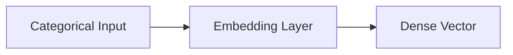

## Chaining Layers Together

The art of deep learning often lies in how layers are combined. Here are some common patterns:

### CNN Architecture

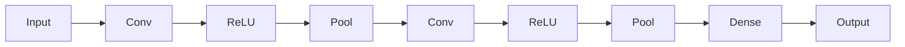

When to use: For image-related tasks, where you want to extract hierarchical features.

### RNN/LSTM Architecture

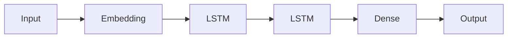

When to use: For sequential data, where order matters and you need to capture long-term dependencies.

### Encoder-Decoder Architecture

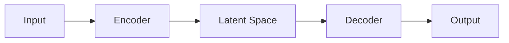

When to use: For sequence-to-sequence tasks like machine translation, or for unsupervised learning tasks like autoencoders.

## Best Practices for Layer Selection and Chaining

1. Start Simple: Begin with a basic architecture and gradually add complexity.
2. Consider the Data: Choose layers that match your data type (e.g., Conv for images, LSTM for sequences).
3. Depth vs. Width: Deeper networks can learn more complex features, but are harder to train. Wider networks can capture more information but may overfit.
4. Residual Connections: For very deep networks, consider adding residual connections to help with gradient flow.
5. Bottlenecks: Use narrower layers to force the network to learn compact representations.
6. Regularization: Add dropout layers or use L1/L2 regularization to prevent overfitting.
7. Normalization: Consider adding batch normalization layers to stabilize learning.

## Advanced Concepts and Groundbreaking Ideas

### Attention Mechanisms

Attention allows models to focus on relevant parts of the input when producing output.

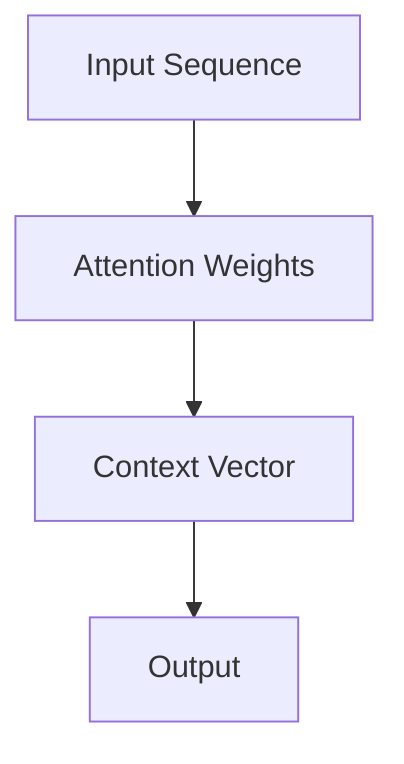

When to use: In sequence-to-sequence models, when you want the model to focus on different parts of the input for each output step.

### Transformers

Transformers use self-attention to process sequential data, allowing for parallelization and capturing long-range dependencies.

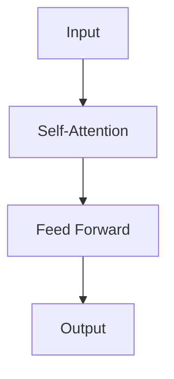

When to use: For natural language processing tasks, especially when dealing with long sequences or when you need to capture complex relationships between different parts of the input.

### Large Language Models (LLMs)

LLMs are massive transformer-based models trained on vast amounts of text data.

When to use: For a wide range of natural language tasks, including text generation, summarization, translation, and question-answering.

### Reinforcement Learning from Human Feedback (RLHF)

RLHF fine-tunes language models using human preferences, improving their alignment with human values and intentions.

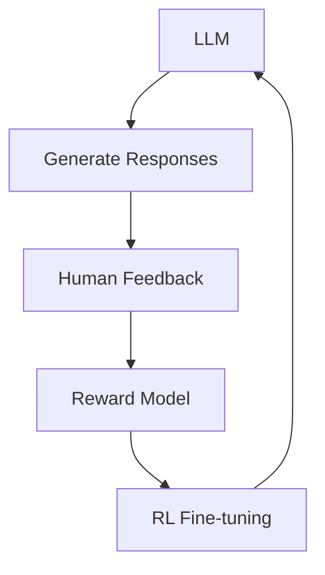

When to use: To improve the quality, safety, and alignment of language model outputs with human preferences.

### Few-Shot and Zero-Shot Learning

These techniques allow models to perform well on new tasks with little or no specific training data.

When to use: When you have limited labeled data for a specific task, or when you want a model to generalize to entirely new tasks.

### Neural Architecture Search (NAS)

NAS automates the process of designing neural network architectures.

When to use: When you want to optimize network architecture for a specific task or dataset, especially when traditional architectures aren't performing well.

## Challenges and Considerations

1. Computational Resources: Deep learning often requires significant computational power. Consider cloud computing or GPU acceleration.
2. Data Requirements: Deep learning models typically need large amounts of data. Consider data augmentation or transfer learning for smaller datasets.
3. Interpretability: Deep models can be black boxes. Consider using techniques like SHAP values or integrated gradients for interpretability.
4. Ethical Considerations: Be aware of biases in your data and model outputs, especially for models that make important decisions.

## Conclusion

Deep Learning and Neural Networks have dramatically advanced the field of AI, enabling breakthroughs in various domains. As you embark on your deep learning journey, remember that the key to success often lies in understanding your data, starting simple, and iterating based on empirical results. While the field is rapidly evolving with groundbreaking concepts like transformers and RLHF, the fundamental principles of layering, backpropagation, and thoughtful architecture design remain crucial. As you develop your skills, always consider the ethical implications of your work and strive to create AI systems that are beneficial, fair, and aligned with human values.