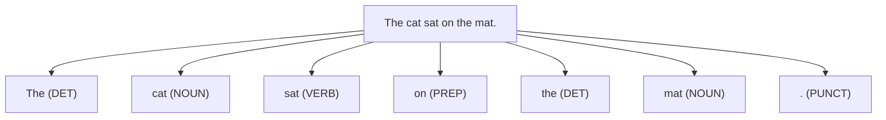
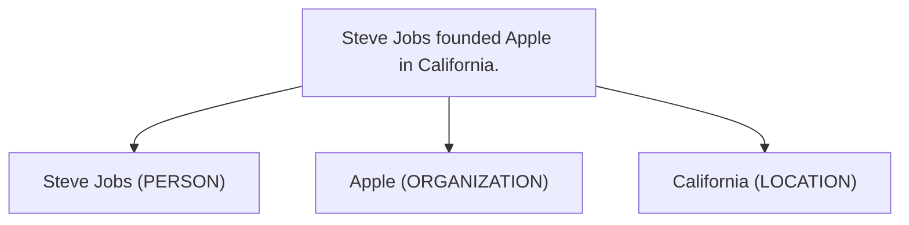
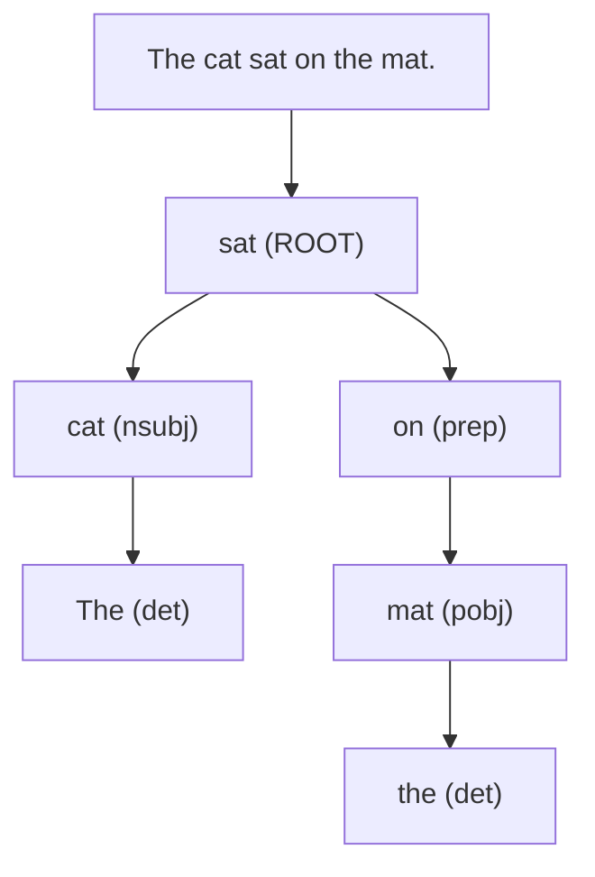
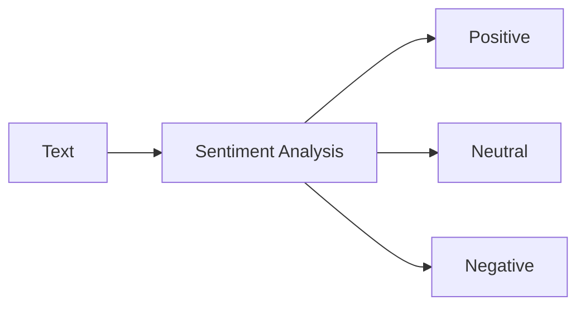
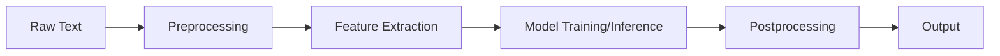
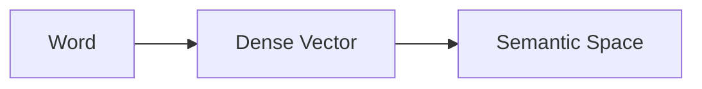
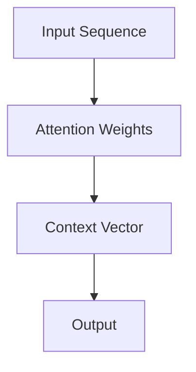
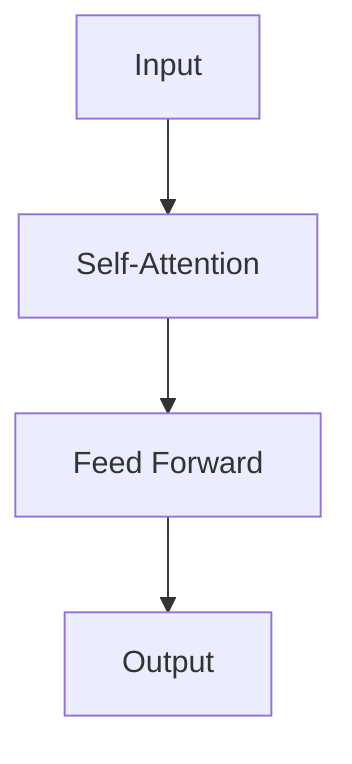

# Natural Language Processing

## Introduction

Natural Language Processing (NLP) is a field of artificial intelligence that focuses on the interaction between computers and humans using natural language. The ultimate objective of NLP is to read, decipher, understand, and make sense of human languages in a valuable way.

## Why NLP?

NLP is crucial for several reasons:

1. Vast amounts of unstructured text data exist in the world
2. Need for human-computer interaction in natural language
3. Automation of text analysis tasks
4. Insights extraction from text data
5. Enabling machines to understand and generate human language

## Core Concepts in NLP

### Tokenization

Tokenization is the process of breaking down text into smaller units, typically words or subwords.

When to use: As a fundamental preprocessing step for most NLP tasks.

### Part-of-Speech (POS) Tagging

POS tagging assigns grammatical tags to each token.

When to use: For syntactic analysis, information extraction, and as a feature for other NLP tasks.

### Named Entity Recognition (NER)

NER identifies and classifies named entities (e.g., person names, organizations, locations) in text.

When to use: For information extraction, question answering, and text summarization.

### Dependency Parsing

Dependency parsing analyzes the grammatical structure of a sentence, establishing relationships between "head" words and words that modify those heads.

When to use: For understanding sentence structure, relation extraction, and as a feature for more complex NLP tasks.

### Sentiment Analysis

Sentiment analysis determines the emotional tone behind a series of words, used to gain an understanding of the attitudes, opinions, and emotions expressed within text.

When to use: For brand monitoring, customer feedback analysis, and social media monitoring.

## NLP Pipeline

A typical NLP pipeline consists of several stages:

1. Preprocessing: Cleaning and normalizing text
2. Feature Extraction: Converting text into numerical features
3. Model Training/Inference: Applying machine learning algorithms
4. Postprocessing: Refining model outputs
5. Output: Generating final results

## Key NLP Tasks and Techniques

### Text Classification

Text classification involves assigning categories to text documents.

When to use: For spam detection, topic categorization, sentiment analysis.

Techniques:

- Naive Bayes
- Support Vector Machines
- Deep Learning (CNNs, RNNs)

### Text Generation

Text generation involves creating human-like text based on input or prompts.

When to use: For chatbots, content creation, language translation.

Techniques:

- N-gram models
- Recurrent Neural Networks (RNNs)
- Transformer models (e.g., GPT)

### Machine Translation

Machine translation automatically translates text from one language to another.

When to use: For cross-language communication, multilingual content creation.

Techniques:

- Statistical Machine Translation
- Neural Machine Translation (Seq2Seq models, Transformers)

### Question Answering

Question answering systems automatically answer questions posed in natural language.

When to use: For customer support, information retrieval systems.

Techniques:

- Information Retrieval-based methods
- Machine Reading Comprehension models

### Summarization

Text summarization condenses large texts into shorter versions while preserving key information.

When to use: For news aggregation, report generation, content curation.

Techniques:

- Extractive summarization (selecting important sentences)
- Abstractive summarization (generating new sentences)

## Advanced NLP Concepts

### Word Embeddings

Word embeddings are dense vector representations of words that capture semantic meanings.

Popular techniques:

- Word2Vec
- GloVe
- FastText

When to use: As input features for various NLP tasks, especially in deep learning models.

### Attention Mechanisms

Attention allows models to focus on relevant parts of the input when producing each part of the output.

When to use: In sequence-to-sequence tasks like machine translation, summarization.

### Transformers

Transformer models use self-attention to process sequential data, allowing for parallelization and capturing long-range dependencies.

When to use: For a wide range of NLP tasks, especially when dealing with long sequences or complex language understanding.

### Transfer Learning in NLP

Transfer learning involves using pre-trained models on large datasets and fine-tuning them for specific tasks.

Popular models:

- BERT
- GPT
- RoBERTa

When to use: When you have limited labeled data for your specific task.

## NLP Libraries and Tools

| Library/Tool | Description | Best Used For |
|--------------|-------------|---------------|
| NLTK | Comprehensive NLP toolkit | Text processing, linguistic tasks |
| spaCy | Industrial-strength NLP | Fast text processing, NER, POS tagging |
| Transformers (Hugging Face) | State-of-the-art NLP models | Advanced NLP tasks, transfer learning |
| Gensim | Topic modeling, document similarity | Text analysis, topic modeling |
| TextBlob | Simple, high-level interface | Quick prototyping, sentiment analysis |

## Best Practices in NLP

1. Understand Your Data: Analyze your text data thoroughly before applying NLP techniques.
2. Preprocess Carefully: Clean and normalize your text data appropriately for your task.
3. Choose the Right Representation: Select appropriate text representation (e.g., bag-of-words, word embeddings) based on your task.
4. Consider Transfer Learning: Utilize pre-trained models when possible, especially for complex tasks.
5. Evaluate Properly: Use appropriate evaluation metrics and test sets for your specific NLP task.
6. Handle Imbalanced Data: Many NLP tasks involve imbalanced datasets; use techniques like oversampling or class weighting.
7. Be Aware of Biases: NLP models can perpetuate or amplify biases present in training data.
8. Iterate and Experiment: NLP often requires trying multiple approaches to find what works best for your specific problem.

## Challenges in NLP

1. Ambiguity: Natural language is inherently ambiguous (e.g., word sense disambiguation).
2. Context Understanding: Capturing context and world knowledge is challenging for machines.
3. Multilingual NLP: Developing models that work well across multiple languages.
4. Common Sense Reasoning: Enabling machines to make inferences that humans find obvious.
5. Handling of Informal Language: Processing colloquialisms, slang, and social media text.
6. Computational Resources: Many advanced NLP models require significant computational power.

## Future Directions in NLP

1. More Efficient Pre-trained Models: Developing smaller, faster models without sacrificing performance.
2. Multimodal NLP: Integrating text with other modalities like images and speech.
3. Commonsense AI: Incorporating common sense knowledge into NLP systems.
4. Explainable NLP: Developing techniques to make NLP model decisions more interpretable.
5. Low-resource NLP: Improving performance for languages with limited data.
6. Ethical AI in NLP: Addressing biases and ensuring fairness in language models.

## Conclusion

Natural Language Processing is a rapidly evolving field that offers powerful tools for working with text data. As an everyday programmer, understanding NLP concepts and techniques can greatly enhance your ability to build intelligent, language-aware applications. While the field presents challenges, it also offers exciting opportunities to create systems that can understand, generate, and interact using human language. As you delve into NLP, remember to stay current with the latest developments, be mindful of ethical considerations, and always ground your work in the specific needs of your users and use cases.