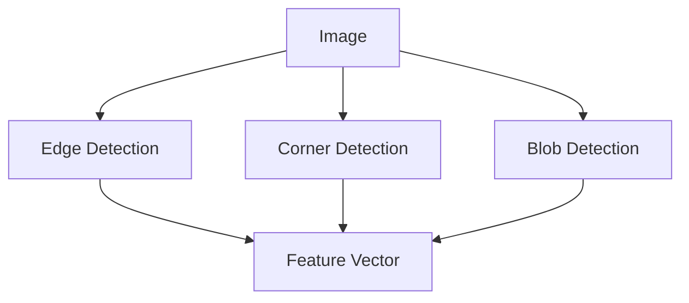
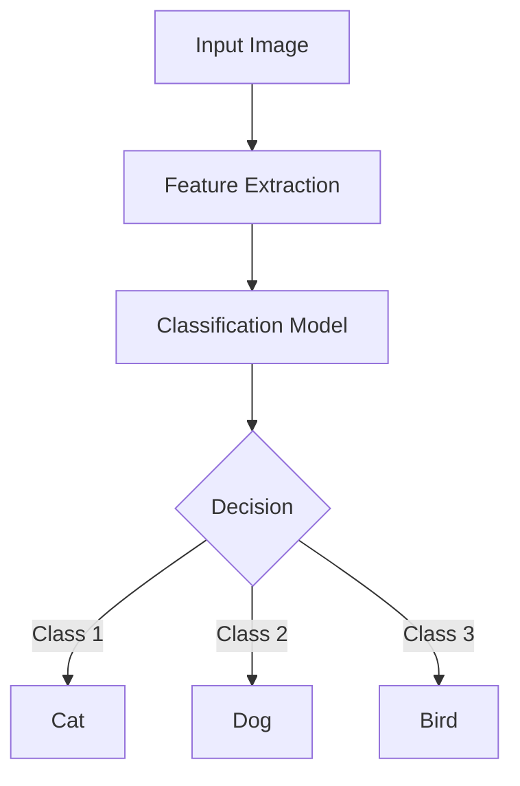
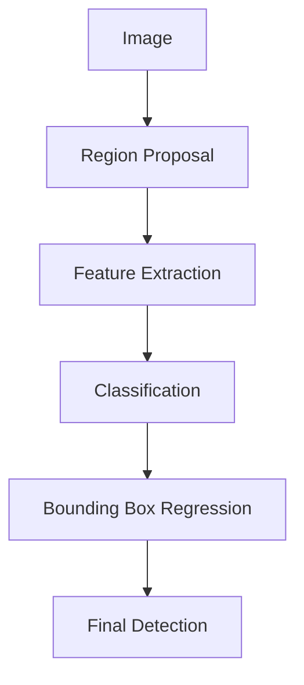
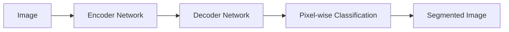
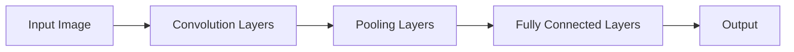
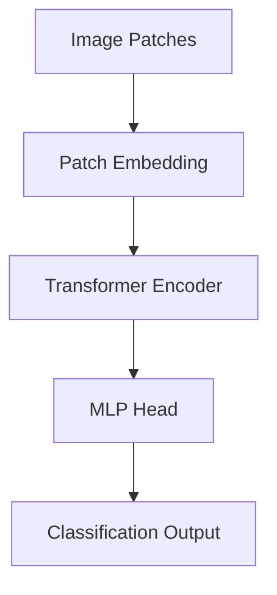
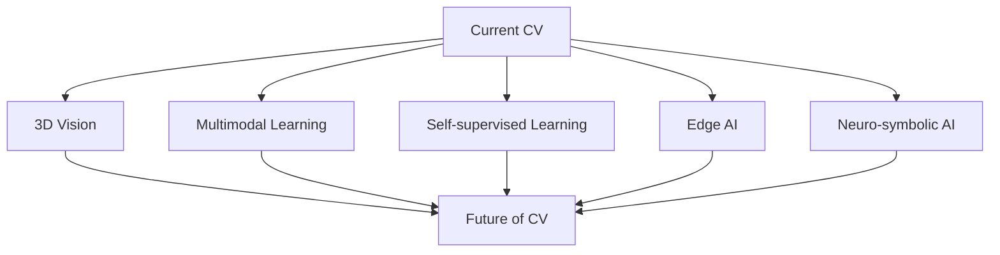

# Computer Vision

Computer Vision (CV) is a field of artificial intelligence that enables machines to interpret and understand visual information from the world around them. It's the science of making computers gain high-level understanding from digital images or videos, aiming to automate tasks that the human visual system can do.

### Introduction to Computer Vision

Computer Vision sits at the intersection of various disciplines, including computer science, mathematics, and neurobiology. It seeks to replicate the complexity and capabilities of human vision, allowing machines to perceive, process, and analyze visual data in ways that can augment or even surpass human abilities.

The importance of Computer Vision in modern AI solutions cannot be overstated. From autonomous vehicles to medical diagnosis, from facial recognition to quality control in manufacturing, CV is transforming industries and opening up new possibilities for innovation.

### Key Concepts in Computer Vision

#### Image Processing

At its core, Computer Vision starts with image processing. This involves manipulating digital images to enhance their quality or extract useful information.

#### Feature Detection and Extraction

Features are distinctive attributes or parts of an image. Detecting and extracting these features is crucial for understanding the content of images.

#### Image Classification

This involves categorizing images into predefined classes. It's one of the fundamental tasks in Computer Vision.

#### Object Detection and Recognition

Going beyond classification, object detection involves identifying and locating specific objects within an image.

#### Semantic Segmentation

This advanced technique involves partitioning an image into semantically meaningful parts, essentially classifying each pixel in the image.

### Common Challenges in Computer Vision

1. **Variability of Visual Data**: Objects can appear differently due to changes in lighting, viewpoint, or occlusion.
2. **Scale and Perspective**: The same object can look different based on distance and angle.
3. **Computational Complexity**: Processing high-resolution images or video streams in real-time requires significant computational resources.
4. **Data Annotation**: Many CV algorithms require large amounts of labeled data, which can be time-consuming and expensive to produce.

### Best Practices in Computer Vision

1. **Data Preprocessing**: Normalize and augment your data to improve model robustness.
2. **Transfer Learning**: Leverage pre-trained models to reduce training time and improve performance, especially when working with limited datasets.
3. **Ensemble Methods**: Combine multiple models to achieve better performance and robustness.
4. **Regular Evaluation**: Continuously test your models on diverse datasets to ensure generalization.
5. **Interpretability**: Implement techniques to understand what your model is "seeing" to make decisions.

### Recent Advancements and State-of-the-Art Approaches

The field of Computer Vision has seen remarkable progress in recent years, largely driven by advancements in deep learning and the availability of large datasets.

#### Convolutional Neural Networks (CNNs)

CNNs have revolutionized image classification and object detection tasks. Architectures like ResNet, Inception, and EfficientNet have pushed the boundaries of what's possible in image recognition.

#### Region-based CNNs (R-CNN) and YOLO

These architectures have significantly improved object detection speed and accuracy, enabling real-time object detection in videos.

#### Generative Adversarial Networks (GANs)

GANs have opened up new possibilities in image generation and manipulation, leading to applications like style transfer and super-resolution.

#### Transformer-based Models

Originally developed for natural language processing, transformer architectures like Vision Transformer (ViT) are now being successfully applied to Computer Vision tasks.

#### DALL-E and Other Text-to-Image Models

Models like DALL-E, Midjourney, and Stable Diffusion represent a paradigm shift in Computer Vision. These models can generate highly detailed and creative images from textual descriptions, bridging the gap between natural language processing and image generation.

### When and How to Use Computer Vision

Computer Vision is applicable in a wide range of scenarios:

1. **Quality Control**: In manufacturing, CV can detect defects or ensure product consistency.
2. **Security and Surveillance**: For facial recognition, anomaly detection, or crowd monitoring.
3. **Healthcare**: In medical imaging for disease detection and diagnosis.
4. **Autonomous Vehicles**: For object detection, lane detection, and navigation.
5. **Retail**: For inventory management, cashier-less stores, and customer behavior analysis.
6. **Augmented Reality**: To understand the real world and overlay digital information.

When implementing CV solutions:

1. **Define the Problem Clearly**: Understand whether you need classification, detection, segmentation, or generation.
2. **Assess Data Availability**: Determine if you have enough labeled data or if you need to use techniques like transfer learning or data augmentation.
3. **Choose the Right Model**: Consider the trade-offs between accuracy, speed, and computational requirements.
4. **Plan for Scalability**: Ensure your solution can handle increasing amounts of data and users.
5. **Consider Ethical Implications**: Be aware of privacy concerns and potential biases in your models.

### Future Outlook

The future of Computer Vision is incredibly promising, with several exciting trends on the horizon:

1. **3D Vision**: Moving beyond 2D images to understand and reconstruct 3D scenes.
2. **Multimodal Learning**: Combining vision with other modalities like text and audio for more comprehensive understanding.
3. **Self-supervised Learning**: Reducing the need for large labeled datasets by learning from unlabeled data.
4. **Edge AI**: Bringing Computer Vision capabilities to edge devices for real-time processing.
5. **Neuro-symbolic AI**: Combining neural networks with symbolic reasoning for more robust and interpretable models.

### Conclusion

Computer Vision is a rapidly evolving field that's transforming how machines interact with the visual world. As an AI Solution Architect, understanding the fundamentals, challenges, and state-of-the-art techniques in CV is crucial for designing effective and innovative solutions. By staying abreast of the latest developments and best practices, you can harness the power of Computer Vision to solve complex problems and create impactful applications across various industries.