# Reinforcement Learning

Reinforcement Learning (RL) is a powerful paradigm in machine learning where an agent learns to make decisions by interacting with an environment. It's inspired by behavioral psychology, focusing on how software agents ought to take actions in an environment to maximize some notion of cumulative reward.

### Introduction to Reinforcement Learning

At its core, RL is about learning through trial and error. An agent takes actions in an environment, which is in a particular state, and receives rewards or penalties as a consequence. The goal is to learn a policy - a strategy for choosing actions - that maximizes the expected cumulative reward over time.

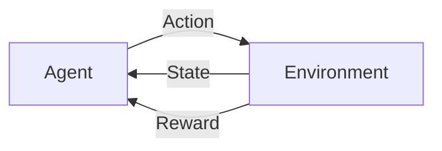

### Key Concepts in Reinforcement Learning

#### The RL Framework

The RL framework consists of several key components:

1. **Agent**: The learner and decision-maker.
2. **Environment**: The world in which the agent operates.
3. **State**: The current situation of the environment.
4. **Action**: A move the agent can make.
5. **Reward**: Feedback from the environment.
6. **Policy**: The strategy the agent employs to determine the next action.

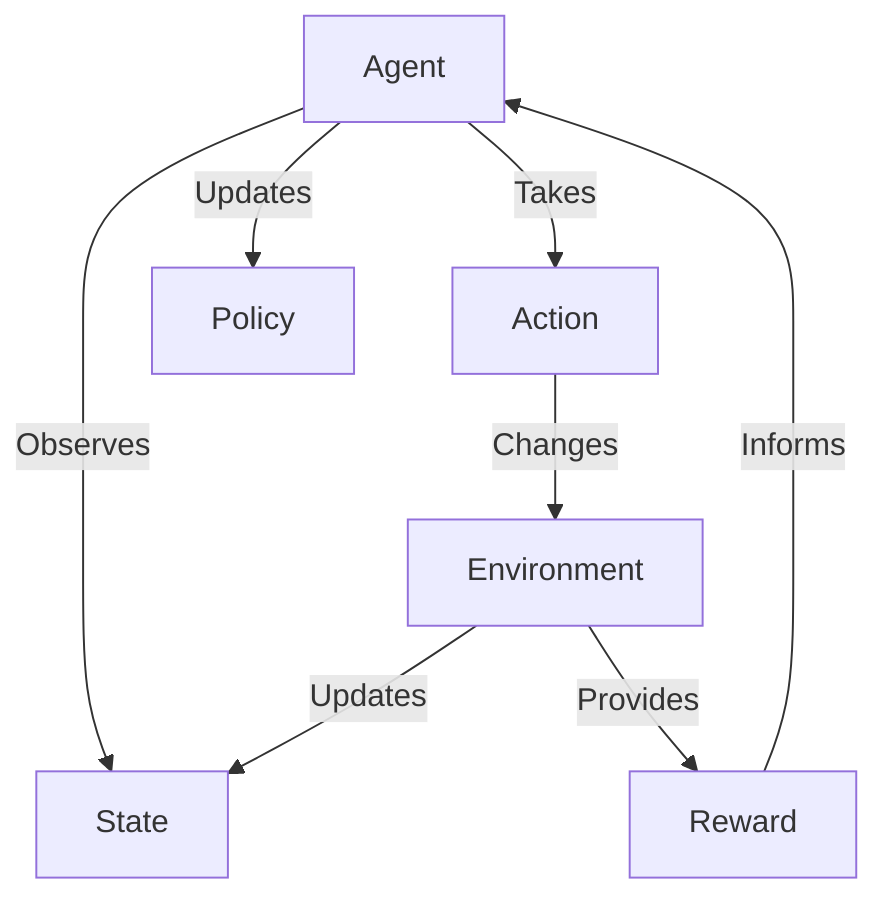

#### Value Function and Q-Function

The value function estimates the expected return from a given state, while the Q-function estimates the value of taking a specific action in a given state.

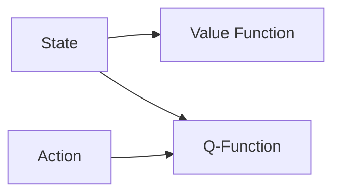

#### Exploration vs. Exploitation

A key challenge in RL is balancing exploration (trying new actions to gather information) with exploitation (using known information to maximize reward).

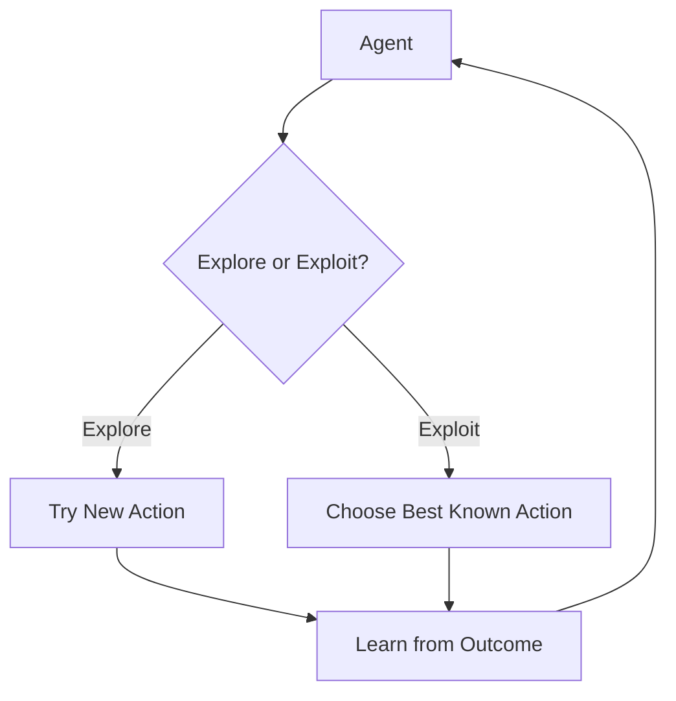

### Common Algorithms in Reinforcement Learning

#### Q-Learning

Q-Learning is a model-free algorithm that learns the value of an action in a particular state.

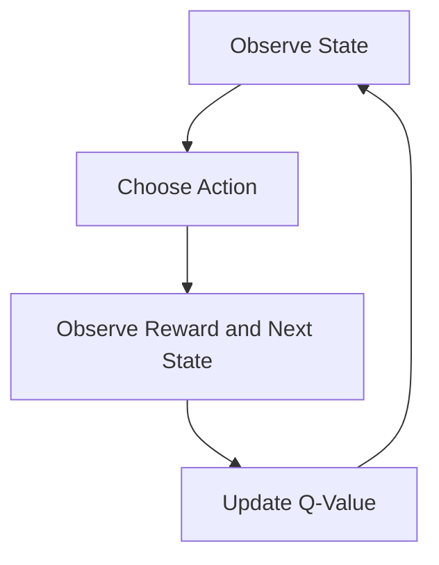

#### Policy Gradient Methods

These methods directly optimize the policy without using a value function.

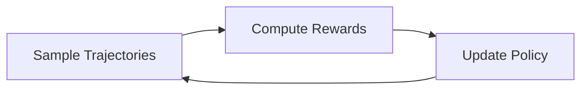

#### Actor-Critic Methods

These combine value function approximation with direct policy optimization.

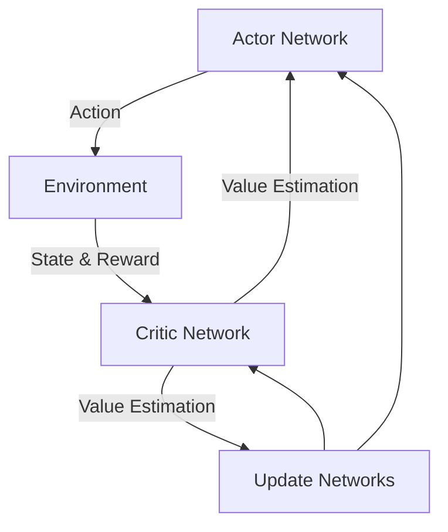

### When and How to Use Reinforcement Learning

RL is particularly useful in scenarios where:

1. The environment is complex and dynamic.
2. The optimal solution is not known in advance.
3. There's a clear reward signal.
4. The problem can be framed as a sequence of decisions.

Common application areas include:

1. **Game Playing**: From classic board games to complex video games.
2. **Robotics**: For learning motor control and navigation.
3. **Resource Management**: In systems like data centers or traffic control.
4. **Recommendation Systems**: For personalized content delivery.
5. **Finance**: For trading strategies and portfolio management.

When implementing RL solutions:

1. **Define the Environment**: Clearly specify states, actions, and rewards.
2. **Choose the Right Algorithm**: Consider the problem's complexity and available computational resources.
3. **Design the Reward Function**: This is crucial as it defines what the agent should optimize for.
4. **Handle Sparse Rewards**: Many real-world problems have infrequent rewards, requiring techniques like reward shaping.
5. **Consider Sample Efficiency**: RL often requires many interactions, so simulation or efficient exploration strategies may be necessary.

### Recent Advancements and State-of-the-Art Approaches

The field of Reinforcement Learning has seen significant advancements in recent years:

#### Deep Reinforcement Learning

Combining deep neural networks with RL has led to breakthroughs in complex domains.

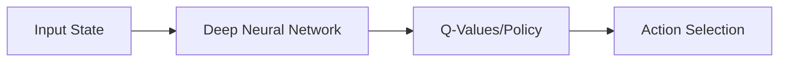

#### AlphaGo and AlphaZero

DeepMind's AlphaGo and its successor AlphaZero demonstrated superhuman performance in complex games like Go and Chess, using a combination of deep learning and Monte Carlo Tree Search.

#### Proximal Policy Optimization (PPO)

PPO has become a popular algorithm due to its simplicity and good performance across a variety of tasks.

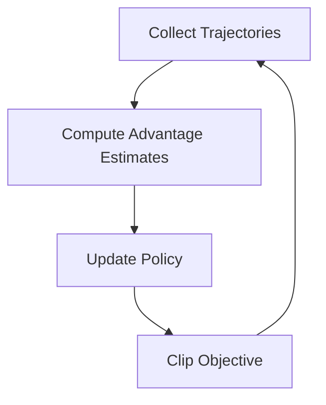

#### Soft Actor-Critic (SAC)

SAC is an off-policy algorithm that provides sample-efficient learning and stability through entropy regularization.

#### Model-Based RL

Approaches that learn a model of the environment to improve sample efficiency and generalization.

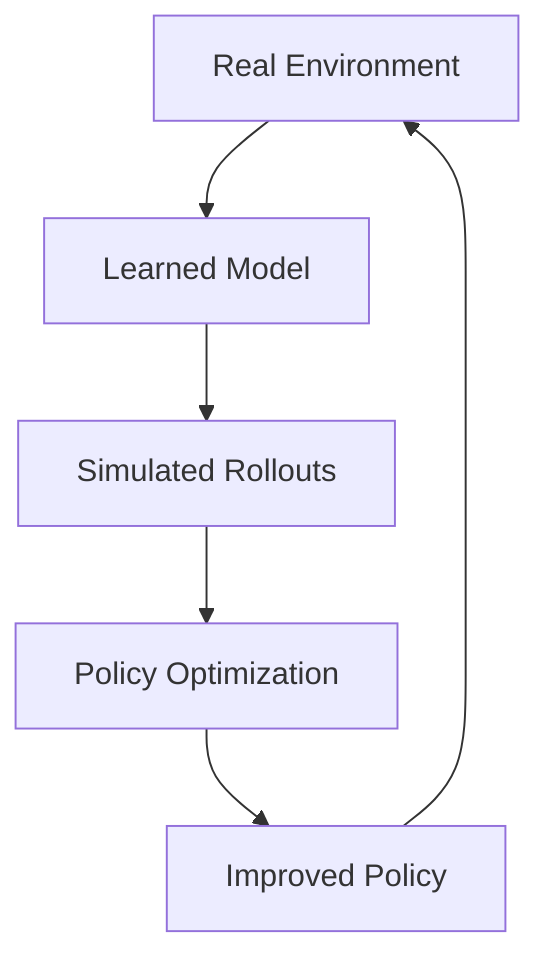

#### Multi-Agent RL

Extending RL to scenarios with multiple interacting agents, crucial for applications like autonomous driving and swarm robotics.

### Future Outlook

The future of Reinforcement Learning is exciting, with several promising directions:

1. **Offline RL**: Learning from pre-collected datasets without environment interaction.
2. **Meta-RL**: Developing agents that can quickly adapt to new tasks.
3. **Hierarchical RL**: Learning at multiple levels of abstraction for more complex tasks.
4. **Safe RL**: Ensuring that learned policies are safe and reliable in real-world applications.
5. **Causal RL**: Incorporating causal reasoning for better generalization and robustness.

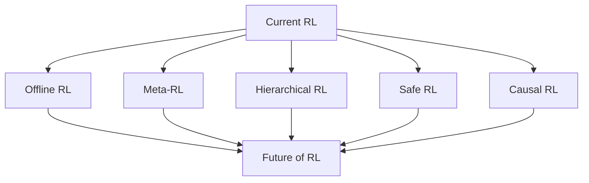

### Conclusion

Reinforcement Learning represents a powerful approach to creating adaptive, intelligent systems capable of making complex decisions. As an AI Solution Architect, understanding RL's principles, algorithms, and recent advancements is crucial for designing effective solutions in domains where traditional supervised learning falls short.

By leveraging RL, you can create systems that learn and improve through interaction, opening up possibilities in robotics, game AI, resource management, and many other fields. As the field continues to advance, RL is poised to play an increasingly important role in shaping the future of artificial intelligence and autonomous systems.