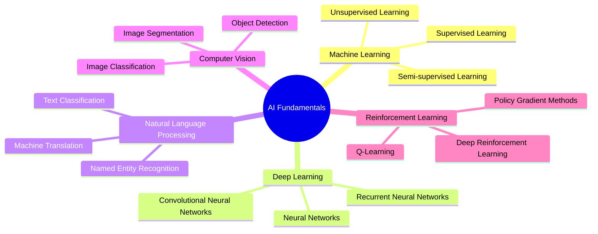

# AI Fundamentals

Welcome to the AI Fundamentals section of our AI Solution Architect handbook. This section provides a comprehensive overview of the core concepts and technologies that form the foundation of modern artificial intelligence.

## Overview

Artificial Intelligence (AI) is a rapidly evolving field that encompasses various subfields and techniques. This section breaks down the fundamental areas of AI, providing in-depth insights into each key component.

## Subsections

Dive deep into each fundamental area of AI:

1. [Machine Learning Basics](01-Machine-Learning-Basics.md): Understand the core principles of machine learning, including supervised, unsupervised, and semi-supervised learning techniques.
1. [Deep Learning and Neural Networks](02-Deep-Learning-and-Neural-Networks.md): Explore the architecture and applications of neural networks, from basic perceptrons to complex deep learning models.
1. [Natural Language Processing](03-Natural-Language-Processing.md): Discover how AI systems process and understand human language, enabling applications like chatbots, translation, and sentiment analysis.
1. [Computer Vision](04-Computer-Vision.md): Learn about the techniques that allow machines to interpret and analyze visual information from the world around them.
1. [Reinforcement Learning](05-Reinforcement-Learning.md): Understand how AI agents learn to make decisions through interaction with their environment.

## How to Use This Section

Each subsection provides a detailed exploration of its respective topic, including:

- Key concepts and terminology
- Fundamental algorithms and techniques
- Real-world applications and use cases
- Recent advancements and future trends

We recommend starting with Machine Learning Basics and progressing through the subsections in order. However, feel free to jump to specific topics based on your interest or project requirements.

## Stay Updated

The field of AI is constantly evolving. We regularly update this handbook to reflect the latest advancements and best practices. Be sure to check back often for the most up-to-date information.

Happy learning, and may your journey into AI be both enlightening and rewarding!
