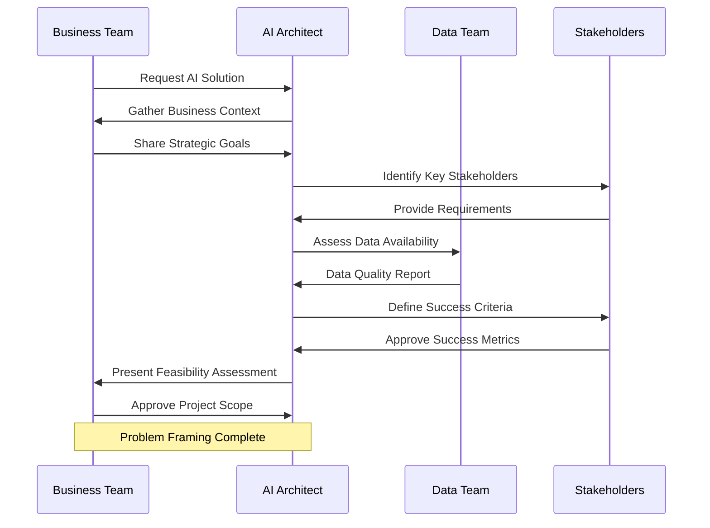
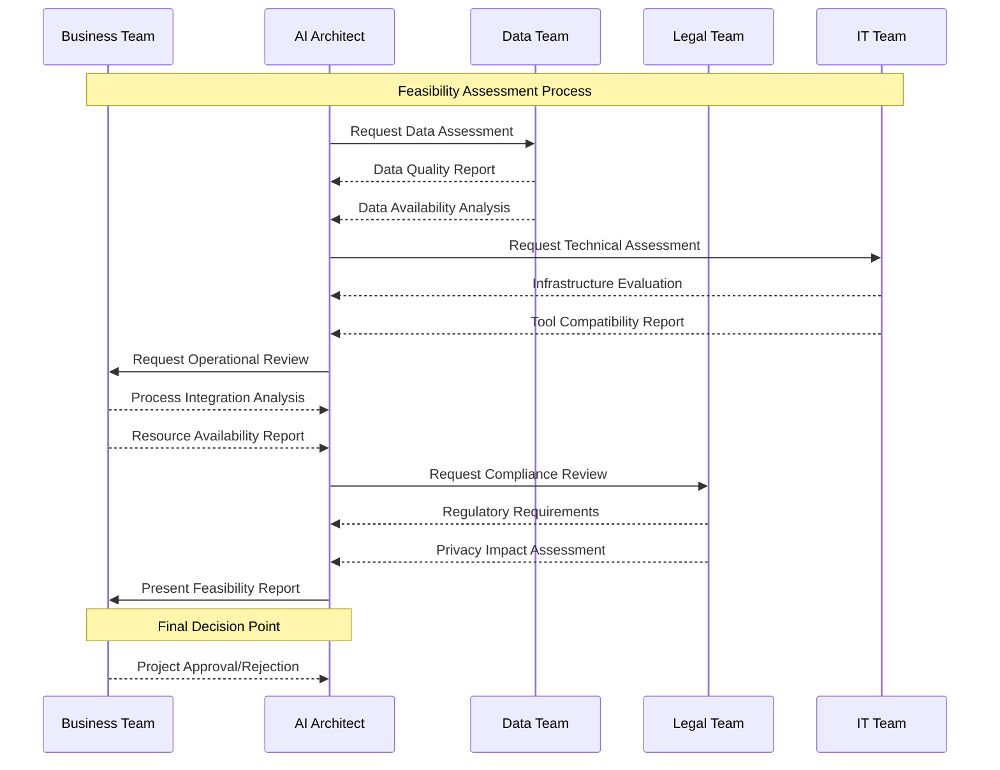

# Problem Framing and Requirements Analysis

In this section, we will dive into **Problem Framing and Requirements Analysis**, the crucial first step in designing an effective AI solution. This stage sets the foundation for the entire project, ensuring that the problem is well-understood, the requirements are clear, and the solution is aligned with business objectives.

## Why Problem Framing Matters

Problem framing is about defining **what problem you're trying to solve**, **why it matters**, and **how AI can provide a solution**. Misaligned problem framing is one of the most common reasons AI projects fail. It is not just about selecting the right model or technology; it’s about ensuring the problem is correctly understood, the data is suitable, and the expected outcomes are realistic.

### Key Objectives of Problem Framing:

- **Clarify the business problem** and its significance.
- **Identify the root cause** of the problem using data analysis.
- **Define the AI problem** clearly and determine if AI is the right solution.
- **Set measurable goals and objectives** for the AI solution.

## The Problem Framing Process

Let's break down the process into structured steps:

1. **Understand the Business Context**
2. **Identify Stakeholders**
3. **Define the Problem Statement**
4. **Determine Success Criteria**
5. **Assess Feasibility**

### Understand the Business Context

Understanding the **business context** is critical to ensure that the AI solution aligns with the broader business goals. Begin by gathering information on the company's strategic objectives, current challenges, and market conditions.

**Questions to Ask:**

- What is the business objective or strategic goal?
- How does solving this problem benefit the organization?
- What are the potential risks or constraints?

### Identify Stakeholders

Identify all relevant stakeholders early in the process. Stakeholders can include business leaders, end-users, data engineers, and legal/compliance teams.

| Stakeholder | Role | Key Interests |
|-------------|------|---------------|
| Business Leaders | Decision-makers | ROI, strategic alignment |
| End-Users | Users of the solution | Usability, efficiency |
| Data Engineers | Data preparation | Data quality, availability |
| Compliance Team | Regulatory oversight | Data privacy, compliance |

### Define the Problem Statement

A well-defined problem statement serves as a guide for the entire project. It should be concise, focused, and quantifiable. Avoid vague or overly broad statements.

**Example of a Good Problem Statement:**

*"The company wants to reduce customer churn by predicting which customers are likely to leave within the next three months, allowing targeted retention strategies."*

**Key Elements:**

- **Current State**: Describe the problem as it currently exists.
- **Desired Outcome**: State what success looks like.
- **Constraints**: Mention any known limitations (e.g., time, data availability).

### Determine Success Criteria

Defining clear, measurable success criteria is essential for evaluating the outcome of the AI solution. Success criteria should include:

- **Performance Metrics**: Accuracy, F1 score, or other relevant metrics.
- **Business Metrics**: ROI, customer satisfaction, or cost savings.
- **Acceptable Thresholds**: Define what level of performance is considered successful.

| Type of Metric | Example |
|----------------|---------|
| Accuracy Metric | Precision, Recall, F1 Score |
| Business Metric | Reduction in churn rate, Increase in sales |
| Time-based Metric | Model inference time, Time-to-market |

### Assess Feasibility

Before moving forward, assess the feasibility of the solution based on the following factors:

- **Data Availability**: Is the required data accessible and of good quality?
- **Technical Feasibility**: Do you have the necessary infrastructure and tools?
- **Operational Feasibility**: Can the organization integrate the AI solution into its existing processes?
- **Legal and Ethical Considerations**: Are there regulatory concerns that need to be addressed?
  
  

## Common Pitfalls

Be aware of these common pitfalls during problem framing and requirements analysis:

- **Jumping to Solutions Too Early**: Avoid selecting a model or technology before clearly defining the problem.
- **Ignoring Stakeholder Input**: Failing to engage key stakeholders can lead to misaligned expectations.
- **Overcomplicating the Problem Statement**: Keep it simple and focused. A complex statement can lead to confusion and scope creep.
- **Lack of Clear Success Criteria**: Without measurable goals, it’s difficult to determine if the solution is effective.

## Best Practices

- **Use a Structured Approach**: Follow a step-by-step process for framing the problem.
- **Leverage Data Insights Early**: Analyze existing data to validate the problem statement.
- **Engage with Stakeholders Regularly**: Maintain continuous communication to align expectations.
- **Document Everything**: Create detailed documentation of the problem framing and requirements analysis to avoid misunderstandings later.

## Real-World Example

Consider a **retail company** that wants to reduce inventory costs. Initially, the problem was framed as "reducing stock levels." However, after stakeholder analysis and data exploration, the problem was redefined as "optimizing stock levels to prevent overstock and understock, based on seasonal demand forecasting." This refined problem statement led to a more targeted solution using time-series forecasting models.

## Next Steps

Once the problem is well-framed and requirements are gathered, you can proceed to the next step: **selecting the appropriate architecture pattern** for your AI solution. In the next section, [AI Architecture Patterns](02-AI-Architecture-Patterns.md), we will explore various architectural approaches and their use cases.
