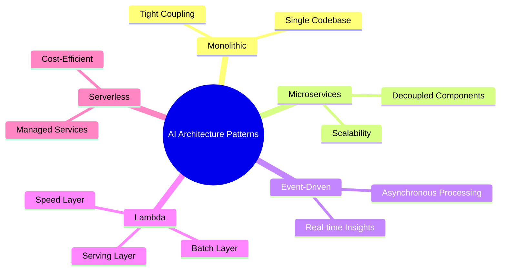
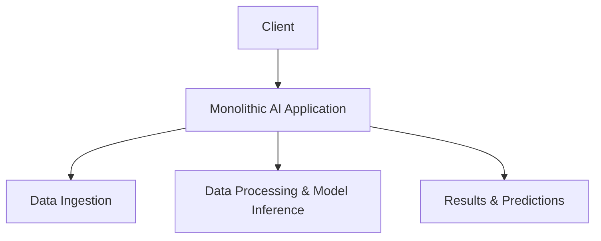
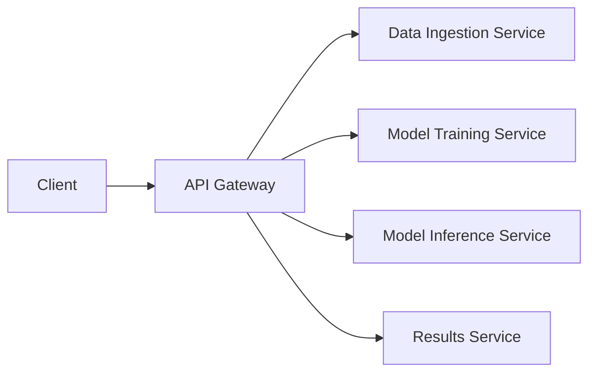
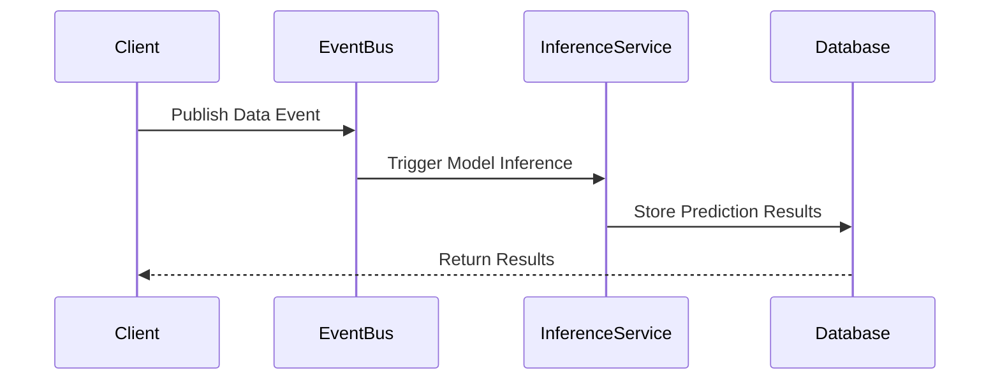
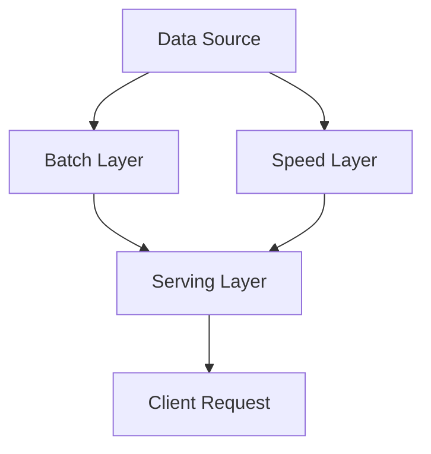
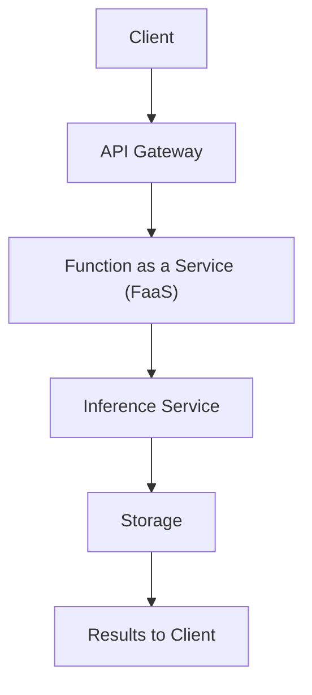
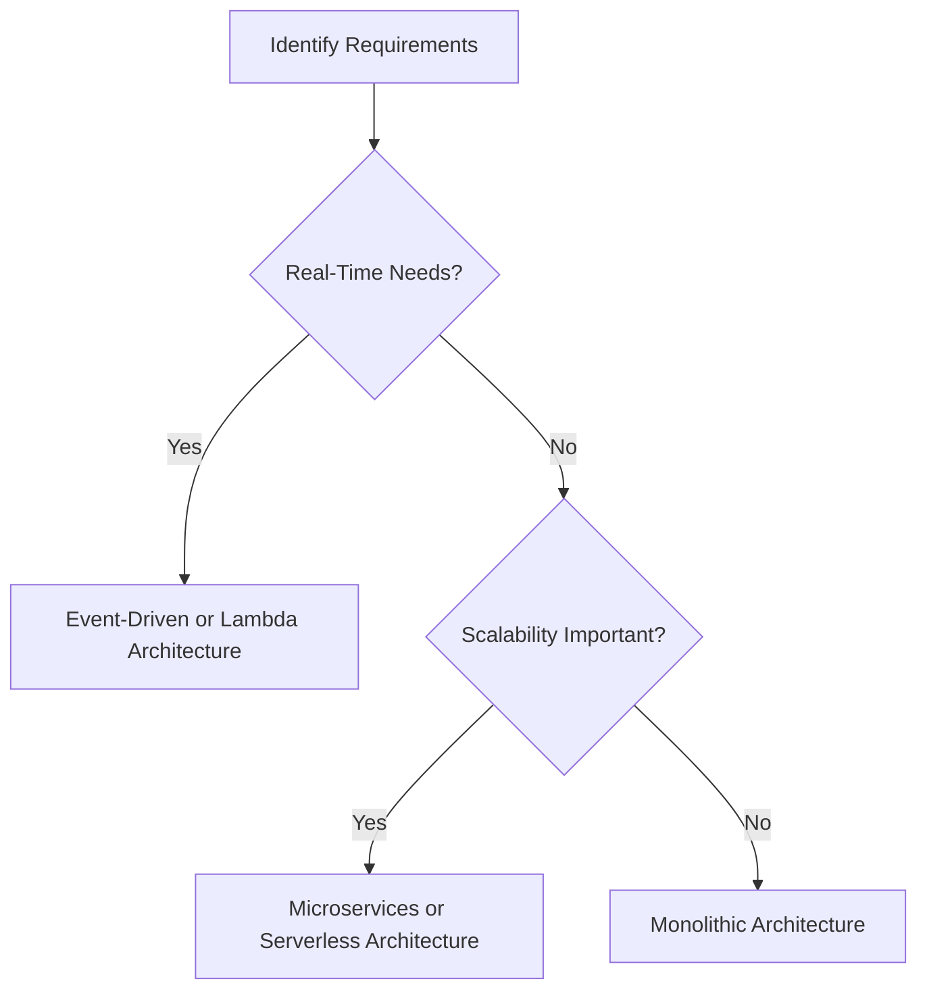

# AI Architecture Patterns

In this section, we explore different **AI architecture patterns** that can be leveraged to build scalable, robust, and maintainable AI solutions. Selecting the right architecture pattern is a critical decision that directly impacts your system's performance, cost, and flexibility. This section will provide an overview of common architecture patterns and when to use them.

## Overview

AI solutions can be architected in various ways, depending on factors like data processing needs, real-time requirements, scalability, and system complexity. Some common architecture patterns for AI include:

- **Monolithic Architecture**
- **Microservices Architecture**
- **Event-Driven Architecture**
- **Lambda Architecture**
- **Serverless Architecture**

##Monolithic Architecture

### Description

A **monolithic architecture** is a traditional design pattern where the entire application is built as a single, cohesive unit. It is often easier to develop initially but can become challenging to maintain and scale as the application grows.

### Pros and Cons

| Pros | Cons |
|------|------|
| Simple to develop and deploy | Hard to scale |
| Easier to debug and test | Tight coupling between components |
| Suitable for small projects | Difficult to update and maintain |

### Use Cases

- Small AI applications with limited scope
- Proof of concept or prototype projects
- Systems where rapid development is prioritized over scalability

##Microservices Architecture

### Description

In a **microservices architecture**, the AI solution is broken down into small, loosely coupled services that communicate over APIs. This approach enables independent development, testing, and scaling of each service, making it ideal for large and complex AI systems.

### Pros and Cons

| Pros | Cons |
|------|------|
| High scalability and flexibility | Increased complexity in deployment and management |
| Independent development and updates | Requires robust API management |
| Better fault isolation | Potential for increased latency |

### Use Cases

- Large-scale AI applications
- Continuous model updates and deployments
- Multi-model AI solutions requiring different services

##Event-Driven Architecture

### Description

An **event-driven architecture** leverages a publish-subscribe or message queue system to handle events asynchronously. This is particularly useful for real-time AI applications where new data triggers model inference or updates.

### Pros and Cons

| Pros | Cons |
|------|------|
| Real-time processing | Requires careful event management |
| Scalable and resilient | Can be complex to monitor and troubleshoot |
| Decoupled components | Potential for data loss if not handled correctly |

### Use Cases

- Fraud detection in financial transactions
- Real-time recommendation systems
- Predictive maintenance using streaming data

##Lambda Architecture

### Description

A **lambda architecture** combines batch processing and real-time streaming to achieve both accurate and low-latency results. It consists of three main layers:

- **Batch Layer**: Handles large-scale data processing and generates historical models.
- **Speed Layer**: Processes real-time data to provide immediate insights.
- **Serving Layer**: Combines outputs from both the batch and speed layers to serve the final results.

### Pros and Cons

| Pros | Cons |
|------|------|
| Supports both real-time and batch processing | High system complexity |
| Fault-tolerant and resilient | Requires significant maintenance and tuning |
| Balances accuracy and latency | Duplication of data processing logic |

### Use Cases

- Real-time analytics dashboards
- Customer behavior analysis
- Large-scale data processing systems with real-time requirements

##Serverless Architecture

### Description

A **serverless architecture** utilizes managed cloud services that automatically handle scaling and infrastructure management. It is an excellent choice for lightweight AI applications and scenarios with unpredictable traffic patterns.

### Pros and Cons

| Pros | Cons |
|------|------|
| Cost-effective (pay-as-you-go model) | Limited control over infrastructure |
| Scales automatically with demand | Cold start latency issues |
| Simplified deployment | May not suit long-running tasks |

### Use Cases

- Chatbots and virtual assistants
- Image recognition applications
- Lightweight predictive analytics services

## Choosing the Right Architecture Pattern

Selecting the right architecture pattern depends on several factors:

| Consideration | Recommended Pattern |
|---------------|---------------------|
| **Scalability** | Microservices, Serverless |
| **Real-Time Processing** | Event-Driven, Lambda Architecture |
| **Cost Efficiency** | Serverless Architecture |
| **Ease of Development** | Monolithic Architecture |
| **Handling Large Data Volumes** | Lambda Architecture, Microservices |

## Best Practices for AI Architecture Design

- **Start Small and Scale Gradually**: Begin with a simpler architecture and refactor as the project grows.
- **Consider Data Privacy and Security**: Ensure the architecture supports secure data handling, especially in regulated industries.
- **Leverage Cloud Services**: Utilize managed services for infrastructure components to simplify maintenance and scalability.
- **Monitor and Optimize**: Implement logging, monitoring, and performance tracking to continuously optimize your architecture.

## Next Steps

In the next section, [Scalability and Performance Considerations](03-Scalability-and-Performance-Considerations.md), we will dive deeper into strategies for optimizing the performance and scalability of your AI solution.
