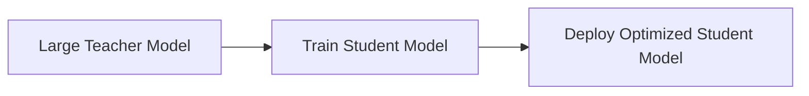

# Scalability and Performance Considerations

In this section, we focus on the critical aspects of **scalability and performance** in AI solution design. Building scalable and high-performance AI systems is essential to meet the growing demands of users and handle increasing data volumes effectively. This section will cover strategies, patterns, and best practices for designing AI solutions that are both scalable and performant.

## Overview

Scalability and performance are closely related but distinct concepts:

- **Scalability** refers to the system's ability to handle increasing workloads by adding resources (hardware or software) without compromising performance.
- **Performance** focuses on optimizing the system's speed, efficiency, and response time.

Key areas to consider:

- **Scaling Strategies**: Horizontal vs. Vertical Scaling
- **Data Partitioning and Sharding**
- **Caching Mechanisms**
- **Model Optimization Techniques**
- **Monitoring and Performance Tuning**

##Scaling Strategies

Scaling can be achieved in two main ways:

### Horizontal Scaling

Horizontal scaling involves adding more instances of services or nodes to distribute the workload. This method is highly effective for AI solutions that need to handle large, unpredictable traffic or data volumes.

**Pros:**

- Improved fault tolerance
- Better handling of high traffic
- Easy to add or remove instances based on demand

**Cons:**

- Requires robust load balancing
- Complexity in managing stateful services

### Vertical Scaling

Vertical scaling involves upgrading the hardware (e.g., CPU, RAM, GPU) of a single machine. This method is simpler but has physical and cost limitations.

**Pros:**

- Simpler to implement
- No need for complex load balancing

**Cons:**

- Limited by hardware capacity
- Potential single point of failure

**When to Use:**

- Smaller AI solutions or proofs of concept
- Scenarios where load is predictable and limited

##Data Partitioning and Sharding

Data partitioning is a technique to divide data into smaller, more manageable parts. **Sharding** is a specific form of partitioning that helps distribute data across multiple databases or storage systems.

### Benefits of Sharding:

- Improves query performance by reducing the search space
- Enhances fault isolation (failure of one shard does not affect others)
- Enables parallel processing of data

### Challenges:

- Complex data management and consistency
- Increased overhead in maintaining shard keys
- Potential data skew if sharding is not balanced

##Caching Mechanisms

Caching is a powerful technique to reduce latency and improve performance by storing frequently accessed data in memory.

### Types of Caching:

- **In-Memory Caching**: Uses tools like Redis or Memcached to store data in memory, offering fast read access.
- **Distributed Caching**: Extends in-memory caching across multiple nodes for scalability.

### Best Practices:

- Cache frequently requested predictions or features
- Set appropriate expiration policies to manage stale data
- Use distributed caching for large-scale systems

##Model Optimization Techniques

Optimizing the AI model itself can significantly improve performance and reduce resource usage. Some common techniques include:

### Pruning

Pruning involves removing unnecessary neurons or layers from the model to reduce its size without sacrificing accuracy.

### Quantization

Quantization reduces the precision of the model weights (e.g., from 32-bit floating-point to 8-bit integers), decreasing the model size and inference time.

### Knowledge Distillation

Knowledge distillation transfers knowledge from a large, complex model (teacher) to a smaller, simpler model (student), enabling faster inference while maintaining accuracy.

**Benefits:**

- Reduces inference time and latency
- Lowers computational and memory requirements
- Enables deployment on edge devices

##Monitoring and Performance Tuning

Monitoring is essential for understanding the performance of your AI system in real time. It helps identify bottlenecks and areas for improvement.

### Key Metrics to Monitor:

| Metric Type | Example Metrics |
|-------------|-----------------|
| **Model Performance** | Inference latency, throughput, error rate |
| **System Performance** | CPU usage, GPU utilization, memory usage |
| **User Experience** | Response time, availability, error rates |

### Best Practices:

- Use tools like **Prometheus**, **Grafana**, or **Datadog** for monitoring.
- Set up **alerts** for key performance metrics (e.g., high latency, low throughput).
- Regularly analyze logs to identify performance issues.

## Common Pitfalls

Avoid these common pitfalls when addressing scalability and performance:

- **Over-provisioning Resources**: Leads to unnecessary costs without significant performance gains.
- **Neglecting Monitoring**: Without proper monitoring, it’s difficult to detect and resolve performance issues.
- **Ignoring Data Bottlenecks**: Slow data access can negate the benefits of model optimization or hardware upgrades.
- **Relying Solely on Vertical Scaling**: Vertical scaling has limitations and can create single points of failure.

## Real-World Example

A **streaming video platform** wanted to enhance its real-time recommendation engine to serve millions of users simultaneously. Initially, it relied on a monolithic architecture with vertical scaling, but it faced latency issues during peak traffic. By transitioning to a **microservices architecture** with **horizontal scaling** and implementing **distributed caching**, the platform achieved a 50% reduction in response time and improved user engagement.

## Next Steps

Now that you have a solid understanding of scalability and performance considerations, the next section, [Cost Optimization Strategies](04-Cost-Optimization-Strategies.md), will provide guidance on how to optimize costs without sacrificing performance.

