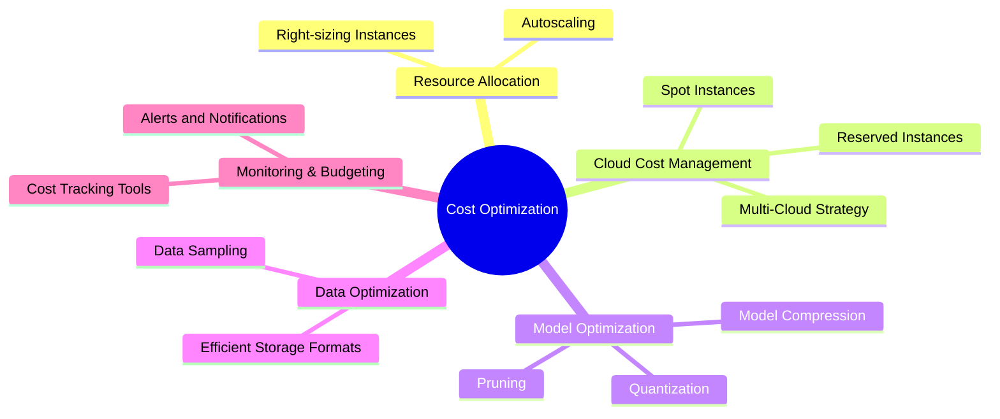
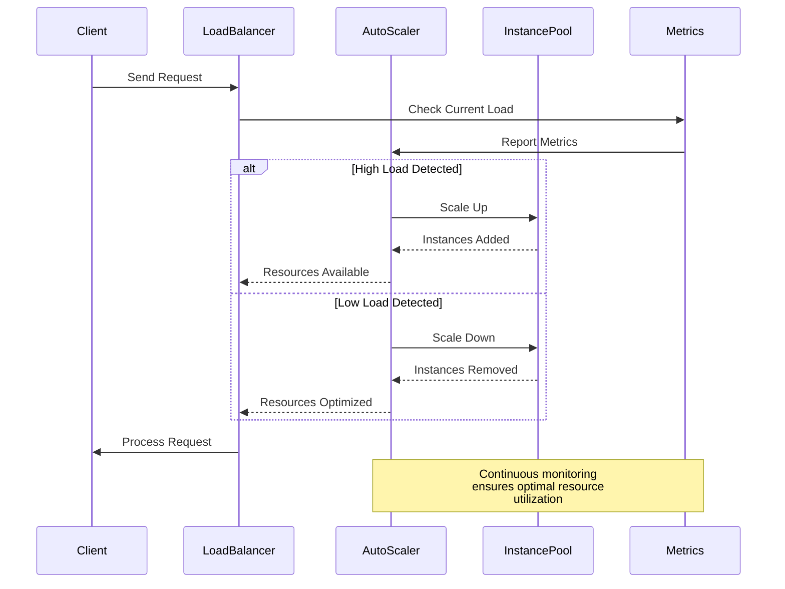
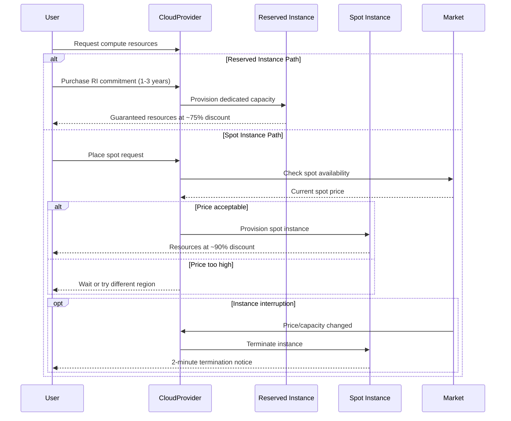
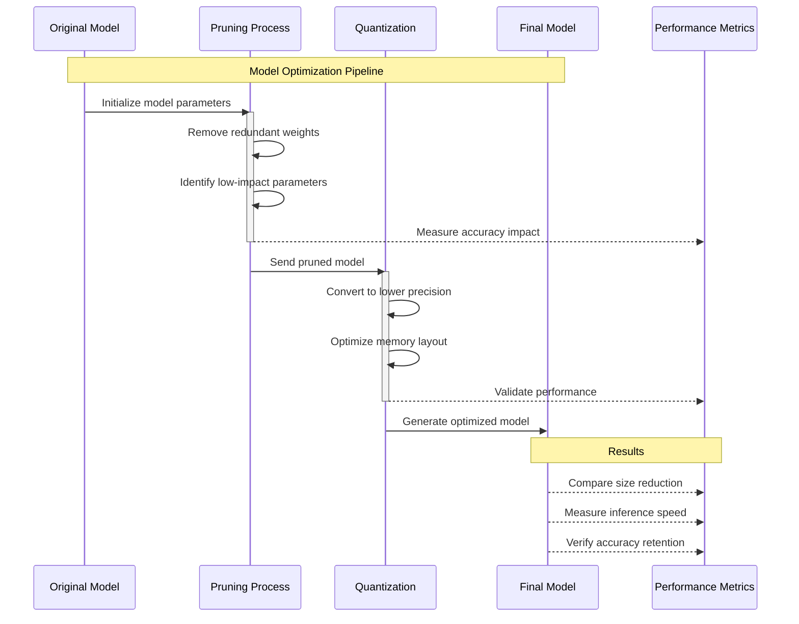
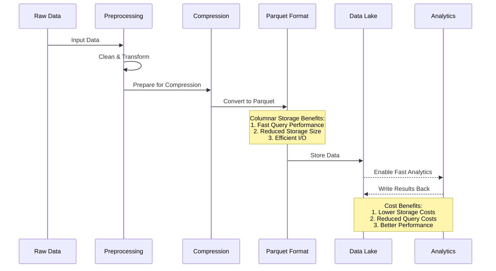
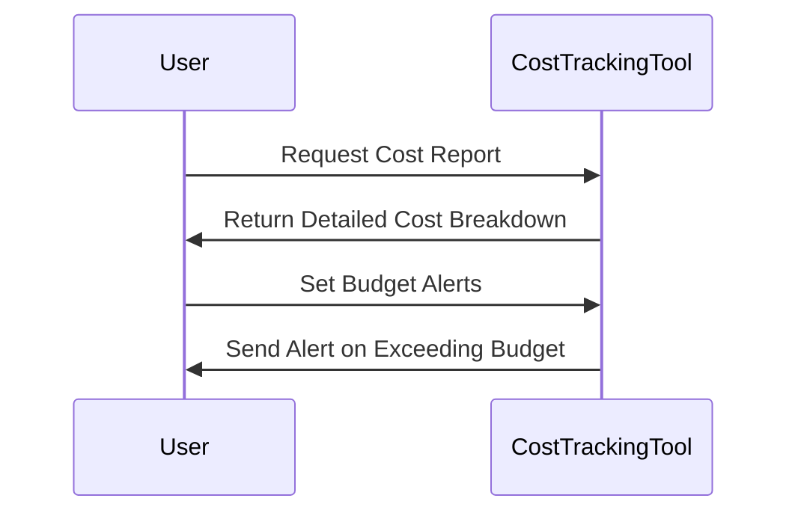

# Cost Optimization Strategies

In this section, we focus on **Cost Optimization Strategies** for AI solutions. Developing and maintaining AI systems can be resource-intensive, especially when scaling for production use. Effective cost management involves balancing performance and scalability without overspending on infrastructure, storage, or compute resources.

## Overview

Cost optimization is an essential consideration in AI solution design. By strategically managing resources and choosing the right tools and techniques, you can significantly reduce costs while maintaining high performance. This section covers:

- **Efficient Resource Allocation**
- **Cloud Cost Management**
- **Model Optimization for Cost Savings**
- **Data Storage and Processing Optimization**
- **Monitoring and Budgeting**

##Efficient Resource Allocation

Effective resource allocation is key to reducing unnecessary spending. Misallocation of resources can lead to underutilized or over-provisioned infrastructure.

### Autoscaling

Autoscaling automatically adjusts the number of active instances based on demand. This approach helps manage costs by increasing resources only when necessary.

**Best Practices:**

- Set up **target utilization thresholds** (e.g., CPU usage above 70%) to trigger scaling.
- Use **cool-down periods** to prevent rapid scaling up and down.

### Right-Sizing Instances

Right-sizing involves selecting the appropriate instance types based on workload requirements. Many organizations use larger instances than necessary, leading to wasted resources.

**Tips for Right-Sizing:**

- Analyze usage metrics to determine the ideal instance size.
- Regularly review and adjust instance types based on changing workloads.
- Consider using **cloud provider recommendations** for instance sizing.

## Cloud Cost Management

Cloud platforms offer various pricing models and services designed to help optimize costs.

### Reserved and Spot Instances

- **Reserved Instances**: Commit to using a specific instance type for 1-3 years in exchange for a significant discount (up to 75%).
- **Spot Instances**: Use excess cloud capacity at reduced prices (up to 90% off) but with the risk of sudden termination.

**Best Practices:**

- Use **reserved instances** for stable, long-term workloads.
- Leverage **spot instances** for non-critical tasks like batch processing and model training.

### Multi-Cloud Strategy

A **multi-cloud strategy** allows you to leverage the strengths of multiple cloud providers, optimizing costs by using the most cost-effective services from each provider.

| Cloud Provider | Strengths | Example Use Case |
|----------------|-----------|------------------|
| AWS | Diverse service offerings | High-compute tasks using EC2 Spot Instances |
| Google Cloud | AI/ML capabilities | TensorFlow training with cost-effective GPUs |
| Azure | Enterprise integration | Scalable deployment using Azure Functions |

**Challenges:**

- Increased complexity in management
- Potential for data transfer costs between providers

##Model Optimization for Cost Savings

Optimizing the AI model itself can lead to significant cost reductions, especially in production environments where inference costs can accumulate.

### Pruning and Quantization

- **Pruning** reduces the size of the model by removing less important parameters, reducing compute costs.
- **Quantization** decreases the precision of model weights (e.g., from 32-bit floating-point to 8-bit integers), reducing both storage and compute requirements.

**Benefits:**

- Lower inference costs due to reduced compute requirements
- Faster model execution, improving user experience
- Enables deployment on less expensive hardware

### Model Compression

Model compression techniques like **knowledge distillation** and **weight sharing** can also help reduce the size and complexity of models, further lowering costs.

##Data Storage and Processing Optimization

Data is often a significant cost driver in AI projects, particularly when dealing with large datasets or real-time data streams.

### Data Sampling

Instead of using the entire dataset, employ **data sampling** techniques to work with a representative subset. This approach reduces storage costs and speeds up model training.

**Example:**

Use **stratified sampling** to ensure that the subset retains the distribution of the original dataset, improving training efficiency without sacrificing model quality.

### Efficient Storage Formats

Choosing the right data format can reduce both storage and I/O costs.

- **Parquet**: Columnar storage format optimized for read-heavy workloads, reducing storage costs and speeding up queries.
- **Avro**: Suitable for schema evolution and streaming data.
- **ORC**: Best for high-compression requirements and analytics.

**Tips:**

- Compress data before storing (e.g., gzip, snappy).
- Use **data lake storage** like Amazon S3 or Google Cloud Storage for cost-effective, scalable storage.

##Monitoring and Budgeting

Tracking and monitoring your AI solution's costs is critical to avoid unexpected expenses.

### Cost Tracking Tools

- **AWS Cost Explorer**, **Azure Cost Management**, and **Google Cloud Billing** provide detailed cost breakdowns.
- **FinOps** tools like **CloudHealth** or **Kubecost** offer advanced cost tracking and analysis.

### Budget Alerts and Notifications

Set up **budget alerts** to receive notifications when spending exceeds predefined thresholds.

**Example:**

- Receive an alert if monthly compute costs exceed $10,000.
- Get notified if storage costs increase by more than 20% month-over-month.

## Common Pitfalls

Be aware of these common pitfalls when implementing cost optimization strategies:

- **Over-optimization Leading to Performance Issues**: Cutting costs too aggressively can lead to degraded performance and poor user experience.
- **Ignoring Long-Term Commitments**: Relying solely on on-demand pricing without considering reserved instances can lead to higher costs for stable workloads.
- **Lack of Regular Cost Review**: Cloud costs can change frequently; regular audits are necessary to identify new savings opportunities.

## Real-World Example

A **fintech company** was struggling with high costs from running deep learning models on-demand in AWS. By implementing **autoscaling**, switching to **spot instances** for training, and optimizing models using **quantization**, they reduced their monthly cloud expenses by 40% while maintaining the same level of service.

## Next Steps

Now that you understand how to effectively manage and reduce costs, proceed to the next section: [AI Solution Evaluation Metrics](05-AI-Solution-Evaluation-Metrics.md), where we will explore how to measure and evaluate the performance and impact of your AI solution.
