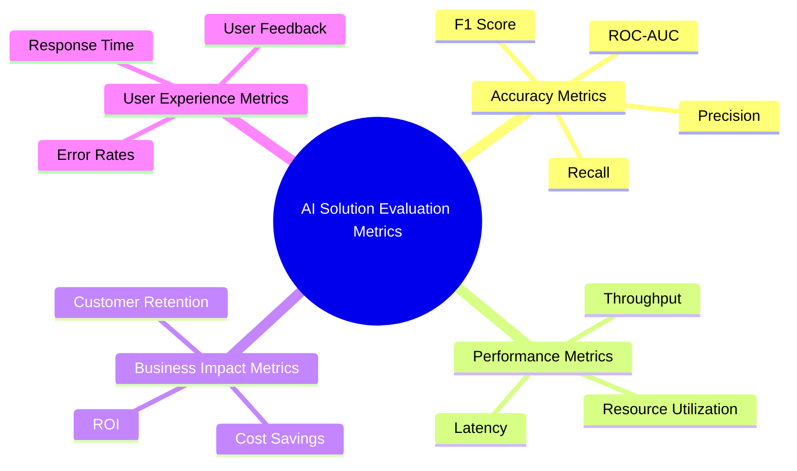
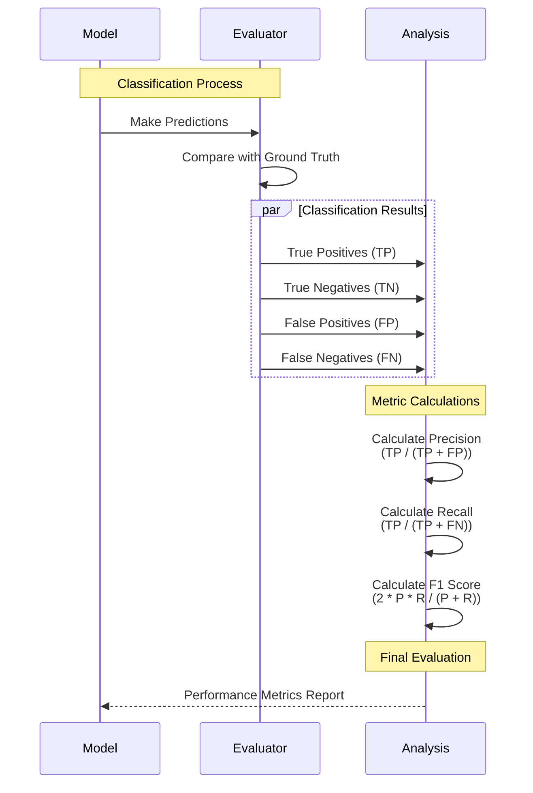
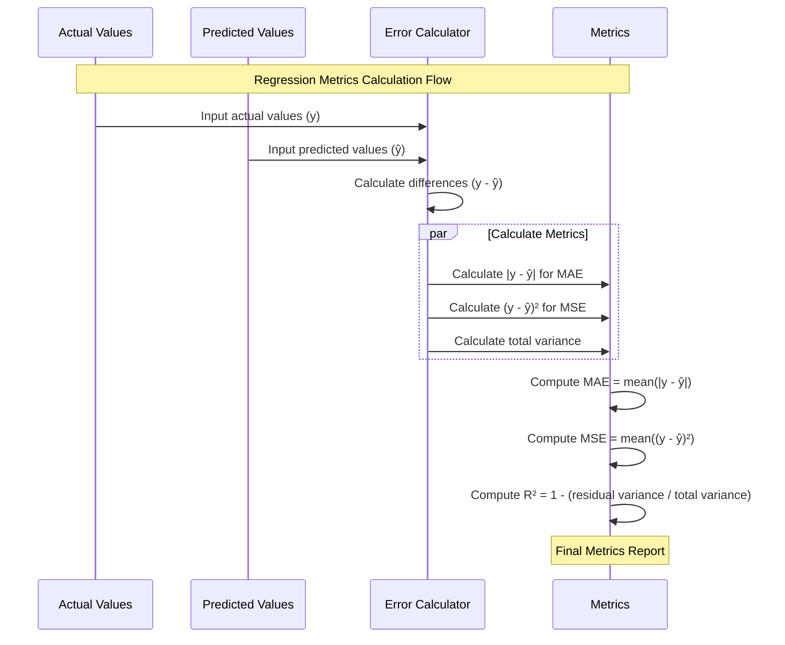
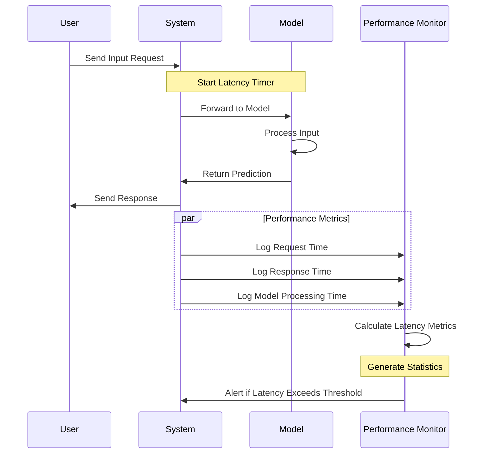
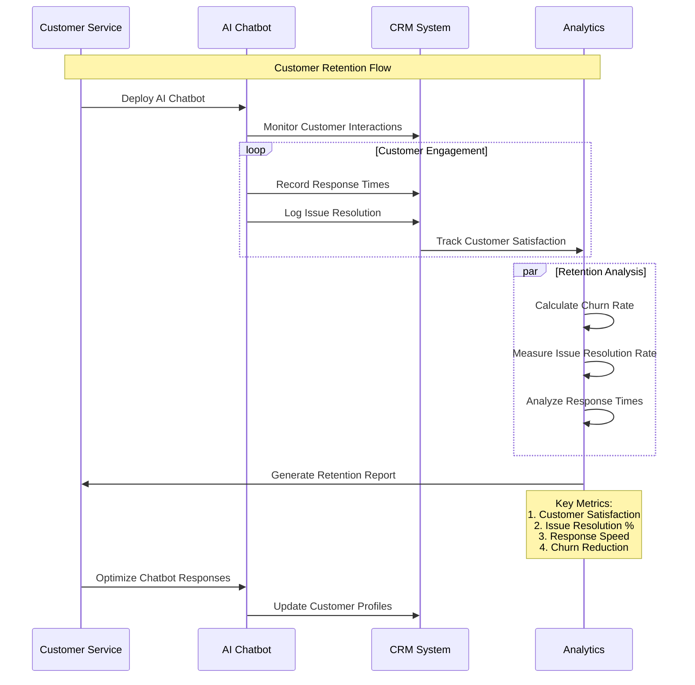

# AI Solution Evaluation Metrics

In this section, we will explore how to effectively evaluate the performance of your AI solutions using a comprehensive set of metrics. Proper evaluation is crucial to ensure that your AI models are not only accurate but also aligned with business goals and user expectations.

## Overview

Choosing the right evaluation metrics is a critical step in building successful AI solutions. Metrics help you:

- **Measure model performance** and accuracy
- **Assess system efficiency and scalability**
- **Evaluate business impact and user satisfaction**

Key categories of evaluation metrics include:

- **Accuracy Metrics**
- **Performance Metrics**
- **Business Impact Metrics**
- **User Experience Metrics**

##Accuracy Metrics

Accuracy metrics are used to assess the quality of predictions made by the AI model. The choice of metric depends on the specific task (e.g., classification, regression, recommendation).

### Classification Metrics

For classification tasks, common metrics include:

- **Precision**: Measures the percentage of true positive predictions among all positive predictions made by the model.
- **Recall**: Indicates the percentage of actual positive cases correctly identified by the model.
- **F1 Score**: The harmonic mean of precision and recall, providing a balanced measure of both.
- **ROC-AUC**: The area under the Receiver Operating Characteristic curve, indicating the model's ability to distinguish between classes.

| Metric | Formula | Use Case |
|--------|---------|----------|
| Precision | TP / (TP + FP) | Minimize false positives (e.g., fraud detection) |
| Recall | TP / (TP + FN) | Minimize false negatives (e.g., medical diagnosis) |
| F1 Score | 2 * (Precision * Recall) / (Precision + Recall) | Balance between precision and recall |
| ROC-AUC | Area under ROC curve | Evaluate overall classification performance |

### Regression Metrics

For regression tasks (e.g., predicting sales, prices), common metrics include:

- **Mean Absolute Error (MAE)**: The average absolute difference between predicted and actual values.
- **Mean Squared Error (MSE)**: The average squared difference between predicted and actual values, penalizing larger errors.
- **R² (Coefficient of Determination)**: Indicates the proportion of variance in the target variable explained by the model.

| Metric | Formula | Use Case |
|--------|---------|----------|
| MAE | (1/n) ∑ |y - ŷ| | Interpretability and robustness |
| MSE | (1/n) ∑ (y - ŷ)² | Penalizes larger errors |
| R² | 1 - (SS_res / SS_tot) | Measure of explained variance |

##Performance Metrics

Performance metrics help evaluate the system’s efficiency, particularly during inference.

### Latency

Latency is the time taken for the model to return a prediction after receiving an input. It is crucial for real-time applications like chatbots or fraud detection.

- **Low Latency**: Important for applications requiring quick responses (e.g., autonomous driving).
- **High Latency Tolerance**: Acceptable for batch processing tasks (e.g., offline data analysis).

### Throughput

Throughput measures the number of predictions or inferences the system can handle per second. It is a key metric for high-traffic applications.

- **High Throughput**: Necessary for large-scale applications like e-commerce recommendation engines.

### Resource Utilization

Tracking CPU, GPU, and memory usage helps ensure efficient use of hardware resources.

**Tips for Monitoring:**

- Use tools like **Prometheus**, **Grafana**, or **CloudWatch**.
- Set thresholds for acceptable utilization levels (e.g., GPU usage below 80%).

##Business Impact Metrics

Business impact metrics help translate model performance into tangible business outcomes. These metrics are essential for demonstrating the value of the AI solution to stakeholders.

### Return on Investment (ROI)

ROI measures the financial return generated by the AI solution relative to its cost.

**Formula:**

$$
\text{ROI} = \frac{\text{Net Profit}}{\text{Total Investment}} \times 100
$$

### Cost Savings

Calculate the reduction in operational costs achieved by automating tasks or optimizing processes using AI.

### Customer Retention

Track the impact of AI solutions (e.g., recommendation systems, personalized marketing) on customer retention and engagement.

**Example:**

An AI-driven customer support chatbot can reduce churn by providing quick responses and resolving issues effectively.

## User Experience Metrics

User experience metrics focus on the end-user’s interaction with the AI solution. These metrics are often overlooked but are crucial for user satisfaction.

### Response Time

Response time is a key user experience metric, especially for interactive applications like voice assistants or recommendation systems.

### Error Rates

Track the number of errors or failed predictions, as this directly impacts user trust and satisfaction.

**Example:**

- High error rates in a facial recognition system can lead to poor user experiences and potential bias concerns.

### User Feedback

Collect user feedback to understand the strengths and weaknesses of the AI solution from a usability perspective.

**Tips for Gathering Feedback:**

- Use surveys or feedback forms integrated into the application.
- Implement A/B testing to compare different versions of the model.

## Common Pitfalls

Be mindful of these common pitfalls when selecting evaluation metrics:

- **Choosing Inappropriate Metrics**: Using the wrong metrics can misrepresent model performance (e.g., accuracy for imbalanced datasets).
- **Overfitting to Metrics**: Focusing solely on maximizing a specific metric can lead to overfitting and poor generalization.
- **Neglecting Business Impact**: Metrics like precision and recall are important, but they should be tied to business outcomes for a holistic evaluation.

## Real-World Example

A **healthcare startup** developed an AI model to predict patient readmission risk. Initially, the model was evaluated using accuracy, but it performed poorly in practice due to class imbalance. After switching to **F1 Score** and **Recall** as the primary metrics, the team identified the need for better handling of the minority class (high-risk patients). This led to improved patient outcomes and a 30% reduction in readmissions.

## Next Steps

Now that you have a strong understanding of evaluation metrics, you can use this knowledge to effectively measure the success of your AI solutions. In the next section, [Deployment Strategies for AI Solutions](06-Deployment-Strategies-for-AI-Solutions.md), we will explore best practices for deploying your models in production environments.
