# Deployment Strategies for AI Solutions

Deploying AI solutions into production is a critical step in the AI lifecycle. An effective deployment strategy ensures that the model performs well in real-world scenarios, scales to meet user demand, and can be easily maintained and monitored. This section explores the best practices and strategies for deploying AI models, focusing on various deployment paradigms, infrastructure options, deployment strategies, monitoring, and maintenance.

## Overview

Successful AI deployment requires careful planning across multiple dimensions:

- **Deployment Paradigms**: Selecting the right mode of inference (batch, real-time, edge).
- **Infrastructure Options**: Choosing the best environment (on-premises, cloud, hybrid).
- **Deployment Strategies**: Ensuring smooth rollout with minimal risk (e.g., blue-green, canary, shadow).
- **Monitoring and Maintenance**: Setting up comprehensive monitoring to detect issues early.
- **Continuous Integration/Continuous Deployment (CI/CD)**: Automating the deployment process for efficiency and reliability.

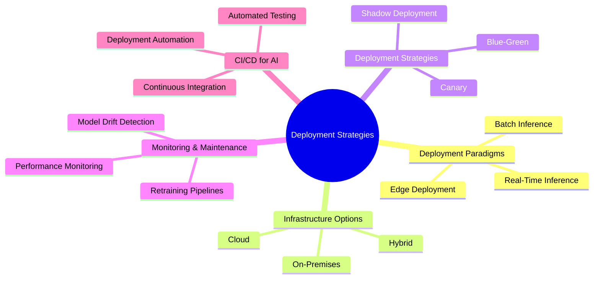

## Deployment Paradigms

### Batch Inference

**Batch inference** processes large datasets at scheduled intervals. It is ideal for tasks that do not require real-time predictions and can be executed during off-peak hours.

| **Use Cases**               | **Advantages**                          | **Disadvantages**                        |
|-----------------------------|-----------------------------------------|------------------------------------------|
| Demand forecasting, risk assessment, customer segmentation | Efficient for large datasets, less resource-intensive during peak hours | Not suitable for real-time requirements, high latency |

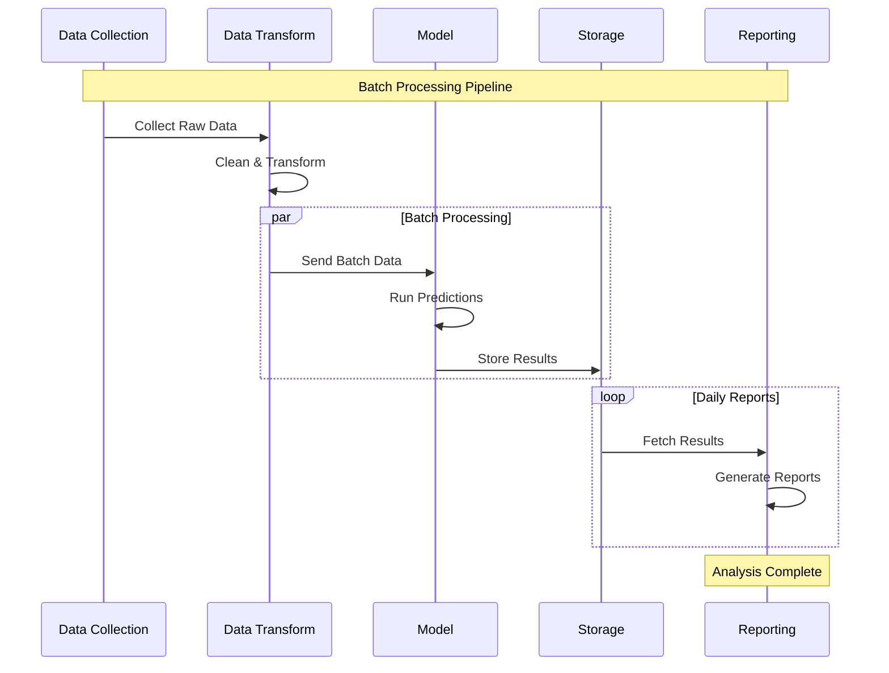

### Real-Time Inference

**Real-time inference** provides predictions as soon as data arrives, making it essential for applications requiring immediate responses.

| **Use Cases**                  | **Advantages**                     | **Disadvantages**                    |
|--------------------------------|------------------------------------|--------------------------------------|
| Chatbots, fraud detection, recommendation systems | Instant predictions, enhances user experience | Requires low-latency infrastructure, higher resource consumption |

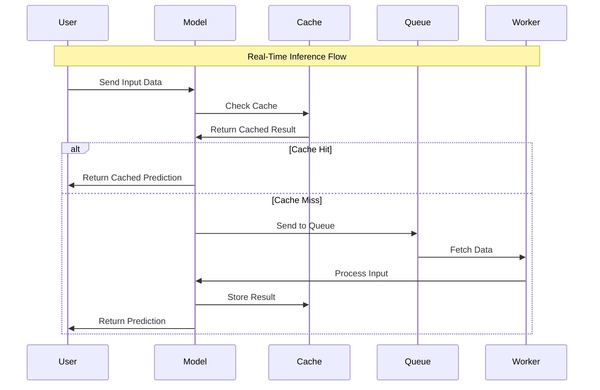

### Edge Deployment

**Edge deployment** runs AI models directly on devices like IoT sensors or mobile apps, reducing latency and enabling offline predictions.

| **Use Cases**                       | **Advantages**                      | **Disadvantages**                      |
|------------------------------------|-------------------------------------|----------------------------------------|
| Autonomous vehicles, mobile apps, smart cameras | Low latency, reduced bandwidth usage, enhanced privacy | Limited computational resources, challenges with updates |

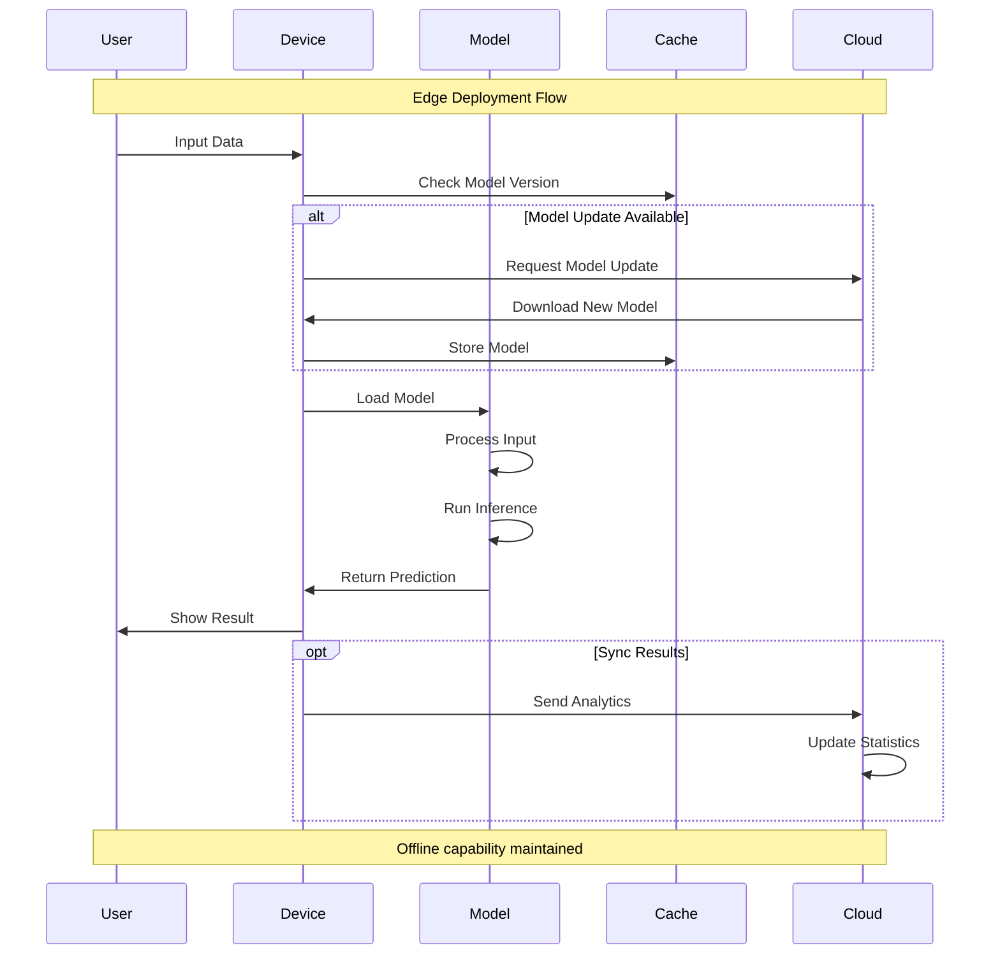

## Infrastructure Options

Selecting the right infrastructure is vital for successful AI deployment. Options include **on-premises**, **cloud**, and **hybrid** environments.

| **Infrastructure** | **Pros**                           | **Cons**                              |
|--------------------|------------------------------------|---------------------------------------|
| On-Premises        | Full control, enhanced data privacy | High initial costs, limited scalability |
| Cloud              | Scalable, flexible, managed services | Potential data transfer costs, vendor lock-in |
| Hybrid             | Balances control and scalability   | Increased complexity, synchronization issues |

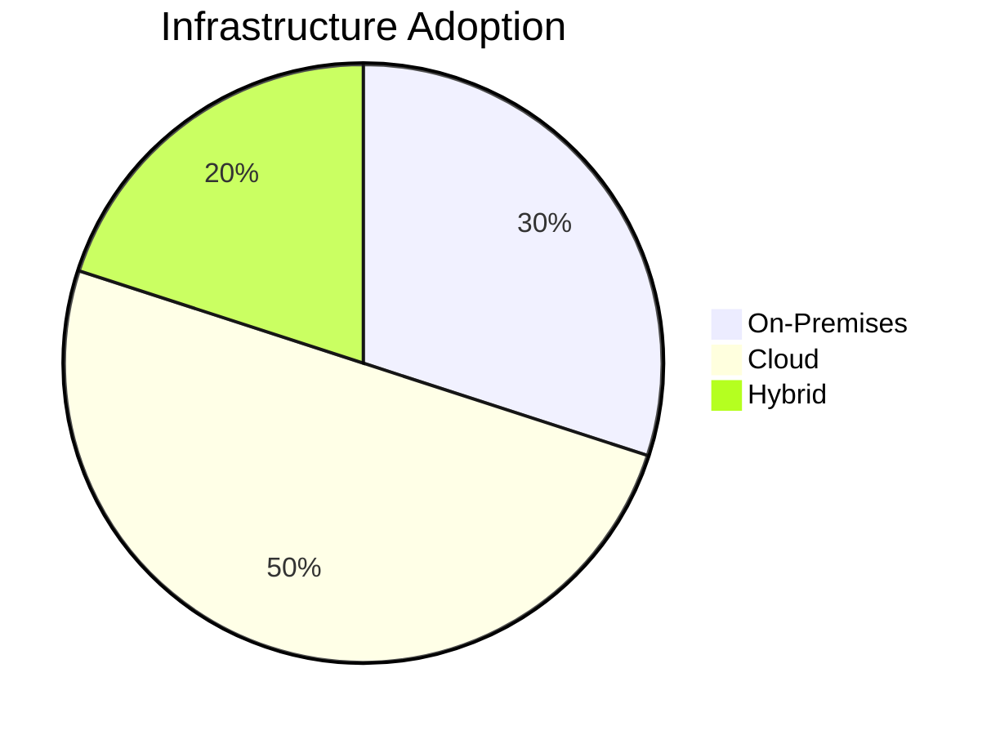

## Deployment Strategies

Effective deployment strategies reduce risks and ensure a smooth transition from development to production.

### Blue-Green Deployment

In **blue-green deployment**, two identical environments (blue and green) are maintained. Traffic is switched from blue (current version) to green (new version) once testing is complete.

| **Pros**                   | **Cons**                          |
|----------------------------|-----------------------------------|
| Zero downtime, easy rollback | Higher resource costs, duplicate infrastructure |

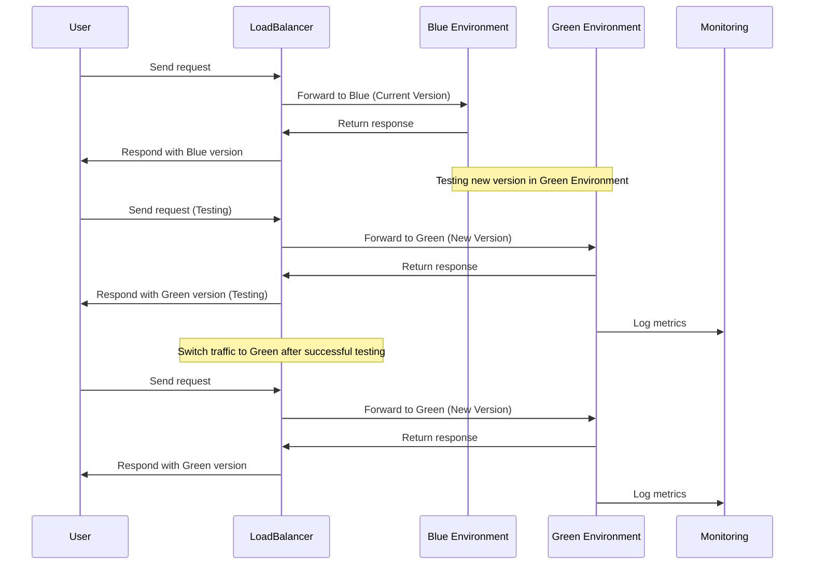

### Canary Deployment

**Canary deployment** gradually rolls out the new version to a small subset of users, allowing real-world testing without impacting all users.

| **Pros**                         | **Cons**                             |
|----------------------------------|--------------------------------------|
| Reduces risk, allows incremental testing | Complex traffic management, longer rollout time |

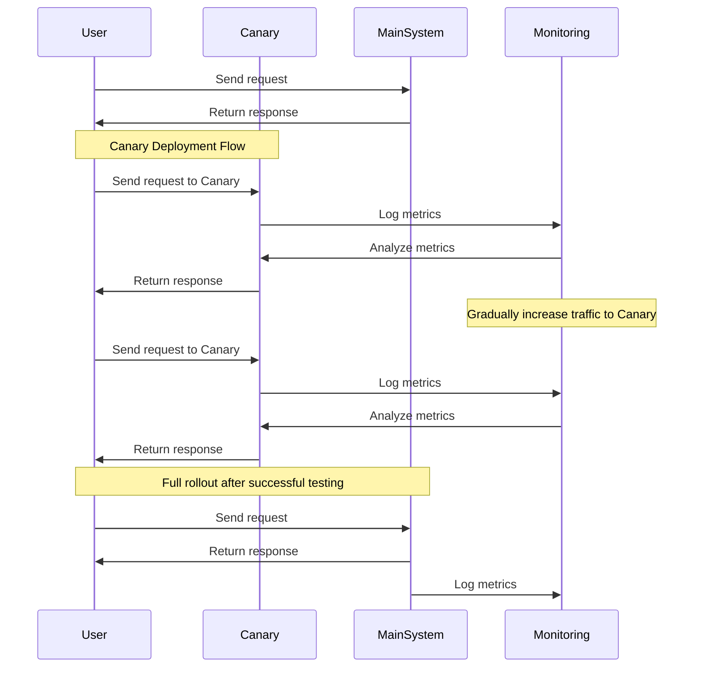

### Shadow Deployment

In **shadow deployment**, the new model runs alongside the current model, processing live traffic without affecting users. This allows for comprehensive testing with real data.

| **Pros**               | **Cons**                     |
|------------------------|------------------------------|
| Safe testing with real data, no impact on user experience | High infrastructure costs, requires complex monitoring |

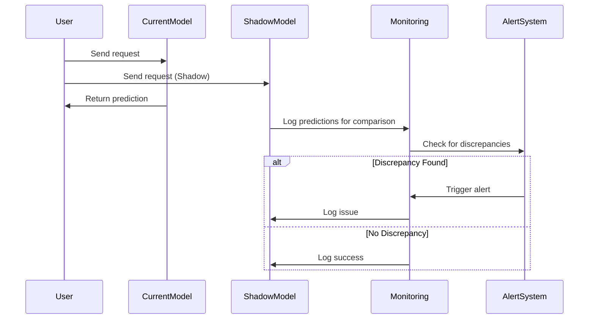

## Monitoring and Maintenance

Continuous monitoring and maintenance are essential to detect performance issues, data drift, and system failures.

### Model Drift Detection

Model drift occurs when the data distribution changes, leading to a decline in model performance. Techniques for detecting drift include:

| **Technique**           | **Description**                            |
|-------------------------|--------------------------------------------|
| Statistical Tests       | Compare training and production data distributions. |
| Performance Monitoring  | Track key metrics like accuracy and F1 score over time. |

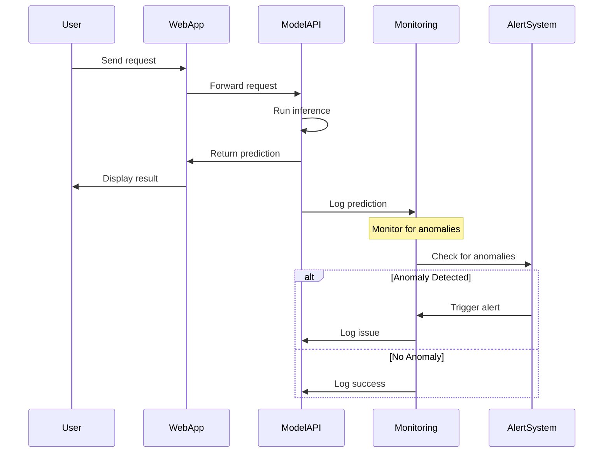

### Model Retraining

A retraining pipeline ensures that the model is periodically updated with new data to maintain performance. This can be automated using a CI/CD pipeline.

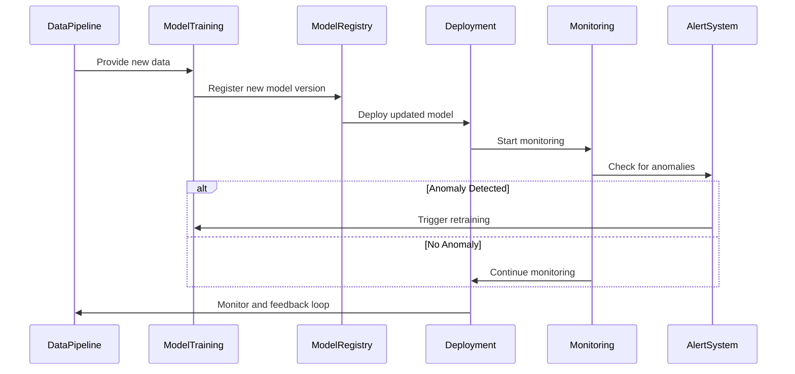

## Continuous Integration and Continuous Deployment (CI/CD)

A robust **CI/CD pipeline** automates the testing, integration, and deployment of AI models, streamlining the process and reducing errors.

| **Best Practices**                  | **Description**                                 |
|------------------------------------|-------------------------------------------------|
| Unit Tests                         | Validate data quality and model performance.    |
| Automated Versioning               | Track changes to model artifacts.               |
| Feedback Loop                      | Monitor deployed models and trigger retraining. |

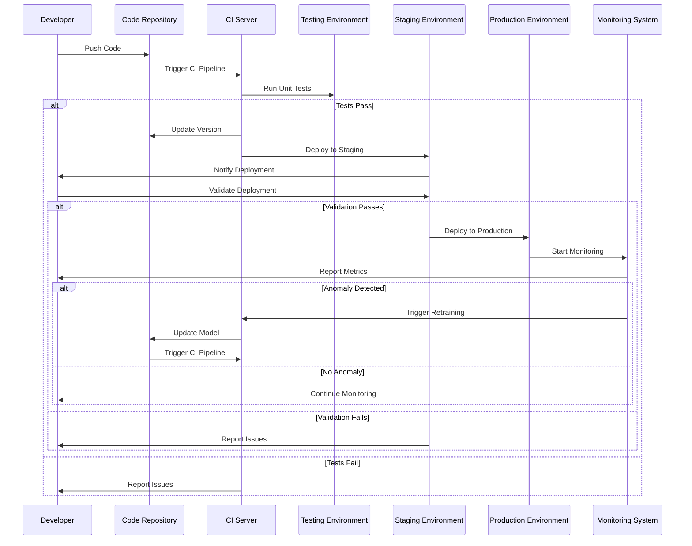

## Common Pitfalls

- **Lack of Monitoring**: Without comprehensive monitoring, detecting issues like model drift is challenging.
- **Ignoring Canary or Shadow Deployment**: Directly deploying new models without gradual rollout can lead to system failures.
- **Underestimating Infrastructure Needs**: Inadequate scaling can result in performance bottlenecks and user dissatisfaction.

## Real-World Example

A **healthcare analytics company** deploys a predictive model for patient readmission risk using a hybrid deployment strategy. The company initially performs batch inference for historical data analysis. For real-time risk assessment, the model is deployed on a cloud-based API service with a shadow deployment strategy. This allows the team to validate the model with live data before a full rollout, resulting in improved accuracy and a 30% reduction in readmissions.

## Next Steps

With a solid understanding of deployment strategies, you are now ready to dive into [AI Integration and Deployment](../5.-AI-Integration-and-Deployment/index.md). This section will cover advanced topics like API design, microservices architecture, containerization, and CI/CD for AI systems.