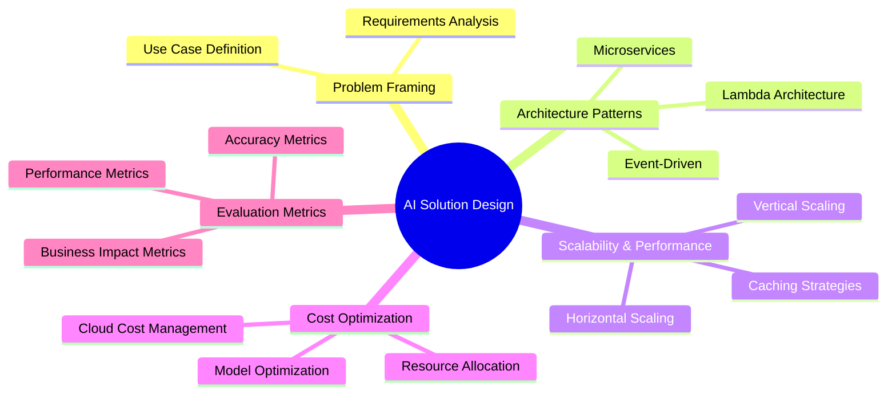

# AI Solution Design

Welcome to the AI Solution Design section of our AI Solution Architect handbook. This section focuses on the practical aspects of designing and implementing AI solutions that are effective, scalable, and cost-efficient.

## Overview

Designing AI solutions requires a holistic approach that goes beyond just understanding AI technologies. It involves careful problem framing, choosing the right architecture patterns, considering scalability and performance, optimizing costs, and establishing proper evaluation metrics.

## Subsections

Explore each crucial aspect of AI solution design:

1. [Problem Framing and Requirements Analysis](01-Problem-Framing-and-Requirements-Analysis.md): Learn how to properly define the problem, gather requirements, and set the foundation for a successful AI project.
2. [AI Architecture Patterns](02-AI-Architecture-Patterns.md): Discover various architectural patterns suitable for AI solutions, including microservices, event-driven architectures, and lambda architectures.
3. [Scalability and Performance Considerations](03-Scalability-and-Performance-Considerations.md): Understand the key factors that influence the scalability and performance of AI systems, and learn strategies to optimize them.
4. [Cost Optimization Strategies](04-Cost-Optimization-Strategies.md): Explore techniques to manage and optimize the costs associated with developing, deploying, and maintaining AI solutions.
5. [AI Solution Evaluation Metrics](05-AI-Solution-Evaluation-Metrics.md): Learn about different metrics used to evaluate AI solutions, covering aspects like accuracy, performance, and business impact.
6. [Deployment Strategies for AI Solutions](06-Deployment-Strategies-for-AI-Solutions.md): Explore best practices for deploying AI solutions in various environments, including cloud, edge, and hybrid deployments.

## How to Use This Section

Each subsection provides in-depth coverage of its respective topic, including:

- Key concepts and best practices
- Real-world examples and case studies
- Practical tips and implementation strategies
- Common pitfalls to avoid

We recommend starting with Problem Framing and Requirements Analysis and progressing through the subsections in order. However, feel free to focus on specific topics based on your current project needs or areas of interest.

## Applying Your Knowledge

As you go through this section, consider how each aspect of AI solution design applies to your specific projects or use cases. Try to:

- Practice framing problems in your domain using the techniques discussed
- Sketch potential architectures for AI solutions you're working on or planning
- Analyze the scalability and performance requirements of your projects
- Identify areas where you can optimize costs in your AI initiatives
- Develop a set of evaluation metrics tailored to your specific AI solutions

Remember, effective AI solution design is an iterative process. Don't hesitate to revisit these topics as you progress in your projects and gain more experience.

## Stay Updated

The field of AI is rapidly evolving, and so are the best practices for designing AI solutions. We regularly update this handbook to reflect the latest trends, technologies, and methodologies. Be sure to check back often for the most up-to-date information.

Happy designing, and may your AI solutions be robust, scalable, and impactful!
