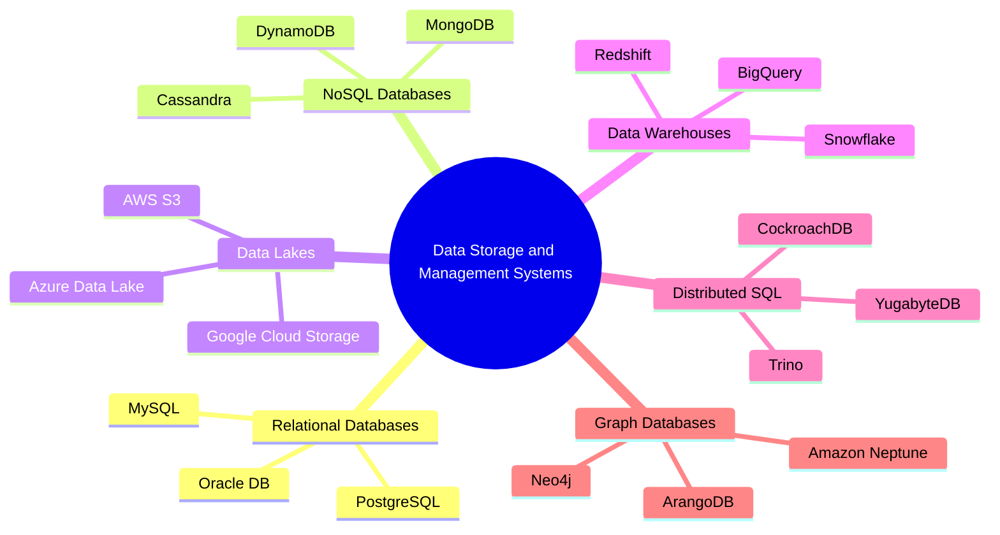
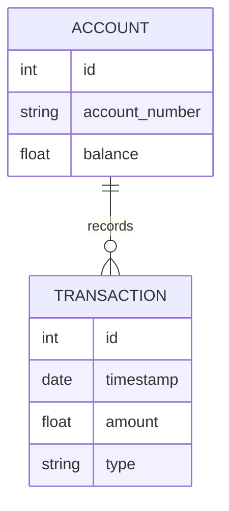
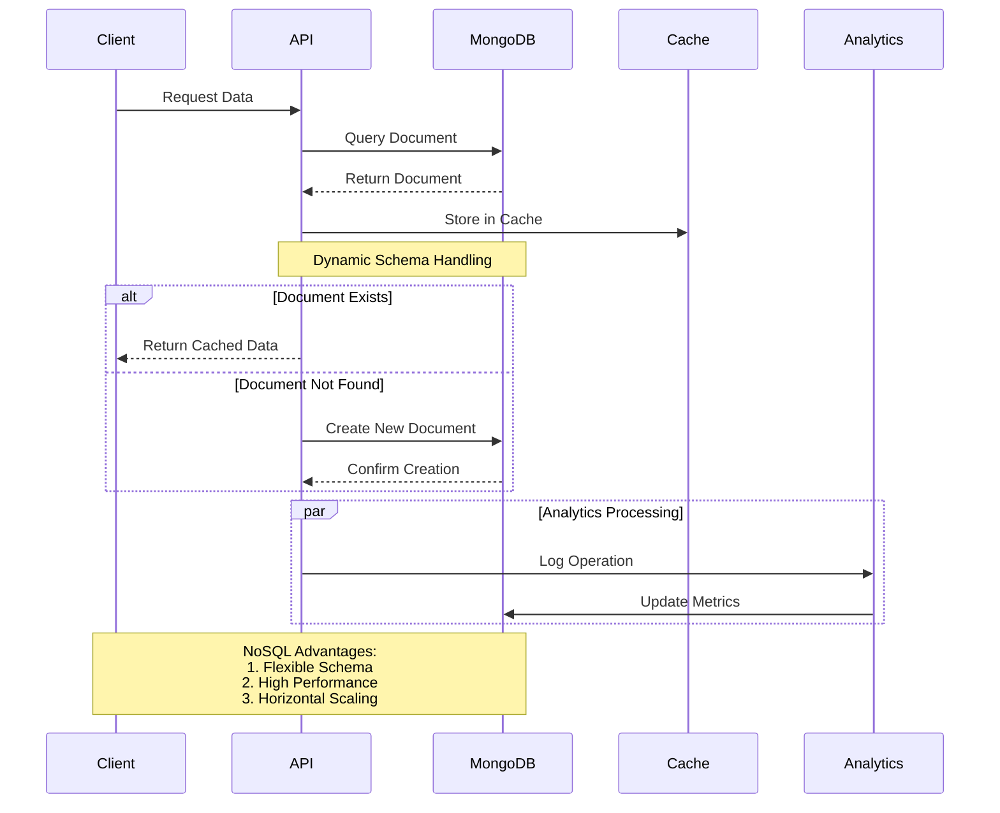
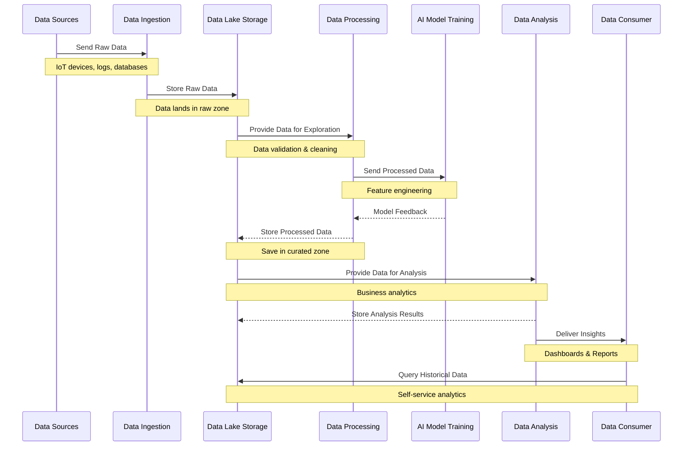
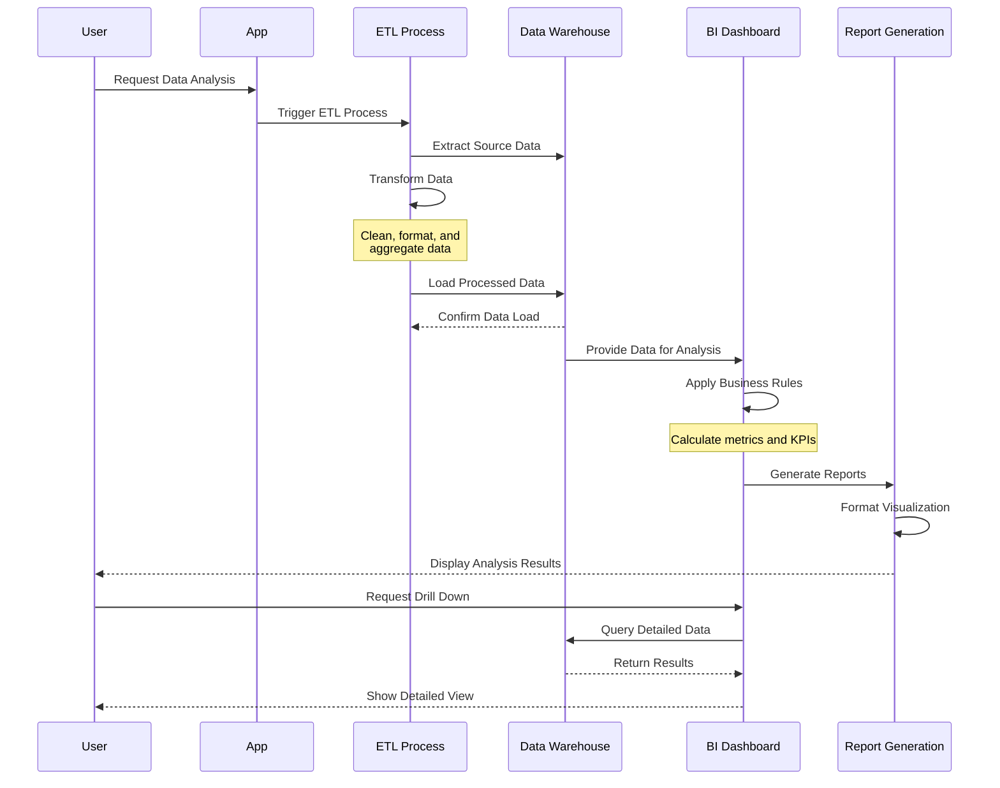
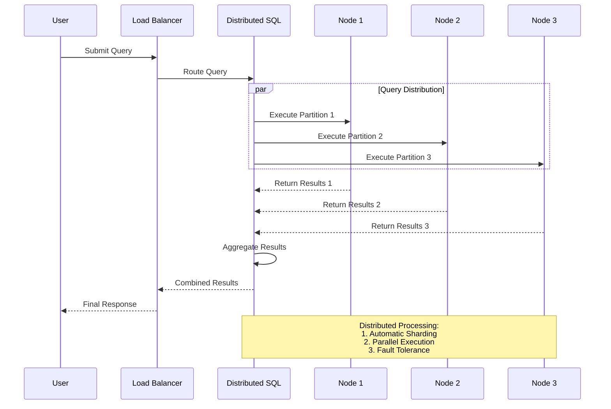
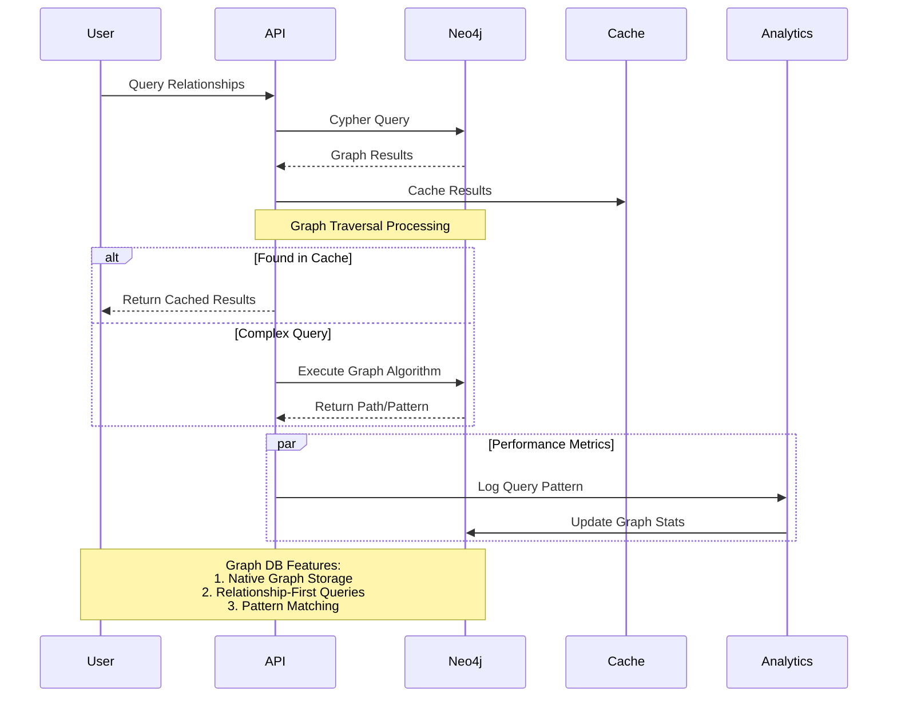

# Data Storage and Management Systems

Choosing the right data storage and management system is foundational for designing robust AI architectures. AI projects require storage solutions that can handle vast amounts of diverse data, provide fast access, and scale efficiently. This page covers the following key data storage options, highlighting their strengths, use cases, and potential pitfalls.

## Overview

Effective data storage systems for AI must consider:

- **Scalability**: Ability to grow with data volume.
- **Flexibility**: Support for various data types (structured, semi-structured, unstructured).
- **Performance**: Fast read and write operations.
- **Consistency vs. Availability**: Balancing between ACID (strong consistency) and eventual consistency.
- **Integration**: Compatibility with analytics and AI tools.

### Data Storage Systems Categories

## Relational Databases

### Overview

Relational databases use structured tables with predefined schemas, enabling strong ACID properties. They are ideal for applications requiring transactional integrity and complex queries.

**Example Use Case:** A banking system uses a relational database to manage account balances and transaction records, ensuring data consistency across multiple operations.

### Advantages and Limitations

| Advantage | Limitation |
|-----------|------------|
| ACID compliance for strong consistency | Scalability challenges for very large datasets |
| Complex querying with SQL support | Rigid schema limits flexibility with changing data |

**Real-World Example:** PostgreSQL is widely used in financial systems due to its robust ACID compliance and support for complex SQL queries.

## NoSQL Databases

### Overview

NoSQL databases are designed for flexible, scalable data storage. They are schema-less, allowing for dynamic data models, and are well-suited for handling unstructured or semi-structured data.

**Example Use Case:** A social media application uses MongoDB to store user-generated content (e.g., posts, comments) with varying structures and fields.

### Types of NoSQL Databases

| Type | Description | Best Use Case | Example |
|------|-------------|---------------|---------|
| **Document Store** | Stores JSON-like documents | Content management | MongoDB, CouchDB |
| **Key-Value Store** | Simple key-value pairs | Caching, session management | Redis, DynamoDB |
| **Column Family** | Stores data in columns rather than rows | Time-series data, analytics | Cassandra, HBase |
| **Graph** | Stores nodes and edges representing relationships | Social networks, fraud detection | Neo4j, Amazon Neptune |

**Advantages:**

- High scalability and flexibility.
- Efficient for real-time analytics and large-scale distributed systems.

**Limitations:**

- May sacrifice consistency for availability (CAP theorem).
- Limited support for complex joins and aggregations.

## Data Lakes

### Overview

A data lake is a centralized storage system designed to hold raw, unprocessed data in its native format. It supports a variety of data types (structured, semi-structured, and unstructured) and is optimized for large-scale analytics.

**Example Use Case:** A healthcare provider stores raw patient data (e.g., medical records, lab results) in a data lake for later processing and analysis by data scientists.

### Advantages and Limitations

| Advantage | Limitation |
|-----------|------------|
| Cost-effective storage for vast amounts of raw data | Can become a "data swamp" without proper governance |
| Supports a wide variety of data types and formats | Slower query performance compared to structured storage |

**Real-World Example:** Netflix uses a data lake architecture on AWS S3 to store raw logs and event data for further analysis and model training.

## Data Warehouses

### Overview

Data warehouses are optimized for high-performance analytics on structured data. They are used to aggregate and analyze large volumes of data from multiple sources, providing a single source of truth for business intelligence.

**Example Use Case:** A retail company uses a data warehouse to analyze sales data, track inventory, and generate reports for decision-making.

### Advantages and Limitations

| Advantage | Limitation |
|-----------|------------|
| High performance for complex analytical queries | Higher storage and compute costs |
| Centralized and consistent data storage | Not well-suited for unstructured data |

**Real-World Example:** Snowflake is used by Adobe for efficient analytics on large datasets, providing quick insights for marketing and product development.

## Distributed SQL Systems

### Overview

Distributed SQL systems combine the scalability of NoSQL databases with the consistency and familiarity of traditional SQL databases. These systems are designed for high availability, fault tolerance, and global distribution.

**Example Use Case:** An e-commerce platform uses Trino on top of a data lake to execute complex SQL queries on petabyte-scale datasets for real-time analytics.

### Advantages and Limitations

| Advantage | Limitation |
|-----------|------------|
| Horizontal scalability with SQL compatibility | Higher write latency in distributed environments |
| High availability and fault tolerance | Complexity in setup and maintenance |

**Real-World Example:** LinkedIn uses CockroachDB for its global user base, leveraging distributed SQL to ensure low-latency access across regions.

## Graph Databases

### Overview

Graph databases are specialized for representing and querying complex relationships between entities using nodes and edges. They excel in scenarios where relationships are central, such as social networks or recommendation systems.

**Example Use Case:** A fraud detection system uses Neo4j to model and query complex relationships between users, transactions, and devices.

### Advantages and Limitations

| Advantage | Limitation |
|-----------|------------|
| Efficient traversal of complex relationships | Not suited for heavy transactional workloads |
| Flexible schema for dynamic, connected data | Limited support for standard SQL queries |

**Real-World Example:** eBay uses Neo4j for its recommendation engine, analyzing user behavior and product relationships to suggest relevant items.

## Comparing Data Storage Systems

| Feature | Relational DB | NoSQL DB | Data Lake | Data Warehouse | Distributed SQL | Graph DB |
|---------|---------------|----------|-----------|----------------|-----------------|----------|
| **Schema** | Fixed | Flexible | Schema-on-read | Fixed | SQL-compliant | Flexible |
| **Scalability** | Vertical | Horizontal | Horizontal | Vertical | Horizontal | Horizontal |
| **Data Type** | Structured | Unstructured | All types | Structured | Structured | Graph data |
| **Query Language** | SQL | NoSQL (varies) | SQL, Python, etc. | SQL | SQL | GraphQL, Cypher |
| **Use Case** | OLTP, analytics | Real-time analytics | Big data storage | Business intelligence | Large-scale analytics | Relationship-based queries |

## Real-World Example

A **global ride-sharing service** employs a combination of storage solutions:

- **NoSQL (MongoDB)** for storing real-time trip data.
- **Data Lake (AWS S3)** for raw logs and historical data.
- **Distributed SQL (Trino)** for complex, cross-region analytics.
- **Graph Database (Neo4j)** for user behavior and fraud detection analysis.

## Next Steps

To continue learning about how to process data for AI, visit [Data Pipelines and ETL Processes](02-Data-Pipelines-and-ETL-Processes.md) and discover how to design robust pipelines for efficient data transformation and integration.