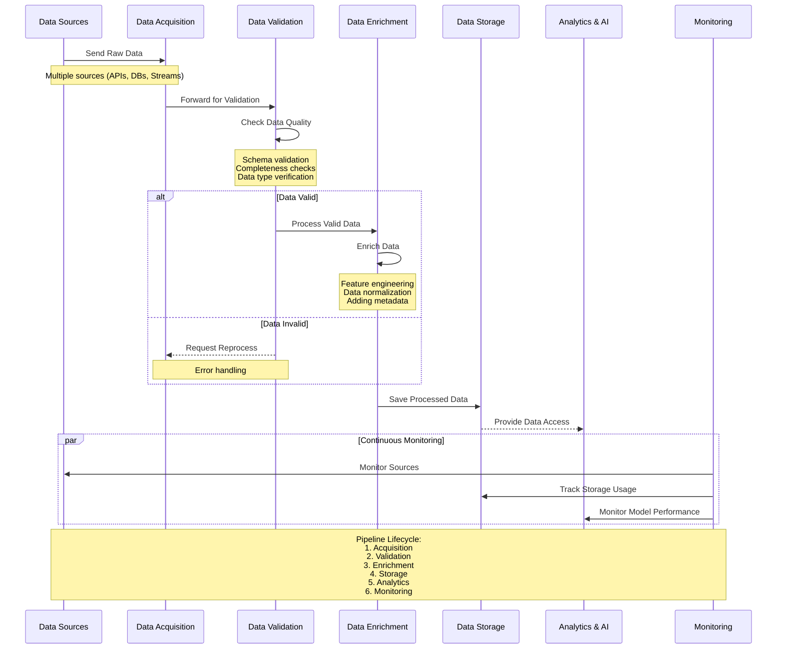
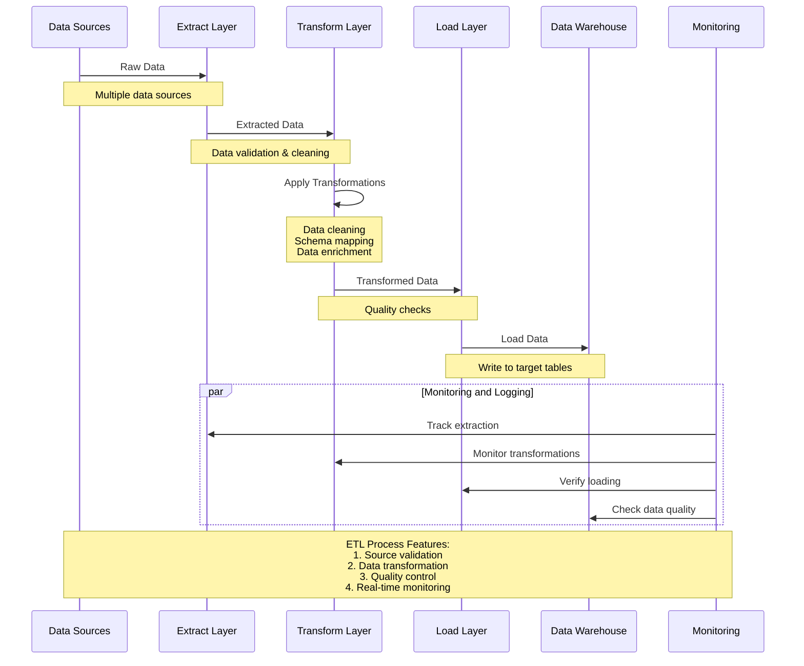
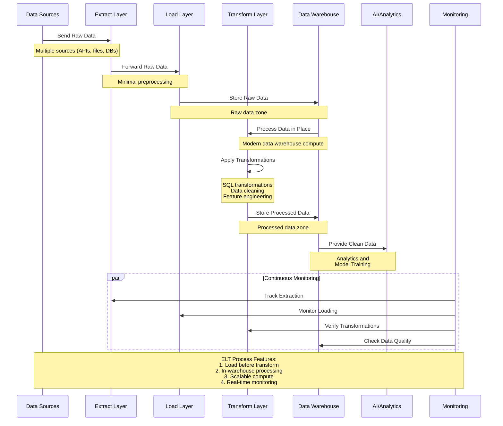
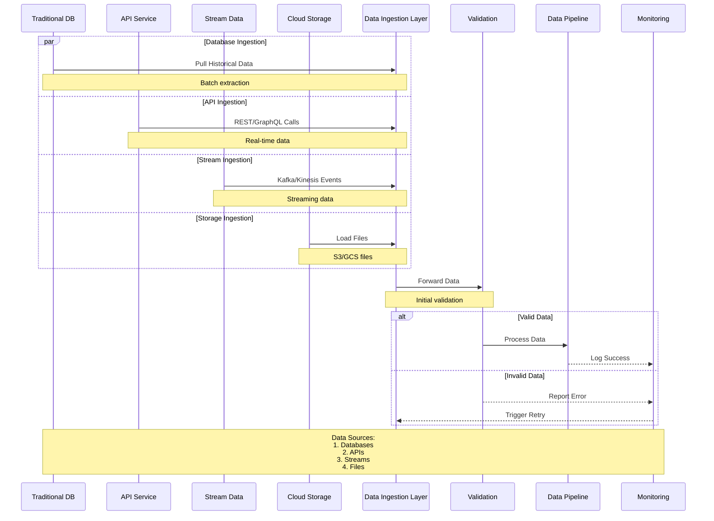
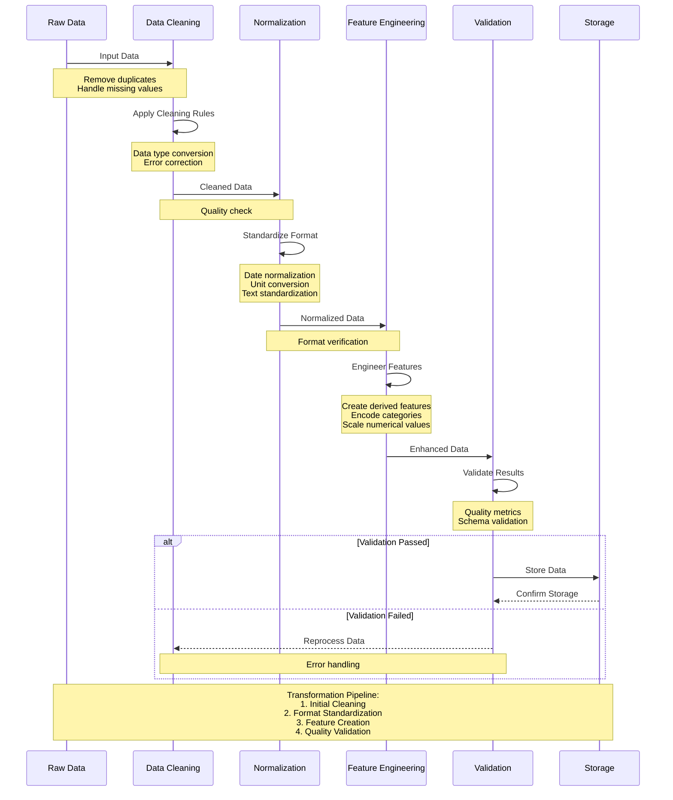
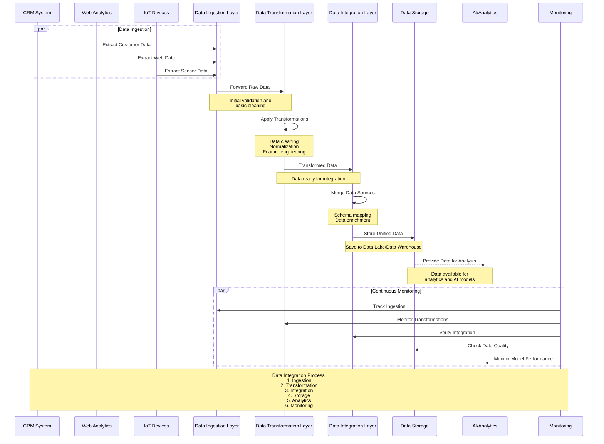
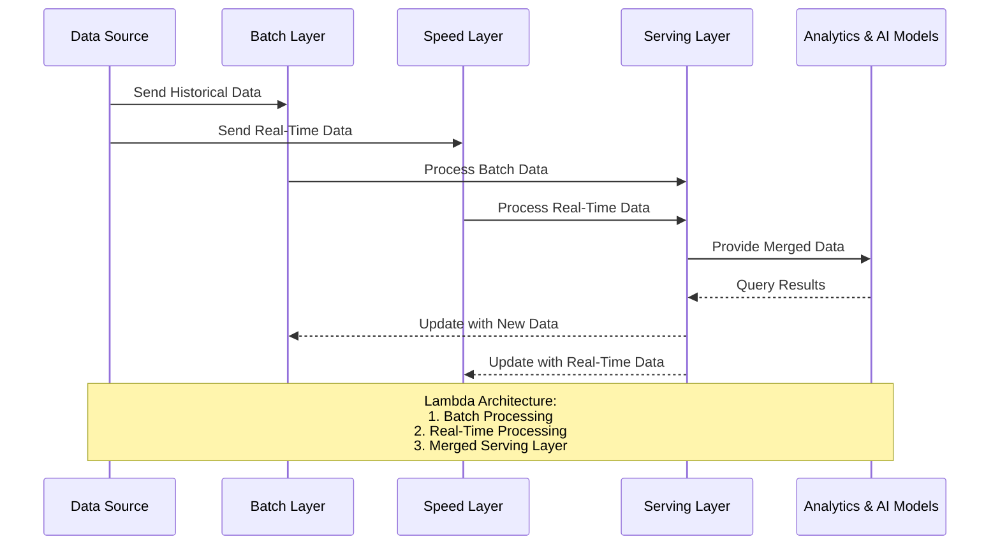
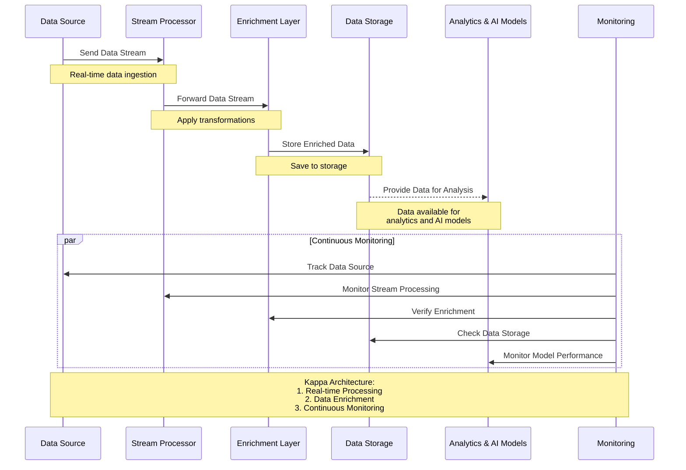

# Data Pipelines and ETL Processes

Data pipelines and ETL (Extract, Transform, Load) processes are critical elements in the data architecture of AI solutions. They enable the movement, transformation, and management of data across various systems, ensuring that high-quality, clean, and enriched data is made available for analytics and AI model training. In this section, we will provide a comprehensive overview of data pipelines, ETL processes, and modern data processing frameworks, including best practices, design patterns, and real-world examples.

## Overview

Data pipelines are automated workflows that transport data from various sources to a centralized destination for storage, processing, and analysis. The complexity of AI projects requires these pipelines to be efficient, scalable, and reliable. A well-designed data pipeline includes:

- **Data Ingestion**: Capturing data from a variety of sources such as databases, APIs, and streaming services.
- **Data Transformation**: Cleaning, normalizing, and enriching data for consistency and usability.
- **Data Integration**: Merging data from multiple sources into a unified, structured format.
- **Data Storage and Delivery**: Storing processed data in databases, data warehouses, or data lakes for further analysis.

### Expanded Data Pipeline Lifecycle

To build an effective data processing pipeline, consider the full data lifecycle, including:

1. **Data Acquisition**: Extracting raw data from internal and external sources.
2. **Data Validation**: Verifying the integrity and quality of the extracted data.
3. **Data Enrichment**: Adding contextual information and deriving new features.
4. **Data Storage**: Storing the cleaned and processed data in a scalable, queryable format.
5. **Data Analytics and AI Integration**: Enabling data access for analytics, reporting, and AI model training.
6. **Monitoring and Maintenance**: Ensuring ongoing data quality, performance, and pipeline reliability.

## Understanding ETL and ELT

### ETL (Extract, Transform, Load)

The traditional ETL process involves:

1. **Extract**: Pulling raw data from multiple sources.
2. **Transform**: Cleaning, formatting, and enriching the data.
3. **Load**: Writing the transformed data to a target system (e.g., data warehouse).

**When to Use ETL:** ETL is best suited for processing structured data and when transformations are complex and require heavy processing before loading.

### ELT (Extract, Load, Transform)

In the ELT process, data is first **extracted** and **loaded** into a data lake or data warehouse before transformations occur within the storage layer. This approach leverages the powerful compute capabilities of modern data warehouses.

**When to Use ELT:** ELT is ideal for handling large volumes of data, especially when transformations can be parallelized using cloud-native data warehouses like BigQuery or Snowflake.

| Process | Characteristics | Best Use Cases | Common Technologies |
|---------|-----------------|----------------|---------------------|
| **ETL** | Data is transformed before loading. | Complex data cleaning, structured data processing. | Apache Airflow, Talend, Informatica |
| **ELT** | Data is loaded first, then transformed. | Large datasets, cloud-native environments. | dbt, Google BigQuery, Snowflake |

## Data Ingestion

Data ingestion is the first step in any data pipeline. It involves collecting raw data from multiple sources, which may include:

- **Traditional Databases**: Relational databases (e.g., PostgreSQL, MySQL) provide structured data.
- **APIs and Web Services**: RESTful APIs, GraphQL APIs, and microservices offer real-time access to external data.
- **Message Queues and Streaming Services**: Apache Kafka, AWS Kinesis, and Google Pub/Sub handle real-time data streams.
- **File Systems and Cloud Storage**: CSV, JSON, and Parquet files stored in AWS S3, Azure Blob Storage, or Google Cloud Storage.

**Best Practices for Data Ingestion:**

1. **Ensure Scalability**: Design the ingestion layer to handle increasing data volume as the AI system grows.
2. **Monitor Latency**: For real-time applications, minimize delays in data collection.
3. **Handle Errors Gracefully**: Implement error handling and retries to avoid data loss.

## Data Transformation

Data transformation involves cleaning, enriching, and standardizing data to make it ready for analysis. Common transformation tasks include:

- **Data Cleaning**: Removing duplicates, handling missing values, and correcting errors.
- **Normalization**: Standardizing data formats (e.g., date formats, units of measurement).
- **Data Aggregation**: Summarizing data for faster analysis (e.g., daily sales totals).
- **Feature Engineering**: Creating new features that improve model performance (e.g., time-based features, categorical encoding).

**Advanced Transformation Techniques:**

- **Data Anonymization**: Masking sensitive information to comply with data privacy regulations (e.g., GDPR, HIPAA).
- **Data Imputation**: Using statistical methods to fill in missing values.
- **Dimensionality Reduction**: Techniques like PCA (Principal Component Analysis) to reduce the number of features.

## Data Integration

Data integration is the process of combining data from different sources to create a unified view. This step is essential for AI projects that require diverse data inputs, such as combining customer data from CRM systems with web analytics data.

**Integration Challenges:**

- **Data Silos**: Isolated data sources hinder analysis and model training.
- **Schema Mismatches**: Different data sources may have varying structures and formats.
- **Data Latency**: Synchronizing real-time and batch data sources can be challenging.

**Integration Strategies:**

- **Schema Mapping**: Define a common schema to map data from different sources.
- **Change Data Capture (CDC)**: Capture incremental changes to keep data up to date.
- **Data Federation**: Virtualize data sources for unified access without physical data movement.

**Tools for Data Integration:** Apache Nifi, Apache Camel, and Talend provide robust solutions for integrating disparate data sources.

## Modern Data Processing Architectures

### Lambda Architecture

Lambda Architecture is a popular design pattern that combines both batch and real-time processing. It consists of three layers:

1. **Batch Layer**: Processes historical data in large chunks.
2. **Speed Layer**: Handles real-time data for low-latency updates.
3. **Serving Layer**: Merges both batch and real-time results for querying.

**Pros:**

- High fault tolerance and scalability.
- Combines the strengths of batch and real-time processing.

**Cons:**

- High complexity and maintenance costs.
- Requires synchronization between batch and speed layers.

### Kappa Architecture

Kappa Architecture simplifies data processing by using a single real-time stream processing engine for both historical and live data.

**Pros:**

- Simplifies the architecture by eliminating the batch layer.
- Ideal for applications with predominantly real-time data needs.

**Cons:**

- May struggle with large-scale historical data.
- Relies heavily on the stream processing engine's capabilities.

## Best Practices for Designing Data Pipelines

1. **Modular Design**: Break down the pipeline into independent, reusable components.
2. **Ensure Data Lineage**: Track the flow of data to maintain transparency and reproducibility.
3. **Implement Robust Monitoring**: Use tools like Prometheus, Grafana, or Datadog to monitor pipeline performance.
4. **Optimize for Scalability**: Design the pipeline to handle increasing data volume without major rework.
5. **Automate Testing and Validation**: Validate data quality at each stage to catch errors early.

## Real-World Example

A **global video streaming platform** might use the following data architecture:

- **Data Ingestion**: Apache Kafka collects real-time data from user interactions (e.g., video views, likes).
- **Stream Processing**: Apache Flink filters and enriches the stream for immediate analytics.
- **Batch Processing**: Apache Spark aggregates historical viewing data for recommendation models.
- **Data Storage**: AWS S3 stores raw and processed data, while Snowflake is used for querying.
- **Analytics and AI**: Data scientists use the processed data to train models for personalized recommendations.

## Next Steps

Now that you have a detailed understanding of data pipelines and ETL processes, continue to [Data Quality and Preprocessing](03-Data-Quality-and-Preprocessing.md) to learn how to ensure high-quality data