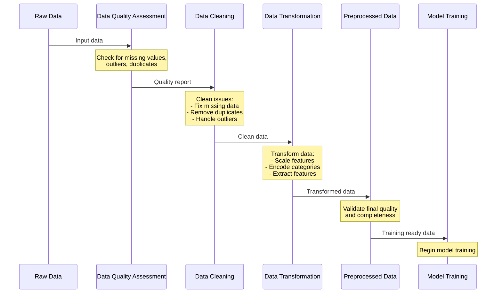
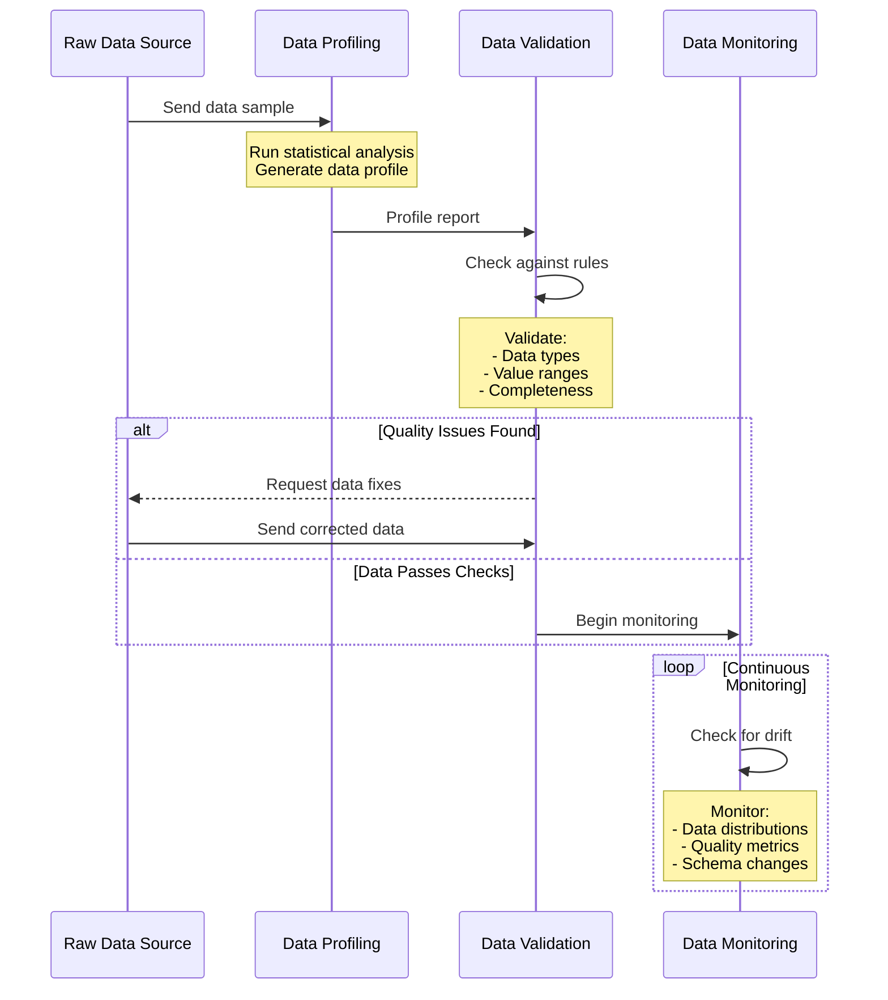
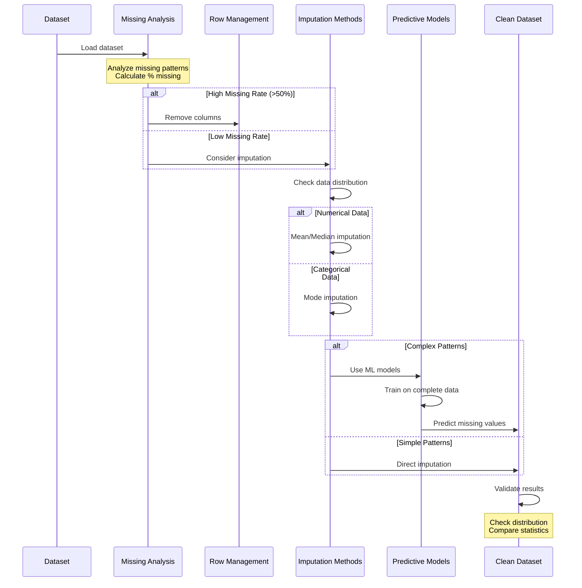
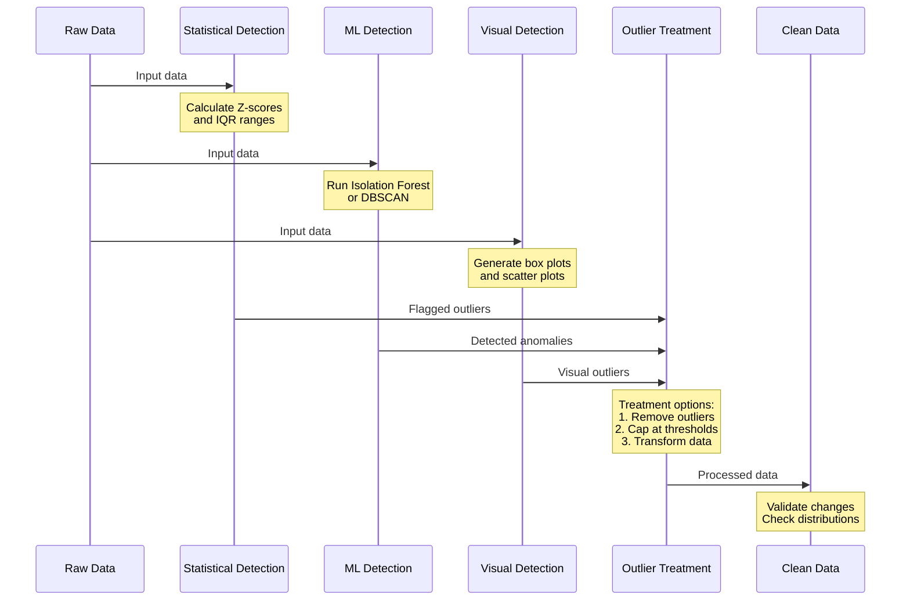
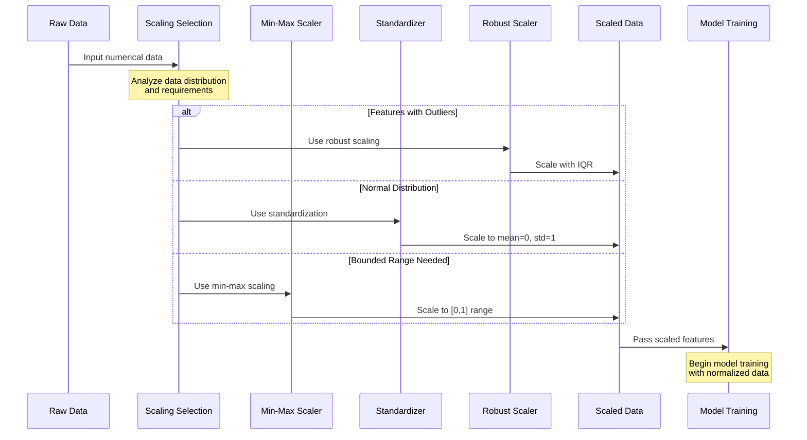
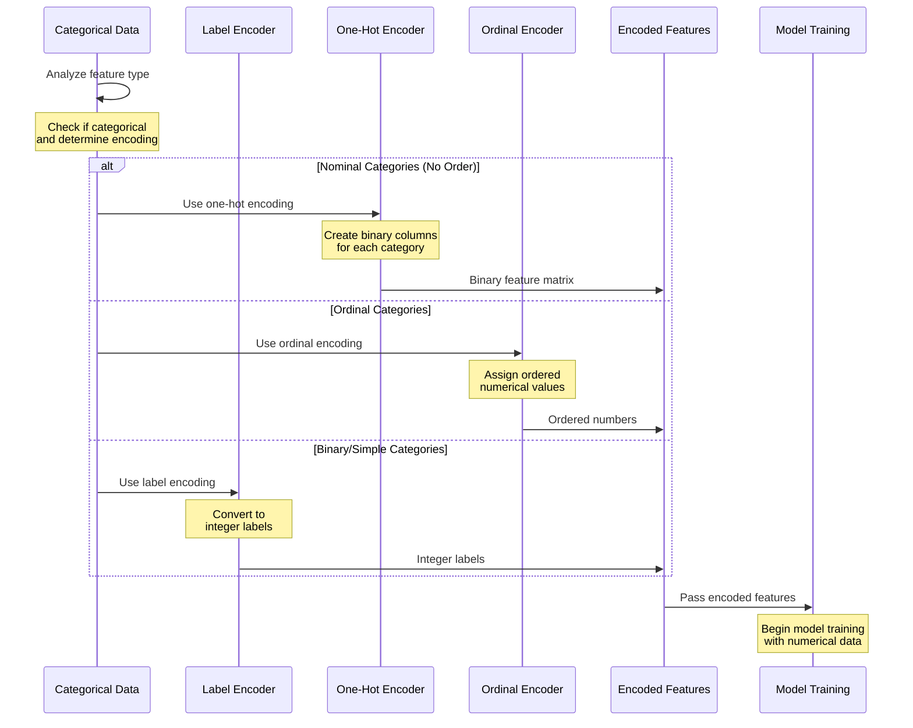
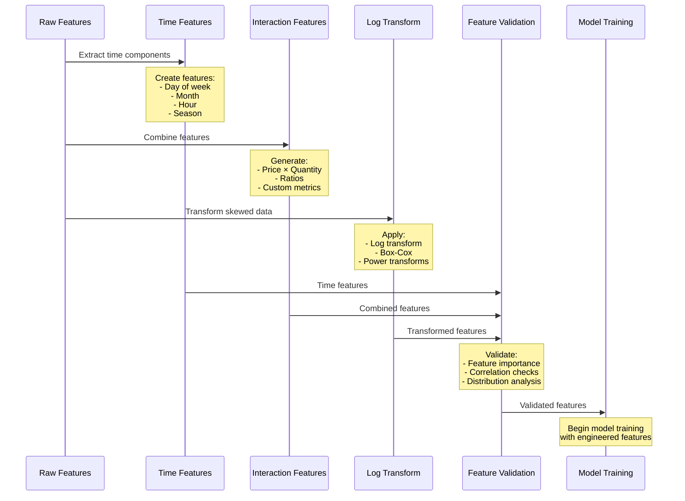

# Data Quality and Preprocessing

High-quality data is the bedrock of successful AI projects. Poor data quality can lead to inaccurate model predictions, biased outcomes, and unreliable insights. Preprocessing ensures that data is clean, consistent, and ready for analysis, helping to maximize the performance of AI models. This section covers the key techniques, best practices, and tools for data quality and preprocessing in AI architectures.

## Overview

Data quality refers to the degree to which data is accurate, complete, consistent, and relevant for its intended use. Data preprocessing involves transforming raw data into a structured and clean format suitable for analysis and model training. Together, these steps are crucial in building reliable AI models.

### Key Aspects of Data Quality

- **Accuracy**: Data should be correct and error-free.
- **Completeness**: Data should not have missing values.
- **Consistency**: Data should be uniform across datasets (e.g., standardized formats).
- **Timeliness**: Data should be up-to-date.
- **Relevance**: Data should be pertinent to the analysis task.

## Data Quality Issues

Data quality issues are common, especially when dealing with data from multiple sources. Common problems include:

- **Missing Data**: Missing values can distort statistical analysis and bias model predictions.
- **Inconsistent Data**: Differences in formats, units, and naming conventions can lead to integration issues.
- **Outliers**: Extreme values can skew the analysis and model performance.
- **Duplicate Records**: Duplicate entries can inflate counts and lead to incorrect conclusions.
- **Data Drift**: Changes in data distributions over time can degrade model performance.

### Identifying Data Quality Issues

Effective data profiling and quality checks can help identify problems early. Common techniques include:

- **Summary Statistics**: Analyzing mean, median, mode, and standard deviation.
- **Visual Inspection**: Using histograms, box plots, and scatter plots.
- **Data Profiling Tools**: Using tools like **Pandas Profiling**, **Great Expectations**, or **Dataprep**.

## Data Cleaning Techniques

Data cleaning involves identifying and correcting errors or inconsistencies in the dataset. The goal is to ensure that the data is accurate, consistent, and complete.

### Handling Missing Data

Missing data is a common issue that can arise due to various reasons such as sensor failures, user input errors, or incomplete records. There are several strategies to handle missing data:

| Method | Description | When to Use |
|--------|-------------|-------------|
| **Remove Missing Values** | Discard rows or columns with missing data. | When the proportion of missing values is small. |
| **Mean/Median Imputation** | Replace missing values with the mean or median of the column. | When data is normally distributed. |
| **Forward/Backward Fill** | Use previous or next value to fill gaps. | Time-series data. |
| **Predictive Imputation** | Use machine learning models to predict missing values. | When missing data is significant and patterns exist. |

### Outlier Detection and Treatment

Outliers are extreme values that differ significantly from the rest of the data. They can distort model predictions and should be carefully managed.

**Common Techniques for Outlier Detection:**

- **Statistical Methods**: Using z-scores or IQR (Interquartile Range) to identify outliers.
- **Visual Methods**: Box plots and scatter plots.
- **Machine Learning**: Isolation Forests, DBSCAN clustering.

### Removing Duplicates

Duplicate records can arise from data entry errors or merging datasets. Removing duplicates is essential to ensure data accuracy.

**Techniques for Handling Duplicates:**

1. **Exact Matching**: Remove records with identical values across all columns.
2. **Fuzzy Matching**: Use algorithms like Levenshtein distance for approximate matches.
3. **Aggregation**: Aggregate duplicate records by taking averages or sums.

## Data Transformation

Data transformation involves converting data into a format suitable for analysis. It is a crucial step in data preprocessing that includes tasks like scaling, encoding, and feature extraction.

### Data Scaling

Scaling ensures that numerical features are on a similar scale, improving the performance of algorithms that rely on distance measures (e.g., KNN, SVM).

| Method | Description | Use Case |
|--------|-------------|----------|
| **Min-Max Scaling** | Rescales features to a range (e.g., 0 to 1). | Neural networks, distance-based models. |
| **Standardization** | Centers data around mean 0 with standard deviation 1. | Models requiring normally distributed data. |
| **Robust Scaling** | Uses IQR for scaling, less sensitive to outliers. | Data with outliers. |

### Encoding Categorical Data

Machine learning models require numerical inputs, so categorical features need to be encoded.

- **Label Encoding**: Converts categories to integer labels (e.g., "red" = 0, "blue" = 1).
- **One-Hot Encoding**: Creates binary columns for each category (e.g., "color_red", "color_blue").
- **Ordinal Encoding**: Assigns ordered integer values based on category ranking.

**Example Use Case:** Encoding "Day of Week" as an ordinal feature for a time-series model.

### Feature Engineering

Feature engineering is the process of creating new features or transforming existing ones to enhance model performance. It includes:

- **Time-based Features**: Extracting day, month, or hour from a timestamp.
- **Interaction Features**: Multiplying or combining features (e.g., price × quantity).
- **Log Transformations**: Reducing skewness of data distributions.

**Example:** Creating a "total spend" feature from "price" and "quantity" columns.

## Data Quality Tools

A range of tools can be used for data quality assessment and preprocessing:

| Tool | Description | Use Case |
|------|-------------|----------|
| **Great Expectations** | Open-source tool for data validation and quality checks. | Automated testing of data quality. |
| **Pandas Profiling** | Generates detailed data reports in Python. | Quick data exploration and profiling. |
| **Apache Deequ** | Data quality library for large-scale data processing. | Data quality checks on Spark dataframes. |
| **Dataprep** | Python library for fast data cleaning and validation. | Exploratory data analysis and profiling. |

## Real-World Example

A **telecommunications company** uses the following data preprocessing workflow for customer churn prediction:

1. **Data Ingestion**: Customer data is collected from CRM, call logs, and transaction records.
2. **Data Quality Checks**: Great Expectations validates data completeness and consistency.
3. **Data Cleaning**: Missing values are imputed using mean imputation for numerical features and mode imputation for categorical features.
4. **Feature Engineering**: New features like "average call duration" and "total spend" are created.
5. **Data Transformation**: Data is standardized and encoded before being fed into a predictive churn model.

## Best Practices

- **Automate Data Quality Checks**: Use data validation tools to catch issues early in the pipeline.
- **Document Preprocessing Steps**: Maintain a log of data transformations for reproducibility.
- **Continuously Monitor Data Quality**: Set up alerts for data drift or anomalies in production.
- **Test with Sample Data**: Run preprocessing steps on a small sample before applying to the full dataset.

## Next Steps

With a solid understanding of data quality and preprocessing, you are now ready to explore the next step in the AI lifecycle: [Feature Engineering](04-Feature-Engineering.md), where we dive deeper into creating and selecting features that enhance model performance.