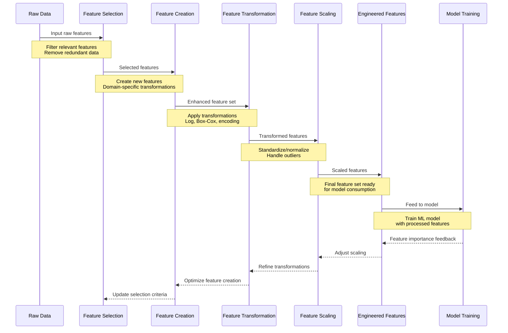
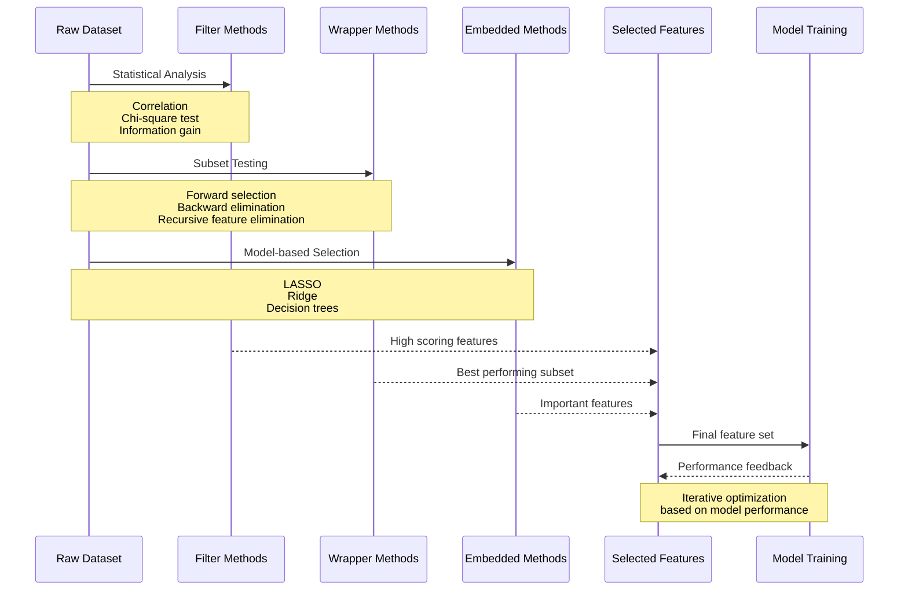
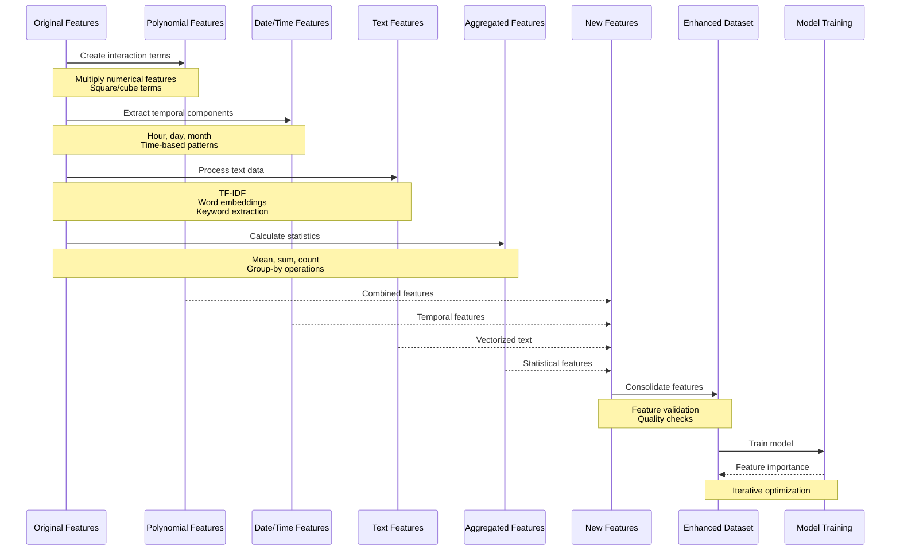
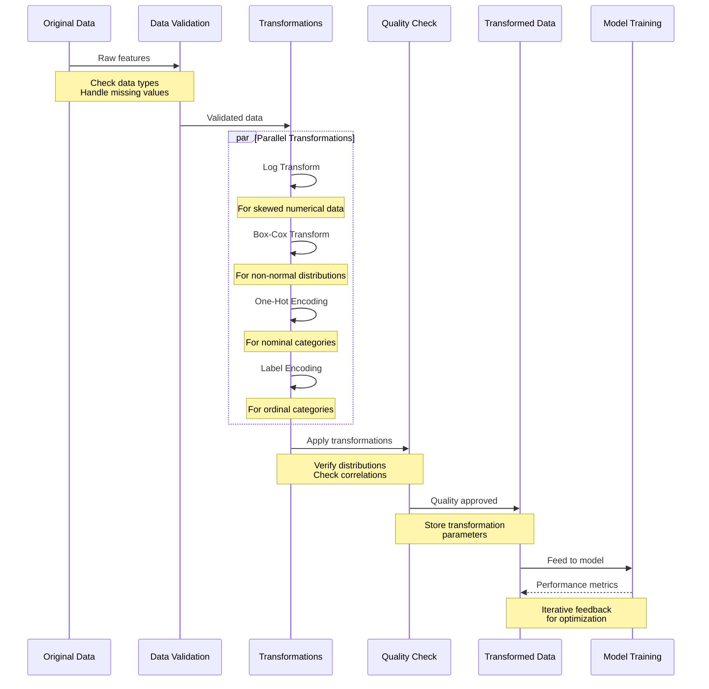
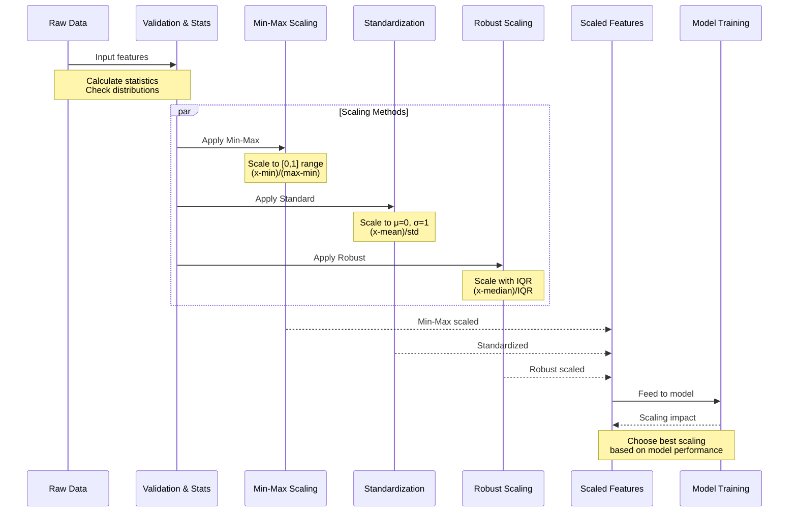
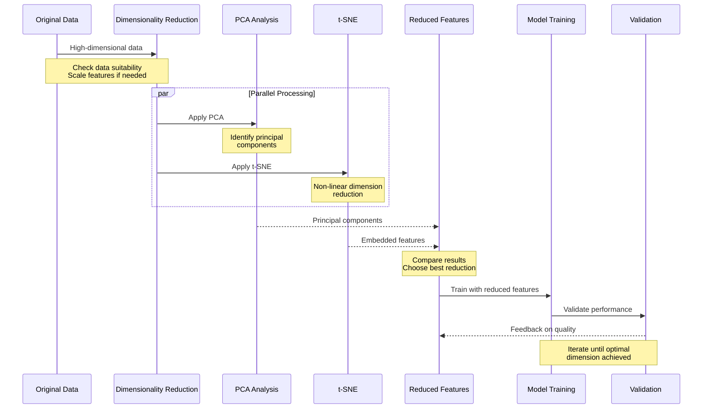

# Feature Engineering

Feature engineering is the process of creating new input variables (features) or transforming existing ones to improve the performance of machine learning models. It is a crucial step in the data preparation phase and can often be the difference between a good model and a great model. Effective feature engineering leverages domain knowledge, statistical analysis, and data transformations to create features that provide the model with meaningful signals.

## Overview

Features are the input variables used by a machine learning model to make predictions. The process of feature engineering involves selecting the most relevant features, creating new ones, and transforming existing data to make it more useful for the model.

**Key Objectives of Feature Engineering:**

- **Increase Predictive Power**: Enhance the model's ability to learn patterns from the data.
- **Improve Model Interpretability**: Create features that are easy to understand and explain.
- **Reduce Noise and Redundancy**: Eliminate irrelevant or redundant data.
- **Handle Data Imbalances**: Address issues with skewed or imbalanced data distributions.

## Feature Selection

Feature selection is the process of identifying the most important and relevant features from the dataset. This step helps reduce the dimensionality of the data, mitigate overfitting, and improve model performance.

### Methods for Feature Selection

| Method | Description | Best Use Case |
|--------|-------------|---------------|
| **Filter Methods** | Uses statistical techniques (e.g., correlation, chi-square test) to evaluate features. | Quick initial analysis for univariate feature selection. |
| **Wrapper Methods** | Iteratively tests different subsets of features using a model (e.g., forward selection, recursive feature elimination). | When computational resources are available for model-based evaluation. |
| **Embedded Methods** | Feature selection occurs as part of the model training process (e.g., LASSO, decision trees). | When using models that have built-in feature importance metrics. |

**Real-World Example:** In a credit scoring model, feature selection might involve evaluating features like income, credit history, and debt-to-income ratio to determine which variables contribute most to predicting loan defaults.

## Feature Creation

Feature creation involves generating new features from existing data. This step often requires domain knowledge and creativity to identify patterns and relationships that the model might not easily detect.

### Common Techniques for Feature Creation

1. **Polynomial Features**: Creating interaction features by combining existing features (e.g., multiplying two numerical features).
2. **Date and Time Features**: Extracting components like hour, day of the week, or month from timestamps.
3. **Text Features**: Using techniques like TF-IDF, word embeddings, or keyword extraction to create numerical representations of text data.
4. **Aggregated Features**: Summarizing data by calculating statistics such as mean, sum, or count (e.g., total purchases per customer).

**Example:** In an e-commerce dataset, creating a new feature like "total spend" by multiplying "price" and "quantity" can help the model better understand purchasing behavior.

## Feature Transformation

Feature transformation changes the original data into a format that is more suitable for machine learning models. This step often includes normalization, scaling, and log transformations to handle skewed data distributions.

### Types of Transformations

| Transformation | Description | When to Use |
|----------------|-------------|-------------|
| **Log Transformation** | Applies a logarithmic scale to reduce skewness. | When data has a long tail or contains extreme values. |
| **Box-Cox Transformation** | Applies a power transformation to make data more normal. | When data is not normally distributed. |
| **One-Hot Encoding** | Converts categorical features into binary columns. | For nominal categorical variables (e.g., "color" with values like "red", "blue"). |
| **Label Encoding** | Converts categorical features into numerical labels. | For ordinal categorical variables (e.g., "low", "medium", "high"). |

**Example:** A dataset with a highly skewed income distribution can benefit from a log transformation, making the data more normally distributed and easier for the model to learn.

## Feature Scaling

Feature scaling standardizes the range of independent variables, making them comparable. This step is particularly important for models that use distance-based metrics (e.g., K-Nearest Neighbors, SVM).

### Scaling Methods

| Method | Description | Best Use Case |
|--------|-------------|---------------|
| **Min-Max Scaling** | Rescales data to a fixed range (e.g., 0 to 1). | Neural networks, distance-based models. |
| **Standardization** | Centers data around the mean with unit variance. | When data is normally distributed. |
| **Robust Scaling** | Uses median and IQR for scaling, reducing the impact of outliers. | Data with significant outliers. |

**Real-World Example:** In a health dataset, features like "age" and "blood pressure" are scaled to the same range, ensuring that no single feature dominates the model's learning process.

## Advanced Feature Engineering Techniques

### Feature Interactions

Feature interactions involve creating new features by combining two or more existing features. This technique can help models capture complex relationships between variables.

**Example:** In a retail dataset, creating a feature like "discounted spend" (price × discount rate) can provide additional insights into customer purchasing behavior.

### Dimensionality Reduction

Dimensionality reduction techniques like PCA (Principal Component Analysis) and t-SNE help reduce the number of features while retaining the most important information. This is useful for high-dimensional datasets where many features may be redundant.

### Target Encoding

Target encoding replaces categorical variables with the mean of the target variable for each category. This technique can be effective in reducing overfitting when dealing with high-cardinality categorical features.

**Example:** In a housing price prediction model, encoding "neighborhood" based on the average house price in each neighborhood can help capture location-based price variations.

## Best Practices for Feature Engineering

1. **Understand the Domain**: Use domain knowledge to identify relevant features and transformations.
2. **Experiment and Iterate**: Feature engineering is an iterative process; try different techniques and evaluate their impact on model performance.
3. **Document Transformations**: Keep a record of all feature transformations for reproducibility and explainability.
4. **Monitor for Data Drift**: Regularly check for changes in feature distributions, especially in production environments.

## Real-World Example

A **financial services company** develops a credit risk model using the following feature engineering steps:

1. **Feature Selection**: Identifies key variables such as income, credit history, and loan amount.
2. **Feature Creation**: Creates a new feature "debt-to-income ratio" by dividing total debt by annual income.
3. **Feature Transformation**: Applies log transformation to income data to reduce skewness.
4. **Feature Scaling**: Standardizes numerical features to ensure comparability.
5. **Model Training**: Uses the engineered features to train a gradient boosting model, resulting in improved prediction accuracy.

## Next Steps

With a comprehensive understanding of feature engineering, you can now move on to the next phase: [Data Versioning and Lineage](05-Data-Versioning-and-Lineage.md), where we discuss how to track data changes and maintain a clear lineage for reproducibility and compliance in AI projects.