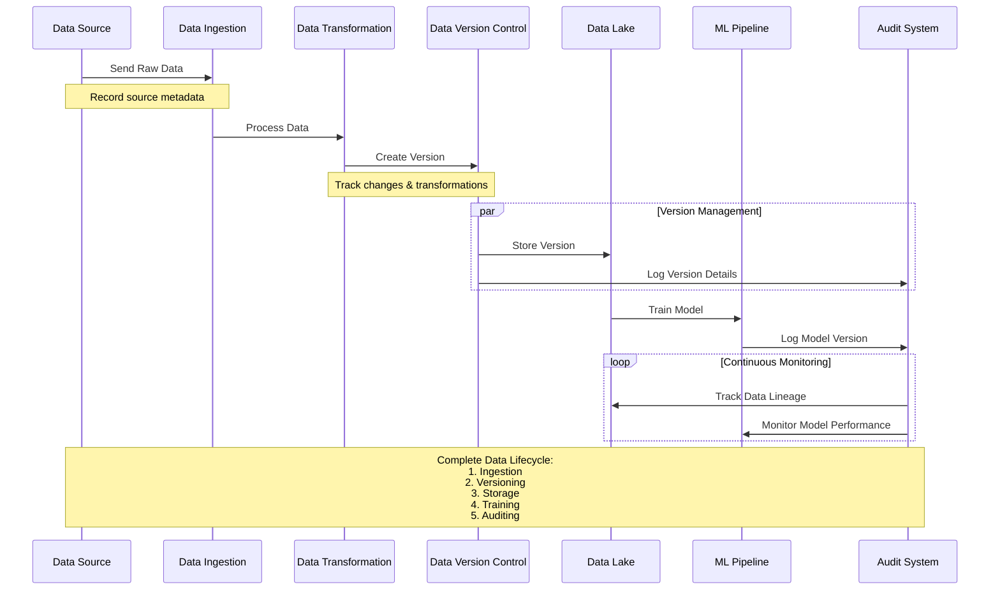
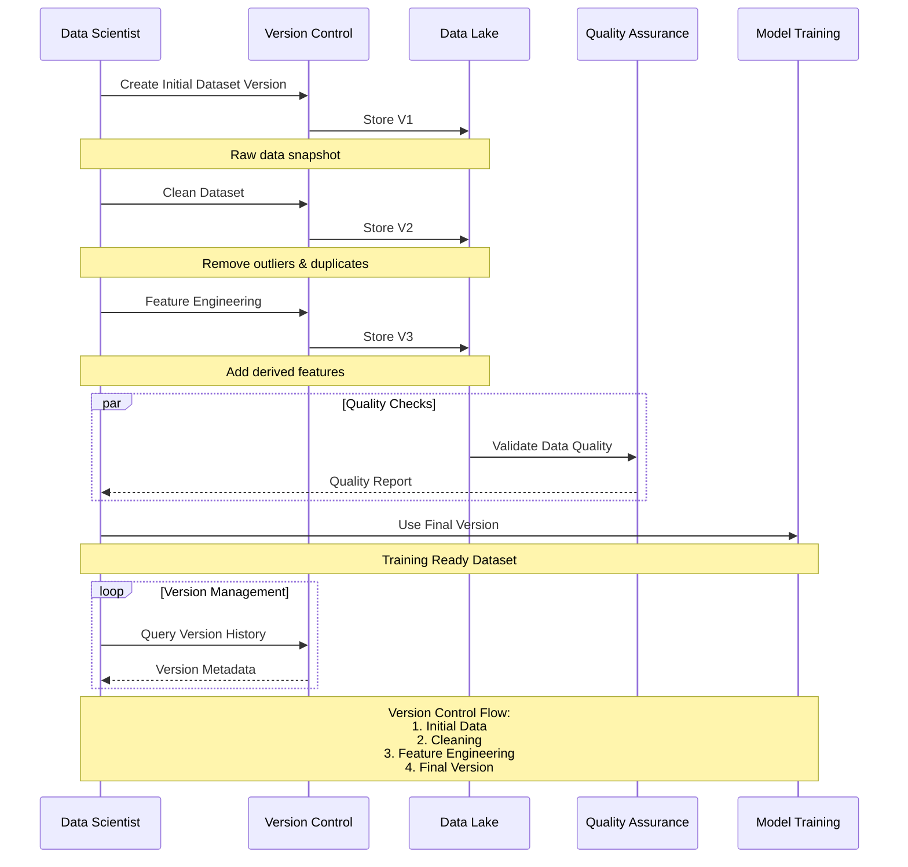
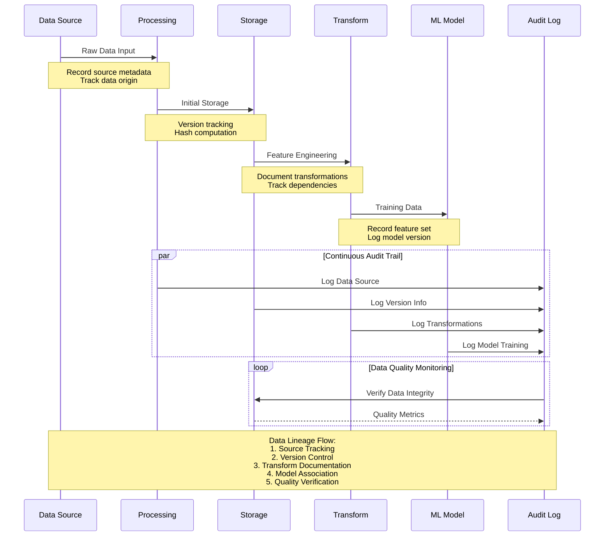
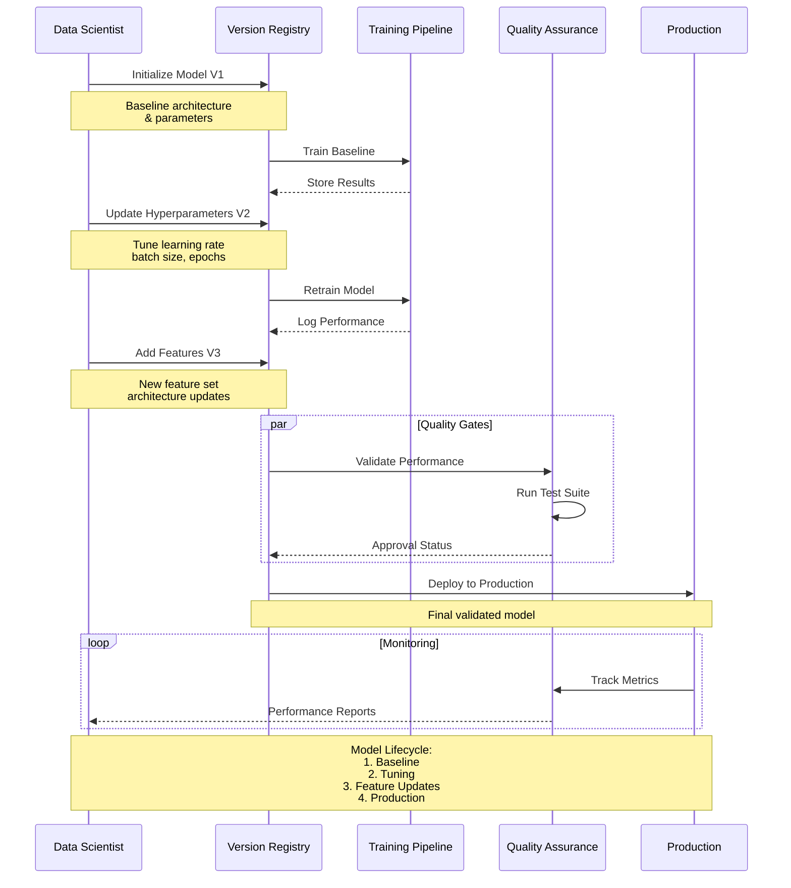
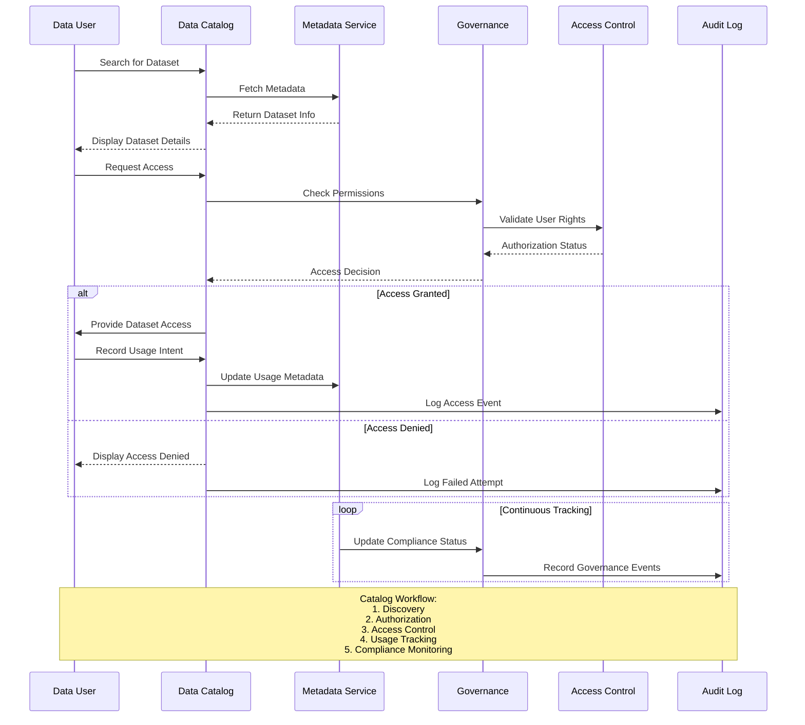

# Data Versioning and Lineage

Data versioning and lineage are critical components of a robust data architecture, especially for AI-driven systems. They help track how data evolves over time, document its journey through various stages of the data pipeline, and provide a transparent view of the entire data lifecycle. By implementing these practices, AI architects can ensure reproducibility, improve compliance, enhance collaboration, and streamline debugging efforts.

## Overview

Data versioning and lineage address key challenges in managing data complexity by:

- **Tracking Changes**: Monitoring how data is modified across different stages of the pipeline.
- **Maintaining History**: Keeping records of previous versions of data, allowing for reproducibility.
- **Documenting Flow**: Capturing the complete journey of data from its source to its final destination, including all transformations.
- **Enabling Compliance**: Providing an audit trail for regulatory and governance requirements.

## Key Objectives

- **Reproducibility**: Ensures that AI models and experiments can be recreated using historical data versions.
- **Auditability**: Provides a comprehensive record of data changes for compliance and regulatory needs.
- **Transparency**: Offers insights into data transformations and processes, aiding in debugging and root-cause analysis.
- **Collaboration**: Enables data teams to work with a shared understanding of data history and provenance.

## Data Versioning

Data versioning involves tracking different versions of datasets as they evolve over time. This practice is essential for maintaining consistency and reproducibility in AI projects, where changes in the dataset can significantly impact model performance.

### Techniques for Data Versioning

| Technique | Description | Best Use Case |
|-----------|-------------|---------------|
| **File-Based Versioning** | Tracks versions of data files using version control systems (e.g., Git, DVC). | Small to medium-sized datasets, exploratory projects. |
| **Database Versioning** | Uses database-specific tools or timestamp columns to manage data changes. | Structured data in relational databases. |
| **Data Lake Versioning** | Tracks data changes in data lakes using tools like Delta Lake, Apache Hudi, or Iceberg. | Large-scale datasets, cloud-native environments. |
| **Snapshotting** | Captures periodic snapshots of the entire dataset for historical reference. | Time-series data, compliance requirements. |

### Tools for Data Versioning

- **DVC (Data Version Control)**: An open-source tool that integrates with Git to manage data versions.
- **Delta Lake**: Provides ACID transactions and data versioning on top of data lakes.
- **LakeFS**: A version control system for data lakes, enabling Git-like operations on datasets.

**Example:** In a predictive maintenance project, historical sensor data is versioned using Delta Lake. This allows data scientists to roll back to previous versions if a model’s performance degrades after a data update.

## Data Lineage

Data lineage is the process of documenting the complete journey of data, from its origin to its final destination. It tracks every transformation, aggregation, and movement of data throughout the pipeline.

### Importance of Data Lineage

- **Debugging and Root-Cause Analysis**: Quickly trace the source of data issues or anomalies.
- **Compliance and Auditability**: Maintain a transparent record of data transformations for regulatory audits.
- **Impact Analysis**: Understand how changes to source data affect downstream systems and AI models.

### Tools for Data Lineage

- **Apache Atlas**: An open-source metadata management and data governance tool for tracking data lineage.
- **DataHub**: LinkedIn’s open-source metadata platform for capturing data lineage and maintaining a data catalog.
- **Microsoft Purview**: A unified data governance service that includes lineage tracking for Azure environments.

**Example:** A financial services firm uses Apache Atlas to track data lineage across its data pipeline, ensuring compliance with regulatory requirements like GDPR by providing an audit trail of data transformations.

## Data Auditing

Data auditing involves systematically reviewing data processes to ensure compliance with internal policies, regulatory requirements, and best practices. It helps detect anomalies, assess data quality, and maintain data integrity.

### Key Aspects of Data Auditing

- **Change Tracking**: Logs every change made to the data, including updates, deletions, and transformations.
- **Quality Checks**: Automated validation checks to ensure data integrity (e.g., completeness, accuracy).
- **Compliance Monitoring**: Ensures adherence to regulations such as GDPR, CCPA, and HIPAA.

**Example Use Case:** A healthcare organization audits its patient data pipelines to verify that data anonymization processes are correctly applied, maintaining patient privacy and compliance with HIPAA regulations.

## AI Model Versioning and Auditing

AI models, like data, need versioning and auditing to ensure reproducibility, maintain performance, and comply with regulatory standards. Model versioning tracks changes to the model architecture, hyperparameters, and input data, while model auditing involves a comprehensive review of the model’s development process and performance metrics.

### Best Practices for Model Versioning

- **Track Changes**: Maintain records of all changes to model code, hyperparameters, and training data.
- **Use a Model Registry**: Tools like **MLflow**, **Weights & Biases**, and **Kubeflow** provide model tracking, versioning, and metadata storage.
- **Monitor Performance**: Track key performance metrics across versions to detect model drift.

### Tools for Model Auditing

| Tool | Description | Features |
|------|-------------|----------|
| **MLflow** | Open-source platform for managing the ML lifecycle. | Experiment tracking, model registry, version control. |
| **Weights & Biases** | Machine learning experiment tracking tool. | Model versioning, performance monitoring, visualizations. |
| **ClearML** | End-to-end MLOps platform for model management. | Model auditing, version tracking, orchestration. |

**Example:** A bank uses MLflow to version and audit its credit risk models, tracking changes in input data, model architecture, and performance metrics for regulatory compliance.

## Data and AI Model Catalog

A data catalog is a comprehensive inventory of data assets, providing metadata, data lineage, and quality metrics. An AI model catalog complements this by documenting AI models, including their versions, performance metrics, and metadata.

### Benefits of Using Data and Model Catalogs

- **Improved Discovery**: Easily find and understand data assets and models.
- **Enhanced Collaboration**: Share insights and best practices across teams.
- **Better Governance**: Maintain oversight of data usage and model deployment.

### Tools for Data and Model Catalogs

- **Data Catalog Tools**: Apache Atlas, Alation, Google Data Catalog.
- **Model Catalog Tools**: MLflow, Sagemaker Model Registry, Tecton.

**Example Use Case:** An e-commerce company uses a data catalog to document all customer interaction data, while a model catalog tracks its recommendation models, enabling faster experimentation and improved traceability.

## Best Practices for Data Versioning and Lineage

1. **Automate Versioning**: Use tools and automation to ensure consistent version tracking.
2. **Maintain Clear Documentation**: Document every step in the data pipeline, including transformations and feature engineering.
3. **Implement Robust Monitoring**: Continuously monitor data and model versions for drift and anomalies.
4. **Integrate with Governance Policies**: Align versioning and lineage practices with organizational data governance frameworks.

## Real-World Example

A **global pharmaceutical company** uses a combination of data versioning, lineage, and cataloging to manage its clinical trial data. Delta Lake handles data versioning, Apache Atlas tracks lineage, and an internal data catalog provides metadata. This setup allows the company to meet stringent compliance requirements while enabling data scientists to reproduce experiments accurately.
