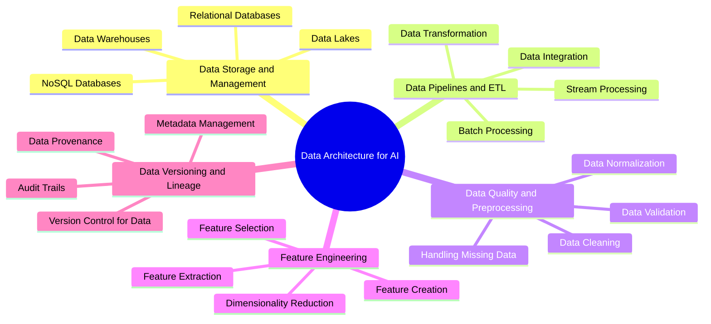

# Data Architecture for AI

Welcome to the Data Architecture for AI section of our AI Solution Architect handbook. This section focuses on the critical aspects of designing and implementing robust data architectures to support AI systems.

## Overview

Effective data architecture is the foundation of any successful AI solution. It encompasses how data is collected, stored, processed, and managed throughout its lifecycle. This section covers key components of data architecture specifically tailored for AI applications.

## Subsections

Explore each crucial aspect of Data Architecture for AI:

1. [Data Storage and Management Systems](01-Data-Storage-and-Management-Systems.md): Learn about various data storage solutions and how to choose the right one for your AI projects, including relational databases, NoSQL databases, data lakes, and data warehouses.

2. [Data Pipelines and ETL Processes](02-Data-Pipelines-and-ETL-Processes.md): Discover how to design and implement efficient data pipelines, and understand the Extract, Transform, Load (ETL) processes crucial for preparing data for AI applications.

3. [Data Quality and Preprocessing](03-Data-Quality-and-Preprocessing.md): Explore techniques for ensuring data quality, including data cleaning, validation, and normalization, as well as strategies for handling missing or inconsistent data.

4. [Feature Engineering](04-Feature-Engineering.md): Learn the art and science of creating, selecting, and transforming features to improve the performance of machine learning models.

5. [Data Versioning and Lineage](05-Data-Versioning-and-Lineage.md): Understand the importance of tracking data changes over time and maintaining clear lineage for reproducibility and compliance.

## How to Use This Section

Each subsection provides in-depth coverage of its respective topic, including:

- Key concepts and best practices
- Comparative analysis of different tools and technologies
- Real-world examples and case studies
- Practical tips for implementation

We recommend starting with Data Storage and Management Systems and progressing through the subsections in order. However, feel free to focus on specific topics based on your current project needs or areas of interest.

## Applying Your Knowledge

As you progress through this section, consider how each aspect of data architecture applies to your specific AI projects:

- Evaluate your current data storage solutions and consider if they're optimal for your AI workloads
- Design a data pipeline for a hypothetical (or real) AI project in your domain
- Develop a checklist for ensuring data quality in your AI initiatives
- Practice feature engineering on a dataset relevant to your work
- Implement a basic data versioning system for one of your projects

Remember, effective data architecture is crucial for the success of AI projects. It's worth investing time to get this foundation right.

## Stay Updated

The field of data architecture, especially as it relates to AI, is rapidly evolving. New tools, technologies, and best practices emerge regularly. We update this handbook frequently to reflect these changes. Be sure to check back often for the most up-to-date information.

May your data be clean, your features be predictive, and your AI models be powerful!
