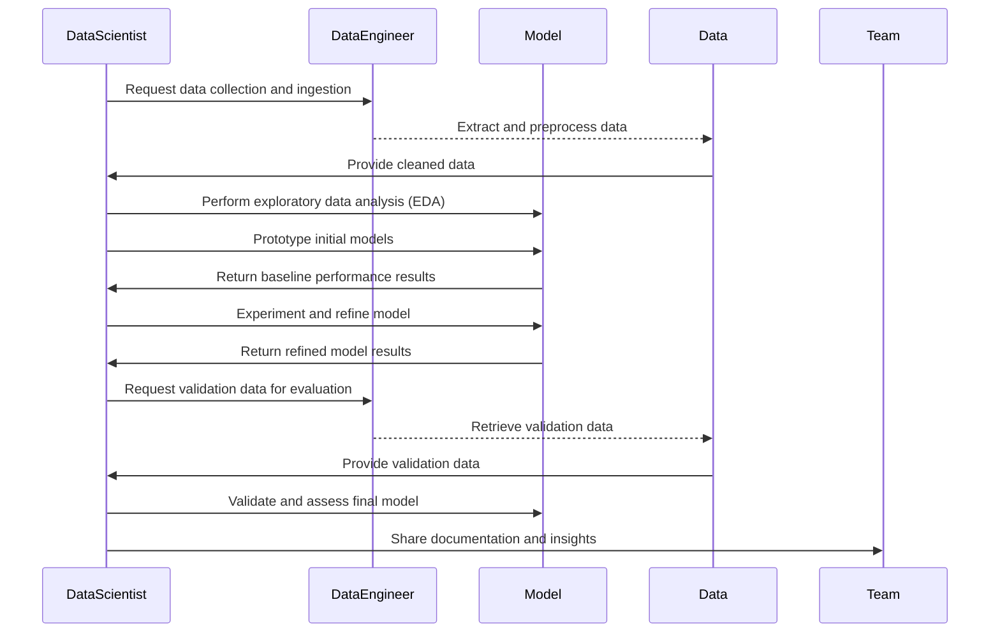
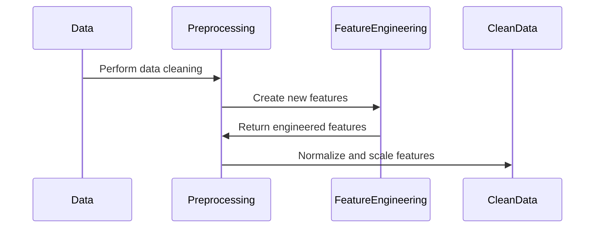
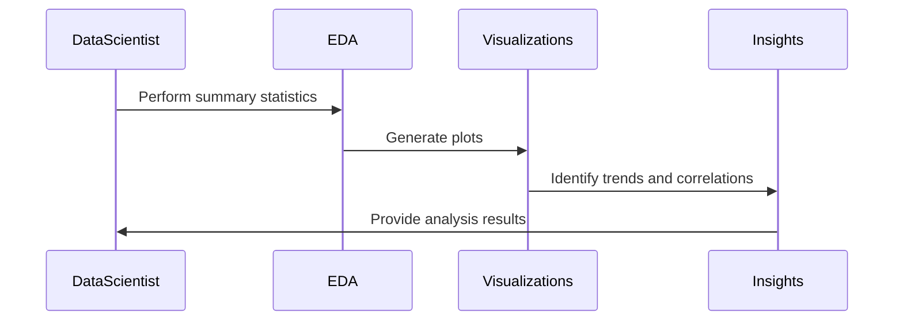
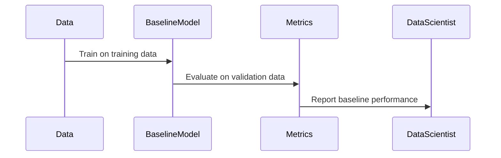
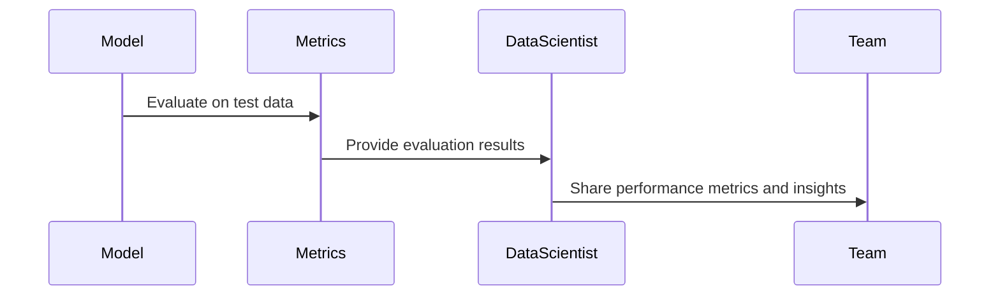

# Model Development Workflows

Effective model development workflows are crucial for building robust AI systems. A well-structured workflow ensures that data scientists and engineers can collaborate seamlessly, track progress, and iterate on models efficiently. This section covers best practices for establishing an AI model development workflow, including data preparation, exploratory data analysis (EDA), prototyping, and iterative experimentation.

## Overview

The model development workflow consists of several key stages, each with its own set of tasks and objectives. By following a standardized approach, teams can ensure:

- **Consistency**: Standardized workflows reduce variability and increase reproducibility.
- **Collaboration**: Clear workflows foster better communication and teamwork.
- **Efficiency**: Structured processes help streamline tasks and eliminate bottlenecks.
- **Scalability**: A scalable workflow allows for easy iteration and adaptation as project requirements evolve.

### Key Stages of the Model Development Workflow

1. **Data Collection and Ingestion**: Gathering relevant data from various sources.
2. **Data Preparation**: Cleaning and preprocessing data to ensure quality.
3. **Exploratory Data Analysis (EDA)**: Analyzing data distributions and identifying trends.
4. **Model Prototyping**: Building initial model versions for experimentation.
5. **Experimentation and Refinement**: Iterating on model versions based on performance.
6. **Evaluation and Validation**: Assessing model performance using appropriate metrics.
7. **Collaboration and Documentation**: Documenting findings and sharing insights with the team.

## Data Collection and Ingestion

The first step in the workflow is collecting relevant data from internal and external sources. This phase involves working closely with data engineers to identify the necessary datasets and define data ingestion processes.

### Best Practices

- **Define Data Requirements**: Clearly specify what data is needed based on the problem statement.
- **Automate Data Ingestion**: Use tools like Apache Nifi or Apache Airflow to automate data extraction and ingestion.
- **Maintain Data Quality**: Implement validation checks to ensure the integrity of the ingested data.

**Example Use Case:** A retail company gathers transaction data from its POS system and combines it with online sales data for customer behavior analysis.

## Data Preparation

Data preparation involves cleaning, transforming, and preprocessing the raw data. This step is critical for ensuring that the data is suitable for analysis and model training.

### Key Steps in Data Preparation

- **Data Cleaning**: Handle missing values, duplicates, and inconsistencies.
- **Feature Engineering**: Create new features based on domain knowledge.
- **Data Normalization and Scaling**: Standardize numerical features to improve model performance.

**Tools for Data Preparation:** Pandas, PySpark, and Dask are commonly used for scalable data processing.

## Exploratory Data Analysis (EDA)

EDA is a crucial step where data scientists explore the dataset to understand its structure, identify patterns, and detect anomalies. This phase involves generating descriptive statistics and visualizations to gain insights into the data.

### EDA Techniques

| Technique | Description | Best Use Case |
|-----------|-------------|---------------|
| **Summary Statistics** | Provides basic metrics (e.g., mean, median, variance). | Initial understanding of data distributions. |
| **Visualization** | Uses plots (e.g., histograms, scatter plots) to identify trends and correlations. | Detecting outliers and data relationships. |
| **Correlation Analysis** | Measures the relationship between variables using correlation coefficients. | Identifying multicollinearity in features. |

**Example:** In a credit scoring project, EDA might reveal that income and credit history are strong predictors of loan defaults.

## Model Prototyping

Model prototyping involves building initial versions of the model to test hypotheses and establish baseline performance. This phase is iterative and exploratory, allowing data scientists to try different algorithms and configurations.

### Steps for Model Prototyping

1. **Select Baseline Models**: Start with simple algorithms like linear regression or decision trees.
2. **Split Data**: Divide data into training, validation, and test sets.
3. **Train Baseline Models**: Fit models to the training data and evaluate using validation data.
4. **Establish Baseline Metrics**: Record performance metrics as a benchmark for further experimentation.

**Tools for Prototyping:** Scikit-learn, TensorFlow, and PyTorch are popular frameworks for building and testing models.

## Experimentation and Refinement

After establishing a baseline, the next phase is to iterate on the model through experimentation. This involves adjusting hyperparameters, testing new features, and experimenting with different model architectures.

### Tips for Effective Experimentation

- **Track Experiments**: Use tools like MLflow or Weights & Biases to log experiments and track performance.
- **Follow a Hypothesis-Driven Approach**: Make changes based on specific hypotheses rather than random adjustments.
- **Document Changes**: Record all modifications to the model, including feature changes and parameter tuning.

**Example Use Case:** A data scientist working on a fraud detection model might iterate by adding new features related to transaction frequency and testing different neural network architectures.

## Evaluation and Validation

Evaluation is the process of assessing the model’s performance using appropriate metrics. Validation helps ensure that the model generalizes well to unseen data.

### Common Evaluation Metrics

| Task Type | Metric | Description |
|-----------|--------|-------------|
| **Classification** | Accuracy, F1 Score, ROC-AUC | Measures the model’s ability to correctly classify instances. |
| **Regression** | MAE, MSE, R² Score | Quantifies the error in predictions for continuous variables. |
| **Clustering** | Silhouette Score, Davies-Bouldin Index | Assesses the quality of clustering results. |

## Collaboration and Documentation

Clear documentation and communication are essential for effective model development. Documenting the workflow, assumptions, and results helps facilitate collaboration and ensures that the project can be understood by other team members.

### Best Practices for Documentation

- **Use Notebooks for EDA**: Jupyter notebooks are great for sharing exploratory analysis and visualizations.
- **Maintain a Project Log**: Keep a detailed record of all model versions, experiments, and findings.
- **Share Findings Regularly**: Present updates and insights to stakeholders for feedback.

**Tools for Collaboration:** Confluence, Notion, and GitHub are commonly used for documentation and project management.

## Real-World Example

A **telecommunications company** follows a structured model development workflow for churn prediction:

1. **Data Collection**: Ingests customer usage data and CRM records.
2. **Data Preparation**: Cleans the data and engineers new features like "average call duration."
3. **EDA**: Identifies key predictors of churn using correlation analysis and visualizations.
4. **Prototyping**: Builds a baseline logistic regression model.
5. **Experimentation**: Tests additional features and tunes hyperparameters.
6. **Evaluation**: Validates the final model using ROC-AUC and precision-recall metrics.
7. **Collaboration**: Documents the entire process and shares results with the product team.

## Next Steps

With a solid understanding of model development workflows, you can now proceed to [Model Training and Validation](02-Model-Training-and-Validation.md), where we explore best practices for training models and assessing their performance effectively.