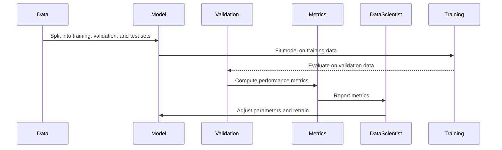
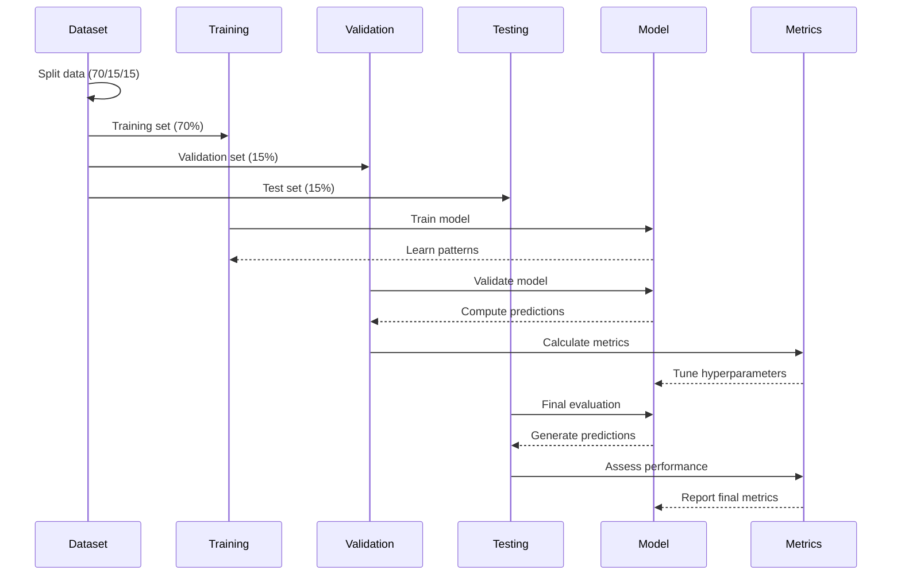
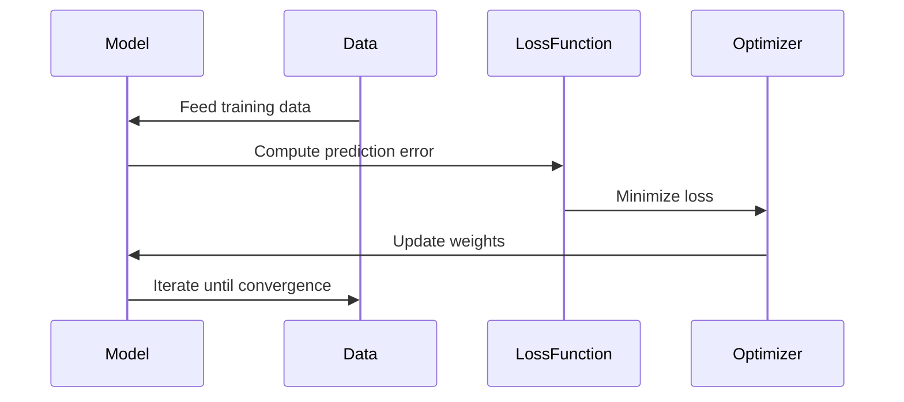
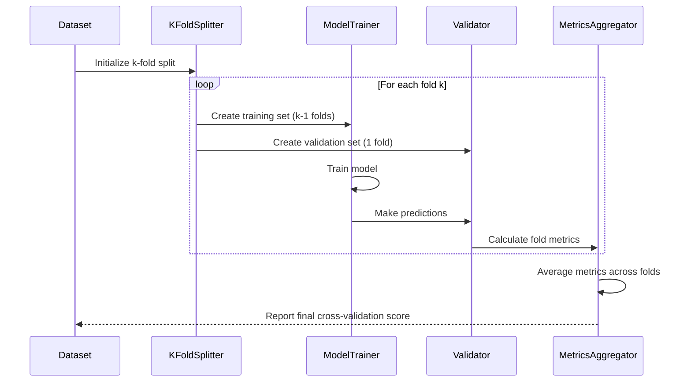
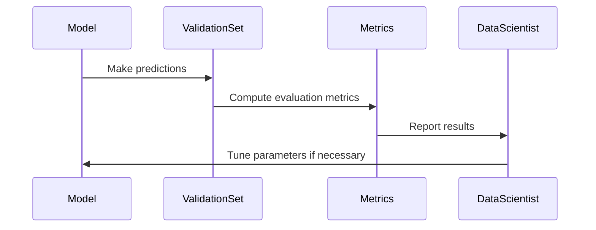

# Model Training and Validation

Model training and validation are core components of the AI model lifecycle. This stage is where the model learns patterns from the data, is evaluated for its predictive performance, and is iteratively refined based on the validation results. In this section, we will cover the end-to-end process of model training and validation, including best practices, techniques, and real-world examples.

## Overview

The goal of model training is to optimize a machine learning algorithm so that it can make accurate predictions on new, unseen data. Model validation, on the other hand, assesses the model’s generalization ability, ensuring it performs well not only on the training data but also on unseen data.

### Key Steps in Model Training and Validation

1. **Data Splitting**: Dividing the dataset into training, validation, and test sets.
2. **Model Training**: Fitting the model to the training data.
3. **Validation**: Evaluating model performance on the validation set to fine-tune hyperparameters.
4. **Testing**: Assessing the final model's performance on an independent test set.
5. **Model Evaluation**: Using metrics to quantify the model’s predictive power.
6. **Iterative Improvement**: Refining the model based on evaluation feedback.

## Data Splitting

Data splitting is a crucial first step in model training. It involves partitioning the dataset into distinct subsets to evaluate model performance effectively.

### Common Data Splitting Techniques

| Technique | Description | Best Use Case |
|-----------|-------------|---------------|
| **Train-Validation-Test Split** | Splits data into 70% training, 15% validation, and 15% test. | Standard practice for most machine learning tasks. |
| **Cross-Validation** | Splits data into k-folds and uses each fold as a validation set once. | Small datasets or when avoiding overfitting is critical. |
| **Time-Series Split** | Uses a rolling window approach, training on past data and testing on future data. | Time-series forecasting and temporal data. |

**Example Use Case:** In a customer churn prediction project, the dataset is split into training, validation, and test sets based on a 70-15-15 split. This approach ensures that the model is evaluated on unseen data, reducing the risk of overfitting.

## Model Training

Model training is the process where the algorithm learns patterns from the training data by optimizing a loss function. This phase involves selecting the right algorithm, setting initial hyperparameters, and fitting the model to the data.

### Algorithm Selection

Choosing the right algorithm depends on the type of problem (e.g., classification, regression), data characteristics, and desired model complexity. Common algorithms include:

- **Linear Models**: Simple and interpretable, but may not capture complex patterns.
- **Decision Trees and Ensembles**: Handle non-linear relationships well and are robust to outliers.
- **Neural Networks**: Suitable for complex tasks like image recognition and NLP but require large datasets.

**Example:** A financial services company selects a gradient boosting algorithm for predicting loan defaults, as it handles non-linear relationships effectively and provides feature importance insights.

### Loss Functions

The loss function measures the difference between the model’s predictions and the actual values. The choice of loss function depends on the problem type:

| Problem Type | Common Loss Functions | Description |
|--------------|-----------------------|-------------|
| **Regression** | Mean Squared Error (MSE), Mean Absolute Error (MAE) | Quantifies the error between predicted and actual values. |
| **Classification** | Cross-Entropy Loss, Hinge Loss | Measures the difference between predicted and true class probabilities. |
| **Clustering** | Sum of Squared Errors (SSE) | Evaluates the compactness of clusters. |

## Model Validation

Validation is the process of assessing the model’s performance on the validation set. It helps determine if the model is overfitting or underfitting and guides hyperparameter tuning.

### Common Validation Techniques

1. **Holdout Validation**: Evaluates the model on a separate validation set.
2. **K-Fold Cross-Validation**: Splits the data into k subsets and validates on each subset, averaging the results for a robust estimate.
3. **Stratified Cross-Validation**: Maintains the class distribution across folds, ideal for imbalanced datasets.

**Best Practice:** Use stratified k-fold cross-validation for imbalanced classification tasks (e.g., fraud detection) to maintain the ratio of positive to negative samples across folds.

## Model Evaluation

Evaluation involves calculating performance metrics that quantify the model's ability to make accurate predictions. The choice of metrics depends on the problem type.

### Key Evaluation Metrics

| Task Type | Metric | Description | When to Use |
|-----------|--------|-------------|-------------|
| **Classification** | Precision, Recall, F1 Score, ROC-AUC | Measures model performance for imbalanced classes. | Fraud detection, medical diagnosis. |
| **Regression** | R² Score, MAE, RMSE | Assesses prediction accuracy for continuous variables. | Price prediction, demand forecasting. |
| **Clustering** | Silhouette Score, Davies-Bouldin Index | Evaluates the quality of clustering. | Customer segmentation. |

**Example:** In a classification task for a healthcare company, the F1 Score is chosen as the primary metric to balance precision and recall, as false negatives (missed diagnoses) need to be minimized.

## Iterative Improvement

The training and validation process is often iterative. Based on the evaluation results, the model may need to be refined. This phase may involve:

- **Feature Engineering**: Adding or modifying features based on insights from validation.
- **Hyperparameter Tuning**: Adjusting parameters to improve model performance (explored further in the [Hyperparameter Tuning](03-Hyperparameter-Tuning.md) section).
- **Algorithm Change**: Switching to a different model type if the current one is not performing well.

**Example Use Case:** A data scientist notices that the model is overfitting (high training accuracy but low validation accuracy). They apply regularization techniques and experiment with simpler model architectures to reduce overfitting.

## Best Practices for Model Training and Validation

1. **Use Cross-Validation for Small Datasets**: It provides a more robust estimate of model performance.
2. **Monitor for Overfitting**: Regularly compare training and validation metrics to detect overfitting early.
3. **Automate Model Evaluation**: Use tools like Scikit-learn’s `GridSearchCV` or MLflow for automated validation and logging.
4. **Keep a Log of Experiments**: Document all changes and results to track model evolution and reproducibility.

## Real-World Example

A **logistics company** develops a predictive model for delivery time estimation:

1. **Data Splitting**: Uses a 70-15-15 split with a time-based holdout for validation.
2. **Model Training**: Trains a random forest model using historical shipment data.
3. **Validation**: Evaluates using k-fold cross-validation, measuring RMSE as the primary metric.
4. **Evaluation**: Compares the RMSE across folds and tunes hyperparameters using a random search.
5. **Iterative Improvement**: Adds features like traffic congestion and weather conditions to refine the model.

## Next Steps

With a strong understanding of model training and validation, continue to the next phase: [Hyperparameter Tuning](03-Hyperparameter-Tuning.md), where we explore techniques to optimize your model’s performance through systematic parameter adjustments.