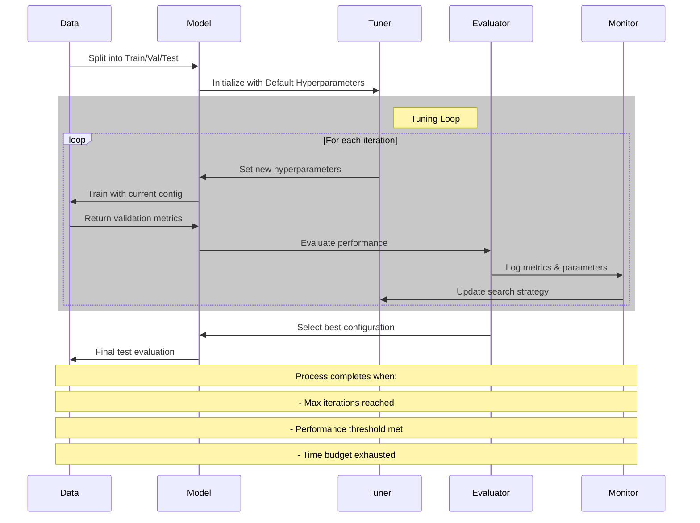
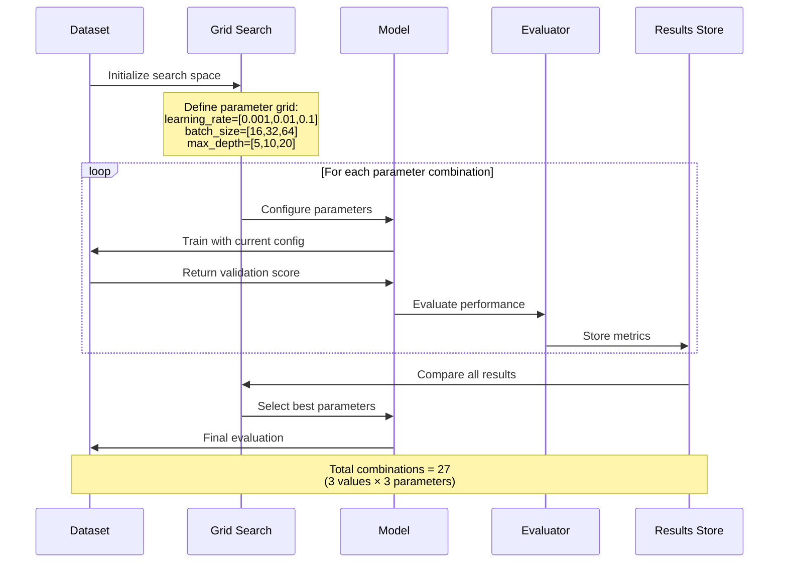
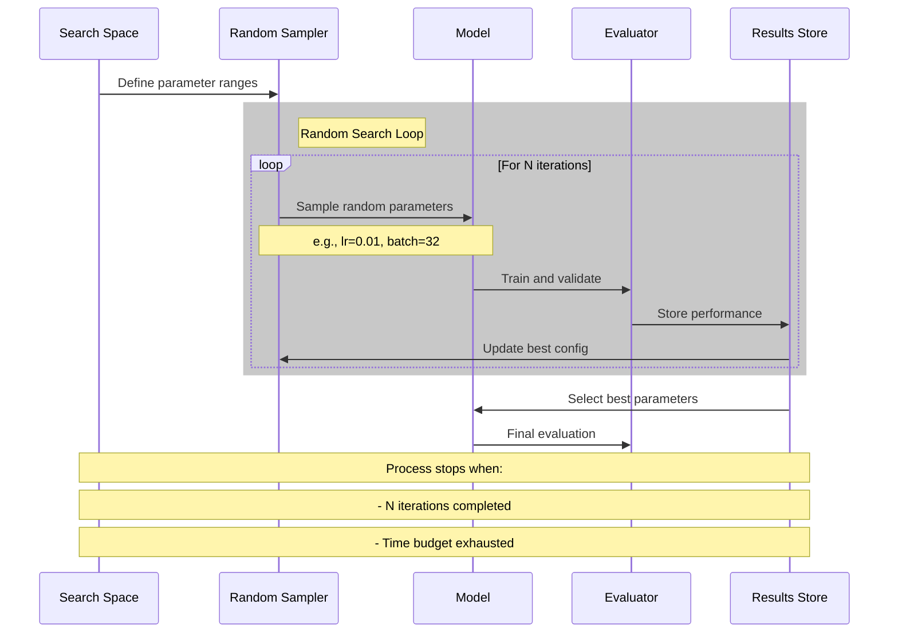
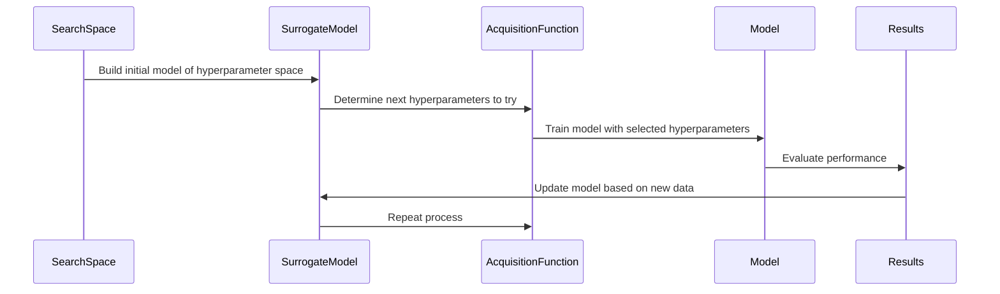
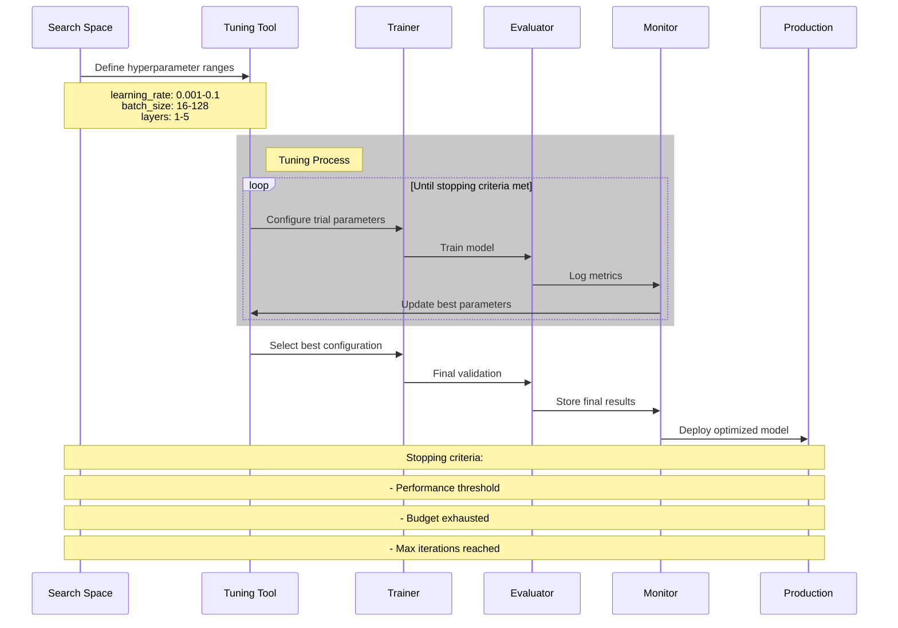

# Hyperparameter Tuning

Hyperparameter tuning is the process of systematically searching for the best hyperparameters for a machine learning model. Unlike model parameters (e.g., weights in a neural network), hyperparameters are set before training and govern the model’s overall behavior, such as learning rate, depth of decision trees, or regularization strength. Effective hyperparameter tuning can significantly enhance model performance, reduce overfitting, and improve generalization.

## Overview

Hyperparameters control the learning process and directly impact the model’s ability to learn from the data. The tuning process aims to find the optimal set of hyperparameters that maximize the model’s predictive power while minimizing errors. Given the vast search space of possible hyperparameter values, tuning is often computationally intensive, requiring a balance between exploration (trying new configurations) and exploitation (refining known good configurations).

### Key Objectives of Hyperparameter Tuning

1. **Performance Optimization**: Achieve the best possible predictive accuracy or minimize the loss function.
2. **Generalization Improvement**: Reduce overfitting by finding the right balance between model complexity and regularization.
3. **Resource Efficiency**: Optimize the search process to minimize computational costs.
4. **Reproducibility**: Ensure that the tuning process can be replicated with consistent results.

## Hyperparameter Categories

Hyperparameters can be broadly categorized based on their function:

| Category | Hyperparameters | Example Models |
|----------|-----------------|----------------|
| **Model Complexity** | Tree depth, number of layers, number of neurons | Decision Trees, Neural Networks |
| **Optimization** | Learning rate, batch size, momentum | Neural Networks, Gradient Boosting |
| **Regularization** | L1/L2 penalties, dropout rate | Logistic Regression, Neural Networks |
| **Feature-Related** | Number of features, polynomial degree | Polynomial Regression, SVM |

### Examples of Hyperparameters

| Model Type | Common Hyperparameters | Description |
|------------|------------------------|-------------|
| **Linear Models** | Regularization strength (alpha), solver type | Controls the complexity and convergence method. |
| **Decision Trees** | Max depth, min samples split, criterion | Governs tree growth and splitting criteria. |
| **Neural Networks** | Learning rate, batch size, epochs, activation function | Defines the optimization process and architecture. |
| **Ensemble Models** | Number of estimators, max features, learning rate | Influences the number of base learners and their individual complexity. |

## Hyperparameter Tuning Strategies

There are several approaches to hyperparameter tuning, ranging from simple methods like grid search to more sophisticated techniques like Bayesian optimization.

### Grid Search

Grid search is an exhaustive search method that tries every combination of hyperparameter values from a predefined set. It’s easy to implement but can be computationally expensive, especially with large datasets and multiple hyperparameters.

**Advantages:**

- Simple and straightforward to implement.
- Guarantees that the optimal configuration will be found within the search space.

**Limitations:**

- Inefficient for large search spaces.
- May not find the true optimal if the search space is poorly defined.

### Random Search

Random search selects random combinations of hyperparameters from the search space, making it more efficient than grid search, especially when only a few hyperparameters have a significant impact on performance.

**Advantages:**

- More efficient than grid search in high-dimensional spaces.
- Better exploration of the search space when the impact of hyperparameters is unknown.

**Limitations:**

- May require many trials to find the optimal configuration.
- No guarantee of finding the best combination within a limited number of trials.

### Bayesian Optimization

Bayesian optimization uses probabilistic models (e.g., Gaussian Processes) to predict the performance of hyperparameters based on past results. It balances exploration and exploitation, making it an efficient choice for expensive tuning tasks.

**Advantages:**

- Efficient and suitable for complex models with expensive evaluations.
- Balances exploration of new hyperparameters and refinement of promising ones.

**Limitations:**

- More complex to implement.
- Requires an accurate surrogate model, which can be challenging for noisy data.

### Advanced Techniques: Hyperband and BOHB

- **Hyperband**: A resource-efficient tuning method that uses early stopping to discard poorly performing configurations quickly.
- **BOHB (Bayesian Optimization with Hyperband)**: Combines Bayesian optimization with Hyperband, offering a scalable and efficient approach for hyperparameter tuning.

| Technique | Description | Best Use Case |
|-----------|-------------|---------------|
| **Hyperband** | Uses a bandit-based approach to allocate resources efficiently. | Scalable hyperparameter tuning with early stopping. |
| **BOHB** | Combines Hyperband with Bayesian optimization for balanced exploration and exploitation. | Large search spaces with expensive evaluations. |

## Tools for Hyperparameter Tuning

There are several tools available that simplify the process of hyperparameter tuning:

| Tool | Description | Key Features |
|------|-------------|--------------|
| **Scikit-learn GridSearchCV** | Built-in function for grid and random search. | Easy integration with Scikit-learn models. |
| **Optuna** | Framework for efficient hyperparameter optimization using advanced techniques. | Supports Bayesian optimization and Hyperband. |
| **Ray Tune** | Scalable hyperparameter tuning library. | Distributed tuning, supports advanced algorithms like BOHB. |
| **Hyperopt** | Python library for distributed hyperparameter optimization. | Uses Tree-structured Parzen Estimator (TPE) for efficient search. |

## Best Practices for Hyperparameter Tuning

1. **Start Simple**: Begin with basic tuning methods (e.g., random search) before moving to complex techniques.
2. **Use Early Stopping**: Implement early stopping to save computational resources when a configuration shows poor performance early.
3. **Parallelize Tuning**: Utilize distributed frameworks (e.g., Ray Tune) to run multiple experiments in parallel.
4. **Monitor and Log Results**: Use tools like MLflow or Weights & Biases for logging and tracking hyperparameter experiments.
5. **Leverage Domain Knowledge**: Narrow down the search space using insights from previous projects or domain expertise.

## Real-World Example

A **telecommunications company** optimizes its customer churn model using the following strategy:

1. **Grid Search**: Starts with grid search for initial exploration of key hyperparameters.
2. **Random Search**: Refines the search space with random sampling to cover a broader range of configurations.
3. **Bayesian Optimization**: Uses Optuna for a targeted search, focusing on the most promising configurations.
4. **Evaluation and Deployment**: Evaluates the final model using cross-validation and deploys the optimized model in production.

## Next Steps

With a comprehensive understanding of hyperparameter tuning, you are now ready to proceed to [Model Versioning and Experiment Tracking](04-Model-Versioning-and-Experiment-Tracking.md), where we discuss how to track experiments and maintain a clear lineage of model versions for reproducibility and better management.