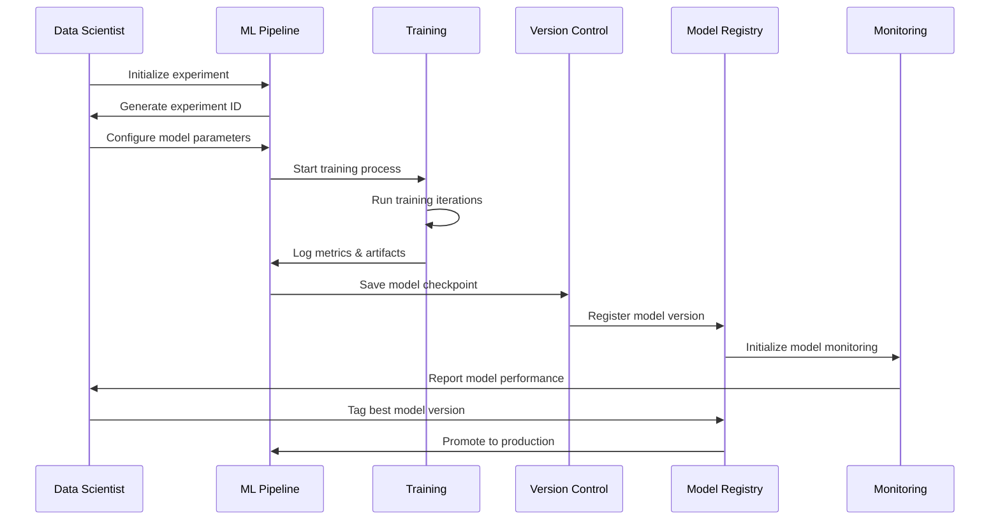
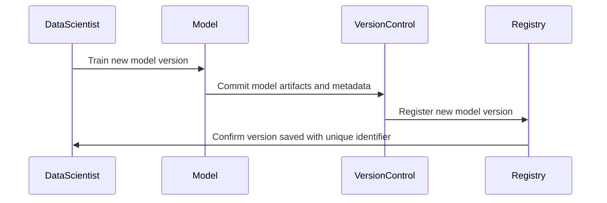
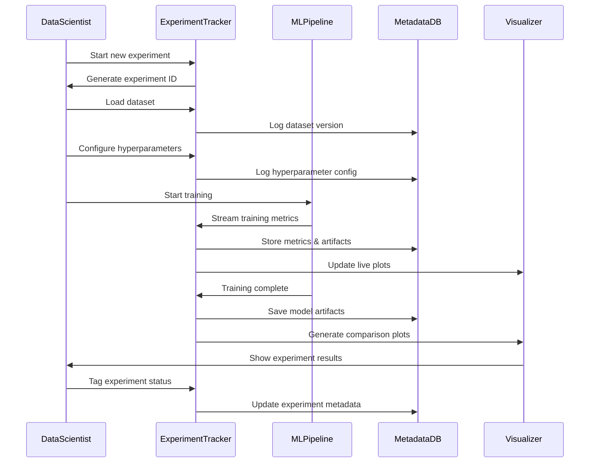
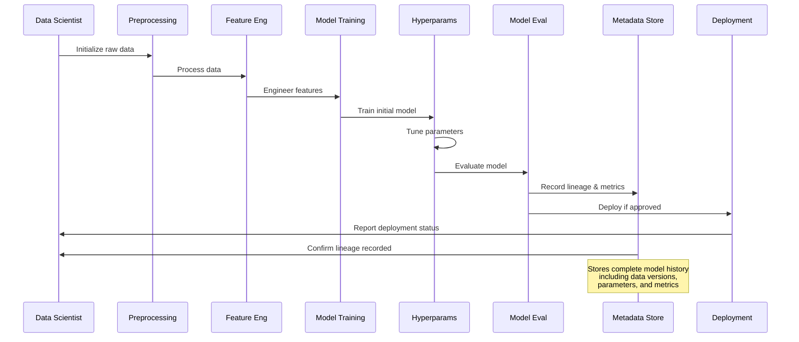

# Model Versioning and Experiment Tracking

Model versioning and experiment tracking are essential practices in the AI model lifecycle that ensure reproducibility, improve collaboration, and maintain a clear record of model evolution. In complex AI projects, multiple versions of models are developed and tested, making it critical to track changes systematically. This section covers best practices, tools, and strategies for implementing effective model versioning and experiment tracking.

## Overview

The development of machine learning models often involves numerous iterations, each with different datasets, hyperparameters, algorithms, and feature sets. Without proper tracking, it can become difficult to reproduce results, debug issues, or compare different experiments. Model versioning and experiment tracking address these challenges by:

- **Recording Experiment Details**: Capturing metadata such as hyperparameters, datasets, evaluation metrics, and model configurations.
- **Maintaining a Version History**: Keeping a clear lineage of all model versions to track improvements over time.
- **Enabling Reproducibility**: Ensuring that results can be consistently reproduced across environments and time.
- **Facilitating Collaboration**: Allowing multiple team members to contribute to and review the experiment history.

## Key Concepts

1. **Model Versioning**: Tracking and managing different versions of a machine learning model as it evolves.
2. **Experiment Tracking**: Logging all aspects of an experiment, including data, hyperparameters, model configurations, and results.
3. **Model Lineage**: Documenting the history and provenance of a model, from raw data through to deployment.
4. **Metadata Management**: Storing detailed metadata about each experiment and model version, aiding in reproducibility and debugging.

## Model Versioning

Model versioning is the practice of systematically saving and managing different versions of a model throughout its lifecycle. It involves assigning unique identifiers to each version, capturing relevant metadata, and storing the models in a central repository.

### Best Practices for Model Versioning

- **Use Semantic Versioning**: Follow a versioning scheme like `major.minor.patch` (e.g., `v1.0.0`), where changes are categorized based on their impact.
- **Store Model Artifacts**: Save model files (e.g., `.h5`, `.pkl`, `.onnx`), configuration files, and metadata.
- **Maintain a Model Registry**: Use a centralized registry (e.g., MLflow Model Registry, Sagemaker Model Registry) to track and manage model versions.
- **Tag and Annotate Models**: Add tags and annotations to models to indicate their purpose (e.g., "baseline", "production", "experiment-123").

### Example Tools for Model Versioning

| Tool | Description | Key Features |
|------|-------------|--------------|
| **MLflow Model Registry** | Centralized model management with versioning. | Model lifecycle tracking, annotations, and tags. |
| **DVC (Data Version Control)** | Version control for data and models, integrated with Git. | Handles large files, tracks model files and metadata. |
| **Sagemaker Model Registry** | AWS service for model versioning and deployment. | Model approval workflows, version history, integration with AWS services. |

**Example Use Case:** A financial services firm uses MLflow Model Registry to track multiple versions of its credit risk model. Each version is tagged based on its intended use ("production", "testing"), and metadata includes details like dataset version, algorithm, and hyperparameters.

## Experiment Tracking

Experiment tracking involves logging all aspects of an experiment, including data used, hyperparameters, model configurations, evaluation metrics, and results. This process allows data scientists to compare experiments, reproduce results, and gain insights from historical data.

### What to Track in an Experiment

| Aspect | Details |
|--------|---------|
| **Data Version** | Record the specific version of the dataset used. |
| **Hyperparameters** | Log all hyperparameters (e.g., learning rate, batch size, number of layers). |
| **Algorithm Details** | Capture the model type, architecture, and configurations. |
| **Evaluation Metrics** | Record key metrics (e.g., accuracy, F1 Score, RMSE). |
| **Training Environment** | Log the hardware and software environment (e.g., Python version, GPU type). |

### Tools for Experiment Tracking

| Tool | Description | Features |
|------|-------------|----------|
| **MLflow** | Open-source platform for managing the ML lifecycle. | Experiment tracking, model registry, and deployment. |
| **Weights & Biases** | Experiment tracking tool with real-time logging. | Hyperparameter sweeps, collaborative reporting, visualizations. |
| **ClearML** | End-to-end MLOps platform for tracking experiments. | Automated logging, metadata management, and pipeline orchestration. |
| **Neptune.ai** | Tool for experiment management and model tracking. | Customizable dashboards, integration with popular ML frameworks. |

**Example Use Case:** A data scientist uses Weights & Biases to track hyperparameter sweeps for a deep learning model. The tool logs all experiments, including learning rate, batch size, and model architecture, providing visual comparisons of performance metrics across runs.

## Model Lineage

Model lineage refers to the documentation of the entire history of a model, from data collection and preprocessing to training, evaluation, and deployment. Maintaining clear lineage helps with debugging, compliance, and reproducibility.

### Benefits of Model Lineage

- **Transparency**: Provides a clear view of the entire model development process.
- **Debugging**: Helps trace the source of issues by following the lineage of a model’s creation.
- **Compliance**: Essential for meeting regulatory requirements in industries like healthcare and finance.

**Example Use Case:** A pharmaceutical company uses lineage tracking to document the development of an AI model used for drug discovery. The lineage includes details about the dataset (e.g., clinical trial data), preprocessing steps, feature selection, model architecture, and evaluation results, ensuring compliance with FDA regulations.

## Best Practices for Versioning and Experiment Tracking

1. **Automate Tracking**: Use tools that automatically log experiments and model versions to reduce manual errors.
2. **Integrate with CI/CD**: Incorporate model versioning and experiment tracking into continuous integration/continuous deployment (CI/CD) pipelines for seamless updates.
3. **Use a Centralized Registry**: Maintain a centralized model registry to track all versions and metadata.
4. **Tag and Annotate Experiments**: Use descriptive tags and annotations to provide context for each experiment and model version.
5. **Monitor Drift and Retrain**: Regularly check for data and model drift, and update the versioned models as necessary.

## Real-World Example

A **logistics company** uses a combination of DVC and MLflow for model versioning and experiment tracking:

1. **Data Versioning**: Uses DVC to version control the dataset, ensuring consistency across experiments.
2. **Experiment Tracking**: Logs all hyperparameters, metrics, and configurations using MLflow.
3. **Model Registry**: Registers each model version in MLflow’s Model Registry, tagging the best-performing model as "production".
4. **Deployment and Monitoring**: Deploys the model through a CI/CD pipeline and monitors its performance for drift.

## Next Steps

With a comprehensive understanding of model versioning and experiment tracking, proceed to the next stage: [Model Deployment and Serving](05-Model-Deployment-and-Serving.md), where we explore best practices for deploying your AI models in production environments and ensuring their scalability and reliability.