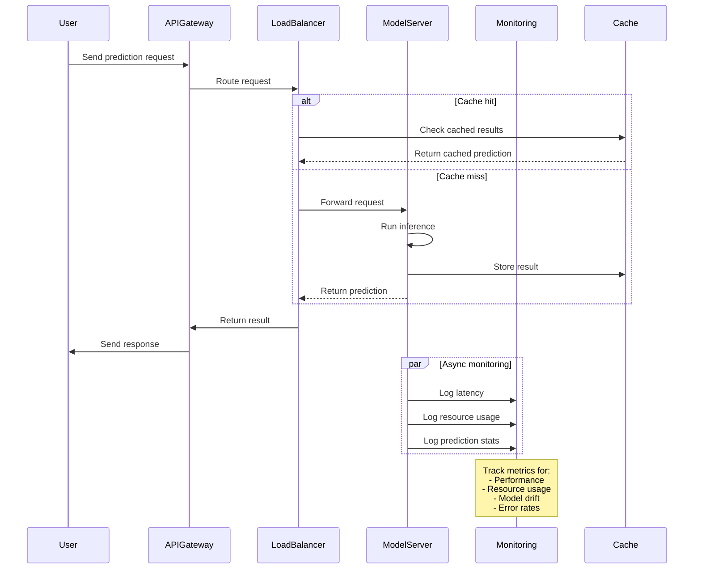
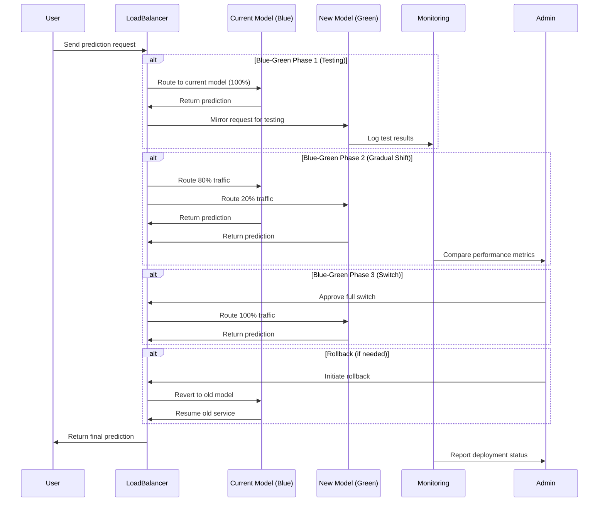
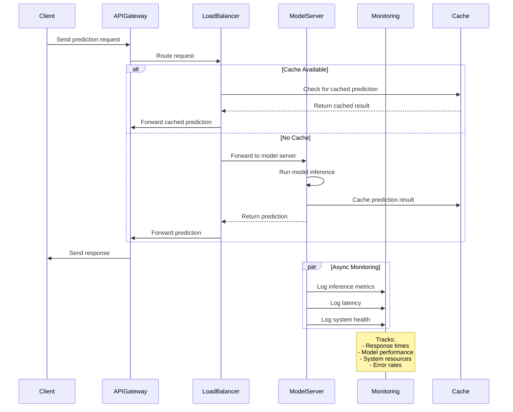
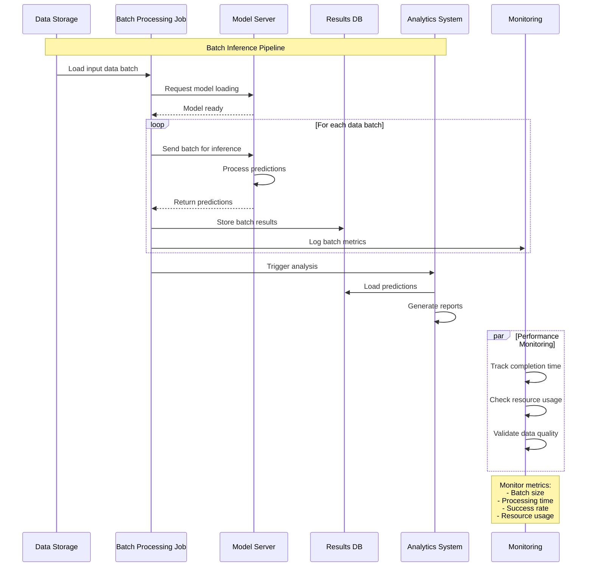
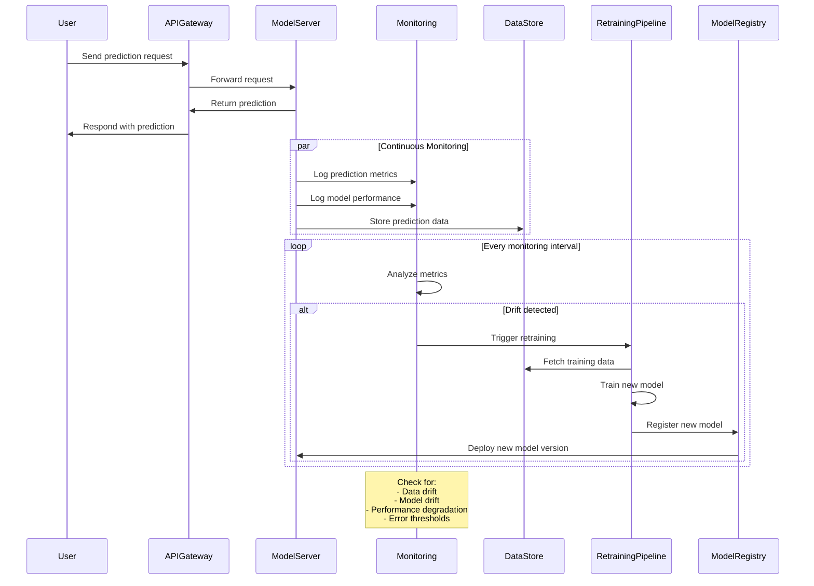

# Model Deployment and Serving

Model deployment and serving are crucial steps in the AI model lifecycle. Once a model has been trained, validated, and optimized, it needs to be deployed into a production environment where it can serve real-time predictions or batch inference requests. This section focuses on best practices for model deployment and serving, including strategies, architectures, and tools to ensure scalability, low latency, and robust monitoring.

## Overview

The goal of model deployment is to integrate the trained model into a production environment and make it accessible to users or other systems. The serving phase involves hosting the model and handling inference requests, providing predictions based on new input data. Effective deployment requires careful consideration of scalability, latency, security, and maintainability.

### Key Objectives

1. **Scalability**: Handle increasing workloads and user demand.
2. **Low Latency**: Provide quick responses, particularly for real-time applications.
3. **Reliability**: Ensure high availability and fault tolerance.
4. **Monitoring**: Track model performance, detect drift, and maintain model health.

## Model Deployment Strategies

There are several strategies for deploying machine learning models, each suited to different use cases and infrastructure requirements.

| Strategy | Description | Best Use Case |
|----------|-------------|---------------|
| **Batch Inference** | Processes a large set of data at once and stores the results. | Offline analytics, periodic reporting. |
| **Real-Time Inference** | Provides predictions in response to individual requests as they arrive. | Customer-facing applications, fraud detection. |
| **Shadow Deployment** | Runs a new model alongside the production model to test performance without affecting end users. | A/B testing, risk mitigation. |
| **Blue-Green Deployment** | Deploys a new model version while keeping the old version live, allowing for a quick rollback if issues arise. | Safe model updates, zero-downtime deployment. |

## Real-Time Model Serving

Real-time serving is crucial for applications that require immediate responses, such as chatbots, recommendation systems, or fraud detection models. This approach involves deploying the model as an API service that can handle incoming requests, process them, and return predictions quickly.

### Architecture for Real-Time Model Serving

A common architecture for real-time model serving includes:

1. **API Gateway**: Manages incoming requests and routes them to the model server.
2. **Model Server**: Hosts the model and handles inference requests (e.g., TensorFlow Serving, TorchServe).
3. **Load Balancer**: Distributes requests across multiple instances of the model server for scalability.
4. **Monitoring System**: Tracks performance metrics and logs inference requests for analysis.

**Best Practices for Real-Time Serving:**

- **Optimize Model Size**: Reduce the model size using techniques like pruning and quantization to improve latency.
- **Use Caching**: Cache frequent predictions to reduce computation time.
- **Leverage GPUs**: Use GPU instances for models that require high computational power (e.g., deep learning models).

## Batch Inference

Batch inference is used when predictions do not need to be made in real-time. Instead, the model processes large batches of input data periodically and stores the results for later use.

### Use Cases for Batch Inference

- **Offline Recommendation Systems**: Generating product recommendations for users based on historical data.
- **Risk Assessment**: Scoring loan applications overnight for financial institutions.
- **Data Processing Pipelines**: Performing image classification or object detection on a large dataset of images.

**Best Practices for Batch Inference:**

- **Parallelize Processing**: Use distributed computing frameworks (e.g., Apache Spark, Dask) for scalable batch inference.
- **Schedule Jobs Efficiently**: Use orchestration tools like Apache Airflow or Kubernetes CronJobs to automate batch inference jobs.
- **Monitor Performance**: Track job completion time and resource usage to optimize processing.

## Deployment Options

There are multiple deployment options depending on your infrastructure and requirements:

| Option | Description | Advantages | Disadvantages |
|--------|-------------|------------|---------------|
| **On-Premises** | Deploying models on local servers. | Full control, data privacy. | High maintenance, limited scalability. |
| **Cloud Services** | Using cloud platforms (e.g., AWS, Azure, GCP). | Scalability, flexibility, managed services. | Potential data transfer costs, vendor lock-in. |
| **Edge Deployment** | Deploying models on edge devices (e.g., mobile phones, IoT devices). | Low latency, offline capabilities. | Limited computational resources. |
| **Hybrid Deployment** | Combining on-premises and cloud deployment. | Flexibility, optimized cost. | Increased complexity. |

### Example Cloud Services for Model Deployment

| Platform | Service | Features |
|----------|---------|----------|
| **AWS** | Sagemaker Endpoint | Managed deployment, autoscaling, monitoring. |
| **Azure** | Azure Machine Learning Inference | Real-time and batch inference, model versioning. |
| **GCP** | Vertex AI Prediction | Auto-scaling, integrated monitoring, A/B testing. |
| **IBM Cloud** | Watson Machine Learning | Multi-cloud deployment, model management. |

## Monitoring and Maintenance

Monitoring and maintenance are critical aspects of model deployment, as model performance can degrade over time due to data drift or changes in the underlying data distribution.

### Key Monitoring Metrics

| Metric | Description | Use Case |
|--------|-------------|----------|
| **Latency** | Time taken to process a single prediction request. | Real-time applications (e.g., chatbots, fraud detection). |
| **Throughput** | Number of requests processed per second. | High-traffic applications (e.g., recommendation systems). |
| **Error Rate** | Percentage of failed or erroneous predictions. | Debugging model issues, maintaining reliability. |
| **Model Drift** | Changes in model performance due to shifts in data distribution. | Continuous monitoring for model retraining triggers. |

**Best Practices for Monitoring:**

- **Set Alerts**: Configure alerts for key metrics (e.g., latency spikes, high error rates).
- **Use APM Tools**: Application performance monitoring tools like Prometheus, Grafana, or New Relic help track model health.
- **Automate Retraining**: Set up a pipeline for automated model retraining if drift or performance degradation is detected.

## Real-World Example

A **global e-commerce platform** deploys its recommendation engine as follows:

1. **Batch Inference**: Runs nightly batch jobs using Apache Spark to update product recommendations for all users.
2. **Real-Time Inference**: Serves real-time recommendations via a REST API using TensorFlow Serving.
3. **Monitoring and Alerts**: Uses Prometheus and Grafana to monitor latency, error rates, and throughput.
4. **Automated Retraining**: Integrates with an automated retraining pipeline triggered by data drift detection.

## Next Steps

Now that you have a comprehensive understanding of model deployment and serving, proceed to the next section: [AI Integration and Deployment](../5.-AI-Integration-and-Deployment/index.md), where we dive deeper into integrating AI models into production environments with APIs, microservices, containerization, and CI/CD strategies.