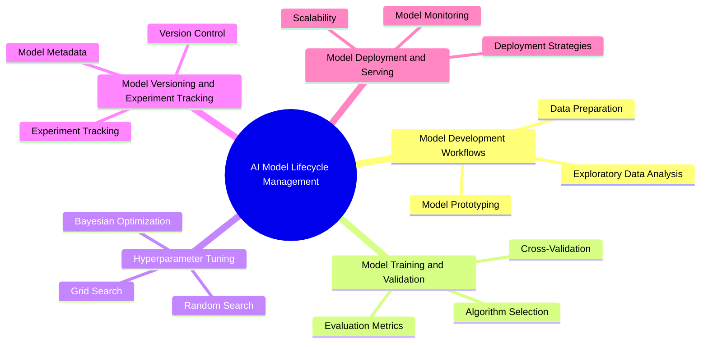

# AI Model Lifecycle Management

Welcome to the **AI Model Lifecycle Management** section of the AI Architect Handbook. This section provides a comprehensive overview of the end-to-end lifecycle of AI models, from development and training to deployment and maintenance. Managing the lifecycle of AI models is a critical aspect of building robust, scalable, and reliable AI solutions. By following best practices in lifecycle management, organizations can streamline the development process, ensure model reproducibility, and maintain consistent model performance in production environments.

## Overview

AI Model Lifecycle Management encompasses the entire journey of an AI model, starting from the initial development phase and extending through training, hyperparameter tuning, versioning, deployment, monitoring, and maintenance. Each phase of this lifecycle has distinct challenges and requirements, and a systematic approach is essential for building effective AI solutions.

### Key Stages of the AI Model Lifecycle

1. **Model Development Workflows**: Defining a systematic approach for developing and iterating on AI models, including data preparation, exploratory data analysis, and initial model prototyping.
2. **Model Training and Validation**: Implementing training processes, selecting appropriate algorithms, and validating model performance using relevant evaluation metrics.
3. **Hyperparameter Tuning**: Optimizing model hyperparameters to enhance predictive performance and generalization.
4. **Model Versioning and Experiment Tracking**: Keeping track of different model versions and experiments to ensure reproducibility and traceability.
5. **Model Deployment and Serving**: Deploying models in production environments, ensuring scalability, low latency, and robust monitoring.

## Subsections

Explore each critical phase of the AI Model Lifecycle:

1. [Model Development Workflows](01-Model-Development-Workflows.md): Learn how to establish robust workflows for model development, including best practices for data preparation, exploratory analysis, and prototyping.
2. [Model Training and Validation](02-Model-Training-and-Validation.md): Understand how to train AI models effectively, choose the right algorithms, and validate their performance using relevant metrics.
3. [Hyperparameter Tuning](03-Hyperparameter-Tuning.md): Discover techniques for optimizing model hyperparameters, including grid search, random search, and advanced methods like Bayesian optimization.
4. [Model Versioning and Experiment Tracking](04-Model-Versioning-and-Experiment-Tracking.md): Learn the importance of versioning models and tracking experiments for reproducibility and better model management.
5. [Model Deployment and Serving](05-Model-Deployment-and-Serving.md): Explore strategies for deploying AI models in production environments, including monitoring, scalability, and low-latency serving.

## How to Use This Section

This section of the handbook provides an in-depth guide to each phase of the AI model lifecycle. By following the best practices and methodologies outlined here, you can:

- **Streamline Model Development**: Adopt standardized workflows that enhance collaboration and efficiency across data science teams.
- **Ensure Reproducibility**: Implement robust versioning and experiment tracking to recreate model results consistently.
- **Optimize Model Performance**: Use hyperparameter tuning and validation techniques to achieve the best possible model accuracy and generalization.
- **Facilitate Scalable Deployment**: Design deployment strategies that accommodate large-scale applications with minimal latency.
- **Maintain Continuous Monitoring**: Establish a monitoring framework to track model performance, detect drift, and trigger retraining when necessary.

## Applying Your Knowledge

As you progress through this section, apply the concepts and best practices to your AI projects:

- **Establish a Development Workflow**: Create a repeatable model development workflow tailored to your team's needs.
- **Track Experiments and Versions**: Set up tools for experiment tracking and model versioning to maintain reproducibility.
- **Optimize Hyperparameters**: Use systematic tuning methods to find the best model configuration.
- **Deploy and Monitor Models**: Design a deployment strategy that balances performance, scalability, and reliability.

## Stay Updated

The field of AI Model Lifecycle Management is rapidly evolving, with new tools, techniques, and best practices emerging frequently. This handbook is regularly updated to reflect the latest trends and advancements in the industry. Make sure to revisit this section often to stay informed about the most current methodologies.

May your models be accurate, your deployments seamless, and your predictions insightful!

