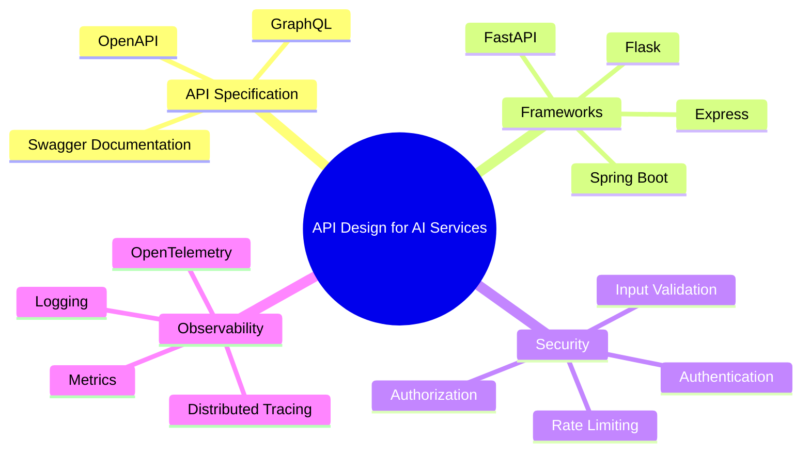
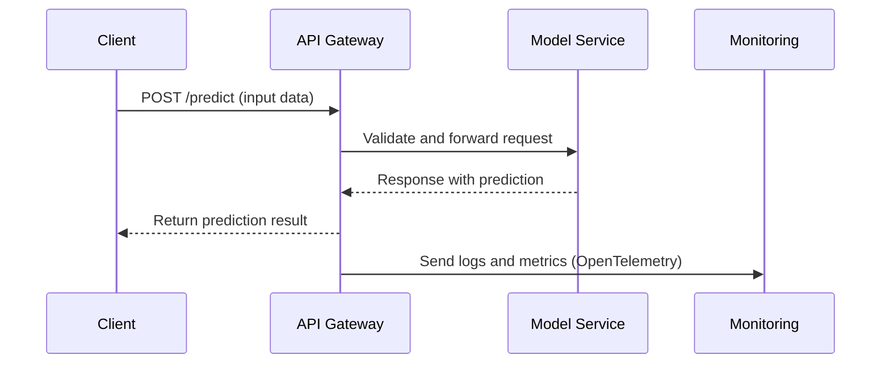

# API Design for AI Services

In this section, we will cover the essentials of designing APIs for AI services. Effective API design is critical for integrating AI models into real-world applications, enabling seamless access, scalability, and maintainability. The goal is to create robust, efficient, and secure APIs that allow clients to easily interact with AI models, regardless of the underlying technology stack.

## Overview

API design for AI services involves defining a clear contract for how consumers interact with AI models. This includes specifying input data formats, response structures, authentication methods, and error handling. By following best practices and leveraging industry standards like OpenAPI, FastAPI, and OpenTelemetry, you can create APIs that are well-documented, secure, and performant.

### Key Components of API Design for AI Services

- **API Specification**: Clearly define your API endpoints, request and response formats, and parameters using OpenAPI or GraphQL schemas.
- **Frameworks**: Utilize efficient frameworks like FastAPI (Python), Express (Node.js), or Flask, but maintain flexibility based on your technology stack.
- **Security**: Implement robust security practices, including authentication, authorization, and input validation.
- **Observability**: Use standards like OpenTelemetry for tracing, logging, and metrics to gain insights into API performance.



## API Specification

### Choosing the Right Specification: OpenAPI vs GraphQL

| Feature         | OpenAPI (REST)                     | GraphQL                          |
|-----------------|-----------------------------------|----------------------------------|
| **Flexibility** | Standard CRUD operations          | Flexible queries                 |
| **Documentation** | Auto-generated with Swagger       | Schema-driven, less auto-generated |
| **Caching**     | Native support via HTTP caching   | Complex, manual caching required |
| **Error Handling** | Standardized HTTP status codes   | Custom error structure           |
| **Best Use Case** | Simple, well-defined endpoints   | Dynamic, complex querying needs  |

- **OpenAPI** is ideal for well-defined, fixed endpoints and works well for services that follow a CRUD (Create, Read, Update, Delete) pattern.
- **GraphQL** allows clients to request exactly the data they need, which can reduce over-fetching and under-fetching of data.

### Example OpenAPI Specification (YAML)

```yaml
openapi: 3.0.0
info:
  title: AI Prediction API
  version: 1.0.0
paths:
  /predict:
    post:
      summary: Get predictions from the AI model
      requestBody:
        required: true
        content:
          application/json:
            schema:
              type: object
              properties:
                input_data:
                  type: array
                  items:
                    type: number
      responses:
        '200':
          description: Successful prediction
          content:
            application/json:
              schema:
                type: object
                properties:
                  prediction:
                    type: number
        '400':
          description: Invalid input data
```

## Request Flow for AI API

The following sequence diagram illustrates a typical request flow for an AI API service, including client interaction, request processing, and response delivery.



## Security Best Practices

### Key Security Measures

1. **Authentication and Authorization**
   - Use OAuth 2.0 or JWT for secure token-based authentication.
   - Implement Role-Based Access Control (RBAC) to manage permissions.
   - Ensure sensitive endpoints are protected by API keys or tokens.

2. **Input Validation and Sanitization**
   - Validate input data types and formats to prevent injection attacks (e.g., SQL Injection, XSS).
   - Use schema validation tools like `pydantic` in Python or `Joi` in Node.js.

3. **Rate Limiting and Throttling**
   - Use tools like NGINX or API Gateway for rate limiting to prevent abuse.
   - Set quotas based on user tiers or plan limits.

4. **Encryption and Secure Transmission**
   - Use HTTPS (TLS) for all data in transit.
   - Encrypt sensitive data at rest using industry-standard encryption (e.g., AES-256).


## Observability with OpenTelemetry

Observability is key to understanding the performance and behavior of your AI API services. By integrating OpenTelemetry, you can gain insights through logging, metrics, and tracing.

| Component         | Tool/Standard     | Description                                    |
|-------------------|-------------------|------------------------------------------------|
| **Logging**       | ELK Stack, Fluentd| Collect and analyze logs for debugging.        |
| **Metrics**       | Prometheus, Grafana| Monitor API latency, error rates, and usage.   |
| **Tracing**       | OpenTelemetry     | Trace requests end-to-end across microservices.|

### Example Code: FastAPI Integration with OpenTelemetry

```python
from fastapi import FastAPI
from opentelemetry import trace
from opentelemetry.instrumentation.fastapi import FastAPIInstrumentor

app = FastAPI()
FastAPIInstrumentor().instrument_app(app)

@app.post("/predict")
async def predict(input_data: list):
    tracer = trace.get_tracer(__name__)
    with tracer.start_as_current_span("prediction"):
        # Model inference logic here
        return {"prediction": 0.95}
```

## Best Practices Checklist

| Practice                        | Recommendation                                         |
|---------------------------------|--------------------------------------------------------|
| **Documentation**               | Use OpenAPI or Swagger for comprehensive API docs.     |
| **Error Handling**              | Standardize error responses with clear status codes.   |
| **Rate Limiting**               | Implement to protect against abusive usage.            |
| **Logging and Monitoring**      | Integrate OpenTelemetry for observability.             |
| **Versioning**                  | Use semantic versioning (e.g., v1, v2) for API changes.|


By following these best practices and leveraging industry standards, you can design APIs that are secure, efficient, and scalable, providing a solid foundation for integrating AI models into your applications.