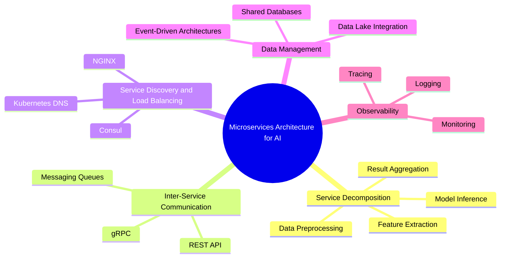
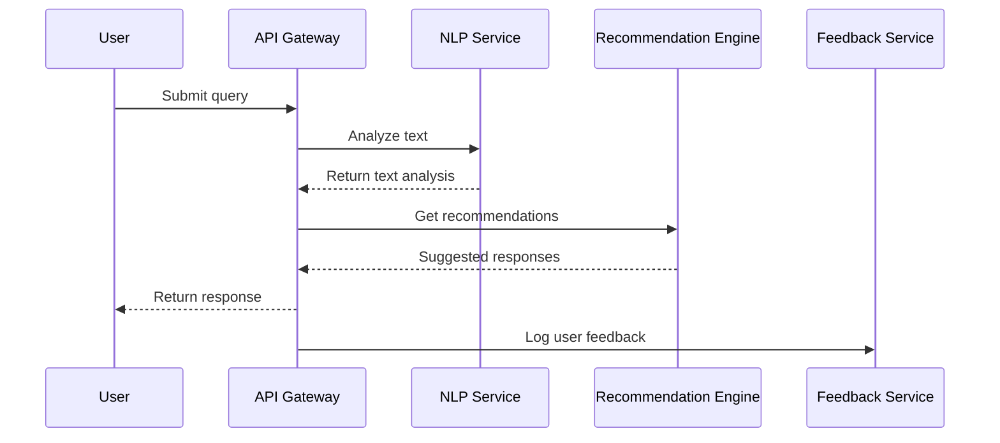
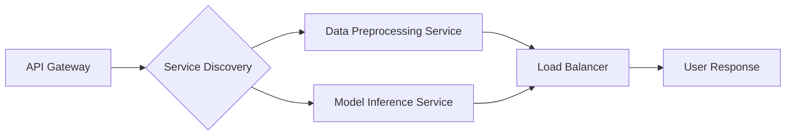
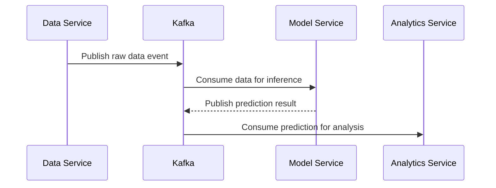
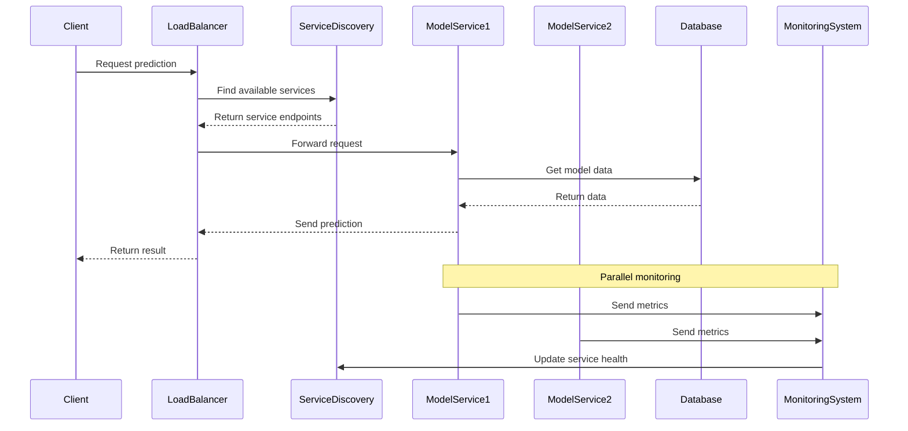

# Microservices Architecture for AI

The **Microservices Architecture for AI** section dives into designing AI systems using a microservices approach. Microservices provide a scalable, modular, and fault-tolerant structure for deploying AI models and services, allowing different components to be developed, deployed, and maintained independently. This architecture is ideal for complex AI solutions requiring agility, scalability, and resilience.

## Overview

Microservices architecture decomposes a monolithic AI application into smaller, loosely coupled services. Each microservice handles a specific function, such as data preprocessing, model inference, or logging. This approach allows teams to build, scale, and update individual components independently, making the system more adaptable to change and easier to maintain.

### Key Components of Microservices Architecture for AI

1. **Service Decomposition**: Breaking down AI functionality into distinct, self-contained services.
2. **Inter-Service Communication**: Using efficient communication protocols like gRPC, REST, or messaging queues (e.g., Kafka, RabbitMQ) for interaction between services.
3. **Service Discovery and Load Balancing**: Ensuring services can find and communicate with each other dynamically, using tools like Consul or Kubernetes DNS.
4. **Data Management**: Managing data across services using shared databases or event-driven architectures.
5. **Observability**: Implementing monitoring, logging, and tracing for better visibility and debugging.

## Service Decomposition

Service decomposition involves splitting the AI application into smaller, manageable services. Each service handles a specific task, such as:

- **Data Preprocessing Service**: Handles data cleaning, normalization, and feature extraction.
- **Model Inference Service**: Hosts the AI model and provides predictions.
- **Feature Store Service**: Manages and serves real-time and batch features for models.
- **Logging and Monitoring Service**: Collects logs, metrics, and traces for observability.

| Service                  | Functionality                                   | Example Technology            |
|--------------------------|-------------------------------------------------|-------------------------------|
| **Data Preprocessing**   | Cleans and transforms input data                | Pandas, Apache Beam           |
| **Model Inference**      | Provides model predictions                      | TensorFlow Serving, ONNX      |
| **Feature Store**        | Stores and serves features for inference        | Feast, Redis                  |
| **Monitoring**           | Collects metrics and traces for observability   | Prometheus, Grafana, ELK Stack|

### Example Decomposition

A typical AI solution for customer support automation may involve the following microservices:

- **User Input Service**: Receives user queries and validates input.
- **Natural Language Processing (NLP) Service**: Performs text analysis, sentiment detection, and entity recognition.
- **Recommendation Engine Service**: Suggests relevant responses or actions.
- **Feedback Loop Service**: Collects user feedback for continuous model improvement.

## Inter-Service Communication

Microservices need efficient communication mechanisms to share data and trigger actions. Common protocols include:

- **gRPC**: High-performance RPC framework, suitable for low-latency and type-safe communication.
- **REST API**: Standard HTTP-based communication, easy to implement and widely supported.
- **Message Queues**: Asynchronous communication using Kafka, RabbitMQ, or AWS SQS, ideal for decoupled services.

### Communication Protocols Comparison

| Protocol      | Latency   | Use Case                          | Pros                           | Cons                          |
|---------------|-----------|-----------------------------------|--------------------------------|-------------------------------|
| **gRPC**      | Low       | Real-time inference               | Fast, type-safe, streaming     | Requires protobufs, complex   |
| **REST API**  | Medium    | Standard API interaction          | Simple, widely supported       | Higher latency, less efficient|
| **Messaging** | High      | Event-driven processing           | Asynchronous, decoupled        | Potential message loss        |

## Service Discovery and Load Balancing

### Service Discovery

In microservices, services often scale dynamically. Tools like **Kubernetes DNS** or **Consul** help discover services by providing a registry that maps service names to their network locations.

### Load Balancing

Load balancers (e.g., **NGINX**, **HAProxy**, or **Kubernetes Ingress**) distribute incoming requests across multiple instances of a service, ensuring high availability and fault tolerance.

## Data Management

Data management is crucial in a microservices architecture. Options include:

- **Shared Databases**: A central database accessed by multiple services (e.g., PostgreSQL, MongoDB). Simple but can become a bottleneck.
- **Event-Driven Architecture**: Services communicate via events using Kafka or RabbitMQ, promoting decoupling and scalability.
- **Data Lakes**: Centralized storage for raw and processed data, often used in AI solutions for batch processing and analytics.

### Example Data Flow (Event-Driven)

## Observability

Observability involves monitoring, logging, and tracing to gain insights into the behavior of microservices.

### Best Practices for Observability

1. **Monitoring**: Use Prometheus and Grafana to track service performance metrics (e.g., latency, error rates).
2. **Logging**: Centralize logs with tools like ELK Stack or Fluentd for better debugging and analysis.
3. **Tracing**: Implement distributed tracing with OpenTelemetry to follow request paths across services.

| Tool                | Functionality            | Description                                    |
|---------------------|--------------------------|------------------------------------------------|
| **Prometheus**      | Monitoring               | Collects time-series metrics                   |
| **Grafana**         | Visualization            | Provides dashboards for metrics                |
| **ELK Stack**       | Logging                  | Centralized log collection and search          |
| **OpenTelemetry**   | Tracing                  | Standardizes tracing across services           |

## Best Practices Checklist

| Practice                       | Recommendation                                   |
|--------------------------------|--------------------------------------------------|
| **Service Decomposition**      | Keep services focused and loosely coupled.       |
| **Data Management**            | Use event-driven architecture for scalability.   |
| **Communication Protocols**    | Choose based on latency, data size, and complexity.|
| **Service Discovery**          | Use tools like Consul or Kubernetes DNS.         |
| **Observability**              | Integrate monitoring, logging, and tracing.      |

By following these best practices, you can build scalable, resilient AI solutions using a microservices architecture, enabling rapid innovation and efficient maintenance.