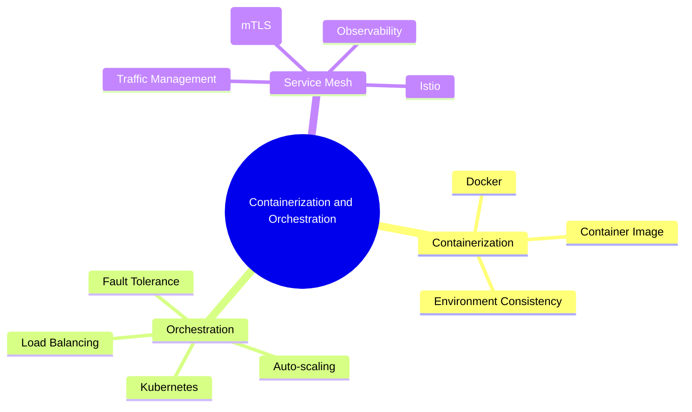
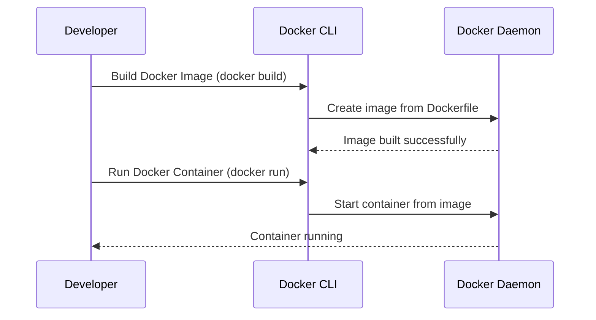
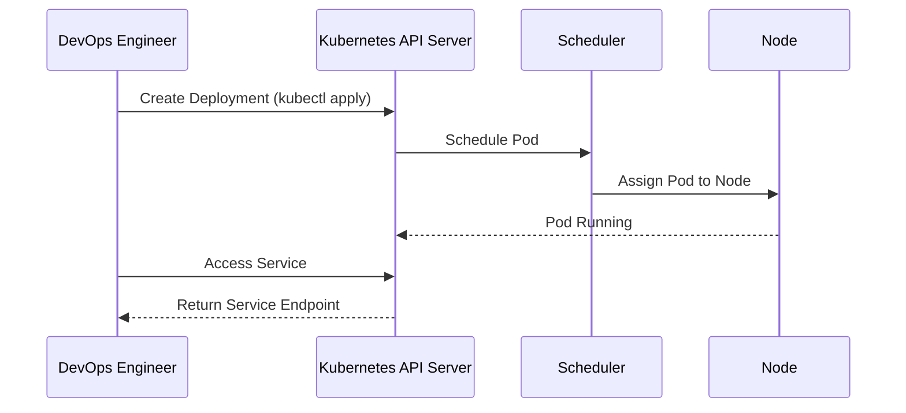
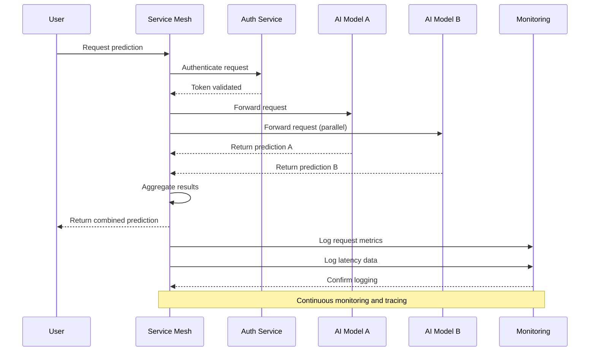

# Containerization and Orchestration

The **Containerization and Orchestration** section explores the essential concepts of deploying AI models using containers and orchestration platforms like Docker and Kubernetes. Containerization allows AI applications to be packaged with all their dependencies, ensuring consistency across environments. Orchestration platforms, in turn, manage these containers, providing scalability, reliability, and ease of maintenance.

## Overview

Containerization and orchestration are key components of modern AI infrastructure. They help AI teams:

- **Standardize Deployments**: Ensure models run consistently in different environments (e.g., development, testing, production).
- **Improve Scalability**: Scale model instances automatically based on demand.
- **Enhance Fault Tolerance**: Recover from failures by restarting containers or redistributing workloads.

By using Docker for containerization and Kubernetes for orchestration, AI architects can streamline the deployment process, reduce operational complexity, and maximize resource efficiency.

### Key Concepts

1. **Containerization with Docker**: Packaging AI models and dependencies into lightweight containers for consistent deployment.
2. **Orchestration with Kubernetes**: Automating the deployment, scaling, and management of containerized applications.
3. **Service Mesh**: Adding observability, security, and traffic management for microservices using tools like Istio or Linkerd.

## Containerization with Docker

### What is Docker?

Docker is a platform for packaging applications and their dependencies into isolated units called **containers**. Each container includes everything needed to run the AI model, such as the runtime, libraries, and environment variables.

#### Benefits of Docker:

- **Consistency**: Run the same container image in different environments without compatibility issues.
- **Isolation**: Keep applications and dependencies isolated, reducing conflicts.
- **Efficiency**: Containers are lightweight and share the host OS kernel, using fewer resources than virtual machines.

### Core Concepts

| Concept             | Description                                 |
|---------------------|---------------------------------------------|
| **Docker Image**    | A snapshot of the application and its dependencies.|
| **Docker Container**| A running instance of a Docker image.       |
| **Docker Registry** | A repository for storing and sharing Docker images (e.g., Docker Hub, AWS ECR).|
| **Dockerfile**      | A script that defines how to build a Docker image.|

#### Building and Running a Docker Container

## Orchestration with Kubernetes

### What is Kubernetes?

Kubernetes (K8s) is an open-source platform for automating the deployment, scaling, and management of containerized applications. It abstracts away the complexity of managing containers, allowing you to focus on building AI solutions rather than handling infrastructure.

#### Key Components of Kubernetes:

1. **Pods**: The smallest deployable unit, which can contain one or more containers.
2. **Nodes**: Worker machines where containers are deployed.
3. **Services**: Expose your pods to the network, providing load balancing and service discovery.
4. **Deployments**: Define how to roll out updates and maintain the desired state of the application.

### Core Kubernetes Concepts

| Component        | Functionality                             |
|------------------|-------------------------------------------|
| **Pod**          | A group of one or more containers sharing the same network and storage.|
| **Service**      | Exposes a set of pods as a network service (e.g., LoadBalancer, ClusterIP).|
| **Ingress**      | Manages external access to services, typically via HTTP/HTTPS.|
| **Deployment**   | Manages the lifecycle of pods, handling updates and rollbacks.|

#### Kubernetes Workflow

## Service Mesh

### What is a Service Mesh?

A **service mesh** is an infrastructure layer that manages service-to-service communication within a microservices architecture. It provides features like traffic management, security, and observability without requiring changes to the application code.

#### Benefits of a Service Mesh:

- **Traffic Management**: Fine-grained control over request routing, including load balancing, retries, and circuit breaking.
- **Security**: Enhanced security with mTLS (mutual TLS) for encrypted communication between services.
- **Observability**: Distributed tracing, logging, and metrics collection for better insights into service behavior.

| Service Mesh Tool | Key Features                          | Example Use Case                  |
|-------------------|---------------------------------------|-----------------------------------|
| **Istio**         | Traffic management, security, observability | Complex microservices architectures|
| **Linkerd**       | Lightweight, simple to configure      | Performance-sensitive applications|
| **Consul**        | Service discovery, configuration      | Hybrid cloud environments         |

#### Service Mesh Architecture Diagram

## Comparing Orchestration Tools

| Feature              | Docker Compose      | Kubernetes          | Nomad                |
|----------------------|---------------------|---------------------|----------------------|
| **Complexity**       | Low                 | High                | Medium               |
| **Scalability**      | Limited             | High                | High                 |
| **Load Balancing**   | Basic               | Advanced            | Advanced             |
| **Service Discovery**| Manual configuration| Built-in (K8s DNS)  | Built-in (Consul)    |
| **Best Use Case**    | Development, testing| Large-scale production| Multi-cloud, hybrid  |

## Best Practices Checklist

| Best Practice                  | Recommendation                                     |
|--------------------------------|----------------------------------------------------|
| **Container Optimization**     | Use minimal base images (e.g., Alpine) for smaller containers.|
| **Security**                   | Scan images for vulnerabilities, use signed images (Docker Content Trust).|
| **Resource Management**        | Define resource limits and requests in Kubernetes manifests.|
| **Rolling Updates**            | Use Kubernetes deployments for zero-downtime updates.|
| **Monitoring and Logging**     | Integrate Prometheus for monitoring and ELK Stack for logging.|

By mastering the essentials of containerization and orchestration, you can streamline the deployment of AI solutions, ensuring scalability, consistency, and resilience across environments.