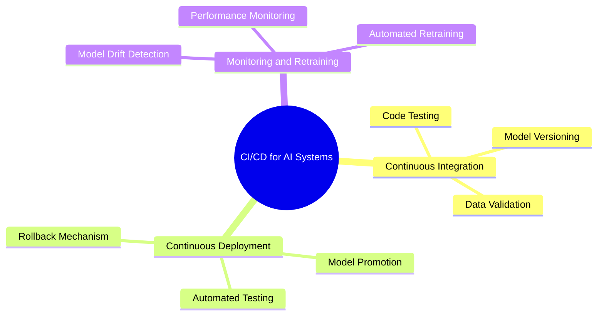
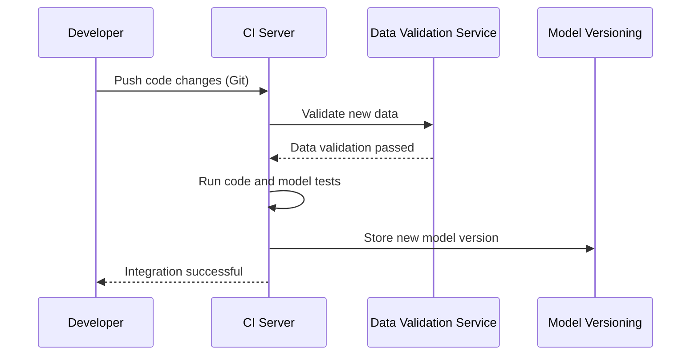
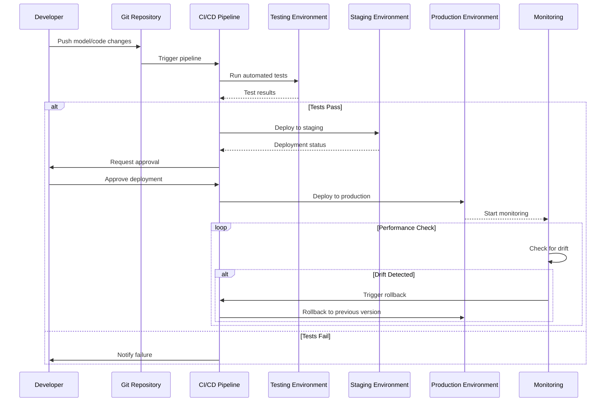
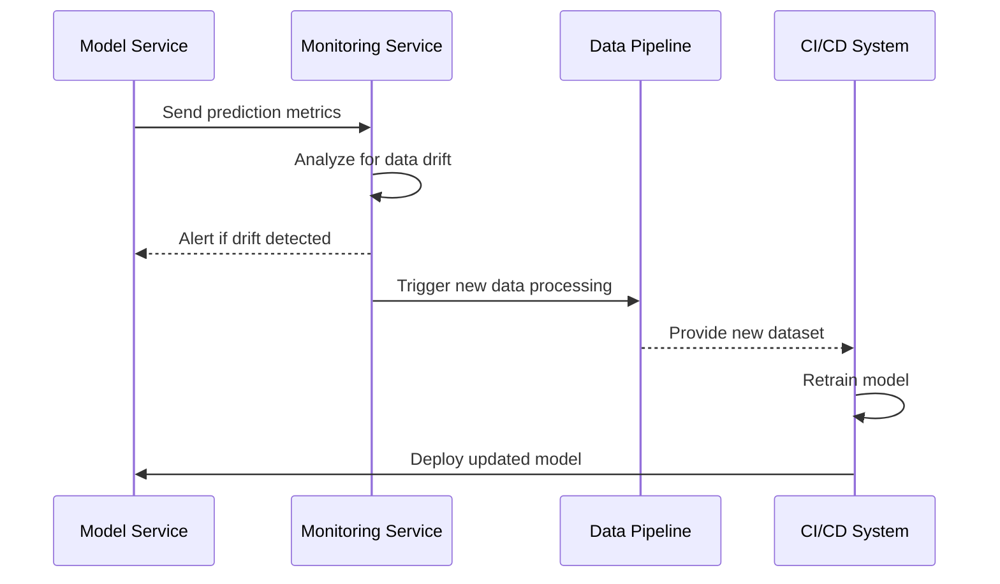

# CI/CD for AI Systems

The **CI/CD for AI Systems** section focuses on Continuous Integration (CI) and Continuous Deployment (CD) practices tailored for AI workflows. Implementing CI/CD for AI projects helps automate the testing, integration, and deployment of AI models, reducing the time from development to production while ensuring high-quality, reproducible results. This approach enhances the agility and reliability of AI solutions, making it easier to adapt to changing data and evolving business requirements.

## Overview

CI/CD for AI systems introduces unique challenges compared to traditional software. AI projects often involve complex data dependencies, model versioning, and performance validation. The key to successful CI/CD for AI lies in creating automated, reproducible pipelines that handle:

- **Data Preparation**: Automated data validation, feature extraction, and preprocessing.
- **Model Training**: Training models using standardized workflows with clear versioning.
- **Model Validation**: Automated testing and evaluation to ensure model performance meets predefined criteria.
- **Model Deployment**: Seamless deployment to production environments, with rollback mechanisms for safety.
- **Monitoring and Retraining**: Continuous monitoring of model performance and automated triggers for retraining.

## Continuous Integration for AI

### Key Components

1. **Code Testing**: Automated testing of code changes, including unit tests for preprocessing functions and integration tests for the entire pipeline.
2. **Data Validation**: Checks for data consistency, schema validation, and data quality before proceeding with model training.
3. **Model Versioning**: Using tools like DVC (Data Version Control) or MLflow to track different versions of datasets and models.

### CI Pipeline Flow

### Tools for Continuous Integration

| Tool                   | Functionality                     | Description                           |
|------------------------|-----------------------------------|---------------------------------------|
| **GitHub Actions**     | CI/CD automation                  | Integrates seamlessly with GitHub repositories.|
| **Jenkins**            | CI server                         | Highly customizable, supports plugins for AI workflows.|
| **GitLab CI**          | Built-in CI/CD                    | Native CI/CD support for GitLab projects.|
| **DVC**                | Data and model versioning         | Tracks changes in datasets and models efficiently.|

## Continuous Deployment for AI

Continuous Deployment (CD) focuses on automating the release of AI models to production environments. This involves deploying models after they pass validation checks and ensuring seamless updates with minimal downtime.

### Key Components

1. **Automated Testing**: Before deployment, run tests such as unit tests, integration tests, and model performance tests.
2. **Model Promotion**: Move models from staging to production based on performance metrics and manual approval processes.
3. **Rollback Mechanism**: Implement rollback strategies in case the new model underperforms or causes issues in production.

### CD Pipeline Flow

### Model Deployment Strategies

| Strategy               | Description                                       | Use Case                        |
|------------------------|---------------------------------------------------|---------------------------------|
| **Blue-Green Deployment** | Deploy new version alongside old one, switch traffic when ready.| Low-risk, minimal downtime      |
| **Canary Release**     | Gradually roll out the new model to a subset of users.| Test changes on a smaller scale|
| **Shadow Deployment**  | Run the new model in parallel without serving its predictions.| Validate performance without affecting users|

## Monitoring and Retraining

Monitoring and retraining are essential for maintaining model performance over time. The model's accuracy may degrade due to data drift, concept drift, or changes in the underlying data distribution.

### Key Monitoring Metrics

- **Prediction Accuracy**: Measure the model's real-time performance using accuracy metrics (e.g., precision, recall).
- **Data Drift**: Detect changes in the data distribution using statistical tests (e.g., Kolmogorov-Smirnov test).
- **Concept Drift**: Identify shifts in the relationship between input features and target predictions.

#### Monitoring and Automated Retraining

### Tools for Monitoring

| Tool                 | Functionality                      | Description                         |
|----------------------|------------------------------------|-------------------------------------|
| **Prometheus**       | Metrics collection                 | Monitors model performance and system health.|
| **Grafana**          | Data visualization                 | Provides dashboards for monitoring metrics.|
| **MLflow**           | Experiment tracking, model registry| Tracks experiments and manages model versions.|
| **Evidently AI**     | Data and model monitoring          | Detects data drift and monitors model performance.|

## Best Practices Checklist

| Best Practice                 | Recommendation                                        |
|-------------------------------|-------------------------------------------------------|
| **Automate Data Validation**  | Use tools like Great Expectations for consistent data checks.|
| **Version Control Everything**| Track code, data, and models using Git and DVC.       |
| **Test Thoroughly**           | Include unit tests, integration tests, and performance tests.|
| **Use Rollback Strategies**   | Implement blue-green or canary releases for safer deployments.|
| **Monitor Continuously**      | Set up monitoring for model drift and performance degradation.|
| **Retrain Regularly**         | Automate retraining based on performance metrics or data drift.|

By implementing CI/CD practices in your AI projects, you can accelerate the delivery of high-quality models, reduce manual errors, and ensure consistent performance in production environments. This approach enhances collaboration across data science, engineering, and operations teams, enabling faster innovation and better results.