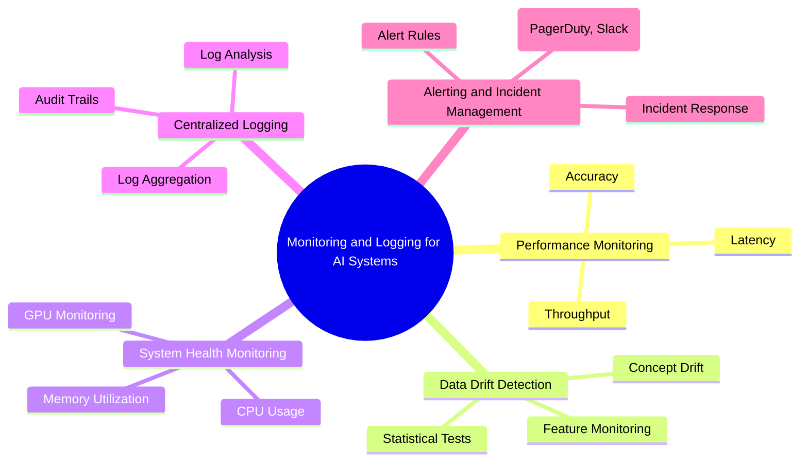
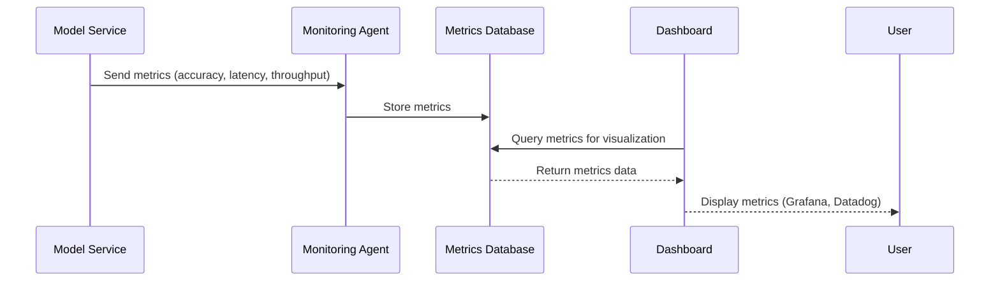
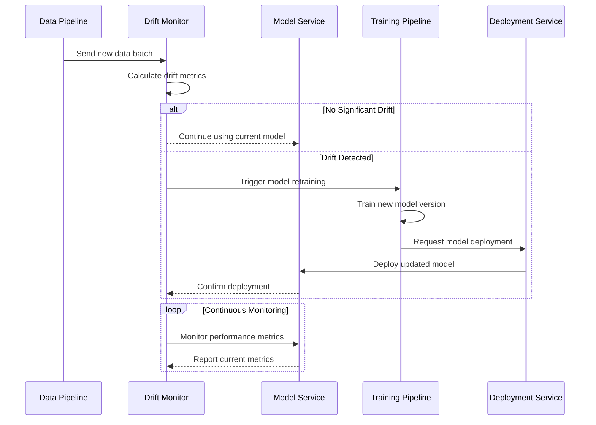
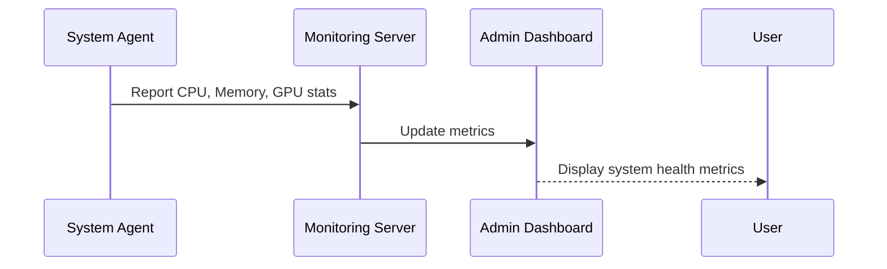
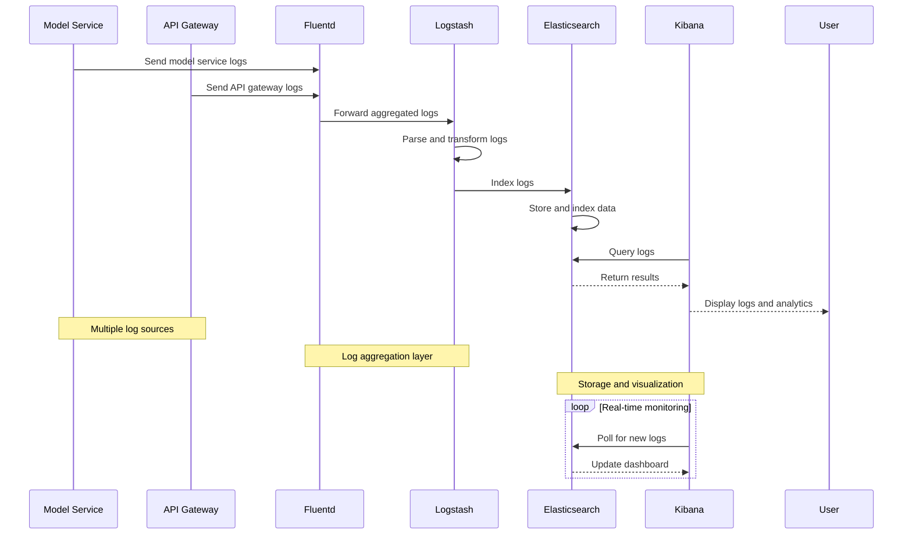
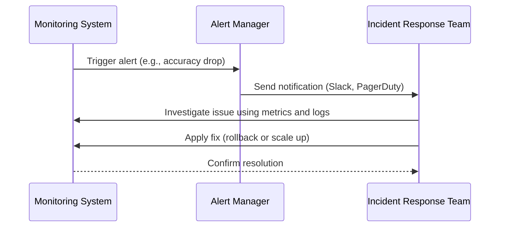

# Monitoring and Logging for AI Systems

The **Monitoring and Logging for AI Systems** section focuses on establishing robust observability for AI models in production. Effective monitoring and logging help ensure that AI models perform as expected, detect anomalies, and provide insights into system health. Observability is crucial for maintaining model reliability, detecting data and concept drift, and enabling quick debugging of issues in complex AI deployments.

## Overview

Monitoring and logging are fundamental components of the AI model lifecycle, especially in production environments where the stakes are high. Unlike traditional software, AI models require specialized monitoring due to factors such as changing data distributions, model performance degradation, and the dynamic nature of model predictions.

### Key Aspects of Monitoring and Logging

1. **Performance Monitoring**: Track metrics related to model accuracy, latency, and throughput.
2. **Data Drift and Concept Drift Detection**: Identify shifts in the input data or changes in the relationship between inputs and outputs.
3. **System Health Monitoring**: Monitor infrastructure components like CPU, memory, and GPU usage.
4. **Centralized Logging**: Aggregate logs from various services for efficient troubleshooting and auditing.
5. **Alerting and Incident Management**: Set up alerts for anomalies and integrate with incident management tools.

## Performance Monitoring

### Key Metrics to Monitor

| Metric                  | Description                                   | Tool/Standard             |
|-------------------------|-----------------------------------------------|---------------------------|
| **Accuracy**            | Measures how often the model makes correct predictions.| Custom evaluation metrics, Prometheus |
| **Latency**             | Time taken to generate predictions (inference time). | Grafana, Datadog          |
| **Throughput**          | Number of predictions made per second.       | Prometheus, CloudWatch    |

#### Performance Monitoring Workflow

### Monitoring Tools for AI Systems

| Tool                | Functionality                      | Description                       |
|---------------------|------------------------------------|-----------------------------------|
| **Prometheus**      | Metrics collection                 | Collects time-series data for model and system metrics.|
| **Grafana**         | Visualization                      | Provides dashboards for monitoring AI system metrics.|
| **Datadog**         | APM, metrics, logging              | End-to-end observability for cloud-native applications.|

## Data Drift and Concept Drift Detection

### Understanding Drift

- **Data Drift**: Occurs when the statistical properties of input data change, potentially impacting model performance.
- **Concept Drift**: Occurs when the relationship between input features and the target prediction changes, leading to a decline in model accuracy.

### Drift Detection Techniques

| Technique            | Description                                   | Example Use Case               |
|----------------------|-----------------------------------------------|--------------------------------|
| **Statistical Tests**| Use tests like KS-test or Chi-square to detect data distribution changes.| Detecting changes in user behavior data.|
| **Feature Monitoring**| Track individual feature distributions over time.| Monitoring temperature or sales data.|
| **Performance Monitoring**| Track accuracy and other performance metrics to detect decline.| Detecting concept drift in fraud detection models.|

#### Data Drift Detection Flow

## System Health Monitoring

System health monitoring involves tracking the resource usage and performance of the underlying infrastructure supporting AI models. This includes monitoring CPU, memory, GPU utilization, and network latency.

### Core Metrics

| Metric                | Description                                | Tool                           |
|-----------------------|--------------------------------------------|--------------------------------|
| **CPU Usage**         | Percentage of CPU being utilized by the model service.| Prometheus, CloudWatch         |
| **Memory Utilization**| Amount of memory being used by the service.| Grafana, Datadog               |
| **GPU Utilization**   | Tracks GPU usage for models running on GPU instances.| NVIDIA DCGM, Prometheus        |
| **Network Latency**   | Measures the time taken for network communication.| Grafana, ELK Stack             |

#### System Health Monitoring

## Centralized Logging

Centralized logging is crucial for debugging and auditing AI systems. It aggregates logs from different components (e.g., API gateway, model service, data pipeline) into a single location for easier analysis.

### Key Components of Centralized Logging

1. **Log Aggregation**: Collect logs from different services using Fluentd or Logstash.
2. **Log Analysis**: Use tools like ELK Stack (Elasticsearch, Logstash, Kibana) for searching and visualizing logs.
3. **Audit Trails**: Maintain detailed logs for compliance and traceability.

| Tool                | Functionality                      | Description                       |
|---------------------|------------------------------------|-----------------------------------|
| **ELK Stack**       | Log aggregation and search         | Centralized logging using Elasticsearch, Logstash, and Kibana.|
| **Fluentd**         | Log collection                     | Collects logs from multiple sources and forwards them.|
| **Graylog**         | Log management and analysis        | Provides a user-friendly interface for log analysis.|

#### Example Flow: Centralized Logging Architecture

## Alerting and Incident Management

Effective monitoring systems include alerting mechanisms to notify the team when issues arise. Alerts can be configured based on predefined thresholds for metrics like accuracy drop, latency spikes, or system resource exhaustion.

### Incident Response Workflow

1. **Alerting**: Set up alerts using Prometheus Alertmanager or Datadog.
2. **Notification**: Integrate with tools like Slack, PagerDuty, or Opsgenie for real-time notifications.
3. **Root Cause Analysis**: Use logs and metrics to diagnose the issue.
4. **Resolution**: Implement a fix, which may involve rolling back the model or scaling up resources.

#### Incident Response Flow

## Best Practices Checklist

| Best Practice               | Recommendation                                        |
|-----------------------------|-------------------------------------------------------|
| **Define Key Metrics**      | Track model accuracy, latency, throughput, and system health.|
| **Automate Drift Detection**| Use tools like Evidently AI or custom scripts for data drift detection.|
| **Centralize Logs**         | Aggregate logs using ELK Stack or Fluentd for efficient analysis.|
| **Integrate Alerting**      | Use Prometheus Alertmanager or Datadog for real-time alerts.|
| **Conduct Root Cause Analysis**| Use logs and metrics to quickly diagnose and resolve issues.|

By implementing effective monitoring and logging practices, you can ensure that your AI models maintain high performance, detect issues early, and provide valuable insights for continuous improvement. This approach leads to more reliable AI solutions and a better overall user experience.