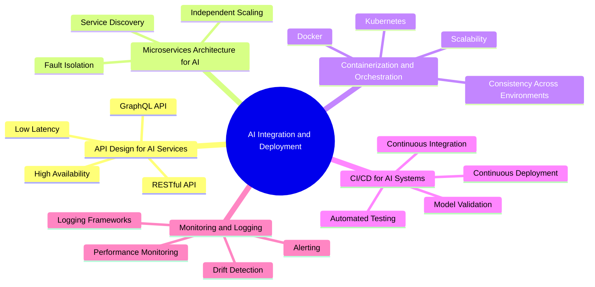

# AI Integration and Deployment

Welcome to the **AI Integration and Deployment** section of the AI Architect Handbook. This section focuses on the practical aspects of integrating AI models into production systems, with an emphasis on building scalable, maintainable, and efficient solutions. Successful integration involves key components such as API design, microservices architecture, containerization, automated CI/CD pipelines, and monitoring frameworks.

## Overview

AI Integration and Deployment involve a structured approach to making AI models operational, scalable, and reliable within enterprise systems. By following best practices for integration and deployment, organizations can ensure that AI models deliver consistent value in production environments. This section covers core topics and techniques to help streamline these processes, enabling effective model deployment and lifecycle management.

### Key Concepts of AI Integration and Deployment

1. **API Design for AI Services**: Crafting robust and scalable APIs (RESTful or GraphQL) to serve AI model predictions, ensuring low latency and high availability.
2. **Microservices Architecture for AI**: Adopting a microservices approach to modularize AI functionalities, allowing for independent scaling and easier maintenance.
3. **Containerization and Orchestration**: Utilizing tools like Docker and Kubernetes for packaging models and orchestrating deployments for enhanced reliability and scalability.
4. **CI/CD for AI Systems**: Setting up continuous integration and continuous deployment pipelines to automate the release process, improving agility and reducing manual errors.
5. **Monitoring and Logging**: Implementing comprehensive monitoring and logging frameworks to track model performance, detect drift, and maintain observability.

## Subsections

Explore each critical aspect of AI Integration and Deployment:

1. [API Design for AI Services](01-API-Design-for-AI-Services.md): Learn how to create scalable APIs for serving AI models, including best practices for RESTful and GraphQL APIs.
2. [Microservices Architecture for AI](02-Microservices-Architecture-for-AI.md): Discover how to structure AI components as microservices for improved scalability and maintainability.
3. [Containerization and Orchestration](03-Containerization-and-Orchestration.md): Explore how to use Docker and Kubernetes for packaging AI models and managing their lifecycle in production.
4. [CI/CD for AI Systems](04-CI\CD-for-AI-Systems.md): Understand the benefits of automating deployment with CI/CD pipelines, including strategies for automated testing and model validation.
5. [Monitoring and Logging](05-Monitoring-and-Logging.md): Learn how to implement robust monitoring and logging to ensure model reliability and traceability in production environments.

## How to Use This Section

This section provides practical guidance on the critical aspects of integrating and deploying AI models effectively. By following the outlined best practices, you can:

- **Design Effective APIs**: Build scalable, low-latency APIs that expose AI model predictions efficiently.
- **Modularize Your AI Solutions**: Leverage microservices to decouple AI components, making them easier to manage and scale.
- **Standardize Deployment**: Use containerization tools like Docker and orchestration frameworks like Kubernetes to ensure consistent deployments across environments.
- **Automate Your Deployment Process**: Implement CI/CD pipelines for faster, error-free updates to AI models in production.
- **Ensure Robust Monitoring**: Set up comprehensive monitoring and logging to track model performance, detect anomalies, and ensure compliance.

## Real-World Example

### Case Study: AI-Driven Customer Support System

A technology company integrated an AI model for automated customer support into its existing microservices architecture. Key steps included:

- **API Design**: A RESTful API was created for real-time prediction, achieving a response time of 50 ms.
- **Microservices Approach**: The AI model was deployed as a separate microservice, allowing it to scale independently based on user demand.
- **Containerization**: Docker was used for packaging the model, ensuring consistency from local development to cloud environments.
- **CI/CD Implementation**: GitHub Actions and Jenkins were employed to automate model retraining, testing, and deployment.
- **Comprehensive Monitoring**: Prometheus was set up for real-time monitoring, while ELK Stack managed logs for detailed analysis.

This approach allowed the company to rapidly deploy updates and maintain a high-quality user experience.

## Stay Updated

AI integration and deployment are rapidly evolving fields, with new tools and methodologies emerging regularly. This section of the handbook will be updated frequently to reflect the latest best practices and industry insights. Revisit often to stay informed about new trends and updates.
