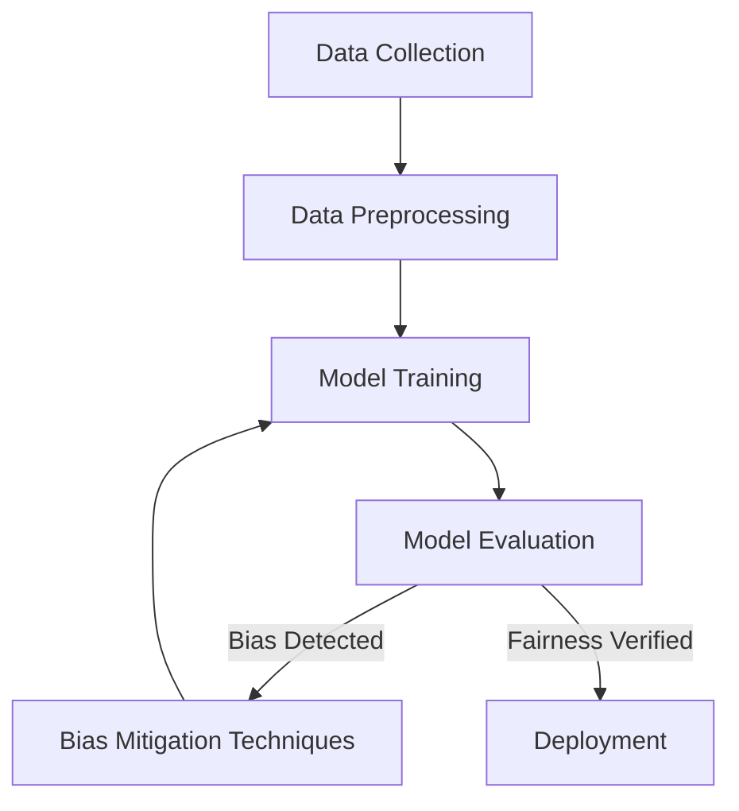
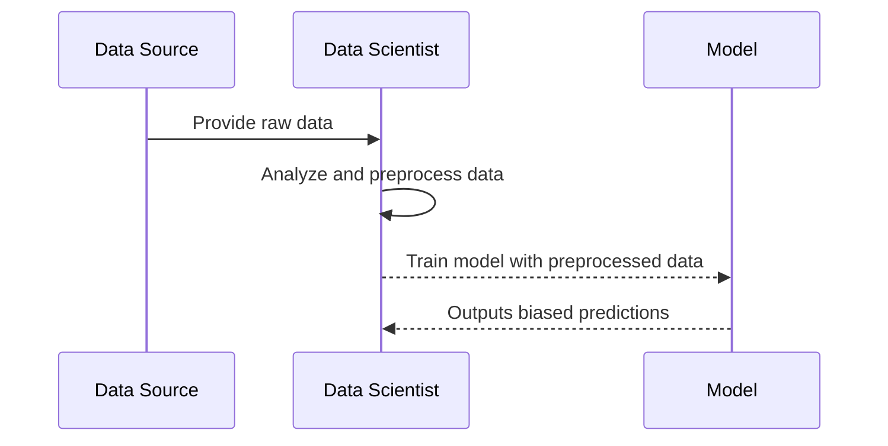
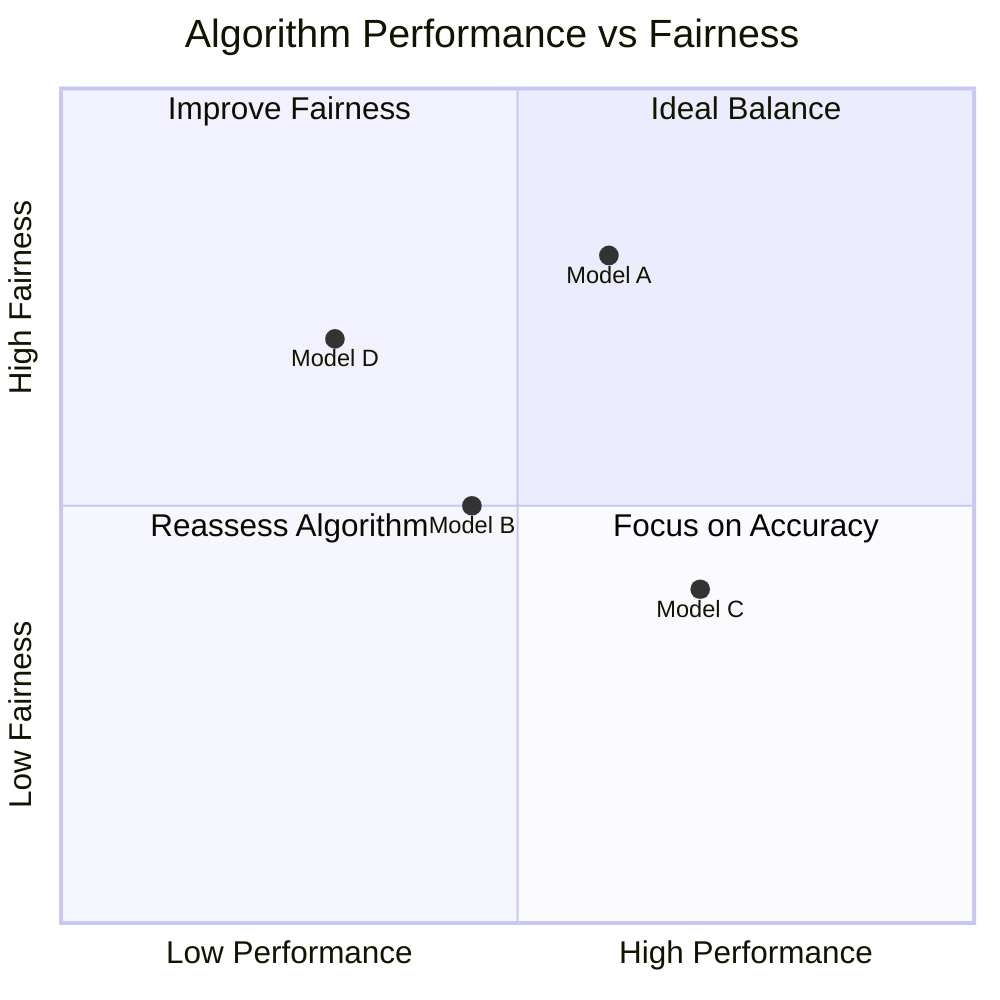
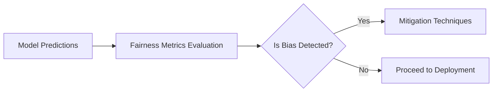
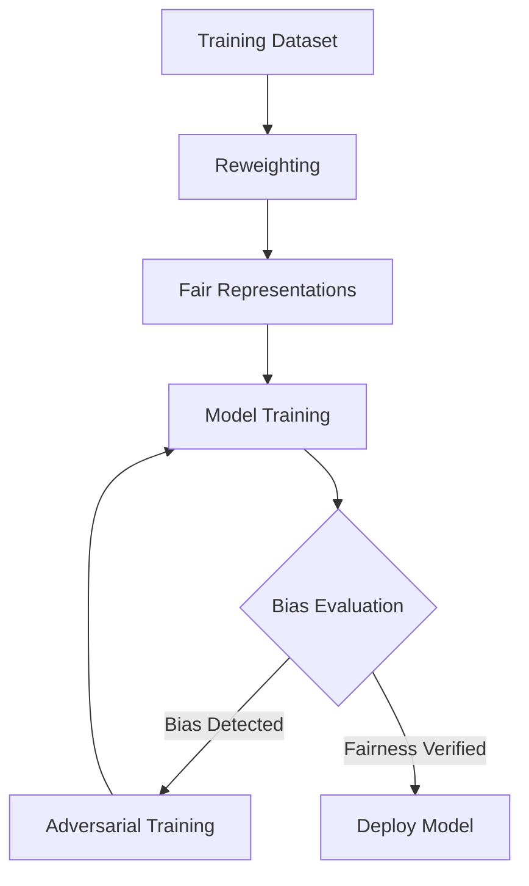

# Fairness and Bias in AI

The **Fairness and Bias in AI** page addresses one of the most critical aspects of ethical AI design: ensuring that AI systems produce equitable outcomes across diverse user groups. Bias in AI can arise from various sources, including data collection, model training, and deployment contexts, leading to unfair decisions that disproportionately impact specific groups. This section focuses on understanding, detecting, and mitigating bias to promote fairness in AI systems.

## Understanding Fairness and Bias

AI fairness involves creating systems that treat all users equitably and produce consistent results regardless of attributes like race, gender, or socioeconomic status. Bias in AI can manifest as:

1. **Data Bias**: Biases originating from imbalanced or non-representative training datasets.
2. **Algorithmic Bias**: Biases introduced by the model's structure, learning algorithms, or optimization functions.
3. **Deployment Bias**: Contextual or environmental factors that create biases during real-world usage.

### Key Dimensions of AI Fairness

| Dimension             | Description                                   | Example                     |
|-----------------------|-----------------------------------------------|-----------------------------|
| **Group Fairness**    | Ensuring equal outcomes across demographic groups.| Equal approval rates across genders in credit applications. |
| **Individual Fairness** | Treating similar individuals similarly.        | Similar candidates receiving similar recommendations. |
| **Procedural Fairness** | Transparency in the decision-making process.   | Providing clear reasons for loan denials. |

## Sources of Bias in AI

### Data Bias

Data is a common source of bias in AI systems. Issues such as historical inequalities, underrepresentation of certain groups, or skewed labeling can create imbalanced datasets.

### Algorithmic Bias

Algorithmic bias occurs when the learning process or model design favors specific patterns in the data, leading to discriminatory outcomes.

### Deployment Bias

Biases can emerge during deployment due to differing real-world contexts compared to training conditions. This is often caused by shifts in data distribution or the introduction of new factors not represented in the training dataset.

---

## Detecting Bias

### Metrics for Measuring Fairness

| Metric                 | Description                                   | Example Use Case             |
|------------------------|-----------------------------------------------|------------------------------|
| **Demographic Parity** | Ensuring equal outcomes across groups.        | Approval rates for loans.    |
| **Equalized Odds**     | Ensuring equal error rates across groups.     | False positive rates in medical diagnostics. |
| **Predictive Parity**  | Ensuring equal predictive value across groups.| Credit scoring consistency.  |

---

## Mitigating Bias

### Bias Mitigation Techniques

| Technique              | Description                                   | When to Use                  |
|------------------------|-----------------------------------------------|------------------------------|
| **Reweighting**        | Assign different weights to underrepresented groups.| During data preprocessing.   |
| **Fair Representations**| Transform data to remove sensitive attributes.| Before model training.        |
| **Adversarial Training**| Use adversarial models to reduce biases.     | During model training.        |
| **Post-hoc Correction** | Adjust predictions to improve fairness.      | After model training.         |

#### Bias Mitigation Workflow

---

## Best Practices for Ensuring Fairness

1. **Diverse Data Collection**: Ensure datasets represent all relevant groups and contexts.
2. **Transparent Evaluation**: Regularly evaluate fairness metrics and report results.
3. **Inclusive Design**: Include diverse perspectives during the design and testing phases.
4. **Regulatory Compliance**: Align with legal and ethical standards for fairness.

---

## Real-World Example

### Case Study: Fairness in Recruitment

A hiring platform used an AI model to screen job applicants. Initial evaluations revealed the model favored candidates from certain socioeconomic backgrounds due to biased historical data. The organization addressed this issue by:

1. **Collecting Diverse Data**: Expanding the dataset to include underrepresented groups.
2. **Applying Bias Detection**: Using fairness metrics like demographic parity to identify issues.
3. **Implementing Reweighting**: Reweighting the dataset to balance representation.
4. **Monitoring Post-deployment**: Continuously monitoring fairness metrics to ensure equitable outcomes.

---

By understanding and mitigating bias, you can design AI systems that deliver fair, equitable outcomes and build trust among users and stakeholders.