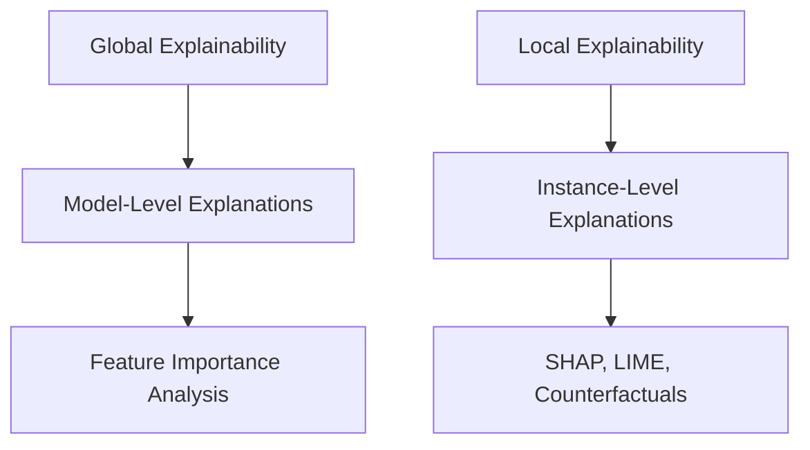
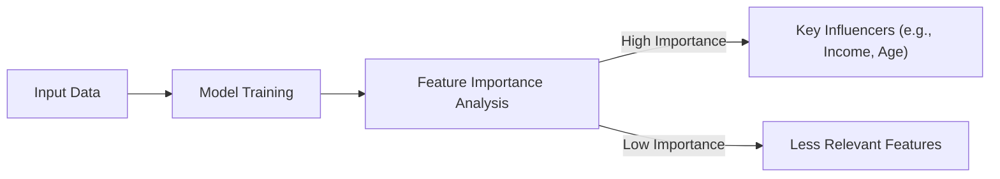
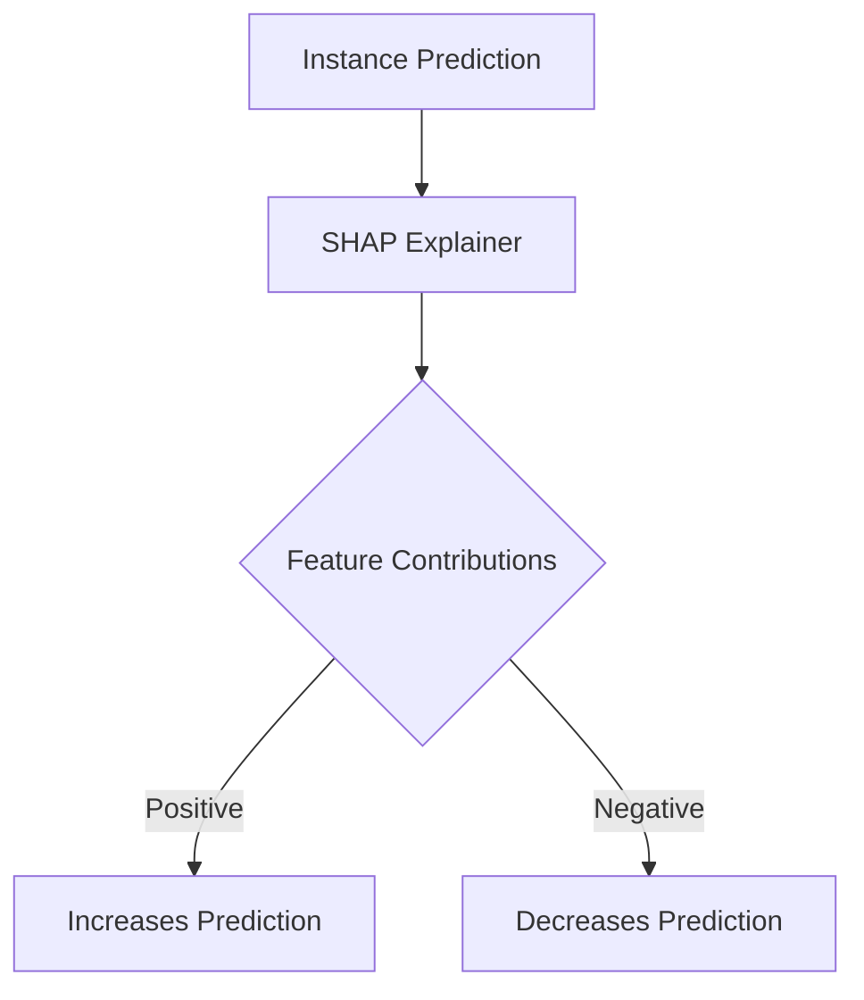
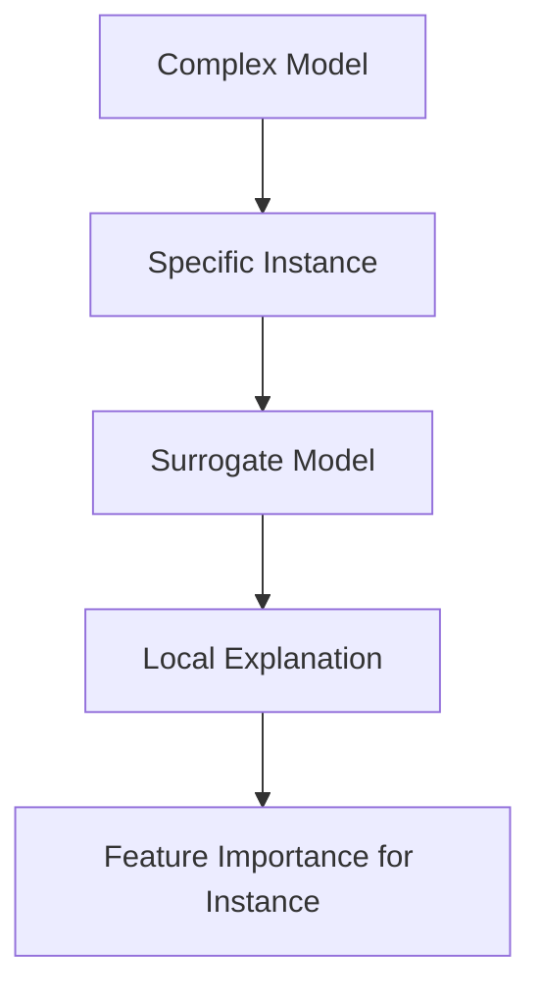
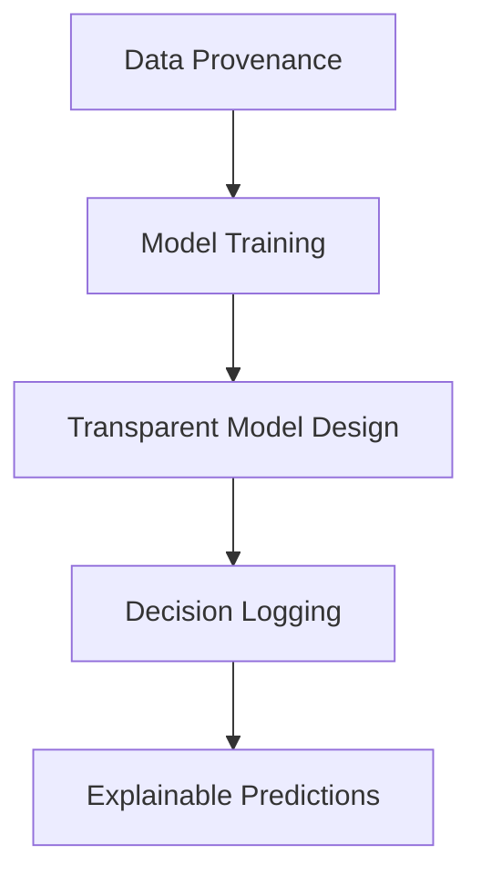
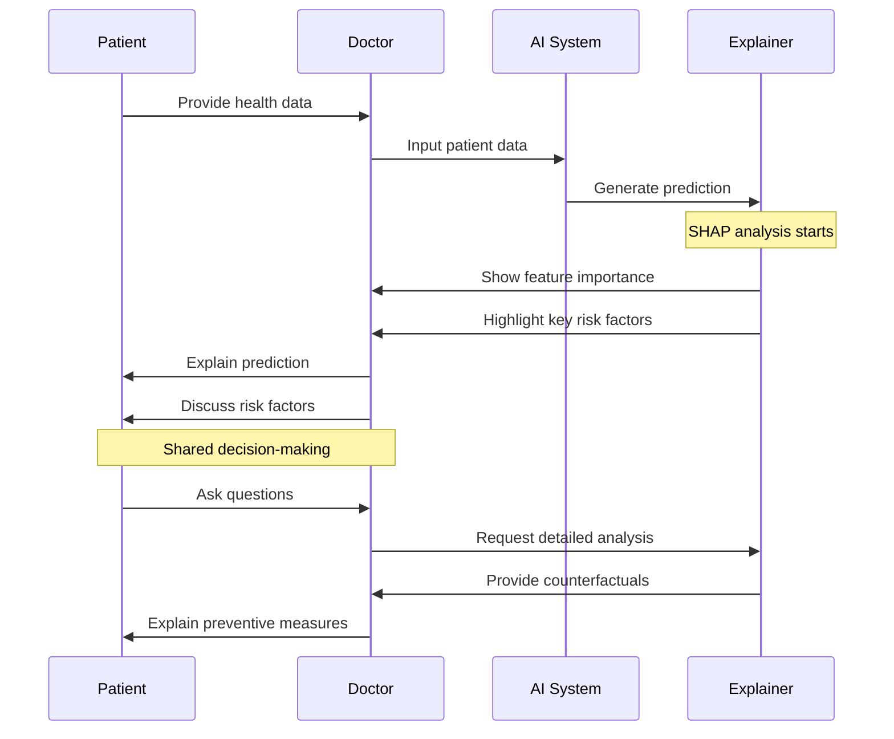

# Transparency and Explainability in AI

Transparency and explainability are foundational pillars of ethical AI design. They involve making AI systems understandable to users, stakeholders, and regulators, ensuring decisions made by AI are interpretable and accountable. Transparency builds trust, while explainability helps address concerns over fairness, reliability, and usability.

This page focuses on techniques, best practices, and tools for achieving transparency and explainability in AI systems.

---

## Importance of Transparency and Explainability

### Why They Matter

1. **Trust and Adoption**: Users are more likely to trust and adopt AI systems they can understand.
2. **Accountability**: Clear explanations allow organizations to justify decisions to regulators, stakeholders, and users.
3. **Bias Detection**: Interpretability helps identify and mitigate potential biases in AI models.
4. **Regulatory Compliance**: Compliance with laws like GDPR (right to explanation) often requires explainable AI.

### Key Dimensions of Explainability

| Dimension            | Description                                   | Example Use Case              |
|----------------------|-----------------------------------------------|-------------------------------|
| **Global Explainability** | Understanding the overall logic of the model.| Understanding a loan approval model's decision-making process. |
| **Local Explainability**  | Explaining specific predictions or outcomes.| Explaining why a particular applicant was denied a loan. |

---

## Techniques for Transparency and Explainability

### Feature Importance Analysis

Feature importance techniques assess the impact of input features on model predictions. This helps identify which factors are most influential in the decision-making process.

### SHAP (Shapley Additive Explanations)

SHAP assigns contribution values to each feature for a specific prediction, based on cooperative game theory. It provides local explainability by showing the influence of each feature on an individual prediction.

#### SHAP Workflow

---

### LIME (Local Interpretable Model-agnostic Explanations)

LIME explains individual predictions by approximating the model with a simple, interpretable surrogate model in the vicinity of the instance being analyzed.

#### LIME Explanation Flow

---

### Counterfactual Explanations

Counterfactuals explain decisions by showing how input changes could alter the outcome. For example: *"If the applicant's income was $5,000 higher, their loan would be approved."*

| Feature             | Original Value | Counterfactual Value | Impact on Outcome        |
|---------------------|----------------|-----------------------|---------------------------|
| **Income**          | $45,000        | $50,000               | Loan approved            |
| **Credit Score**    | 650            | 700                   | Loan approved            |

---

## Tools for Explainability

| Tool                  | Description                                   | Use Case                     |
|-----------------------|-----------------------------------------------|------------------------------|
| **SHAP**              | Provides feature importance at local/global levels.| Explainable AI for tabular data.|
| **LIME**              | Generates interpretable explanations for specific predictions.| Model-agnostic explanations. |
| **AIX360**            | IBM’s AI Explainability toolkit for multiple explainability methods.| Enterprise AI models.         |
| **What-If Tool**      | Interactive analysis of AI models, supports counterfactuals.| Visual exploration of model decisions.|

---

## Achieving Transparency in Practice

### Transparent Model Design

1. **Model Simplicity**: Prefer interpretable models like linear regression or decision trees when possible.
2. **Data Provenance**: Maintain transparency in how data is collected, processed, and used.
3. **Decision Logging**: Log decisions for auditability and future analysis.

---

### Real-World Example: Explainability in Healthcare

#### Scenario

An AI system predicts the risk of cardiovascular disease. The medical team requires explainability to understand predictions and ensure patient trust.

- **Technique Used**: SHAP for feature importance.
- **Outcome**: SHAP revealed that high blood pressure and smoking history were the most influential factors for high-risk predictions. This allowed doctors to provide targeted advice to patients.

#### Explainability Workflow in Healthcare

---

## Challenges and Solutions

| Challenge             | Solution                                    |
|-----------------------|---------------------------------------------|
| **Black-Box Models**  | Use surrogate models like LIME for interpretation.|
| **Scalability**       | Employ tools like SHAP that provide batch explanations.|
| **Regulatory Compliance** | Leverage explainability techniques to meet "right to explanation" requirements.|

---

## Best Practices Checklist

| Best Practice                 | Recommendation                                    |
|-------------------------------|---------------------------------------------------|
| **Start with Simple Models**  | Use interpretable models unless complexity is necessary.|
| **Document Decisions**        | Maintain logs of model decisions and justifications.|
| **Test Explainability Tools** | Regularly evaluate tools like SHAP or LIME for effectiveness.|
| **Involve Stakeholders**      | Ensure stakeholders understand and trust the explanations.|
| **Monitor Post-Deployment**   | Continuously evaluate the system for transparency and fairness.|

---

By implementing transparency and explainability techniques, AI practitioners can enhance trust, accountability, and usability, ensuring ethical and effective AI systems.