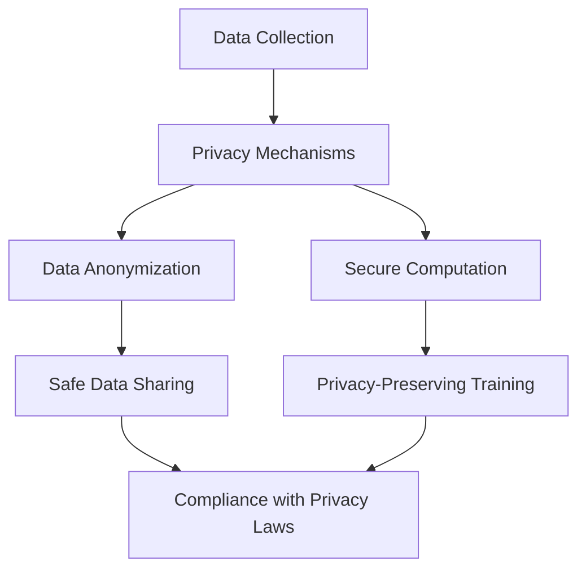
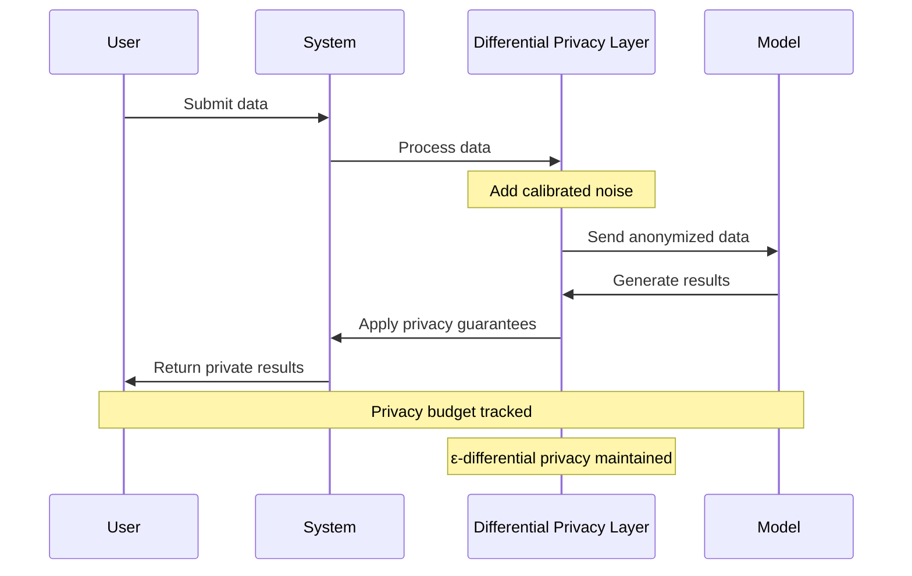
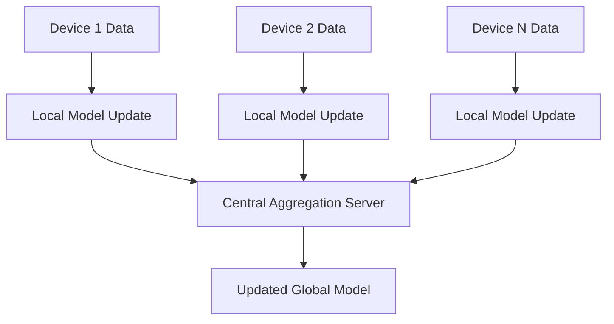
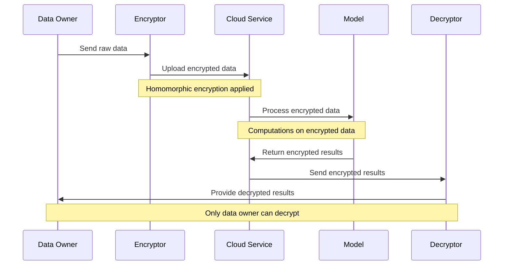
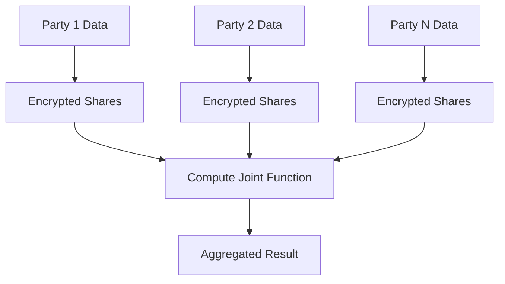
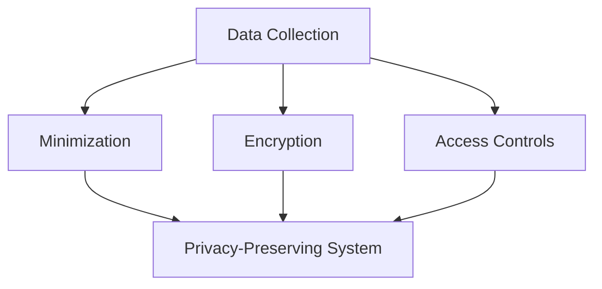
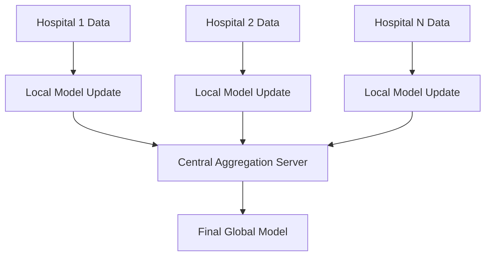

# Privacy-Preserving AI Techniques

The **Privacy-Preserving AI Techniques** section focuses on methodologies and tools that protect user privacy while enabling powerful AI capabilities. As AI systems process vast amounts of sensitive data, safeguarding privacy is essential for maintaining trust, complying with regulations, and minimizing risks of data misuse.

This page explores the core concepts, techniques, and best practices for implementing privacy-preserving AI systems.

---

## Importance of Privacy Preservation in AI

1. **User Trust**: Ensuring user data is protected builds confidence in AI solutions.
2. **Regulatory Compliance**: Aligning with laws like GDPR, CCPA, and HIPAA to avoid legal and financial penalties.
3. **Minimizing Risks**: Reducing the risk of data leaks, breaches, or misuse.
4. **Ethical Responsibility**: Upholding user privacy as a fundamental right.

### Key Dimensions of Privacy-Preserving AI

| Dimension                  | Description                                     | Example Use Case             |
|----------------------------|-------------------------------------------------|------------------------------|
| **Data Anonymization**     | Removing or obfuscating personally identifiable information (PII).| Sharing datasets for research.|
| **Secure Computation**     | Enabling computation on encrypted data.         | Federated learning in healthcare.|
| **Privacy by Design**      | Embedding privacy principles into the system architecture.| AI-driven financial systems.  |

---

## Privacy-Preserving Techniques

### Differential Privacy

Differential privacy ensures that the inclusion or exclusion of any individual’s data does not significantly impact the output of an algorithm, providing plausible deniability for participants.

| Advantage                 | Limitation                  |
|---------------------------|-----------------------------|
| Protects individual data privacy.| Trade-off with data utility. |
| Compliance with privacy laws.   | May reduce model accuracy.     |

---

### Federated Learning

Federated learning trains AI models across multiple decentralized devices or servers without transferring raw data to a central server. Instead, only model updates are shared.

| Use Case                    | Description                                   |
|-----------------------------|-----------------------------------------------|
| **Healthcare**              | Training models on patient data across hospitals without sharing raw data.|
| **Edge Devices**            | Training models on devices like smartphones while keeping data local.|

---

### Homomorphic Encryption

Homomorphic encryption allows computations to be performed directly on encrypted data without decrypting it. The results of the computation remain encrypted and can only be decrypted by the data owner.

#### Applications

1. **Secure Data Sharing**: Enables collaborative data analysis without exposing raw data.
2. **Privacy in Cloud AI**: Allows computations on encrypted cloud-hosted data.

---

### Secure Multi-Party Computation (SMPC)

SMPC enables multiple parties to jointly compute a function over their inputs while keeping those inputs private.

| Feature                  | Benefit                                       |
|--------------------------|-----------------------------------------------|
| Decentralized Privacy    | Inputs remain private across all participants.|
| Collaborative Computation| Facilitates secure AI model training.         |

---

## Privacy by Design Principles

Embedding privacy into the design and architecture of AI systems ensures compliance and user trust from the ground up.

### Principles

1. **Minimize Data Collection**: Collect only the data necessary for the AI system’s functionality.
2. **Data Encryption**: Secure sensitive data at rest and in transit using encryption standards like AES-256.
3. **Access Controls**: Implement strict role-based access controls (RBAC) for sensitive data.

---

## Challenges in Privacy Preservation

| Challenge                    | Solution                                      |
|------------------------------|-----------------------------------------------|
| **Trade-offs Between Privacy and Utility** | Use techniques like differential privacy with optimized noise levels.|
| **Scalability Issues**        | Employ scalable frameworks like TensorFlow Federated or PySyft.|
| **Compliance Complexity**     | Integrate compliance checks into development workflows.|

---

## Real-World Example: Privacy-Preserving Healthcare AI

#### Scenario

A healthcare organization wants to develop a model for predicting disease outcomes using patient data from multiple hospitals while ensuring privacy.

### Approach

1. **Technique**: Federated learning with differential privacy.
2. **Implementation**: Each hospital trains the model locally and sends encrypted updates to a central server.
3. **Outcome**: The final global model achieves high accuracy without exposing patient data.

---

## Best Practices Checklist

| Best Practice                  | Recommendation                                  |
|--------------------------------|------------------------------------------------|
| **Minimize Data Collection**   | Collect only essential data to reduce privacy risks.|
| **Use Privacy-Preserving Techniques** | Employ methods like differential privacy and federated learning.|
| **Encrypt Data**               | Ensure data is encrypted at rest and in transit.|
| **Audit and Monitor**          | Regularly review data usage and privacy safeguards.|
| **Stay Compliant**             | Align with GDPR, CCPA, HIPAA, and other regulations.|

---

By adopting privacy-preserving techniques, you can build AI systems that protect user data while delivering powerful, innovative capabilities.