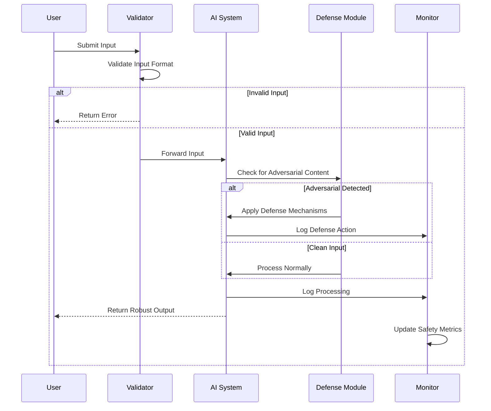
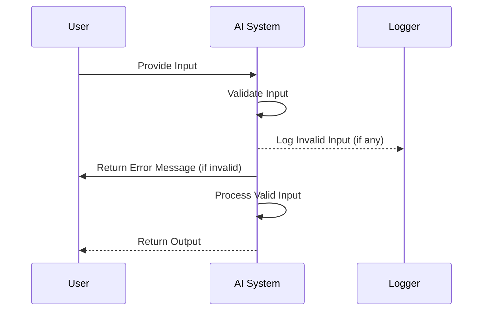
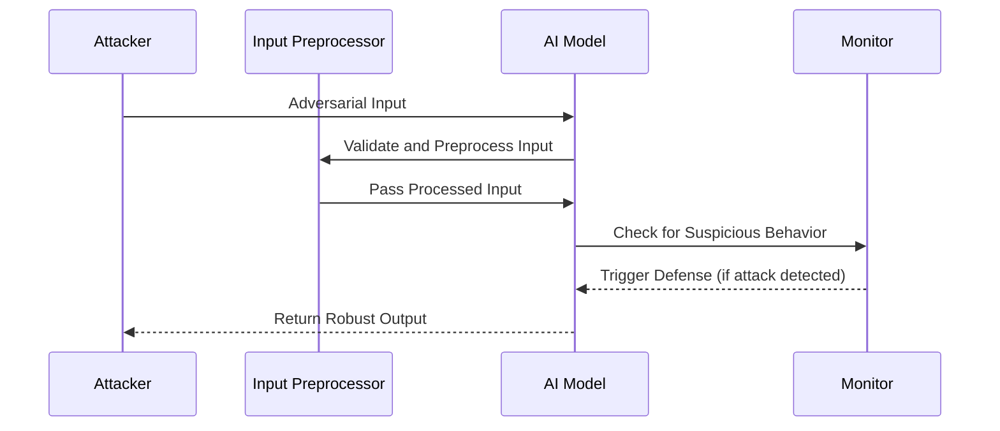
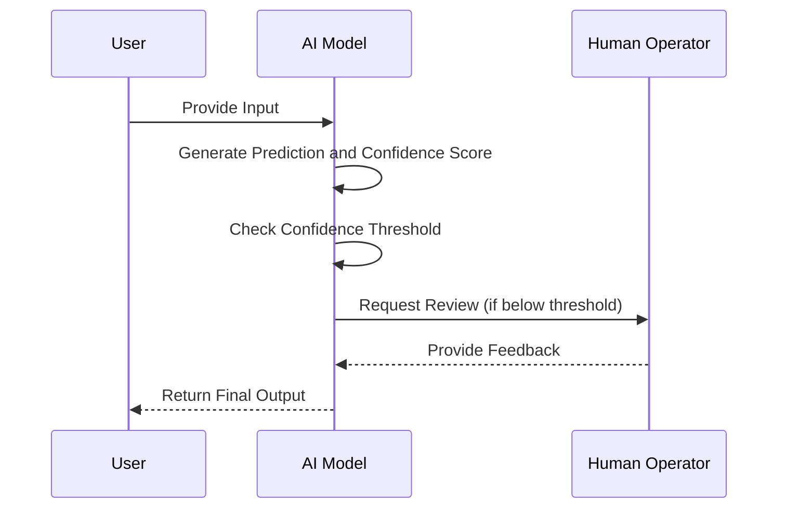
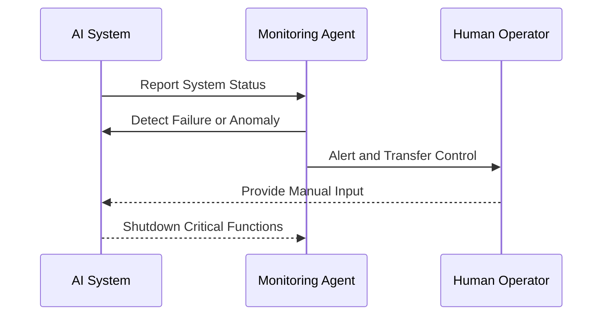
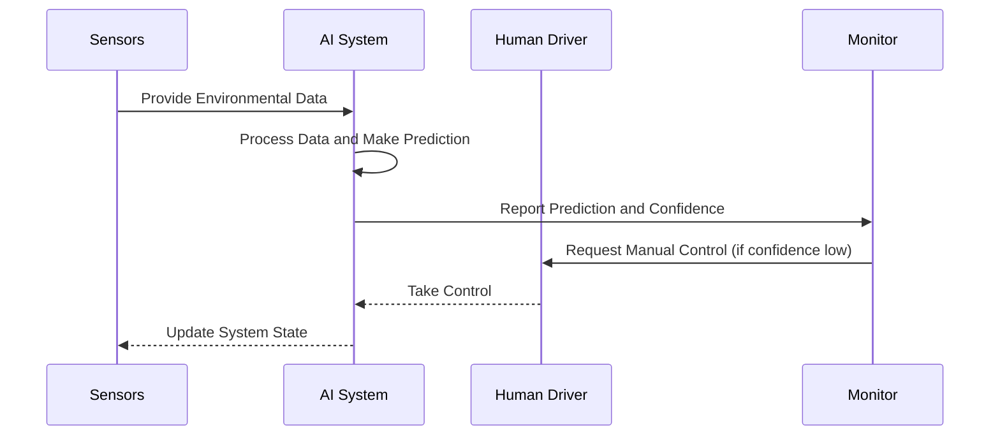

# AI Safety and Robustness

The **AI Safety and Robustness** page focuses on designing AI systems that are resilient, reliable, and safe in real-world applications. Safety involves ensuring AI systems do not cause unintended harm, while robustness ensures that systems can handle unexpected or adversarial inputs gracefully. Together, they form a critical part of building trustworthy AI solutions.

---

## Why AI Safety and Robustness Matter

1. **Minimizing Harm**: Preventing AI from making harmful decisions, especially in high-stakes domains like healthcare and autonomous systems.
2. **Building Trust**: Ensuring systems behave predictably even in uncertain conditions increases user confidence.
3. **Resilience to Attacks**: Robust systems resist adversarial manipulations and malicious inputs.
4. **Regulatory Compliance**: Aligning with standards and guidelines that mandate safe and reliable AI behavior.

---

## Key Dimensions of AI Safety and Robustness

| Dimension             | Description                                   | Example Use Case              |
|-----------------------|-----------------------------------------------|-------------------------------|
| **Error Handling**    | Systems handle unexpected inputs gracefully.  | Autonomous vehicles avoiding crashes. |
| **Adversarial Robustness** | Resilience to inputs crafted to deceive the AI. | Malware detection resisting adversarial files. |
| **Model Uncertainty** | Addressing uncertainty in predictions.        | Medical diagnosis systems providing confidence scores. |
| **Fail-Safe Mechanisms** | Ensuring safe system shutdowns or fallback modes. | AI systems reverting to manual control. |

#### AI Safety Workflow

This diagram shows the detailed flow of input processing through an AI system with safety mechanisms, including input validation, adversarial detection, and monitoring.

---

## Error Handling

Error handling ensures AI systems can manage unexpected or malformed inputs without failing catastrophically. This includes rejecting invalid inputs, logging errors, and providing fallback outputs.

#### Error Handling Workflow

---

## Adversarial Robustness

Adversarial robustness focuses on defending AI systems against inputs intentionally crafted to deceive the model. These adversarial attacks exploit vulnerabilities in the model's decision boundary.

#### Common Adversarial Defenses

1. **Adversarial Training**: Train the model with adversarial examples.
2. **Input Preprocessing**: Normalize or sanitize inputs to reduce attack efficacy.
3. **Model Regularization**: Use techniques like dropout or weight decay to improve generalization.

#### Adversarial Defense Workflow

---

## Addressing Model Uncertainty

Uncertainty in AI predictions arises when the system is unsure about its outputs. Handling this effectively involves:

- **Confidence Scores**: Providing a score alongside predictions to indicate certainty.
- **Uncertainty Estimation**: Using techniques like Bayesian neural networks to quantify uncertainty.
- **Fallback Mechanisms**: In uncertain cases, deferring decisions to human operators.

#### Handling Model Uncertainty

---

## Fail-Safe Mechanisms

Fail-safe mechanisms ensure that AI systems revert to safe states in the event of failures, anomalies, or attacks. This can include:

- **Fallback to Manual Control**: Handing control to human operators in critical systems.
- **Graceful Degradation**: Operating with reduced functionality instead of complete failure.
- **System Shutdown**: Halting operations entirely to prevent harm.

#### Fail-Safe Activation

---

## Best Practices for AI Safety and Robustness

| Best Practice              | Recommendation                                |
|----------------------------|-----------------------------------------------|
| **Rigorous Testing**       | Simulate various edge cases and attack scenarios.|
| **Defensive Design**       | Incorporate mechanisms like input validation and adversarial defenses.|
| **Human-in-the-Loop**      | Enable humans to oversee and override AI decisions when necessary.|
| **Continuous Monitoring**  | Track performance and anomalies in real-time.|
| **Regular Updates**        | Update models and defenses to address new vulnerabilities.|

---

## Real-World Example: Autonomous Vehicles

#### Scenario

An autonomous vehicle must safely navigate urban environments. Key challenges include avoiding accidents caused by:

- **Unexpected Inputs**: Unusual objects like large potholes or debris.
- **Adversarial Attacks**: Malicious alterations to stop signs designed to confuse AI.

### Approach

1. **Error Handling**: Preprocessing inputs to detect and handle anomalies.
2. **Adversarial Robustness**: Training the model to recognize adversarial stop sign alterations.
3. **Fail-Safe Mechanisms**: Activating manual controls in high-risk scenarios.

#### Safety Workflow for Autonomous Vehicles

---

## Challenges and Solutions

| Challenge                 | Solution                                    |
|---------------------------|---------------------------------------------|
| **Handling Unknown Inputs** | Use anomaly detection to flag unexpected inputs.|
| **Defending Against New Attacks** | Continuously update adversarial defenses.   |
| **Uncertainty in Decisions** | Provide confidence scores and fallback options.|

---

By prioritizing safety and robustness, you can design AI systems that are reliable, resilient, and trustworthy, ensuring their responsible use in real-world applications.