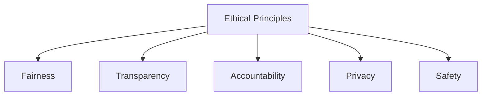
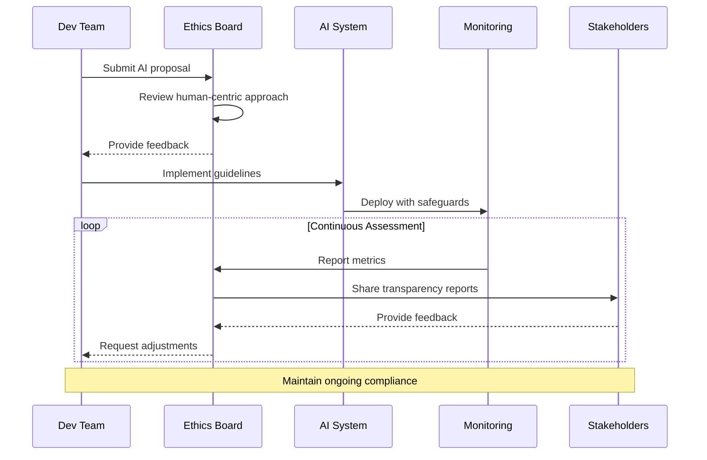
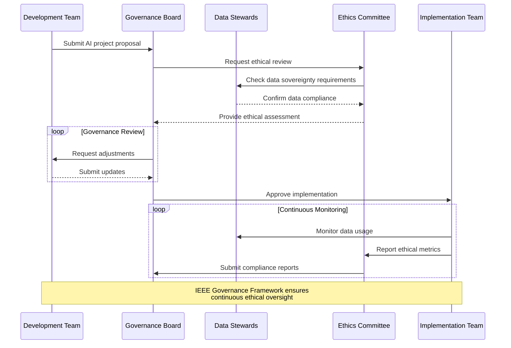
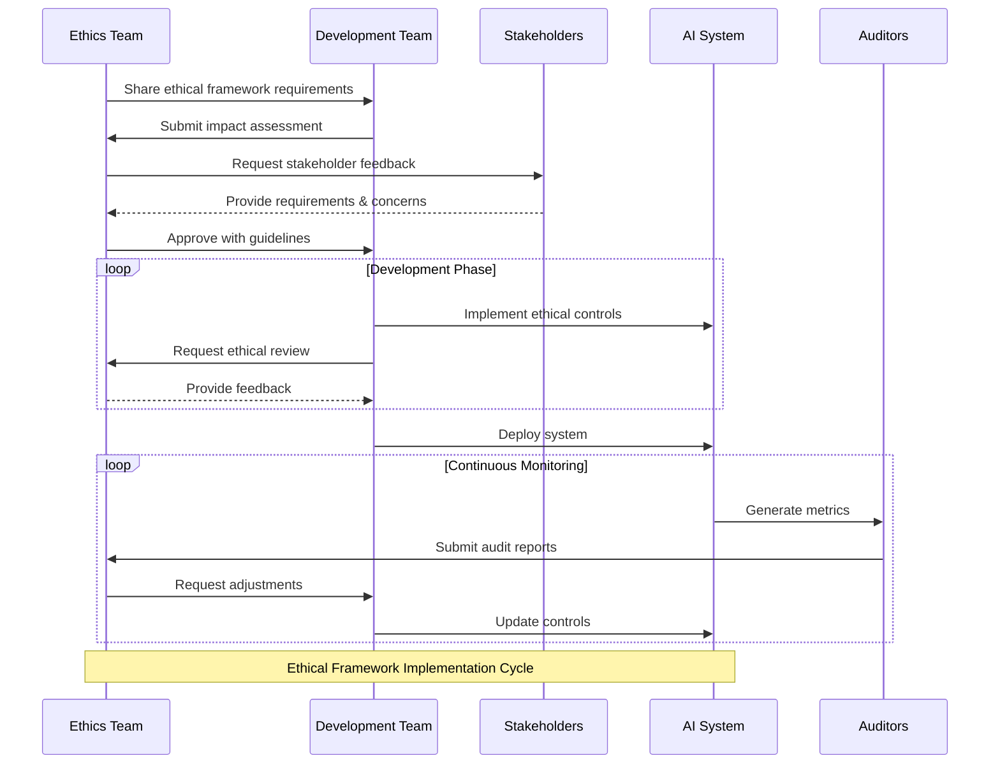

# Ethical Guidelines and Frameworks for AI

The **Ethical Guidelines and Frameworks for AI** section focuses on established principles, industry standards, and frameworks that guide the ethical development, deployment, and use of AI systems. Adhering to ethical guidelines ensures AI systems are aligned with societal values, comply with legal requirements, and build trust among users and stakeholders.

---

## Importance of Ethical Guidelines and Frameworks

1. **Promoting Responsibility**: Ensures AI systems respect human rights and minimize harm.  
2. **Building Trust**: Fosters user confidence through transparency and fairness.  
3. **Regulatory Compliance**: Aligns AI development with laws and industry standards.  
4. **Scalability and Longevity**: Encourages practices that support sustainable and scalable AI systems.  

---

## Key Ethical Principles in AI

| Principle                | Description                                   | Example Practice              |
|--------------------------|-----------------------------------------------|--------------------------------|
| **Fairness**             | Ensure equitable outcomes across all groups. | Regularly audit for bias.     |
| **Transparency**         | Make AI decisions interpretable and understandable.| Use explainable AI techniques.|
| **Accountability**       | Define clear ownership of AI decisions.       | Log decision-making processes.|
| **Privacy**              | Protect user data and ensure consent.         | Implement privacy-preserving AI techniques.|
| **Safety**               | Design systems to minimize risks and harm.    | Use robust testing protocols. |

---

## Established Frameworks for Ethical AI

### **EU Guidelines for Trustworthy AI**

The European Union has defined principles for "Trustworthy AI" that align with their legal and ethical values.

| Pillar                     | Description                                   |
|----------------------------|-----------------------------------------------|
| **Human-Centric Approach** | AI should prioritize human well-being and autonomy.|
| **Technical Robustness**   | AI must be secure, reliable, and resilient.   |
| **Accountability**         | AI processes should be transparent and auditable.|

#### Workflow: EU Guidelines Application

---

### **IEEE Global Initiative on AI Ethics**

The IEEE framework focuses on embedding ethical considerations into AI systems from the ground up. Key focus areas include:

- **Governance**: Establishing clear rules for AI development.
- **Data Sovereignty**: Ensuring individuals maintain control over their data.
- **Ethical Design Practices**: Encouraging inclusive and diverse team contributions.

#### IEEE Governance Flow

---

### **Responsible AI by Tech Giants**

Many technology companies have released their own AI ethics frameworks. Common themes include:

- **Microsoft’s Responsible AI**: Emphasizes fairness, inclusivity, and transparency.
- **Google’s AI Principles**: Focuses on socially beneficial AI and avoiding harm.
- **IBM’s AI Ethics**: Prioritizes accountability and explainability.

| Company          | Key Focus Areas                         | Example Initiatives           |
|------------------|-----------------------------------------|--------------------------------|
| **Microsoft**    | Inclusivity, Fairness, Transparency     | AI Fairness Toolkit           |
| **Google**       | Social Benefits, Safety, Privacy        | Explainable AI (XAI) Research |
| **IBM**          | Accountability, Explainability          | AI FactSheets                 |

---

## Applying Ethical Frameworks

### Steps to Implement Ethical AI Frameworks

1. **Adopt Relevant Guidelines**: Choose frameworks that align with your organization’s goals and regulatory environment.  
2. **Conduct Ethical Impact Assessments**: Regularly evaluate the ethical implications of AI systems.  
3. **Monitor and Audit**: Continuously assess AI systems for fairness, safety, and compliance.  
4. **Engage Stakeholders**: Include diverse perspectives in the development process.  

#### Ethical AI Implementation

---

## Real-World Example: Ethical AI in Financial Services

#### Scenario

A financial services company develops an AI model for loan approval. Ethical concerns include fairness, transparency, and accountability.

### Approach

1. **Framework Adopted**: The company follows the EU Trustworthy AI guidelines.  
2. **Implementation**:
   
      - Ensures fairness by auditing for demographic parity.
      - Increases transparency using SHAP for explainable predictions.
      - Assigns accountability by logging all decisions for auditability.  
  
3. **Outcome**: A compliant and trusted AI system that improves user satisfaction and reduces bias.

---

## Challenges and Solutions

| Challenge                 | Solution                                    |
|---------------------------|---------------------------------------------|
| **Lack of Standardization**| Choose widely adopted frameworks like EU AI guidelines.|
| **Complexity of Compliance** | Use automated tools to monitor compliance metrics.|
| **Stakeholder Misalignment** | Involve diverse stakeholders in decision-making. |

---

## Best Practices Checklist

| Best Practice              | Recommendation                              |
|----------------------------|---------------------------------------------|
| **Start Early**            | Integrate ethical considerations from the project’s inception.|
| **Choose the Right Framework** | Align frameworks with organizational goals and legal requirements.|
| **Audit Regularly**        | Conduct periodic audits to ensure ongoing compliance.|
| **Document Decisions**     | Maintain records of ethical assessments and decisions.|
| **Engage Experts**         | Include ethicists and domain experts in the development process.|

---

By adopting ethical guidelines and frameworks, organizations can build AI systems that are not only effective but also trustworthy, responsible, and aligned with societal values.