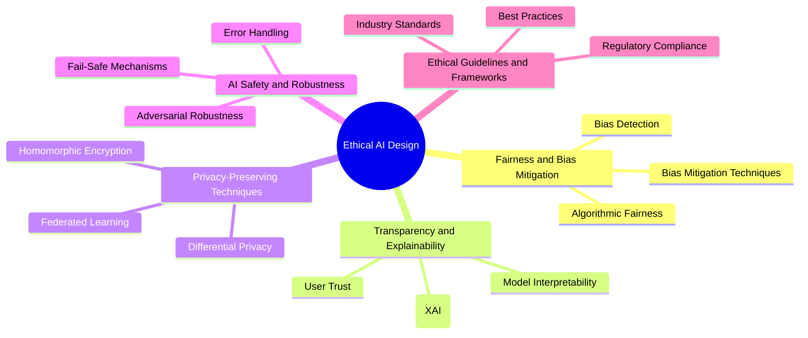

# Ethical AI Design

Welcome to the **Ethical AI Design** section of the AI Architect Handbook. This section delves into the principles and practices of designing AI systems that are fair, transparent, safe, and aligned with societal values. As AI becomes more prevalent in critical applications, ethical considerations are paramount to prevent unintended consequences, biases, and harm. By incorporating ethical principles into the design process, organizations can build AI systems that are trustworthy, equitable, and respectful of user privacy.

## Overview

Ethical AI Design focuses on creating AI systems that are aligned with human values and societal norms. It involves addressing issues related to bias, transparency, privacy, safety, and ethical compliance. Ethical considerations must be integrated throughout the AI model lifecycle — from data collection and model training to deployment and monitoring.

### Core Principles of Ethical AI Design

1. **Fairness and Bias Mitigation**: Ensuring AI systems do not perpetuate or exacerbate existing biases and are fair across different demographic groups.
2. **Transparency and Explainability**: Providing insights into how AI systems make decisions, making them understandable and interpretable to users and stakeholders.
3. **Privacy-Preserving Techniques**: Protecting user data and ensuring compliance with privacy regulations like GDPR and CCPA.
4. **Safety and Robustness**: Building resilient AI systems that can handle unexpected inputs and adversarial attacks.
5. **Ethical Guidelines and Frameworks**: Adopting industry-standard guidelines and frameworks to guide the ethical development and deployment of AI systems.

## Why Ethical AI Design Matters

Ethical AI Design is essential for building trust in AI systems. AI models often influence critical decisions in areas like healthcare, finance, and criminal justice. Unchecked, they can inadvertently amplify biases, violate user privacy, or make unsafe predictions. By adhering to ethical principles, organizations can:

- **Build Trust**: Users are more likely to trust AI systems that are transparent, fair, and respectful of their privacy.
- **Ensure Compliance**: Meet legal requirements and industry regulations, reducing the risk of legal challenges.
- **Promote Inclusivity**: Create AI systems that work well for all users, regardless of their background.
- **Enhance Safety**: Develop robust systems that can handle diverse scenarios and mitigate the risk of harm.

## Subsections

Explore each critical aspect of Ethical AI Design in the following subsections:

1. [Fairness and Bias in AI](01-Fairness-and-Bias-in-AI.md): Learn about common sources of bias in AI systems and strategies for detecting and mitigating bias to ensure fair outcomes.
2. [Transparency and Explainability](02-Transparency-and-Explainability.md): Discover techniques for making AI systems more interpretable and understandable to users and stakeholders.
3. [Privacy-Preserving AI Techniques](03-Privacy-Preserving-AI-Techniques.md): Explore advanced methods like differential privacy and federated learning that protect user data while enabling powerful AI capabilities.
4. [AI Safety and Robustness](04-AI-Safety-and-Robustness.md): Understand how to design AI systems that are resilient to adversarial attacks and can handle unexpected inputs safely.
5. [Ethical Guidelines and Frameworks](05-Ethical-Guidelines-and-Frameworks.md): Review established guidelines and frameworks for ethical AI development, including industry standards and regulatory requirements.

## How to Use This Section

This section provides a comprehensive guide to designing ethical AI systems. Each subsection addresses a specific aspect of ethical AI, offering best practices, real-world examples, and actionable insights. By following the guidance in this section, you can:

- **Identify Bias**: Recognize and mitigate sources of bias in your AI models.
- **Enhance Explainability**: Make your AI systems more transparent and interpretable, increasing user trust.
- **Protect Privacy**: Implement privacy-preserving techniques to safeguard user data.
- **Ensure Safety**: Build robust AI systems that handle errors gracefully and resist adversarial attacks.
- **Follow Ethical Standards**: Adhere to industry guidelines and regulatory frameworks for responsible AI.

## Real-World Example

### Case Study: Fairness in Credit Scoring

A financial services company used an AI model for credit scoring. Initially, the model exhibited biases against certain demographic groups due to historical data imbalances. To address this, the team implemented the following measures:

- **Bias Detection**: Conducted fairness audits using tools like AI Fairness 360 to identify disparate impacts.
- **Bias Mitigation**: Applied reweighting techniques and adjusted the training data to reduce biases.
- **Transparency**: Used SHAP (Shapley Additive Explanations) to provide interpretable model outputs, helping customers understand the decisions.

These efforts led to a fairer credit scoring model that improved user trust and met regulatory compliance standards.

## Stay Updated

The field of Ethical AI Design is rapidly evolving, with new research, tools, and guidelines emerging regularly. This handbook is updated frequently to reflect the latest best practices and advancements in the industry. Revisit this section often to stay informed about new trends and updates.
