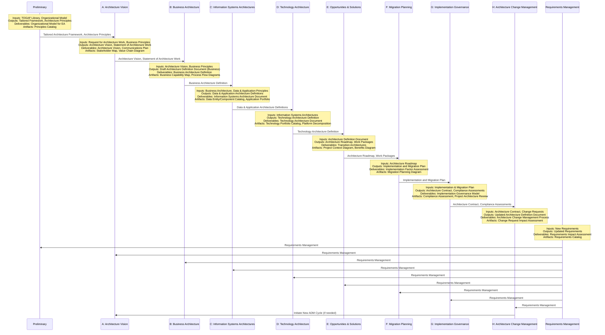
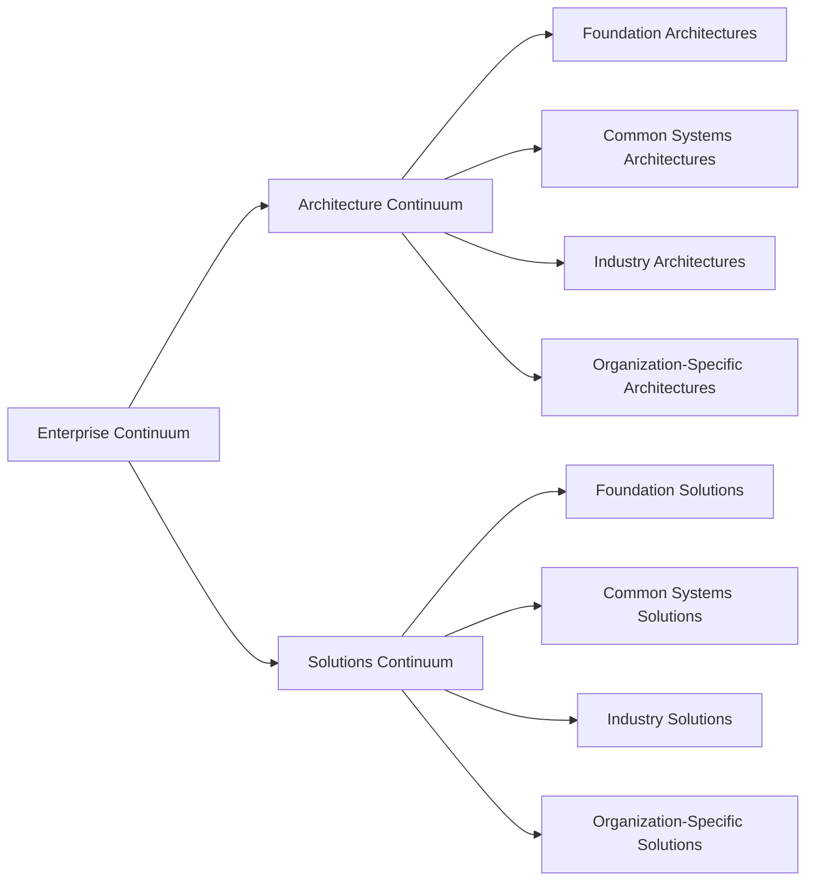

# The Open Group Architecture Framework

## Introduction to TOGAF

### Definition
TOGAF (The Open Group Architecture Framework) is a comprehensive framework for enterprise architecture that provides a methodical approach to designing, planning, implementing, and governing enterprise information technology architecture.

### Reasoning
The need for TOGAF arises from the increasing complexity of IT systems and their integration with business processes. TOGAF provides a standardized approach to architecture development, ensuring consistency, alignment with business goals, and effective management of IT resources.

### Key Facts
- Developed by The Open Group
- Current version: TOGAF 10
- Used by over 80% of Global 50 companies

### Core Concepts

#### Enterprise Architecture
**Definition**: A coherent whole of principles, methods, and models used in the design and realization of an enterprise's organizational structure, business processes, information systems, and infrastructure.

**Reasoning**: Enterprise Architecture provides a holistic view of the organization, enabling better alignment between business strategy and IT implementation. It helps in managing complexity, reducing redundancy, and improving overall efficiency.

#### Architecture Development Method (ADM)
**Definition**: The core of TOGAF, providing a step-by-step approach to developing enterprise architecture.

**Reasoning**: The ADM offers a structured process for architecture development, ensuring that all aspects of an enterprise architecture are considered and addressed in a systematic manner. This methodical approach helps in managing the complexity of architecture development and ensures consistency across different projects.

#### Enterprise Continuum
**Definition**: A repository of architectural assets, including models, patterns, and descriptions.

**Reasoning**: The Enterprise Continuum provides a way to classify and store architectural assets, facilitating their reuse across different projects. This promotes consistency and efficiency in architecture development.

#### Architecture Content Framework
**Definition**: Defines the outputs of architecture activities.

**Reasoning**: The Architecture Content Framework ensures that the outputs of architecture work are consistent and comparable across different projects and organizations. This facilitates communication and understanding among stakeholders.

#### Architecture Capability Framework
**Definition**: Describes the organization, processes, skills, roles, and responsibilities required to establish and operate an enterprise architecture practice.

**Reasoning**: The Architecture Capability Framework helps organizations build and maintain the capability to do architecture effectively. It ensures that the right skills, structures, and processes are in place to support architecture work.

## TOGAF ADM Cycle

The Architecture Development Method (ADM) is the core of TOGAF. It provides a tested and repeatable process for developing architectures.

### Reasoning behind the ADM Cycle
The ADM cycle is designed to be iterative and adaptable. It recognizes that architecture development is not a linear process, but one that requires continuous refinement and adjustment. The cycle allows for:

1. Incremental development of architecture
2. Continuous validation against business requirements
3. Flexibility to adapt to changing business needs
4. Continuous improvement of the architecture practice itself

The central position of Requirements Management emphasizes the importance of aligning architecture work with business needs throughout the process.

### ADM Phases Overview

| Phase | Definition | Reasoning | Key Deliverables |
|-------|------------|-----------|-------------------|
| Preliminary | Preparation and initiation activities required to create an Architecture Capability | Ensures the organization is ready for architecture work and has the necessary capabilities | Tailored architecture framework, Architecture principles |
| A: Architecture Vision | Defines the scope, stakeholders, and high-level vision for the architecture work | Sets the direction for the architecture work and ensures alignment with business goals | Approved Statement of Architecture Work |
| B: Business Architecture | Describes the baseline and target business architectures and analyzes gaps | Ensures that the architecture supports the business strategy and operations | Baseline and target business architectures |
| C: Information Systems Architectures | Develops target architectures for data and application systems | Ensures that information systems support the business architecture | Baseline and target data and application architectures |
| D: Technology Architecture | Develops the target technology architecture that will form the basis of the implementation | Ensures that the technology infrastructure supports the data, application, and business architectures | Baseline and target technology architectures |
| E: Opportunities and Solutions | Identifies implementation projects and groups them into transition architectures | Bridges the gap between architecture and implementation planning | Initial Implementation and Migration Plan |
| F: Migration Planning | Prioritizes projects and develops the detailed Implementation and Migration Plan | Ensures a structured approach to implementing the target architecture | Finalized Architecture Roadmap |
| G: Implementation Governance | Provides architectural oversight for the implementation | Ensures that implementation projects conform to the target architecture | Architecture Contract, Implementation Governance Model |
| H: Architecture Change Management | Establishes procedures for managing changes to the new architecture | Ensures that the architecture remains relevant and continues to add value to the organization | Architecture Updates, Change Requirements |
| Requirements Management | Manages architecture requirements throughout the ADM | Ensures that the architecture work remains aligned with business needs | Architecture Requirements Specification |

This overview provides a foundation for understanding TOGAF and its key components. In the following sections, we'll dive deeper into each of these elements, providing more detailed definitions, reasoning, and practical applications.

## Detailed Guide to TOGAF ADM Phases

### Preliminary Phase

**Definition**: The phase where the organization prepares for doing successful architecture projects.

**Reasoning**: This phase is crucial because it sets the foundation for all subsequent architecture work. It ensures that the organization has the right capabilities, understands its business context, and has tailored TOGAF to its specific needs.

**Key Activities**:

1. Defining Architecture Principles
      - **Definition**: Establishing the guiding principles for architecture work
      - **Reasoning**: These principles provide a basis for decision-making throughout the architecture development process

2. Establishing Architecture Capability
      - **Definition**: Setting up the structures, processes, roles, responsibilities, and skills required for architecture work
      - **Reasoning**: Ensures that the organization has the necessary capabilities to carry out and sustain architecture work

3. Tailoring TOGAF and other frameworks
      - **Definition**: Adapting TOGAF to fit the organization's specific needs and integrating it with other relevant frameworks
      - **Reasoning**: Ensures that the architecture approach is suitable for the organization's specific context and requirements

**Outputs**:

- Organizational Model for Enterprise Architecture
- Tailored Architecture Framework
- Initial Architecture Repository

### Phase A: Architecture Vision

**Definition**: The phase where the scope, constraints, and expectations for an architecture project are defined.

**Reasoning**: This phase sets the direction for the architecture work, ensuring that it aligns with business goals and stakeholder needs. It creates a shared vision that guides all subsequent architecture work.

**Key Activities**:

1. Identifying stakeholders and their concerns
      - **Definition**: Determining who has an interest in the architecture and what their specific concerns are
      - **Reasoning**: Ensures that the architecture addresses the needs of all relevant parties

2. Defining the scope and constraints
      - **Definition**: Determining the breadth and depth of the architecture work and any limitations
      - **Reasoning**: Helps to focus the architecture effort and manage expectations

3. Creating the Architecture Vision
      - **Definition**: Developing a high-level view of the target architecture
      - **Reasoning**: Provides a shared vision that guides all subsequent architecture work

**Outputs**:

- Approved Statement of Architecture Work
- Refined statements of business principles, goals, and drivers
- Architecture Vision

### Phase B: Business Architecture

**Definition**: The phase where the baseline and target business architectures are developed and gaps between them are analyzed.

**Reasoning**: This phase ensures that the architecture supports the business strategy and operations. It provides a foundation for subsequent architecture work by defining the business needs that the architecture must address.

**Key Activities**:

1. Developing baseline and target business architectures
      - **Definition**: Describing the current and desired future state of the business
      - **Reasoning**: Provides a clear understanding of what needs to change in the business

2. Performing gap analysis
      - **Definition**: Identifying differences between the baseline and target architectures
      - **Reasoning**: Helps identify what needs to be done to move from the current state to the desired future state

3. Defining roadmap components
      - **Definition**: Identifying the major work packages required to move from the baseline to the target architecture
      - **Reasoning**: Provides a high-level plan for implementing the changes required by the target architecture

**Outputs**:

- Baseline Business Architecture
- Target Business Architecture
- Gap Analysis Results
- Business Architecture Roadmap

### Phase C: Information Systems Architectures

**Definition**: The phase where the baseline and target architectures for data and applications are developed.

**Reasoning**: This phase ensures that the information systems (both data and applications) support the business architecture. It addresses how data will be stored, accessed, and used, and how applications will support business processes.

**Key Activities**:

1. Developing baseline and target data architectures
      - **Definition**: Describing the current and future structure and management of an organization's data assets
      - **Reasoning**: Ensures that data is managed effectively to support business needs

2. Developing baseline and target application architectures
      - **Definition**: Describing the current and future landscape of applications and their interactions
      - **Reasoning**: Ensures that applications effectively support business processes and manage data

3. Performing gap analysis
      - **Definition**: Identifying differences between the baseline and target architectures
      - **Reasoning**: Helps identify what needs to be done to move from the current state to the desired future state

**Outputs**:

- Baseline Data Architecture
- Target Data Architecture
- Baseline Application Architecture
- Target Application Architecture
- Gap Analysis Results

### Phase D: Technology Architecture

**Definition**: The phase where the baseline and target technology architectures are developed.

**Reasoning**: This phase ensures that the technology infrastructure supports the data, application, and business architectures. It addresses the hardware, software, and network infrastructure needed to support the deployment of core business systems.

**Key Activities**:

1. Developing baseline and target technology architectures
      - **Definition**: Describing the current and future technology infrastructure
      - **Reasoning**: Ensures that the technology can support the data, application, and business architectures

2. Performing gap analysis
      - **Definition**: Identifying differences between the baseline and target architectures
      - **Reasoning**: Helps identify what needs to be done to move from the current state to the desired future state

3. Defining roadmap components
      - **Definition**: Identifying the major work packages required to move from the baseline to the target architecture
      - **Reasoning**: Provides a high-level plan for implementing the changes required by the target architecture

**Outputs**:

- Baseline Technology Architecture
- Target Technology Architecture
- Gap Analysis Results
- Technology Architecture Roadmap

### Phase E: Opportunities and Solutions

**Definition**: The phase where the initial complete version of the Architecture Roadmap is generated based on the gap analysis from previous phases.

**Reasoning**: This phase bridges the gap between architecture and implementation planning. It identifies major implementation projects and groups them into transition architectures that deliver continuous business value.

**Key Activities**:

1. Determining major work packages
      - **Definition**: Identifying significant pieces of work required to move from the baseline to the target architecture
      - **Reasoning**: Breaks down the architecture implementation into manageable chunks

2. Identifying transition architectures
      - **Definition**: Defining intermediate states of the architecture that deliver business value
      - **Reasoning**: Allows for incremental implementation of the architecture, providing business benefits at each stage

3. Defining the Implementation and Migration Strategy
      - **Definition**: Determining the overall approach to implementing and migrating to the target architecture
      - **Reasoning**: Ensures a coordinated approach to implementing the architecture across all architecture domains

**Outputs**:

- Consolidated Gap Analysis Results
- Initial Architecture Roadmap
- Implementation and Migration Strategy

### Phase F: Migration Planning

**Definition**: The phase where the Architecture Roadmap and the Implementation and Migration Plan are finalized.

**Reasoning**: This phase ensures that the implementation of the architecture is properly planned and resourced. It provides a detailed plan for moving from the baseline to the target architecture.

**Key Activities**:

1. Prioritizing projects
      - **Definition**: Determining the order in which projects should be implemented
      - **Reasoning**: Ensures that the most valuable or critical projects are implemented first

2. Estimating resource requirements, project timings, and availability/capability
      - **Definition**: Determining what resources are needed, when projects should occur, and whether the organization has the capability to carry them out
      - **Reasoning**: Ensures that the implementation plan is realistic and achievable

3. Finalizing the Architecture Roadmap and Implementation and Migration Plan
      - **Definition**: Creating the final versions of these key planning documents
      - **Reasoning**: Provides a detailed guide for implementing the architecture

**Outputs**:

- Finalized Architecture Roadmap
- Implementation and Migration Plan
- Architecture Implementation and Migration Plan

### Phase G: Implementation Governance

**Definition**: The phase where architectural oversight is provided for the implementation.

**Reasoning**: This phase ensures that implementation projects conform to the target architecture. It helps maintain the integrity of the architecture throughout the implementation process.

**Key Activities**:

1. Providing architectural oversight for implementation
      - **Definition**: Reviewing implementation projects to ensure they conform to the architecture
      - **Reasoning**: Maintains the integrity of the architecture during implementation

2. Performing architecture compliance reviews
      - **Definition**: Formal assessments of implementation projects against the architecture
      - **Reasoning**: Ensures that projects are implementing the architecture correctly

3. Implementing business and IT operations
      - **Definition**: Putting the new architecture into operation
      - **Reasoning**: Realizes the benefits of the new architecture

**Outputs**:

- Architecture Contract
- Compliance Assessments
- Change Requests

### Phase H: Architecture Change Management

**Definition**: The phase where ongoing support for the architecture is provided and changes to the architecture are managed.

**Reasoning**: This phase ensures that the architecture continues to be relevant and add value to the organization as business needs and technology evolve.

**Key Activities**:

1. Providing continual monitoring and change management process
      - **Definition**: Continuously assessing the relevance of the architecture and managing necessary changes
      - **Reasoning**: Keeps the architecture aligned with changing business needs and technological developments

2. Ensuring changes to the framework and principles are managed
      - **Definition**: Managing changes to the architecture framework and principles
      - **Reasoning**: Maintains the consistency and effectiveness of the architecture practice

3. Ensuring the Architecture Capability meets current requirements
      - **Definition**: Continuously improving the organization's ability to do architecture work
      - **Reasoning**: Ensures that the organization can continue to develop and use effective architectures

**Outputs**:

- Architecture Updates
- Changes to Architecture Framework and Principles
- New Request for Architecture Work

### Requirements Management

**Definition**: The process of managing architecture requirements throughout the ADM.

**Reasoning**: This is a central process that runs alongside all ADM phases. It ensures that the architecture work remains aligned with business needs and that new requirements are properly integrated into the architecture.

**Key Activities**:

1. Identifying and capturing requirements
      - **Definition**: Gathering and documenting architecture requirements
      - **Reasoning**: Ensures that all relevant requirements are considered in the architecture work

2. Managing changes to requirements
      - **Definition**: Tracking and managing changes to requirements over time
      - **Reasoning**: Ensures that the architecture remains aligned with changing business needs

3. Updating the Requirements Repository
      - **Definition**: Maintaining a central store of all architecture requirements
      - **Reasoning**: Provides a single source of truth for architecture requirements

**Outputs**:

- Architecture Requirements Specification
- Requirements Impact Assessment
- Updated Requirements Repository

This detailed guide to the TOGAF ADM provides a comprehensive understanding of each phase, its purpose, key activities, and outputs. It emphasizes the reasoning behind each element, helping architects to apply TOGAF effectively in their work.

## 📝 TOGAF ADM Phases Cheatsheet

This cheatsheet provides the comprehensive table covering all phases of the TOGAF Architecture Development Method (ADM), including the continuous Requirements Management process. This detailed breakdown provides a clear understanding of the purpose, activities, inputs, outputs, deliverables, and artifacts for each phase, helping to illustrate the comprehensive and structured approach that TOGAF takes to enterprise architecture development.

| Phase | Aspect | Item | Definition and Vision |
|-------|--------|------|------------------------|
| Preliminary | Description | | Prepares the organization for successful architecture projects by establishing the necessary capabilities |
| | Key Activities | Define architecture scope | Vision: To clearly delineate the boundaries of the architecture effort, ensuring focus and manageability. This helps in aligning the architecture work with business goals and prevents scope creep. |
| | | Establish architecture team | Vision: To assemble a skilled, cross-functional team that can effectively develop and implement the enterprise architecture. This ensures that all necessary expertise is available and promotes buy-in across the organization. |
| | | Identify and establish architecture principles | Vision: To create a set of guiding principles that will inform all architecture decisions. This ensures consistency in decision-making and alignment with organizational values and goals. |
| | | Tailor TOGAF and other frameworks | Vision: To adapt TOGAF and other relevant frameworks to fit the specific needs and context of the organization. This ensures that the architecture approach is relevant and effective for the organization's unique situation. |
| | | Implement architecture tools | Vision: To select and deploy appropriate tools that will support the architecture development process. This enhances efficiency, consistency, and collaboration in architecture work. |
| | Inputs | TOGAF documentation | The comprehensive set of TOGAF materials that provide guidance on enterprise architecture development. |
| | | Other architecture frameworks | Additional frameworks that may be relevant to the organization's needs, such as FEAF, DoDAF, or industry-specific frameworks. |
| | | Organizational strategies and business drivers | The high-level strategic goals and market forces that are shaping the organization's direction and needs. |
| | Outputs | Tailored architecture framework | A customized version of TOGAF (and potentially other frameworks) that fits the organization's specific needs and context. |
| | | Architecture principles | A set of fundamental architecture tenets that will guide all subsequent architecture work. |
| | | Initial Architecture Repository | The foundational structure for storing and managing all architecture artifacts and deliverables. |
| | Deliverables | Organizational Model for Enterprise Architecture | A document outlining how the enterprise architecture function will be structured and integrated into the organization. |
| | | Tailored Architecture Framework | A formal description of the customized architecture approach, including any adaptations made to TOGAF or other frameworks. |
| | | Initial Architecture Repository | The established repository structure, potentially with some initial content. |
| | Artifacts | Principles catalog | A structured list of all identified architecture principles, including their rationale and implications. |
| | | Architecture governance framework | A document describing how architecture decisions will be made, monitored, and enforced across the organization. |
| A: Architecture Vision | Description | | Sets the scope, constraints, and expectations for the architecture project, creating a high-level aspirational vision |
| | Key Activities | Identify stakeholders and concerns | Vision: To comprehensively map out all parties affected by or interested in the architecture project, and understand their needs and concerns. This ensures that the architecture addresses all relevant perspectives and requirements. |
| | | Create Architecture Vision | Vision: To develop a high-level, aspirational view of the target architecture that aligns with business goals. This provides a clear direction for the architecture work and helps in gaining stakeholder buy-in. |
| | | Obtain approvals | Vision: To secure formal agreement and support from key stakeholders on the Architecture Vision. This ensures alignment and commitment from leadership, which is crucial for the project's success. |
| | | Assess business capabilities | Vision: To evaluate the organization's current abilities in relation to the proposed architecture changes. This helps in identifying gaps and areas for improvement, informing subsequent architecture development. |
| | Inputs | Request for Architecture Work | A formal document outlining the scope and objectives for the architecture engagement, typically initiated by the sponsor. |
| | | Business principles, goals, and drivers | The fundamental tenets guiding the organization, its strategic objectives, and the forces shaping its direction. |
| | | Organizational Model for Enterprise Architecture | The established structure and approach for conducting enterprise architecture within the organization. |
| | Outputs | Approved Statement of Architecture Work | A formal document describing the architecture project's scope, approach, and expected outcomes, approved by key stakeholders. |
| | | Refined statements of business principles, goals, and drivers | Updated and clarified versions of these guiding elements, ensuring they align with the proposed architecture vision. |
| | | Draft Architecture Vision | An initial, high-level description of the target architecture and its benefits to the organization. |
| | Deliverables | Architecture Vision | A comprehensive document outlining the high-level view of the target architecture and its alignment with business goals. |
| | | Communications Plan | A strategy for effectively communicating about the architecture project to various stakeholders throughout its lifecycle. |
| | | Statement of Architecture Work | A formal agreement on the scope, approach, and outcomes of the architecture project. |
| | Artifacts | Stakeholder Map matrix | A visual representation of all stakeholders, their interests, and their level of influence on the project. |
| | | Value Chain diagram | A graphical depiction of how the organization's various activities create value, helping to identify areas for architectural focus. |
| | | Solution Concept diagram | A high-level illustration of the proposed architecture solution and its key components. |
| B: Business Architecture | Description | | Develops the Target Business Architecture that describes how the enterprise needs to operate to achieve its goals |
| | Key Activities | Develop Baseline Business Architecture | Vision: To create a clear picture of the current state of the business. This provides a starting point for identifying areas of improvement and ensures that the future state is grounded in reality. |
| | | Develop Target Business Architecture | Vision: To design the future state of the business that aligns with the Architecture Vision. This provides a clear direction for business transformation efforts. |
| | | Perform gap analysis | Vision: To identify the differences between the current and desired future state of the business. This helps in planning the necessary changes and transformations. |
| | | Define roadmap components | Vision: To outline the high-level steps needed to move from the current to the future state. This provides a strategic plan for business transformation. |
| | Inputs | Organizational model | The current structure and operational model of the enterprise. |
| | | Business principles, goals, and drivers | The fundamental tenets, objectives, and forces shaping the business direction. |
| | | Architecture Vision | The high-level aspirational view of the target architecture developed in Phase A. |
| | Outputs | Draft Architecture Definition Document (business focus) | A document describing the target business architecture, including key models and architectural decisions. |
| | | Draft Architecture Requirements Specification | A list of quantitative statements outlining what the business architecture must do. |
| | Deliverables | Business Architecture document | A comprehensive description of the baseline and target business architectures, including all relevant models and analyses. |
| | | Updated Architecture Vision | A refined version of the Architecture Vision, incorporating insights from the business architecture work. |
| | Artifacts | Business Capability map | A visual representation of what the business does (not how). This helps in understanding and analyzing the fundamental abilities of the enterprise. |
| | | Business Interaction matrix | A matrix showing the interactions between business units and/or business functions. This helps in understanding dependencies and information flows. |
| | | Actor/Role matrix | A matrix depicting the mapping between actors (people or systems) and the roles they play in business processes. This clarifies responsibilities and organizational structure. |
| C: Information Systems Architectures | Description | | Develops the Target Data and Application Architectures that support the Business Architecture and Architecture Vision |
| | Key Activities | Develop Baseline Data Architecture | Vision: To create a clear picture of the current state of the organization's data assets. This provides a foundation for understanding data-related challenges and opportunities. |
| | | Develop Target Data Architecture | Vision: To design the future state of the organization's data landscape that supports business goals. This ensures that data is managed as a valuable asset and aligned with business needs. |
| | | Develop Baseline Application Architecture | Vision: To document the current state of applications in the organization. This provides insight into the existing application portfolio and its alignment with business needs. |
| | | Develop Target Application Architecture | Vision: To design the future state of applications that support the target business architecture. This ensures that the application landscape is optimized to support business goals. |
| | | Perform gap analysis | Vision: To identify differences between current and future states in both data and application domains. This helps in planning necessary changes and improvements. |
| | | Define roadmap components | Vision: To outline the steps needed to transition from current to future states. This provides a strategic plan for evolving the information systems landscape. |
| | Inputs | Business Architecture | The baseline and target business architectures developed in Phase B. |
| | | Baseline Data and Application Architectures | Existing documentation of current data and application landscapes. |
| | Outputs | Draft Architecture Definition Document (data and application focus) | A document describing the target data and application architectures, including key models and architectural decisions. |
| | | Updated Architecture Requirements Specification | A refined list of requirements incorporating data and application-specific needs. |
| | Deliverables | Data Architecture document | A comprehensive description of the baseline and target data architectures, including data models, management practices, and governance. |
| | | Application Architecture document | A detailed description of the baseline and target application architectures, including application portfolios, interfaces, and integration strategies. |
| | Artifacts | Data Entity/Data Component catalog | A listing of all data entities and components in the organization, helping to manage data as an asset. |
| | | Application/Function matrix | A matrix showing which business functions are supported by which applications, helping to identify redundancies or gaps. |
| | | Conceptual Data diagram | A high-level representation of data entities and their relationships, providing a business-oriented view of data. |
| D: Technology Architecture | Description | | Develops the Target Technology Architecture that enables the Business, Data, and Application components |
| | Key Activities | Develop Baseline Technology Architecture | Vision: To document the current state of technology infrastructure. This provides a clear understanding of existing capabilities and constraints. |
| | | Develop Target Technology Architecture | Vision: To design a future technology landscape that supports the business, data, and application architectures. This ensures that technology choices align with and enable business goals. |
| | | Perform gap analysis | Vision: To identify differences between current and future technology states. This helps in planning necessary upgrades, replacements, or new acquisitions. |
| | | Define roadmap components | Vision: To outline the steps needed to evolve the technology landscape. This provides a strategic plan for technology transformation. |
| | Inputs | Business, Data, and Application Architectures | The architectures developed in previous phases, which the technology architecture must support. |
| | Outputs | Draft Architecture Definition Document (technology focus) | A document describing the target technology architecture, including platforms, networks, and infrastructure choices. |
| | | Updated Architecture Requirements Specification | A refined list of requirements incorporating technology-specific needs. |
| | Deliverables | Technology Architecture document | A comprehensive description of the baseline and target technology architectures, including infrastructure, platforms, and networks. |
| | Artifacts | Technology Standards catalog | A list of agreed technology standards to be applied across the enterprise, promoting consistency and interoperability. |
| | | Technology Portfolio catalog | An inventory of technology products and components used in the enterprise, aiding in management and strategic planning. |
| | | Environments and Locations diagram | A depiction of technologies in use at different business locations, helping to manage distributed technology assets. |
| E: Opportunities & Solutions | Description | | Identifies and evaluates implementation projects, culminating in a Transition Architecture  |
| | Key Activities | Determine business constraints for implementation | Vision: To understand the business context and limitations that will affect the implementation. This ensures that the implementation plan is realistic and achievable. |
| | | Review and consolidate gap analysis results | Vision: To create a comprehensive view of all the changes needed across business, data, application, and technology domains. This provides a holistic understanding of the transformation required. |
| | | Formulate implementation and migration strategy | Vision: To develop an overarching approach for moving from the current to the target state. This provides a high-level roadmap for the entire transformation journey. |
| | Inputs | Business, Data, Application, and Technology Architectures | The target architectures developed in previous phases. |
| | | Architecture Requirements Specification | The compiled list of requirements from all architecture domains. |
| | Outputs | Consolidated gap analysis results | A comprehensive list of all gaps identified across all architecture domains. |
| | | Transition Architecture | A description of interim states the architecture will move through on its way to the target state. |
| | | Initial Implementation and Migration Plan | A high-level plan for how the transition from current to target architectures will be achieved. |
| | Deliverables | Architecture Roadmap | A strategic plan outlining the sequence of steps to move from the baseline to target architectures. |
| | | Implementation and Migration Plan | A detailed plan for implementing the target architecture and managing the transition. |
| | Artifacts | Project Context diagram | A visual representation showing how implementation projects fit into the broader business context. |
| | | Benefits diagram | A depiction of how implementation projects will deliver business value, helping to justify investments. |
| F: Migration Planning | Description | | Creates a detailed Implementation and Migration Plan that addresses how to move from the Baseline to the Target Architectures |
| | Key Activities | Prioritize migration projects | Vision: To determine the order in which projects should be undertaken. This ensures that the most critical or valuable projects are addressed first, maximizing benefits and minimizing risks. |
| | | Estimate resource requirements, project timings, and availability/delivery vehicle | Vision: To create a realistic and achievable plan. This ensures that the organization has a clear understanding of the resources, time, and methods needed for successful implementation. |
| | | Perform risk assessment | Vision: To identify and plan for potential obstacles. This helps in proactively addressing issues that could derail the implementation. |
| | Inputs | Architecture Roadmap | The strategic plan outlining the sequence of architecture changes. |
| | | Implementation and Migration Strategy | The high-level approach for moving to the target architecture. |
| | Outputs | Finalized Architecture Definition Document | A comprehensive document describing all aspects of the target architecture. |
| | | Finalized Architecture Requirements Specification | A complete list of requirements that the architecture must meet. |
| | | Finalized Architecture Roadmap | A detailed plan for moving from the current to the target architecture. |
| | Deliverables | Implementation and Migration Plan | A comprehensive plan detailing how the target architecture will be realized. |
| | | Finalized Architecture Roadmap | The final version of the strategic plan for architectural change. |
| | Artifacts | Migration Planning diagram | A visual representation of the steps involved in moving to the target architecture. |
| | | Project Charters | Formal documents initiating and authorizing specific implementation projects. |
| G: Implementation Governance | Description | | Provides architectural oversight for the implementation to ensure compliance with the target architecture |
| | Key Activities | Confirm scope and priorities for deployment | Vision: To ensure that implementation projects remain aligned with architectural goals. This helps maintain focus and prevent scope creep. |
| | | Identify deployment resources and skills | Vision: To ensure that the right people with the right skills are available. This is crucial for successful implementation. |
| | | Guide development of solutions deployment | Vision: To ensure that implementation adheres to architectural principles and standards. This maintains the integrity of the target architecture. |
| | | Perform Enterprise Architecture compliance reviews | Vision: To verify that projects are following the agreed architecture. This helps identify and correct any deviations early. |
| | Inputs | Implementation and Migration Plan | The detailed plan for realizing the target architecture. |
| | Outputs | Architecture Contract | A formal agreement between development partners and sponsors on the deliverables, quality, and fitness-for-purpose of an architecture. |
| | | Compliance Assessments | Reports indicating how well implementation projects adhere to the agreed architecture. |
| | Deliverables | Implementation Governance Model | A framework describing how implementation will be overseen and managed. |
| | | Architecture Compliance reviews | Formal evaluations of projects against architectural standards and principles. |
| | Artifacts | Compliance Assessment reports | Detailed reports on how well projects comply with the architecture. |
| | | Project Architecture Review reports | Assessments of individual projects' alignment with architectural goals. |
| H: Architecture Change Management | Description | | Establishes procedures for managing changes to the new architecture, ensuring controlled evolution |
| | Key Activities | Establish value realization process | Vision: To create a system for measuring and tracking the benefits of architectural changes. This ensures that the architecture continues to deliver value to the organization. |
| | | Deploy monitoring tools | Vision: To implement systems for tracking architectural compliance and performance. This allows for ongoing assessment of the architecture's effectiveness. |
| | | Manage risks | Vision: To continuously identify and mitigate potential threats to the architecture. This helps maintain the stability and relevance of the architecture over time. |
| | | Provide analysis for architecture change management | Vision: To assess the impact of proposed changes to the architecture. This ensures that changes are made thoughtfully and with full understanding of their implications. |
| | Inputs | Architecture Contract | The formal agreement on architecture deliverables and quality. |
| | | Compliance Assessments | Reports on how well implementation adheres to the architecture. |
| | | Change Requests | Formal proposals for alterations to the existing architecture. |
| | Outputs | Updated Architecture Definition Document | A revised version of the architecture description, incorporating approved changes. |
| | | Changes to Architecture Framework and Principles | Updates to the fundamental architecture approach based on lessons learned. |
| | | New Request for Architecture Work | If major changes are needed, this initiates a new cycle of architecture development. |
| | Deliverables | Architecture Change Management process | A defined procedure for handling changes to the architecture. |
| | | Updated Architecture Repository | The central store of architectural information, updated with changes and lessons learned. |
| | Artifacts | Change Request Impact Assessment | Analysis of how proposed changes would affect the existing architecture. |
| | | Architecture Update Recommendations | Suggested modifications to the architecture based on operational experience. |
| Requirements Management | Description | | Manages architecture requirements throughout the ADM, ensuring they're identified, stored, and fed into relevant phases |
| | Key Activities | Identify/document requirements | Vision: To capture all relevant needs and constraints that the architecture must address. This ensures a comprehensive understanding of what the architecture must achieve. |
| | | Baseline requirements | Vision: To establish a clear, agreed-upon set of requirements at the start of each phase. This provides a stable foundation for architecture work. |
| | | Monitor baseline requirements | Vision: To track how requirements are being met throughout the architecture development process. This ensures ongoing alignment with stakeholder needs. |
| | | Identify changed requirements and record priorities | Vision: To capture evolving needs and adjust the architecture accordingly. This ensures the architecture remains relevant in a changing environment. |
| | Inputs | New or changed requirements from any phase | Any needs or constraints identified during the architecture development process. |
| | Outputs | Updated requirements | A current, comprehensive list of all architecture requirements. |
| | | Impact analysis of changed requirements | Assessment of how requirement changes affect the existing or planned architecture. |
| | Deliverables | Requirements Impact Assessment | A formal evaluation of how requirement changes impact the architecture. |
| | Artifacts | Requirements catalog | A comprehensive list of all identified architecture requirements. |
| | | Requirements Traceability matrix | A tool for tracking how requirements are addressed across different aspects of the architecture. |

## Key TOGAF Concepts

### Enterprise Continuum

**Definition**: The Enterprise Continuum is a repository of architectural assets, including models, patterns, architecture descriptions, and other artifacts. It provides methods for classifying architecture and solution artifacts.

**Reasoning**: The Enterprise Continuum enables the effective reuse of architectural work, promoting consistency and efficiency in architecture development across the organization.

#### Architecture Continuum
**Definition**: A categorized repository of architectural building blocks and their relationships.

**Reasoning**: It provides a consistent way to define and understand the generic rules, representations, and relationships in an architecture.

#### Solutions Continuum
**Definition**: A categorized repository of implementations and the standards upon which they are based.

**Reasoning**: It helps in identifying and selecting appropriate solutions that align with the defined architectures.

### Architecture Content Framework

**Definition**: The Architecture Content Framework provides a structural model for architectural content that allows major work products to be consistently defined, structured, and presented.

**Reasoning**: It ensures consistency in the outputs of architecture work, facilitating communication and understanding among stakeholders.

Key components:

1. **Deliverables**: 
      - **Definition**: Contractually specified, formal work products
      - **Reasoning**: Ensures clear expectations and measurable outputs

2. **Artifacts**: 
      - **Definition**: More granular architecture work products
      - **Reasoning**: Provides detailed views of specific aspects of the architecture

3. **Building Blocks**: 
      - **Definition**: Potentially reusable components of business, IT, or architectural capability
      - **Reasoning**: Promotes reuse and consistency across architecture work

### Architecture Repository

**Definition**: The Architecture Repository is used to store different classes of architectural output at different levels of abstraction.

**Reasoning**: It provides a central store for all architecture-related information, facilitating reuse, governance, and change management.

Components:

1. **Architecture Metamodel**: Describes the organizationally tailored application of an architecture framework
2. **Architecture Capability**: Defines the parameters, structures, and processes that support governance of the Architecture Repository
3. **Architecture Landscape**: Provides a snapshot of the architectural state at particular points in time
4. **Standards Information Base**: Captures the standards with which new architectures must comply
5. **Reference Library**: Provides guidelines, templates, patterns, and other forms of reference material
6. **Governance Log**: Provides a record of governance activity across the enterprise

### Architecture Capability Framework

**Definition**: The Architecture Capability Framework provides a set of reference materials for how to establish and operate an architecture function within an enterprise.

**Reasoning**: It helps organizations build and maintain the capability to do architecture work effectively, ensuring that the right skills, structures, and processes are in place.

Key areas:

1. **Architecture Board**: Provides oversight and guidance for architecture work
2. **Architecture Compliance**: Ensures that implementation projects adhere to the established architecture
3. **Architecture Contracts**: Formal agreements that help enforce architecture compliance
4. **Architecture Governance**: Concerned with management and control of architecture throughout the enterprise
5. **Architecture Maturity Models**: Used to assess the current state of architecture capability
6. **Architecture Skills Framework**: Defines the skills required for effective architecture roles

Understanding these key concepts is crucial for effectively applying TOGAF in practice and for success in the TOGAF certification exams.

## TOGAF Techniques

TOGAF provides a set of techniques to support architecture development. Here are some key techniques with their definitions and reasoning:

###Architecture Principles

**Definition**: Architecture principles define the underlying general rules and guidelines for the use and deployment of all IT resources and assets across the enterprise.

**Reasoning**: Principles provide a basis for decision-making throughout the architecture development process, ensuring consistency and alignment with organizational goals.

Example principles:
- Business Continuity
- Common Use Applications
- Information Management is Everybody's Business
- Compliance with Law

###Stakeholder Management

**Definition**: Stakeholder management involves identifying and managing the stakeholders for an architecture project.

**Reasoning**: Effective stakeholder management ensures that the architecture meets the needs of all relevant parties and gains the necessary support for implementation.

Steps:

1. Identify stakeholders
2. Classify stakeholders
3. Determine stakeholder viewpoints
4. Manage stakeholder expectations

###Business Scenarios

**Definition**: Business scenarios are a technique to discover and document business requirements and derive the business and technical requirements for the architecture.

**Reasoning**: Business scenarios provide a way to understand and communicate business needs in a way that both business and technical stakeholders can understand.

Components of a business scenario:

- Business process
- Business actors
- Desired outcome
- Business and technical environment
- Architecture components

###Gap Analysis

**Definition**: Gap analysis is used to validate an architecture by comparing it with a known state or model.

**Reasoning**: Gap analysis helps identify what needs to change to move from the current state to the desired future state, informing the development of roadmaps and transition architectures.

Steps:

1. Identify areas to be analyzed
2. Identify baseline and target components
3. Compare baseline and target
4. Document gaps

###Business Transformation Readiness Assessment

**Definition**: This technique is used to evaluate and quantify an organization's readiness to undergo change.

**Reasoning**: It helps identify potential barriers to change and informs strategies for managing organizational change alongside architecture implementation.

Factors assessed:

- Vision
- Desire
- Need
- Business Case
- Funding
- Sponsorship and Leadership
- Governance
- Accountability
- Workable Approach and Execution Model
- IT Capacity to Execute
- Enterprise Capacity to Execute
- Enterprise Ability to Implement and Operate

###Risk Management

**Definition**: Risk management in TOGAF involves identifying, classifying, and mitigating risks associated with the architecture work.

**Reasoning**: Effective risk management helps prevent or mitigate potential issues that could derail architecture efforts or implementation projects.

Risk management steps:

1. Identify risks
2. Classify risks
3. Evaluate risks
4. Treat risks
5. Monitor risks

###Capability-Based Planning

**Definition**: Capability-based planning focuses on the planning, engineering, and delivery of strategic business capabilities to the enterprise.

**Reasoning**: This technique helps align architecture efforts with the organization's strategic goals by focusing on the capabilities the business needs to achieve those goals.

Steps:

1. Identify business goals and strategic objectives
2. Identify required capabilities to achieve the objectives
3. Assess existing capabilities
4. Identify gaps
5. Plan capability improvements

Understanding and applying these techniques is crucial for effective architecture development using TOGAF.

