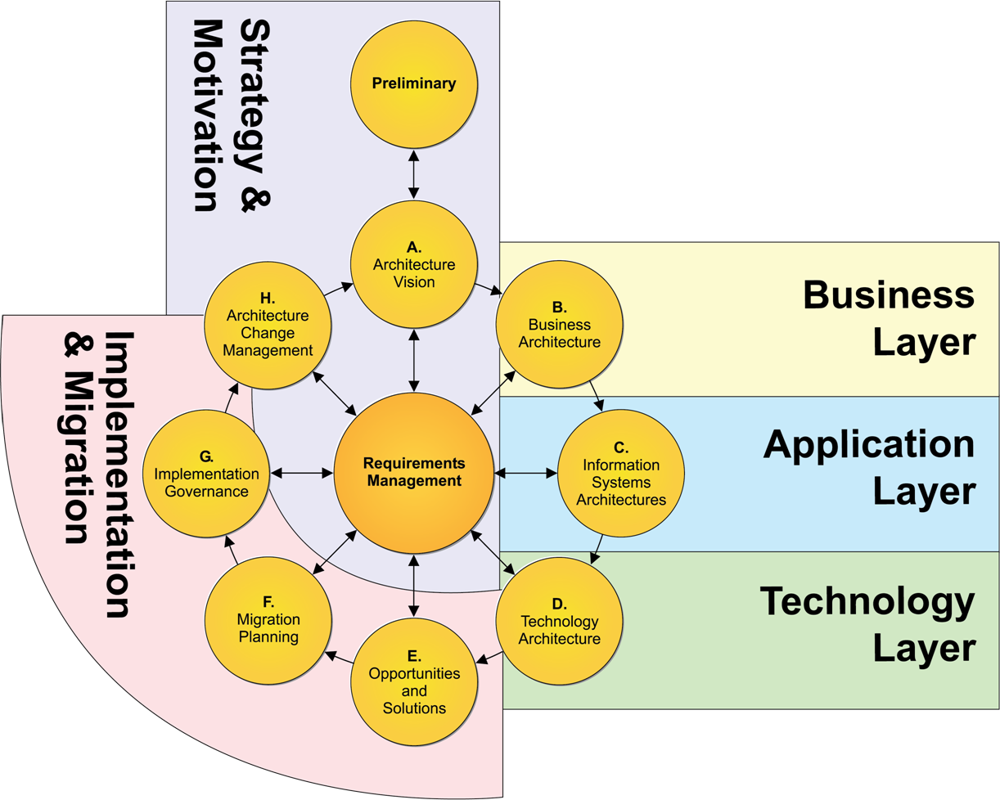

# Applying TOGAF to AI Initiatives

### Introduction

The Open Group Architecture Framework (TOGAF) is a comprehensive methodology for enterprise architecture that provides a structured approach to designing, planning, implementing, and governing enterprise information technology architecture. As artificial intelligence (AI) becomes increasingly integral to enterprise systems, understanding how TOGAF can be applied to AI initiatives is crucial for AI Solution Architects.

### TOGAF Basics: Thinking Like an Architect

#### What is TOGAF?

TOGAF is more than just a framework; it's a way of thinking about enterprise architecture. It encourages architects to:

- View the enterprise holistically, considering all aspects from business goals to technical infrastructure
- Think in layers, from high-level business architecture down to detailed technology implementations
- Consider the relationships and dependencies between different architectural elements
- Plan for change and evolution of the architecture over time

TOGAF provides:

- A common language for describing architectures, enabling better communication among stakeholders
- A method for developing architectures (the Architecture Development Method or ADM), guiding the architect through the process
- A set of tools and techniques for architecture development, supporting practical implementation
- A framework for organizing architecture efforts, ensuring comprehensive coverage of all aspects of enterprise architecture

#### Key Components of TOGAF: Building Blocks of Enterprise Architecture

1. **Architecture Development Method (ADM)**: The core of TOGAF, providing a step-by-step approach to developing enterprise architecture. Think of this as your roadmap for the architecture journey.

2. **Enterprise Continuum**: A repository of architectural assets, including models, patterns, and descriptions. This is your toolkit of reusable architectural components.

3. **Architecture Content Framework**: Defines the outputs of architecture activities. This helps ensure consistency and completeness in your architectural deliverables.

4. **Architecture Capability Framework**: Describes the organization, processes, skills, roles, and responsibilities required to establish and operate an enterprise architecture practice. This helps you build and maintain the capability to do architecture effectively.

### TOGAF Architecture Development Method (ADM): A Journey Through Enterprise Architecture

The ADM is the heart of TOGAF, providing a reliable, proven approach to developing and using enterprise architecture. Let's visualize the ADM phases and their relationships:

This diagram illustrates the iterative nature of the ADM, with Requirements Management as a continuous process influencing all phases. Each phase builds upon the previous ones, creating a comprehensive and coherent architecture.

### Applying TOGAF to AI Initiatives: A Practical Approach

When applying TOGAF to AI initiatives, each phase of the ADM can be tailored to address AI-specific concerns. Let's explore how an AI Solution Architect might approach each phase:

#### Preliminary Phase: Setting the Stage for AI
- **Reasoning**: Before diving into AI projects, we need to understand our organization's readiness and establish guiding principles.
- **Actions**:
    - Define AI-specific principles (e.g., "We will prioritize explainable AI models")
    - Identify existing AI capabilities and constraints within the organization
    - Assess the organization's AI maturity level

#### Phase A: Architecture Vision - Envisioning an AI-Enabled Enterprise
- **Reasoning**: We need a clear vision of how AI will transform our enterprise to guide our architectural efforts.
- **Actions**:
    - Develop a vision statement for AI integration in the enterprise
    - Identify key stakeholders for AI initiatives and their concerns
    - Create high-level scenarios illustrating the impact of AI on the business

#### Phase B: Business Architecture - Reimagining Business with AI
- **Reasoning**: AI will transform business processes and capabilities; we need to map out this transformation.
- **Actions**:
    - Define AI-enabled business processes and services
    - Identify opportunities for AI to enhance business capabilities
    - Develop business scenarios and use cases for AI implementation

#### Phase C: Information Systems Architectures - Designing for Data and AI
- **Reasoning**: AI systems have unique data and application architecture requirements that we must address.
- **Actions**:
    - Design data architectures to support AI models (e.g., data lakes, real-time streaming)
    - Plan for integration of AI systems with existing applications
    - Define data governance policies for AI training and operation

#### Phase D: Technology Architecture - Building the AI Infrastructure
- **Reasoning**: AI systems often require specialized hardware and software; we need to plan this infrastructure.
- **Actions**:
    - Specify AI infrastructure requirements (e.g., GPU clusters, AI-optimized cloud services)
    - Define AI model deployment and serving architectures
    - Plan for scalability and performance of AI systems

#### Phase E: Opportunities and Solutions - Prioritizing AI Initiatives
- **Reasoning**: With limited resources, we need to identify and prioritize the most impactful AI projects.
- **Actions**:
    - Identify AI projects that align with business goals
    - Prioritize AI initiatives based on feasibility, impact, and strategic alignment
    - Develop a portfolio of AI projects with clear objectives and success criteria

#### Phase F: Migration Planning - Charting the Path to AI Adoption
- **Reasoning**: Implementing AI is a journey; we need a clear roadmap to guide our efforts.
- **Actions**:
    - Develop a roadmap for AI adoption and integration
    - Plan for data migration and preparation for AI systems
    - Identify required skills and training for AI implementation

#### Phase G: Implementation Governance - Ensuring Responsible AI
- **Reasoning**: AI systems can have significant ethical and business implications; we need strong governance.
- **Actions**:
    - Establish governance frameworks for AI model development and deployment
    - Define ethics and compliance checks for AI systems
    - Create monitoring and auditing processes for AI systems

#### Phase H: Architecture Change Management - Adapting to the AI Landscape
- **Reasoning**: The AI field is rapidly evolving; our architecture must be adaptable.
- **Actions**:
    - Monitor AI technology trends and their potential impact on the architecture
    - Plan for continuous improvement of AI systems
    - Develop processes for incorporating new AI technologies into the architecture

#### Requirements Management - Aligning AI with Business Needs
- **Reasoning**: AI initiatives must be driven by business requirements, not just technological possibilities.
- **Actions**:
    - Capture and manage AI-specific requirements throughout the ADM cycle
    - Ensure alignment between AI capabilities and business needs
    - Continuously validate AI solutions against evolving business requirements

### Best Practices for Applying TOGAF to AI: Lessons from the Field

1. **Emphasize Data Architecture**: AI lives and dies by its data. Ensure your data architecture can support the volume, velocity, and variety of data needed for AI.

2. **Consider Ethical Implications**: AI ethics isn't just about compliance; it's about building trust with your stakeholders. Incorporate ethical considerations into each phase of the ADM.

3. **Focus on Scalability**: AI workloads can be unpredictable. Design architectures that can scale to handle the computational demands of AI systems, especially during training phases.

4. **Plan for Continuous Learning**: AI models are not "set and forget." Incorporate continuous training and updating into your architecture planning.

5. **Integrate with DevOps**: AI development benefits from rapid iteration. Align AI development with DevOps practices to ensure smooth deployment and operation of AI systems.

6. **Emphasize Explainability**: "Black box" AI can be a liability. Design architectures that support explainable AI, especially for systems used in decision-making processes.

7. **Consider Hybrid Approaches**: One size doesn't fit all in AI. Plan for architectures that can support both on-premises and cloud-based AI systems, depending on data sensitivity and performance requirements.

### Challenges in Applying TOGAF to AI: Navigating the Pitfalls

1. **Rapid Technological Change**: AI technologies evolve rapidly, challenging the typically slower pace of enterprise architecture development. Stay agile and build flexibility into your architecture.

2. **Skill Gap**: Many organizations lack the specialized skills required for AI development and integration. Plan for skill development and consider partnerships to fill the gap.

3. **Data Quality and Availability**: AI systems require high-quality, relevant data, which may not always be readily available in existing enterprise systems. Make data quality a priority from the start.

4. **Integration Complexity**: Integrating AI systems with legacy enterprise applications can be challenging. Plan for integration from the beginning and consider modernization efforts where necessary.

5. **Regulatory Compliance**: AI systems often deal with sensitive data and decision-making processes, requiring careful consideration of regulatory requirements. Stay informed about AI-specific regulations and build compliance into your architecture.

### Future Outlook: The Evolution of TOGAF and AI

As AI continues to evolve and become more integral to enterprise operations, we can expect TOGAF and other enterprise architecture frameworks to adapt. Keep an eye out for:

- Development of AI-specific reference architectures within the TOGAF framework
- Enhanced guidance on managing the ethical implications of AI in enterprise systems
- Greater emphasis on data governance and management in the context of AI
- Integration of AI lifecycle management into the ADM

### Conclusion: TOGAF as a Guide for AI-Enabled Enterprise Architecture

TOGAF provides a robust framework for developing enterprise architectures that can effectively incorporate AI systems. By adapting the ADM to address AI-specific concerns and following best practices, AI Solution Architects can leverage TOGAF to create coherent, scalable, and ethical AI-enabled enterprise architectures.

Remember, TOGAF is a guide, not a strict rulebook. As an AI Solution Architect, your role is to apply the TOGAF principles and methods in a way that best serves your organization's unique needs and goals. Stay curious, keep learning, and don't be afraid to innovate within the TOGAF framework.

As the field of AI continues to advance, staying informed about updates to TOGAF and other relevant frameworks will be crucial for successful AI integration in enterprise environments. The journey of AI-enabled enterprise architecture is just beginning, and with TOGAF as your guide, you're well-equipped to lead the way.
