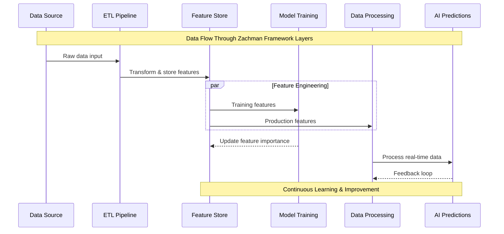
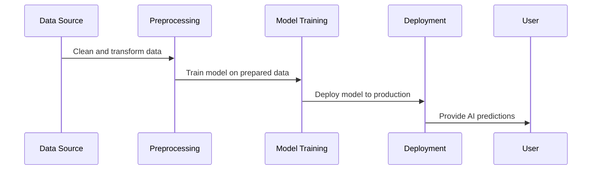
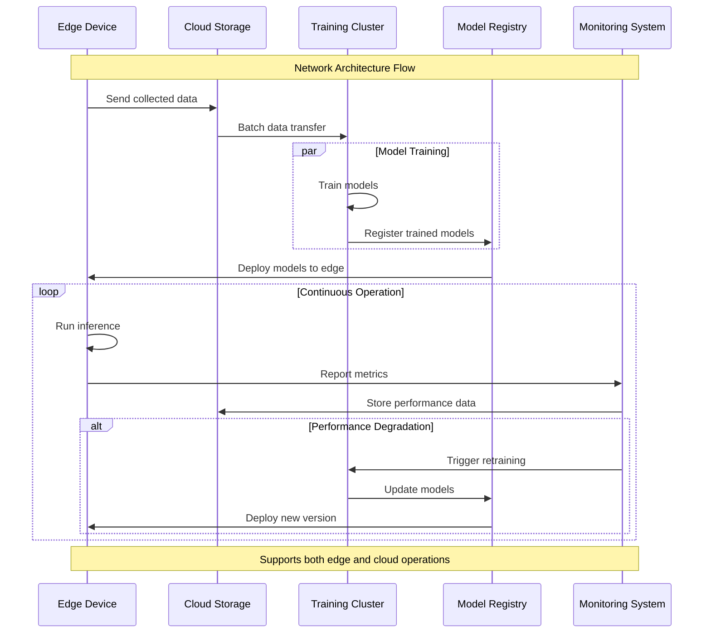
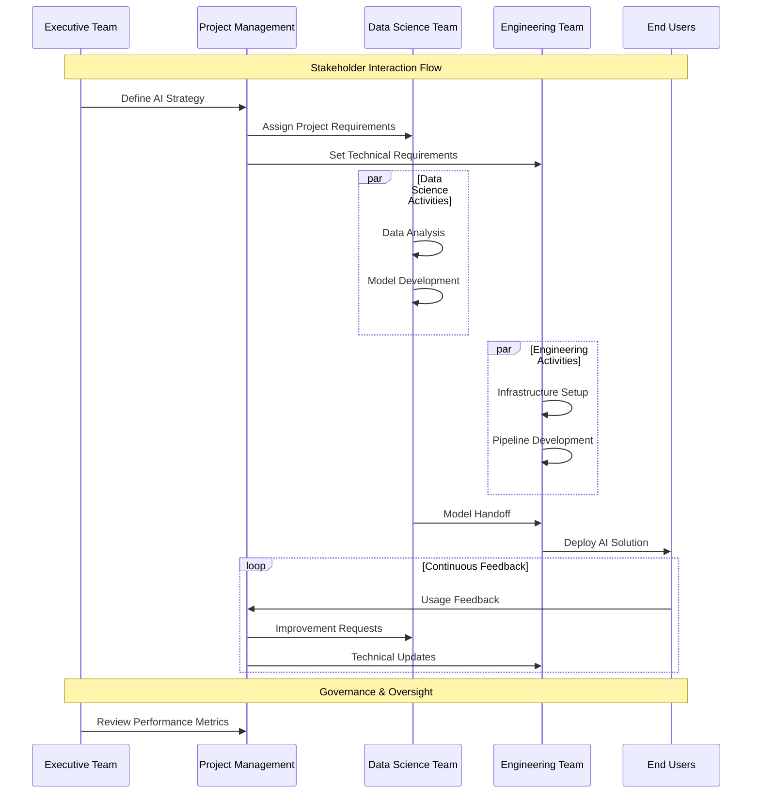
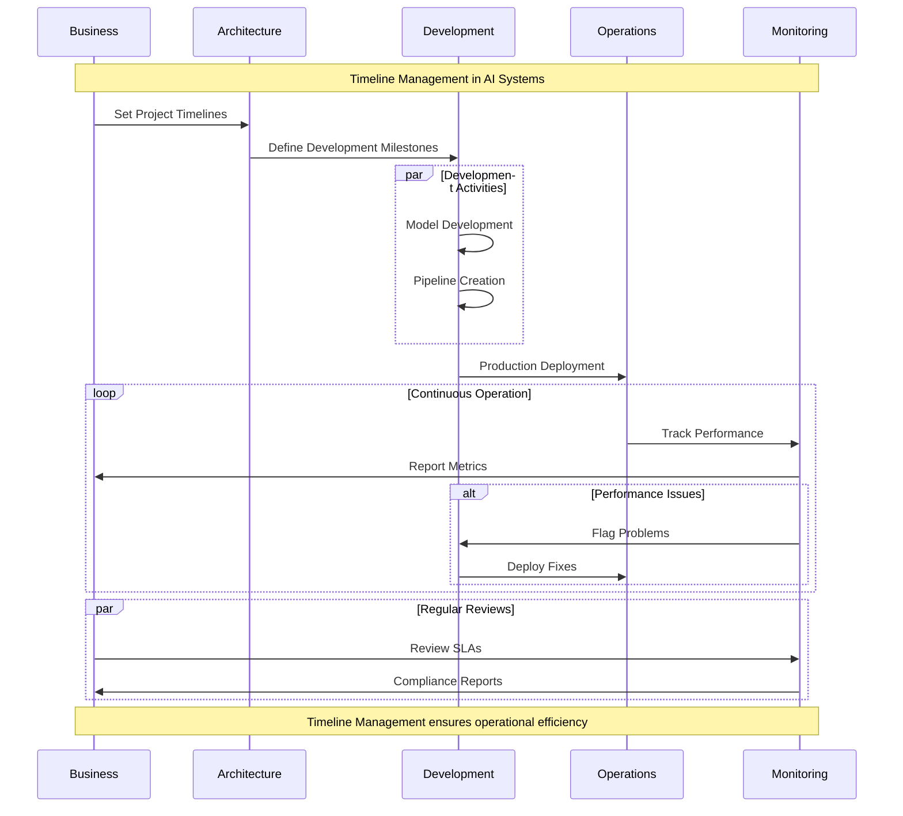
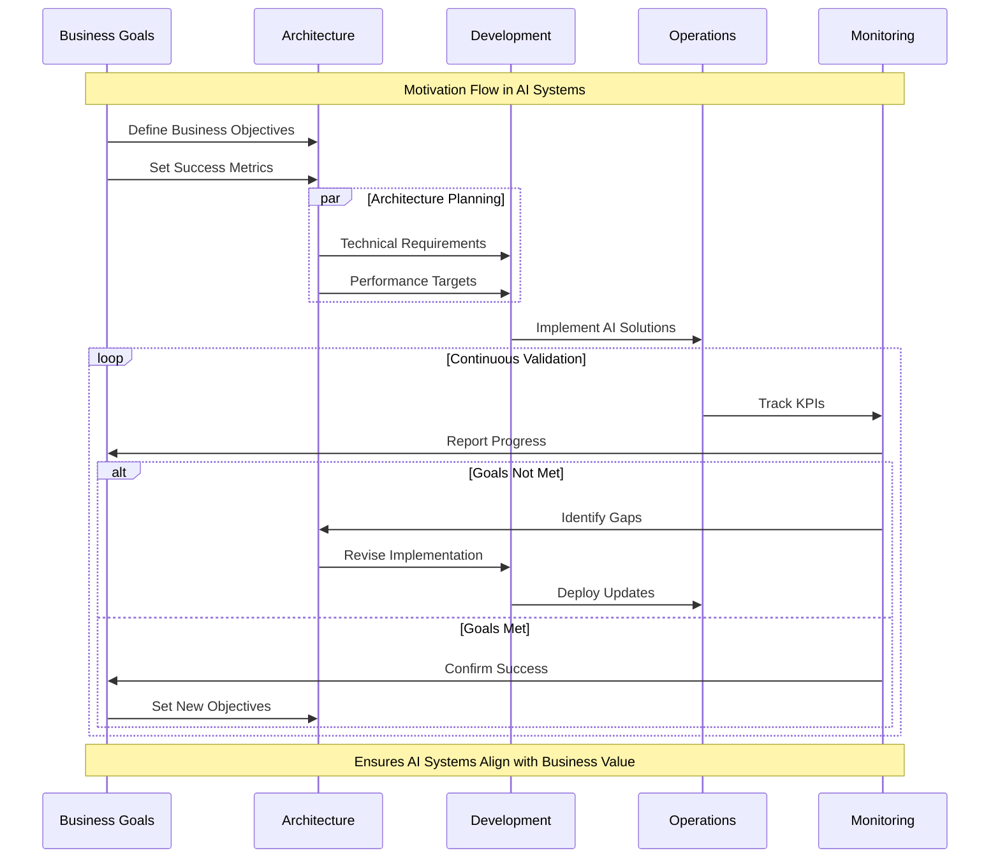

# Zachman Framework for AI Architecture

The **Zachman Framework** is a foundational tool for designing complex systems, offering a structured way to organize and analyze architectural components. It provides a holistic perspective by categorizing information into six fundamental questions (**What**, **How**, **Where**, **Who**, **When**, and **Why**) across six perspectives or roles (e.g., Executive, Business Management, Architect).

Applying the Zachman Framework to **AI architecture** ensures clarity, alignment, and scalability by systematically addressing each dimension of the architecture, from data to processes, and from stakeholders to implementation.

---

## Overview of the Zachman Framework

The Zachman Framework organizes architecture into a two-dimensional grid:

1. **Rows (Perspectives)**: Represent stakeholder viewpoints, from executive strategies to operational details.
2. **Columns (Aspects)**: Address fundamental questions (e.g., **What** defines data, **How** defines processes).

### Zachman Framework Matrix

| Perspective/Role      | What (Data)        | How (Function)     | Where (Network)    | Who (People)       | When (Time)        | Why (Motivation)   |
|-----------------------|--------------------|--------------------|--------------------|--------------------|--------------------|--------------------|
| **Executive**         | Data Strategy     | Business Goals     | Locations          | Stakeholders       | Milestones         | Business Objectives|
| **Business Management**| Business Entities | Business Processes | Distribution Plans | Roles & Responsibilities | Schedules         | Business Rules     |
| **Architect**         | Data Models       | System Processes   | Network Models     | Actor Interactions | Process Timelines  | Business Logic     |
| **Engineer**          | Data Designs      | Application Logic  | Network Design     | User Interfaces    | Event Sequences    | Transformation Rules|
| **Technician**        | Data Structures   | Program Code       | Network Nodes      | Access Controls    | Transaction Logs   | Decision Trees     |
| **User**              | Data Instances    | Operational Tasks  | Node Operations    | User Tasks         | Real-Time Actions  | Operational Choices|

---

## Applying Zachman Framework to AI Architecture

In AI systems, the Zachman Framework ensures alignment between high-level objectives and technical implementations. Here’s how each dimension applies to AI architecture:

### **What (Data)**

Focus on the data AI systems need, its structure, and its governance.

| Perspective/Role      | Example in AI Architecture                         |
|-----------------------|----------------------------------------------------|
| **Executive**         | Define the data strategy aligned with AI goals.   |
| **Business Management**| Identify key business data entities for AI insights.|
| **Architect**         | Design data models, such as feature stores.       |
| **Engineer**          | Define ETL pipelines and data preprocessing.      |
| **Technician**        | Implement database schemas or NoSQL stores.       |
| **User**              | Manage real-time data instances during operations.|

---

### **How (Function)**

Define AI workflows, from data processing to model deployment.

| Perspective/Role      | Example in AI Architecture                         |
|-----------------------|----------------------------------------------------|
| **Executive**         | Set high-level AI-driven business goals.           |
| **Business Management**| Identify business processes where AI adds value.  |
| **Architect**         | Map AI workflows for model training and inference. |
| **Engineer**          | Build automated pipelines for model deployment.    |
| **Technician**        | Write and optimize AI code.                        |
| **User**              | Execute operational workflows using AI outputs.    |

---

### **Where (Network)**

Establish the physical and virtual locations where AI systems operate.

| Perspective/Role      | Example in AI Architecture                         |
|-----------------------|----------------------------------------------------|
| **Executive**         | Determine whether to use cloud, on-prem, or hybrid environments.|
| **Business Management**| Define data distribution requirements.            |
| **Architect**         | Design cloud-based or edge computing architectures.|
| **Engineer**          | Configure Kubernetes clusters for model orchestration.|
| **Technician**        | Optimize network configurations for low latency.   |
| **User**              | Interact with AI systems in their operational environments.|

---

### **Who (People)**

Define the roles and interactions of stakeholders in AI systems.

| Perspective/Role      | Example in AI Architecture                         |
|-----------------------|----------------------------------------------------|
| **Executive**         | Identify key decision-makers for AI initiatives.   |
| **Business Management**| Assign roles for managing AI-enabled processes.   |
| **Architect**         | Map actors (e.g., users, admins, data scientists) to system components.|
| **Engineer**          | Build interfaces for different stakeholder interactions.|
| **Technician**        | Implement access controls for secure usage.        |
| **User**              | Interact with AI systems as defined by user roles. |

---

### **When (Time)**

Address timelines for AI project delivery and system operation.

| Perspective/Role      | Example in AI Architecture                         |
|-----------------------|----------------------------------------------------|
| **Executive**         | Define milestones for AI implementation.          |
| **Business Management**| Plan operational schedules for AI systems.        |
| **Architect**         | Map timelines for AI pipeline processes.          |
| **Engineer**          | Monitor time-bound deployment pipelines.          |
| **Technician**        | Log transaction timestamps.                        |
| **User**              | Operate systems in real time.                      |

---

### **Why (Motivation)**

Clarify the objectives behind AI system development and deployment.

| Perspective/Role      | Example in AI Architecture                         |
|-----------------------|----------------------------------------------------|
| **Executive**         | Align AI initiatives with organizational goals.   |
| **Business Management**| Establish metrics for measuring AI success.       |
| **Architect**         | Define rules and logic that underpin AI workflows. |
| **Engineer**          | Implement business logic in AI systems.           |
| **Technician**        | Ensure decision trees align with operational goals.|
| **User**              | Use AI systems to achieve specific objectives.     |

---

## Benefits of Using the Zachman Framework in AI

1. **Comprehensive Coverage**: Ensures all aspects of AI architecture are addressed systematically.  
2. **Stakeholder Alignment**: Bridges gaps between technical and non-technical teams.  
3. **Scalability**: Lays a robust foundation for scaling AI systems across use cases.  
4. **Risk Management**: Identifies gaps or risks early in the design phase.  

By applying the Zachman Framework, you can design AI architectures that are comprehensive, aligned with business objectives, and robust enough to handle real-world challenges.