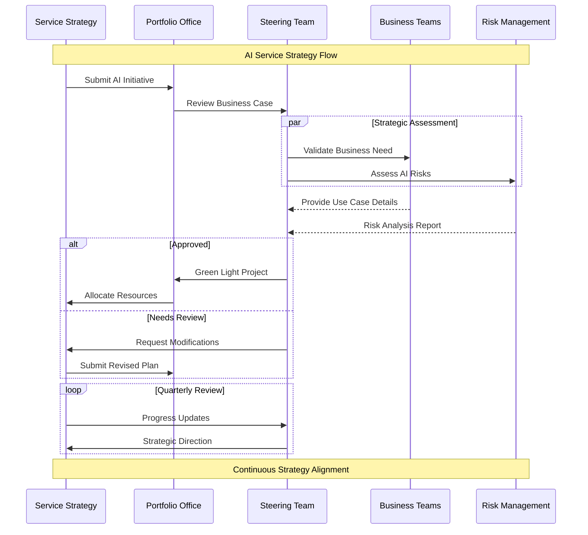
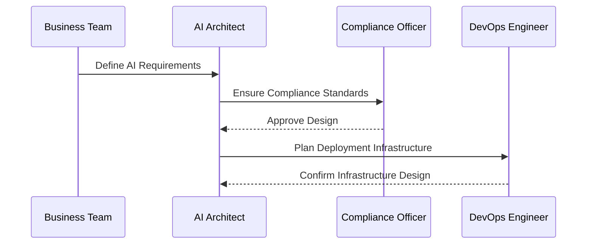
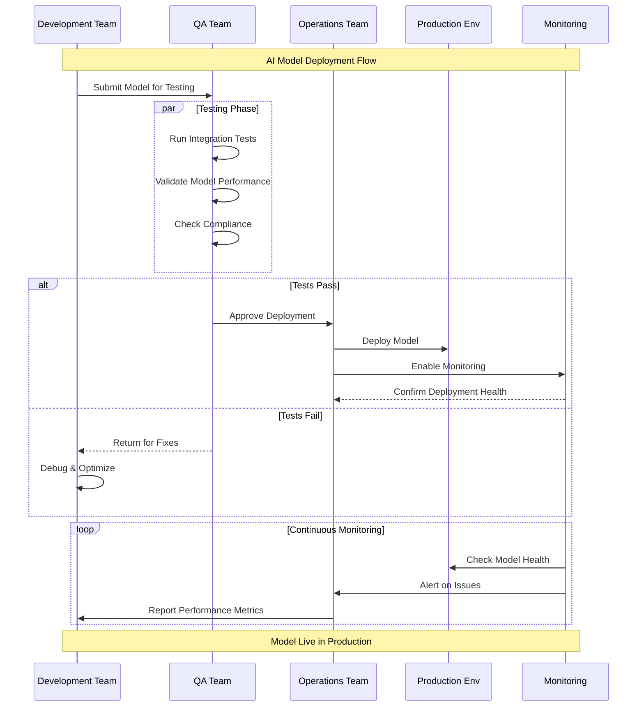
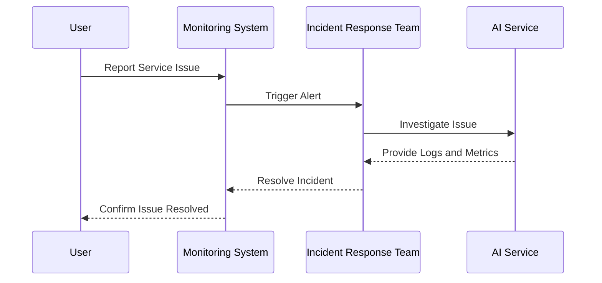
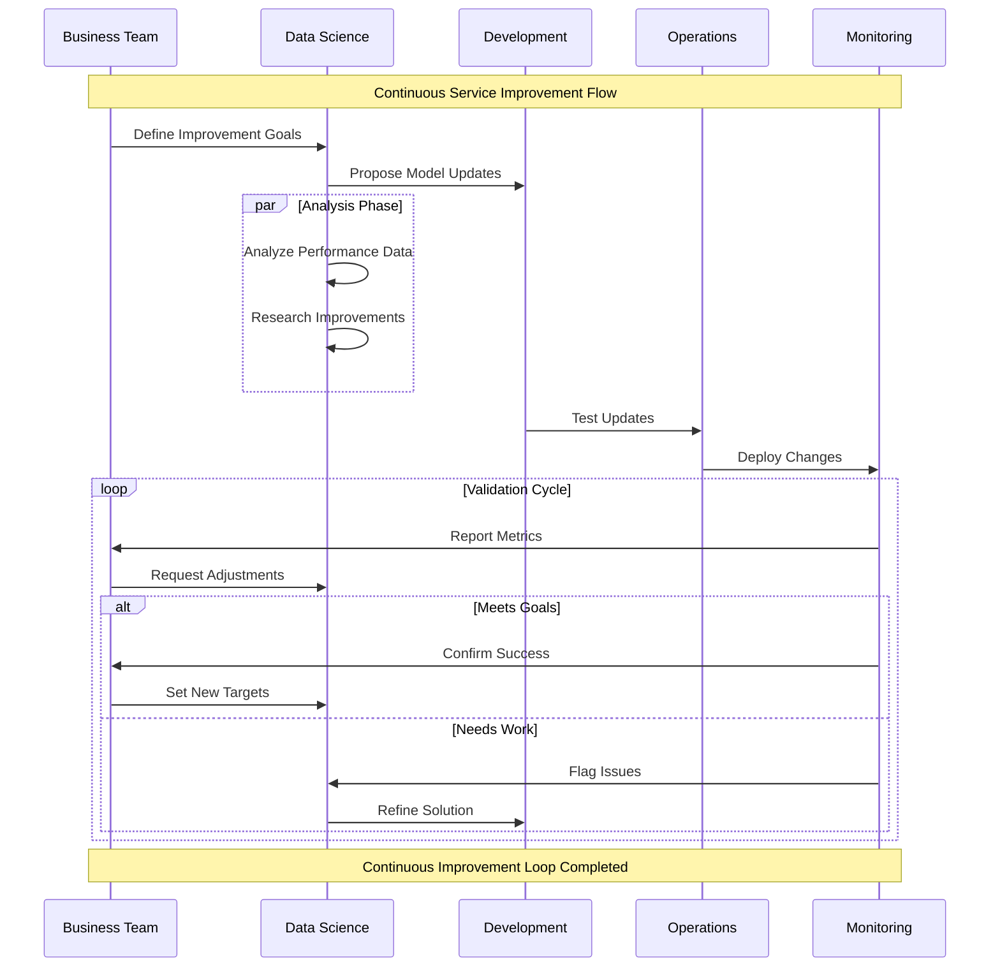

# ITIL for AI Service Management  

The **ITIL (Information Technology Infrastructure Library)** framework provides a structured approach to managing IT services, ensuring alignment with business goals, efficiency, and continuous improvement. Applying ITIL principles to **AI Service Management** adapts these best practices to the unique lifecycle and operational needs of AI systems.

This page explores how ITIL processes and concepts can be tailored for managing AI services, from development and deployment to monitoring and continuous improvement.  

---

## Overview of ITIL and AI Service Management  

ITIL organizes service management into five key stages, known as the **Service Lifecycle**:  

1. **Service Strategy**: Aligning AI services with business needs and objectives.  
2. **Service Design**: Designing AI models and systems for scalability, reliability, and compliance.  
3. **Service Transition**: Safely deploying AI models into production environments.  
4. **Service Operation**: Monitoring and maintaining AI systems for optimal performance.  
5. **Continual Service Improvement (CSI)**: Iteratively enhancing AI services to meet evolving needs.  

---

## Adapting ITIL Stages for AI  

###  Service Strategy for AI  

AI service strategy focuses on defining how AI capabilities align with business goals and deliver measurable value.  

| ITIL Strategy Component   | AI Service Management Application            | Example                     |
|---------------------------|----------------------------------------------|-----------------------------|
| **Business Alignment**    | Ensure AI use cases support organizational goals.| AI for fraud detection in banking. |
| **Service Portfolio**     | Prioritize AI projects based on impact and feasibility.| Focus on high ROI use cases. |
| **Risk Management**       | Identify risks in AI adoption, such as bias or compliance issues.| Risk assessment for AI-driven hiring systems. |

---

###  Service Design for AI  

Service design in AI focuses on creating systems that meet functional, performance, and compliance requirements.  

| ITIL Design Principle     | AI Service Management Application            | Example                     |
|---------------------------|----------------------------------------------|-----------------------------|
| **Capacity Planning**     | Ensure computational resources meet model demands.| Plan GPU allocation for training. |
| **Security**              | Embed data protection and secure pipelines in design.| Use encryption for sensitive data. |
| **SLAs (Service Level Agreements)** | Define model performance expectations and availability.| 95% uptime for an AI chatbot. |

#### AI Service Design Workflow  

---

###  Service Transition for AI  

Service transition focuses on deploying AI systems into production while minimizing risks.  

| ITIL Transition Process   | AI Service Management Application            | Example                     |
|---------------------------|----------------------------------------------|-----------------------------|
| **Change Management**     | Control updates to AI models to avoid service disruption.| Version control for model upgrades. |
| **Knowledge Management**  | Document AI workflows, assumptions, and data provenance.| Create detailed model documentation. |
| **Testing**               | Ensure the AI system behaves as expected in real-world scenarios.| Simulate edge cases for autonomous vehicles. |

#### AI Deployment Workflow  

---

###  Service Operation for AI  

AI service operation ensures smooth running of AI systems through monitoring, issue resolution, and user support.  

| ITIL Operation Process    | AI Service Management Application            | Example                     |
|---------------------------|----------------------------------------------|-----------------------------|
| **Incident Management**   | Resolve model outages or errors rapidly.     | Fix prediction latency issues. |
| **Problem Management**    | Identify root causes of recurring failures.  | Investigate drift in model accuracy. |
| **Event Management**      | Monitor key metrics like inference latency or throughput.| Alert on spikes in prediction time. |

#### Incident Management for AI  

---

###  Continual Service Improvement (CSI) for AI  

CSI in AI focuses on enhancing model performance, workflows, and processes iteratively.  

| ITIL Improvement Process  | AI Service Management Application            | Example                     |
|---------------------------|----------------------------------------------|-----------------------------|
| **Process Reviews**       | Regularly audit AI workflows for efficiency.| Optimize data preprocessing pipelines. |
| **Feedback Loops**        | Incorporate user feedback into AI updates.  | Improve chatbot responses based on user input. |
| **Performance Benchmarking** | Compare model performance against industry standards.| Evaluate recommendation accuracy annually. |

#### AI Service Improvement Plan  

---

## Challenges in Applying ITIL to AI  

| Challenge                   | Solution                                    |
|-----------------------------|---------------------------------------------|
| **Dynamic Nature of AI**    | Use automated monitoring and retraining pipelines.|
| **Complexity of AI Workflows** | Break processes into manageable ITIL components.|
| **Evolving Regulations**    | Integrate compliance reviews into the lifecycle. |

---

## Best Practices Checklist  

| Best Practice              | Recommendation                              |
|----------------------------|---------------------------------------------|
| **Document Everything**    | Maintain clear records of all AI workflows and decisions.|
| **Monitor Continuously**   | Use observability tools to track AI performance and uptime.|
| **Manage Changes**         | Employ change management for model updates. |
| **Align with Business Goals** | Ensure AI projects align with strategic objectives.|
| **Engage Stakeholders**    | Include diverse stakeholders in the lifecycle. |

By integrating ITIL principles into AI service management, organizations can deliver scalable, reliable, and user-focused AI systems while continuously improving their processes and outcomes.