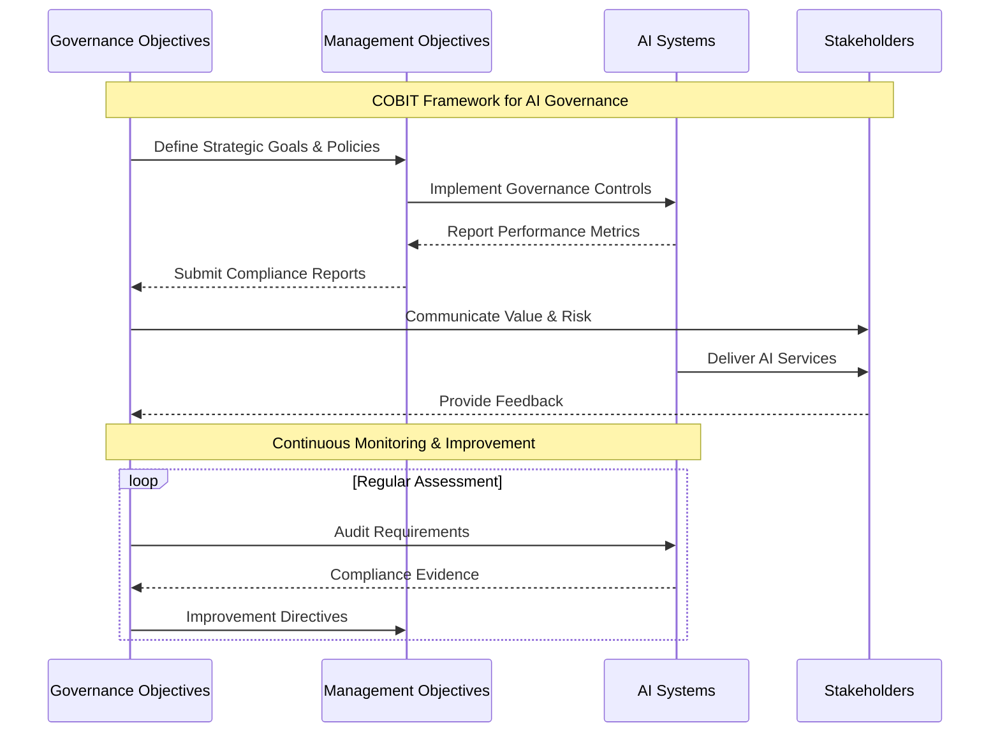
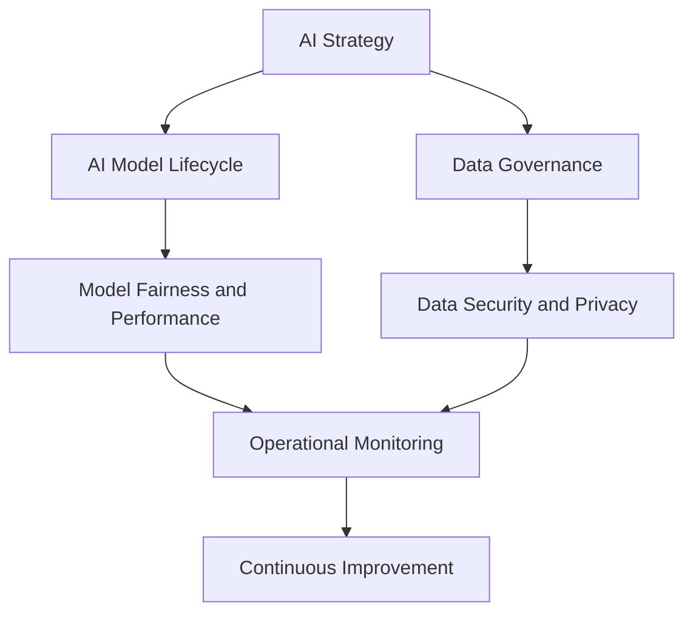
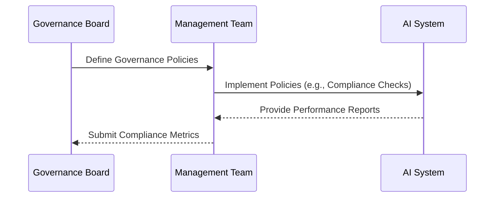
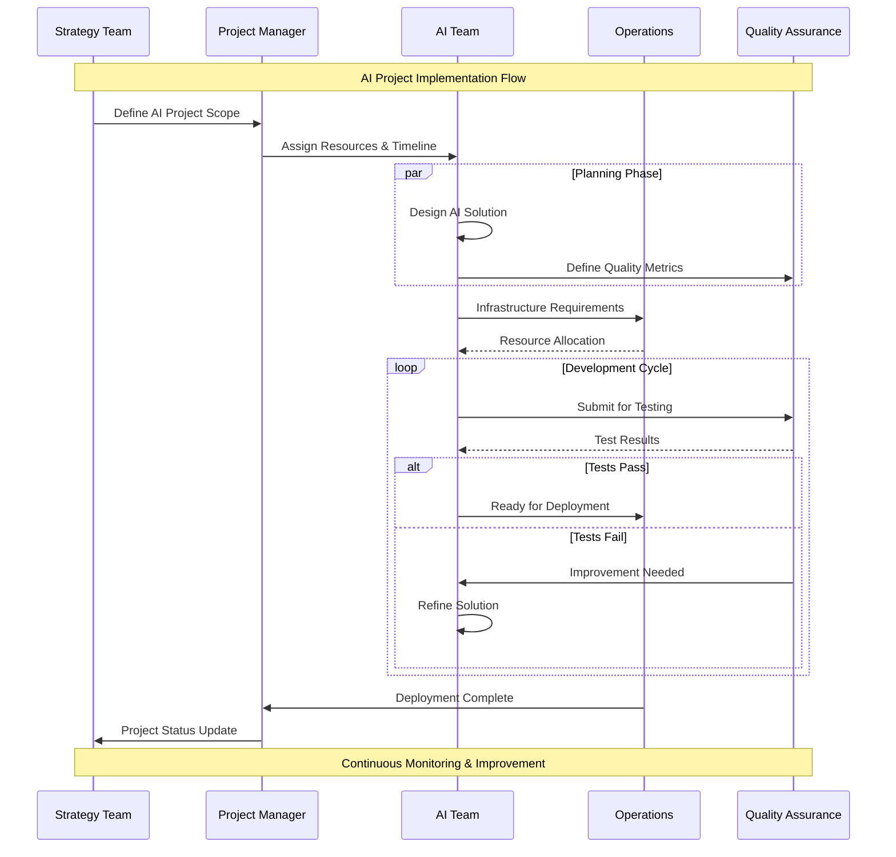
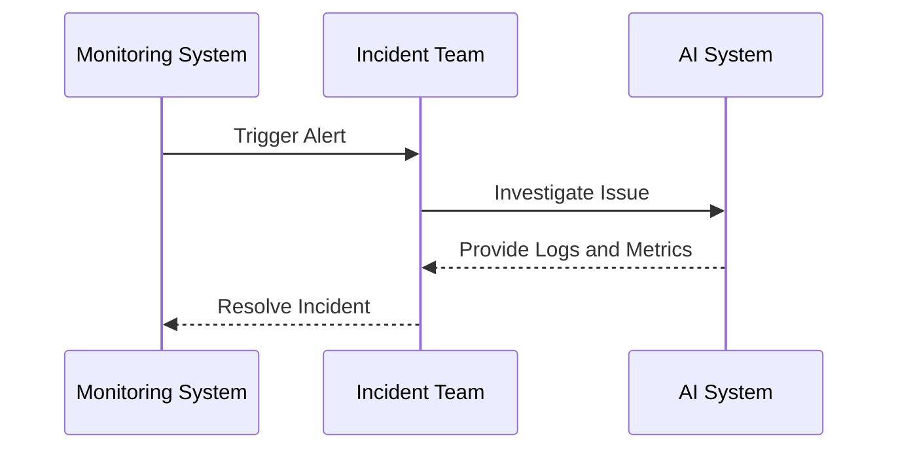
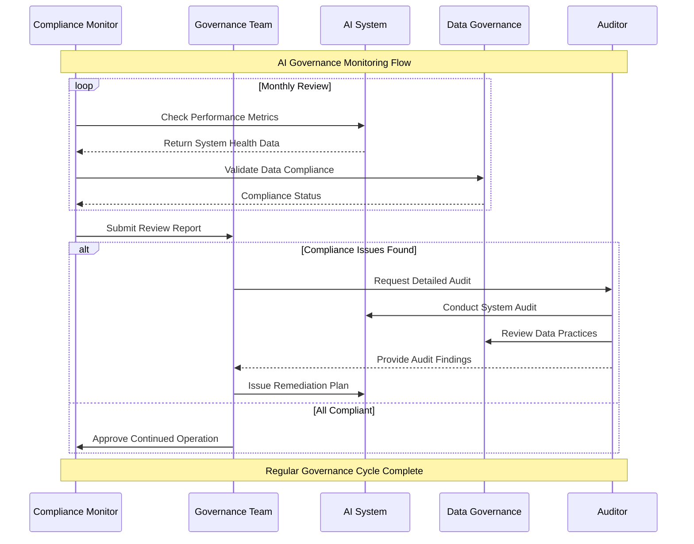

# COBIT for AI Governance  

The **COBIT (Control Objectives for Information and Related Technologies)** framework provides a comprehensive approach to governance and management of IT systems. Applying COBIT to **AI Governance** ensures that AI initiatives align with organizational goals, mitigate risks, and deliver measurable value.  

This page explores how COBIT principles and practices can be adapted to establish robust governance for AI systems, ensuring accountability, compliance, and strategic alignment.  

---

## Overview of COBIT  

COBIT is built around two key components:  

1. **Governance Objectives**: Focus on aligning IT with business goals, managing risks, and ensuring value delivery.  
2. **Management Objectives**: Emphasize the effective planning, building, running, and monitoring of IT systems.  

### COBIT Domains and AI Application  

| Domain                     | AI Governance Application                  | Example                     |
|----------------------------|--------------------------------------------|-----------------------------|
| **Evaluate, Direct, Monitor (EDM)** | Strategic oversight for AI systems. | Align AI initiatives with business goals. |
| **Align, Plan, Organize (APO)** | Effective planning of AI projects.      | Develop AI roadmaps and budgets. |
| **Build, Acquire, Implement (BAI)** | Implementation and deployment of AI systems.| Deploy AI models into production environments. |
| **Deliver, Service, Support (DSS)** | Operational management of AI systems. | Ensure availability and reliability of AI services. |
| **Monitor, Evaluate, Assess (MEA)** | Continuous evaluation of AI systems.  | Measure performance and compliance of AI models. |

---

## COBIT Principles Applied to AI Governance  

### Meeting Stakeholder Needs  

AI governance ensures that AI initiatives deliver value while addressing stakeholder concerns such as fairness, privacy, and transparency.  

| Stakeholder         | AI Governance Responsibility                   |
|---------------------|------------------------------------------------|
| **Executives**      | Align AI projects with strategic business goals.|
| **Regulators**      | Ensure compliance with laws like GDPR and CCPA. |
| **End Users**       | Provide trustworthy and transparent AI systems. |

---

### Covering the Enterprise End-to-End  

COBIT’s holistic approach ensures that AI governance spans all aspects of the organization, from strategy to daily operations.  

#### Enterprise-Wide AI Governance  

---

### Applying a Single, Integrated Framework  

COBIT integrates with other frameworks like ITIL, Zachman, and ISO standards, making it adaptable for AI governance. For example:  

- Combine COBIT’s governance objectives with **ITIL’s operational practices** for AI service management.  
- Use COBIT alongside **ISO 27001** for AI data security compliance.  

---

### Enabling a Holistic Approach  

AI governance requires balancing multiple perspectives, including:  

| Perspective           | COBIT Objective             | AI Application                  |
|-----------------------|-----------------------------|---------------------------------|
| **Strategic**         | Value Delivery              | Align AI outcomes with ROI targets. |
| **Risk**              | Risk Optimization           | Manage risks like model bias or adversarial attacks. |
| **Operational**       | Resource Optimization       | Efficiently allocate AI development and computing resources. |

---

### Separating Governance from Management  

COBIT distinguishes governance (setting objectives and monitoring) from management (executing activities).  

| Role                  | Responsibility              | Example                         |
|-----------------------|-----------------------------|---------------------------------|
| **Governance Board**  | Define AI governance policies.| Establish fairness standards.   |
| **Management Team**   | Implement AI systems and policies.| Deploy bias-detection tools.    |

---

## COBIT Domains in Detail  

### **EDM: Evaluate, Direct, Monitor**  

Strategically oversee AI projects to align them with business goals and mitigate risks.  

| Activity              | AI Governance Task                             |
|-----------------------|------------------------------------------------|
| **Evaluate**          | Assess the potential business impact of AI systems.| Define AI use cases for value delivery. |
| **Direct**            | Provide guidance on ethical and operational standards.| Mandate regular fairness audits.       |
| **Monitor**           | Track AI model performance and compliance.     | Use dashboards to visualize accuracy and drift. |

#### Governance Oversight for AI  

---

### **APO: Align, Plan, Organize**  

Plan and prepare AI systems to ensure alignment with organizational goals.  

| Activity              | AI Governance Task                             |
|-----------------------|------------------------------------------------|
| **Strategy Alignment**| Ensure AI projects are aligned with business objectives.| Use AI to automate customer support.  |
| **Resource Planning** | Allocate budgets and resources for AI projects.| Provision GPU clusters for training.  |
| **Risk Management**   | Identify and mitigate risks in AI development. | Conduct regular risk assessments.     |

#### AI Roadmap Planning  

---

### **BAI: Build, Acquire, Implement**  

Implement AI systems in a controlled and efficient manner.  

| Activity              | AI Governance Task                             |
|-----------------------|------------------------------------------------|
| **System Development**| Build AI models using robust and ethical methodologies.| Ensure fairness during model training. |
| **Change Management** | Manage updates to AI models without disrupting services.| Use version control for models.       |
| **Deployment**        | Safely deploy AI systems into production.      | Use CI/CD pipelines for AI deployment.|

---

### **DSS: Deliver, Service, Support**  

Ensure smooth operations of AI systems post-deployment.  

| Activity              | AI Governance Task                             |
|-----------------------|------------------------------------------------|
| **Incident Management**| Address AI model failures or drift issues.     | Resolve prediction errors promptly.  |
| **Service Monitoring**| Continuously monitor AI system health.         | Track latency and uptime of AI APIs. |
| **User Support**      | Provide support for users interacting with AI systems.| Offer detailed explanations for predictions. |

#### AI Incident Resolution  

---

### **MEA: Monitor, Evaluate, Assess**  

Evaluate the performance, compliance, and impact of AI systems regularly.  

| Activity              | AI Governance Task                             |
|-----------------------|------------------------------------------------|
| **Performance Reviews**| Regularly measure AI model performance against KPIs.| Ensure accuracy meets benchmarks.    |
| **Compliance Audits** | Conduct audits to check adherence to policies. | Verify data privacy compliance.      |
| **Continuous Feedback**| Use feedback loops to improve AI systems.      | Integrate user feedback into model updates. |

#### AI Compliance Review Timeline  

---

## Best Practices Checklist  

| Best Practice              | Recommendation                              |
|----------------------------|---------------------------------------------|
| **Establish Clear Policies** | Define governance policies for AI use, bias, and compliance.|
| **Monitor Continuously**   | Use automated tools for performance and compliance tracking.|
| **Engage Stakeholders**    | Include executives, regulators, and end-users in governance. |
| **Conduct Regular Audits** | Evaluate AI systems for fairness, reliability, and security. |
| **Integrate Risk Management** | Address risks like data breaches and adversarial attacks proactively.|

By applying COBIT to AI governance, organizations can create a structured, scalable, and ethical framework for managing AI systems effectively while ensuring alignment with business goals and regulatory requirements.