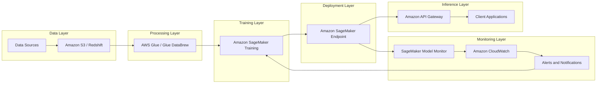
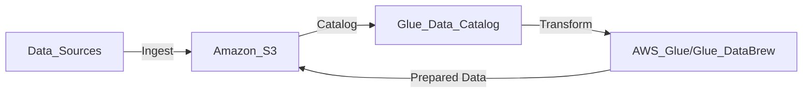
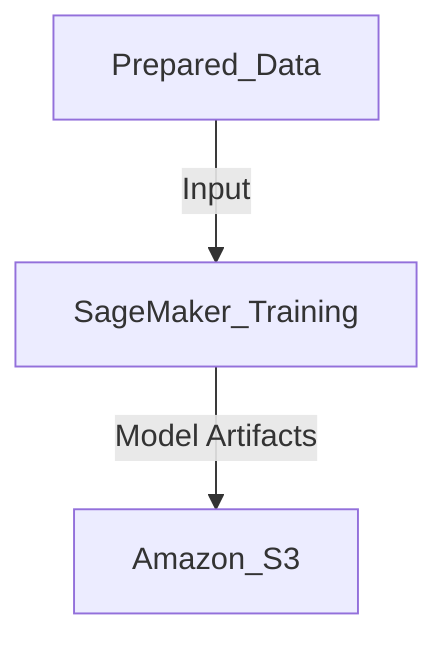
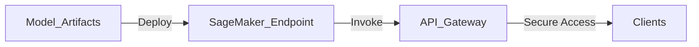
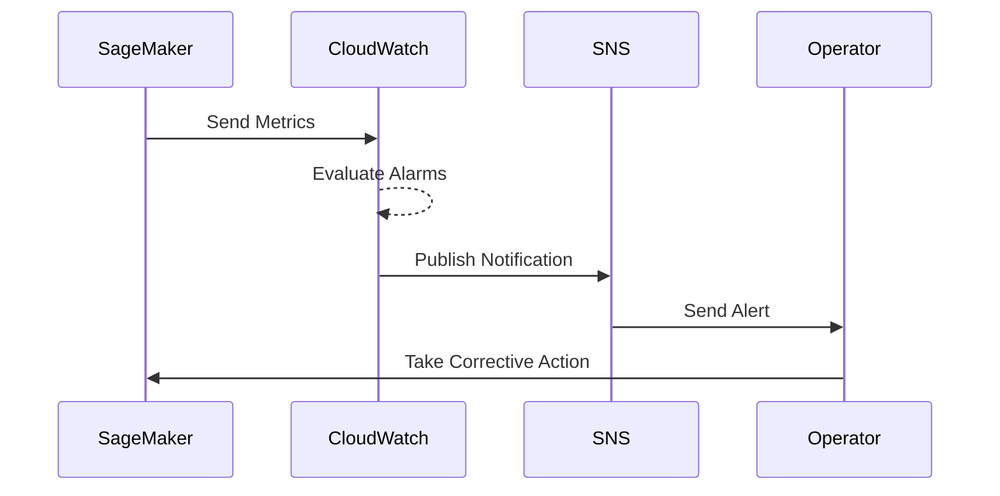
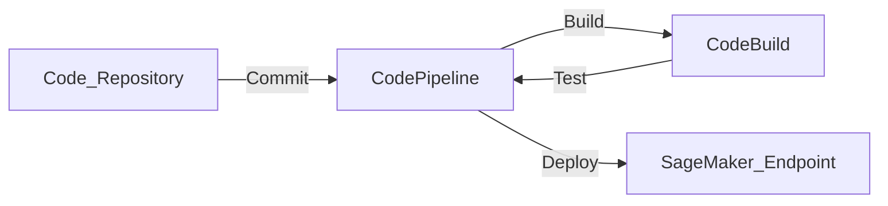

# AWS AI Services and Architecture

## Introduction

Amazon Web Services (AWS) provides a comprehensive ecosystem of services and tools designed to build, deploy, and manage AI solutions at scale. Leveraging AWS's AI capabilities enables organizations to transform data into actionable insights, automate processes, and innovate rapidly while ensuring security and compliance.

---

## AWS AI Capabilities Overview

AWS offers an end-to-end suite of AI services that cover every stage of the AI lifecycle, from data ingestion to model deployment and monitoring. This ecosystem allows organizations to:

- **Securely store and manage data** with scalable storage solutions.
- **Preprocess and transform data** for optimal model performance.
- **Train and fine-tune models** using powerful compute resources.
- **Deploy models at scale** with flexible inference options.
- **Monitor and manage models** to ensure ongoing performance and compliance.

| Key Area               | AWS Services                                                                                               | Use Case                                                 |
|------------------------|------------------------------------------------------------------------------------------------------------|----------------------------------------------------------|
| **Data Management**    | Amazon S3, Amazon Redshift, AWS Glue, AWS Lake Formation                                                   | Secure storage, data lakes, ETL processes                |
| **AI/ML Development**  | Amazon SageMaker, SageMaker Studio, SageMaker Autopilot                                                    | Model development, training, AutoML                      |
| **Compute Resources**  | Amazon EC2, AWS Lambda, AWS Inferentia, Amazon Elastic Kubernetes Service (EKS)                            | Scalable compute for training and inference              |
| **Deployment & Inference** | SageMaker Endpoints, AWS Lambda, Amazon API Gateway, AWS Fargate                                        | Model deployment, real-time and batch inference          |
| **Security & Compliance**  | AWS Identity and Access Management (IAM), AWS Key Management Service (KMS), Amazon Macie, AWS CloudTrail | Data protection, encryption, compliance auditing         |
| **Monitoring & Logging**   | Amazon CloudWatch, SageMaker Model Monitor, AWS CloudTrail                                              | Performance tracking, anomaly detection, audit logs      |

---

## End-to-End AI Platform Architecture on AWS

Building a robust AI platform on AWS involves integrating multiple services to handle the full AI lifecycle. Below is an enhanced architectural overview that illustrates the components and their interactions.

### Architectural Components and Workflow

1. **Data Ingestion and Storage**: Collect data from various sources and store it securely in Amazon S3 or Amazon Redshift.
2. **Data Processing and Feature Engineering**: Use AWS Glue and AWS Glue DataBrew to clean, transform, and prepare data for modeling.
3. **Model Development and Training**: Develop and train models using Amazon SageMaker, leveraging built-in algorithms or custom code.
4. **Model Evaluation and Tuning**: Evaluate model performance and fine-tune hyperparameters using SageMaker's built-in tools.
5. **Model Deployment**: Deploy trained models using SageMaker Endpoints for real-time inference or SageMaker Batch Transform for batch predictions.
6. **Inference and Serving**: Expose inference endpoints via Amazon API Gateway and secure them with AWS IAM and AWS WAF.
7. **Monitoring and Logging**: Continuously monitor model performance with SageMaker Model Monitor and log activities with Amazon CloudWatch and AWS CloudTrail.
8. **Feedback Loop and Iteration**: Use insights from monitoring to retrain models, ensuring they remain accurate and relevant.

---

## Building an AI Platform on AWS: Detailed Workflow

### Data Management and Preprocessing

Efficient data management is the foundation of any AI platform. AWS provides robust services to securely store, catalog, and preprocess data.

- **Data Ingestion**: Collect data from internal systems, IoT devices, or external sources and store it in Amazon S3 or Amazon Redshift.
- **Data Cataloging**: Use AWS Glue Data Catalog to maintain a unified metadata repository.
- **Data Transformation**: Utilize AWS Glue for ETL jobs and AWS Glue DataBrew for interactive data preparation.

### Model Development and Training

Developing and training models involves experimenting with algorithms, tuning hyperparameters, and scaling compute resources.

- **Environment Setup**: Use Amazon SageMaker Studio for an integrated development environment.
- **Model Building**: Develop models using built-in algorithms or custom code in Jupyter notebooks.
- **Training Jobs**: Launch training jobs with managed compute resources, leveraging GPUs or specialized hardware like AWS Inferentia.
- **Hyperparameter Tuning**: Use SageMaker's Automatic Model Tuning to optimize model parameters.

### Deployment and Inference

Deploy models to serve predictions in real-time or batch processes.

- **Model Hosting**: Deploy models to SageMaker Endpoints for real-time inference.
- **Serverless Inference**: Use AWS Lambda for lightweight, scalable inference tasks.
- **Batch Transform**: Perform large-scale batch predictions with SageMaker Batch Transform.

### Security and Compliance

Ensuring the platform adheres to security best practices is critical.

- **Authentication and Authorization**: Implement fine-grained access control with AWS IAM roles and policies.
- **Encryption**: Use AWS KMS for encrypting data at rest and in transit.
- **Network Security**: Deploy resources within a VPC and use security groups and network ACLs.
- **Compliance Auditing**: Track and audit activities using AWS CloudTrail.

### Monitoring and Incident Management

Continuous monitoring allows for proactive incident management and maintaining model performance.

- **Performance Metrics**: Monitor latency, throughput, and error rates with Amazon CloudWatch.
- **Model Drift Detection**: Use SageMaker Model Monitor to detect data and concept drift.
- **Alerting**: Set up Amazon SNS to receive notifications when metrics breach thresholds.
- **Automated Remediation**: Use AWS Lambda functions triggered by CloudWatch alarms to automate responses.

---

## Infrastructure as Code (IaC) and CI/CD Integration

Automating infrastructure deployment and application delivery ensures consistency and accelerates development.

### Implementing IaC with AWS CloudFormation

- **Template Development**: Define AWS resources in CloudFormation templates.
- **Version Control**: Store templates in repositories like AWS CodeCommit or GitHub.
- **Deployment Automation**: Use CloudFormation StackSets for multi-account, multi-region deployments.

### CI/CD Pipeline with AWS CodePipeline

- **Source Stage**: Integrate with AWS CodeCommit, GitHub, or other repositories.
- **Build Stage**: Use AWS CodeBuild to compile code, run tests, and package models.
- **Deploy Stage**: Automate model deployment to SageMaker Endpoints.

---

## Ensuring Security in the AI Platform

Security spans across data, models, and inference endpoints.

### Data Security

- **Access Control**: Implement IAM policies to restrict access to sensitive data.
- **Encryption**: Use server-side encryption with Amazon S3-managed keys or customer-managed keys.
- **Data Loss Prevention**: Employ Amazon Macie to discover and protect sensitive data.

### Model Security

- **Secure Storage**: Store model artifacts in encrypted S3 buckets.
- **Code Security**: Scan code repositories for vulnerabilities using tools like Amazon CodeGuru.
- **Container Security**: Use Amazon ECR scanning for container images.

### Inference Endpoint Security

- **Endpoint Protection**: Secure endpoints with AWS WAF to prevent common web exploits.
- **Network Isolation**: Deploy endpoints within VPCs to limit exposure.
- **Authentication**: Require API keys or use OAuth tokens for client access.

---

## Business Readiness for AWS AI Adoption

Transitioning to AWS AI services requires strategic planning and organizational alignment.

### Advantages of AWS for AI

- **Scalability**: Elastic resources to handle varying workloads without upfront investments.
- **Cost Efficiency**: Pay-as-you-go pricing models reduce capital expenditure.
- **Innovation Acceleration**: Access to cutting-edge AI services and technologies.
- **Compliance and Security**: Certifications and tools to meet regulatory requirements.

### Steps for Organizational Readiness

| Readiness Aspect          | Actions Needed                                         |
|---------------------------|--------------------------------------------------------|
| **Skills and Training**   | Upskill teams through AWS Training and Certification.  |
| **Financial Planning**    | Analyze Total Cost of Ownership (TCO) and ROI.         |
| **Data Strategy**         | Develop a data governance framework and policies.      |
| **Change Management**     | Communicate benefits and provide support during transition. |
| **Process Alignment**     | Integrate AWS AI services into existing workflows and pipelines. |

---

## Best Practices for AWS AI Implementation

1. **Cost Optimization**: Use AWS Cost Explorer and set budgets to monitor spending.
2. **Resource Management**: Implement tagging strategies for resource identification and management.
3. **Automation**: Leverage automation tools to reduce manual effort and errors.
4. **Scalability Planning**: Design architectures that can scale horizontally and vertically.
5. **Compliance Adherence**: Regularly review security policies and compliance requirements.
6. **Performance Tuning**: Continuously monitor and optimize models and infrastructure.
7. **Disaster Recovery**: Implement backup and recovery strategies using AWS Backup.

---

By leveraging AWS's extensive suite of AI services and adhering to best practices, organizations can build scalable, secure, and efficient AI systems that deliver measurable value.  