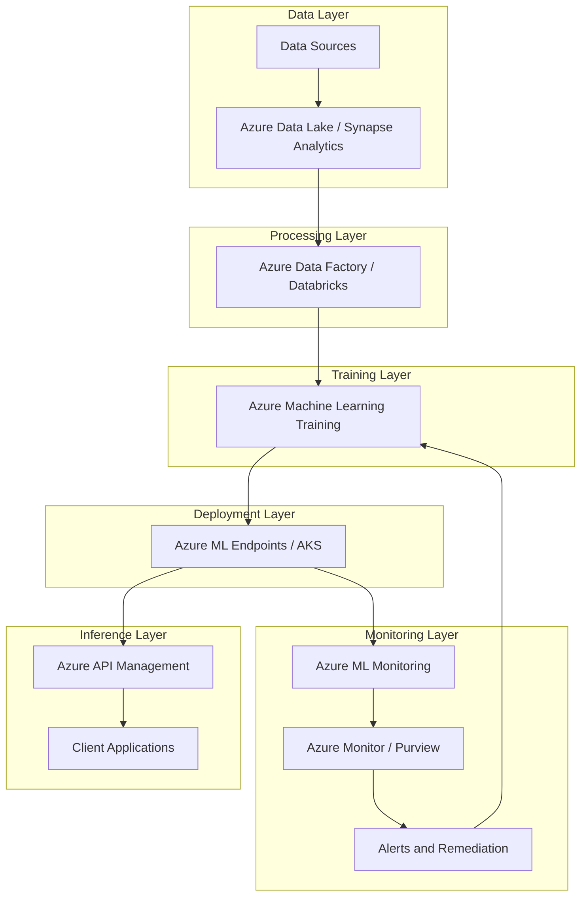
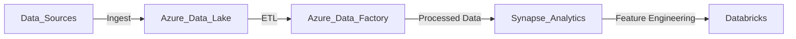
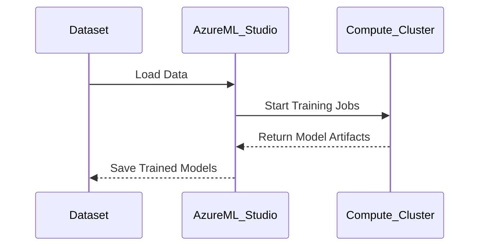
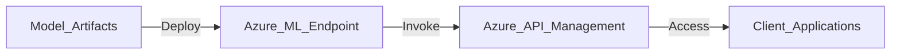
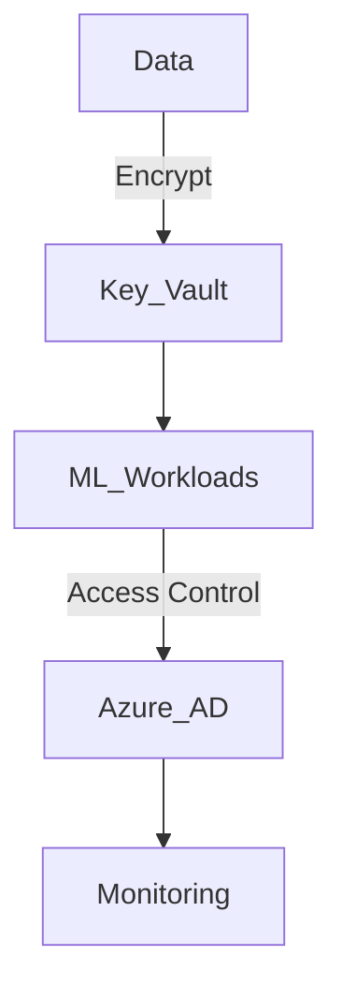
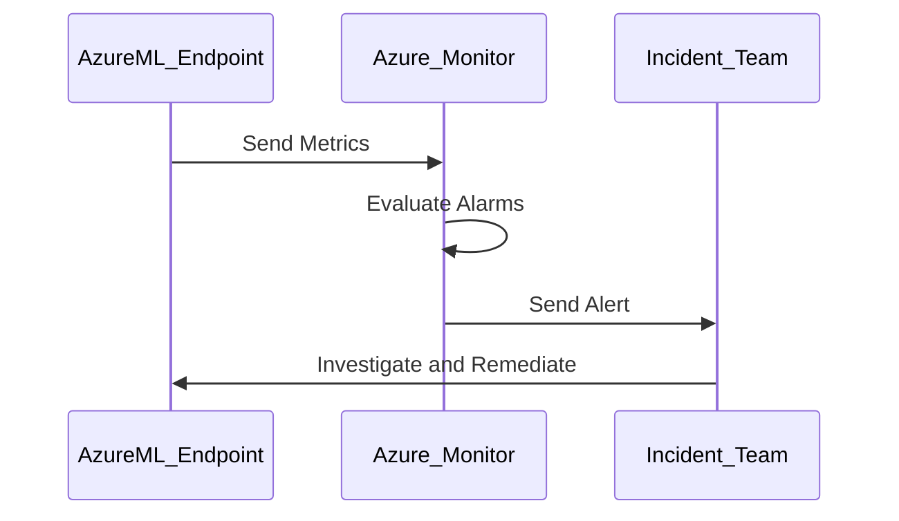

# Azure AI Platform  

## Introduction  

Microsoft Azure provides a powerful and flexible ecosystem of services for building, deploying, and managing AI solutions at scale. With its comprehensive set of AI and machine learning tools, Azure enables organizations to accelerate innovation, drive efficiency, and create intelligent applications while ensuring robust security, compliance, and interoperability across hybrid and multi-cloud environments.  

---

## Azure AI Capabilities Overview  

Azure’s AI services cater to every stage of the AI lifecycle, offering tools for data management, model development, deployment, and monitoring. The platform provides a rich ecosystem for organizations to:  

- **Ingest, process, and manage data** securely and efficiently.  
- **Develop and train models** using Azure Machine Learning and integrated AI frameworks.  
- **Deploy models** on scalable, global infrastructure for real-time or batch inference.  
- **Monitor and maintain models** with governance and compliance tools.  
- **Integrate with existing workflows** through seamless APIs and connectors.  

| Key Area                | Azure Services                                                                                     | Use Case                                         |
|-------------------------|----------------------------------------------------------------------------------------------------|-------------------------------------------------|
| **Data Management**     | Azure Data Lake Storage, Azure Synapse Analytics, Azure Data Factory                              | ETL workflows, big data processing              |
| **AI/ML Development**   | Azure Machine Learning, Azure Cognitive Services, Azure OpenAI                                   | Model training, AutoML, natural language processing |
| **Compute Resources**   | Azure VMs, Azure Kubernetes Service (AKS), Azure Batch                                           | Scalable training and inference infrastructure  |
| **Deployment & Inference** | Azure ML Endpoints, Azure Functions, Azure API Management                                       | Real-time and batch inference                   |
| **Security & Compliance** | Azure Active Directory (AAD), Azure Key Vault, Azure Sentinel                                   | Identity management, encryption, threat detection |
| **Monitoring & Governance** | Azure Monitor, Azure ML Monitoring, Azure Purview                                               | Performance tracking, data governance           |

---

## End-to-End AI Platform Architecture on Azure  

### Architecture Components and Workflow  

An AI platform on Azure integrates multiple services to enable a complete lifecycle for data-driven intelligence:  

1. **Data Management**: Use Azure Data Lake and Synapse Analytics for ingesting and storing data.  
2. **Data Preprocessing**: Transform and clean data with Azure Data Factory.  
3. **Model Training**: Train models in Azure Machine Learning with built-in or custom algorithms.  
4. **Model Deployment**: Deploy models via Azure ML Endpoints or Azure Kubernetes Service (AKS).  
5. **Inference and Serving**: Expose inference endpoints using Azure API Management and secure them with AAD.  
6. **Monitoring and Governance**: Track model performance with Azure ML Monitoring and ensure compliance with Azure Purview.  

---

## Building an AI Platform on Azure: Detailed Workflow  

### Data Management and Preprocessing  

Azure provides robust tools to manage data pipelines and prepare datasets for AI.  

- **Data Storage**: Store large datasets in Azure Data Lake or Synapse Analytics for structured and unstructured data.  
- **ETL Pipelines**: Use Azure Data Factory for automating data ingestion, transformation, and loading.  
- **Interactive Data Processing**: Leverage Azure Databricks for scalable data engineering and feature extraction.  

---

### Model Development and Training  

Azure Machine Learning simplifies the development and training of machine learning models.  

| Feature                  | Benefit                                      |
|--------------------------|----------------------------------------------|
| **AutoML**               | Automates model selection and hyperparameter tuning. |
| **Distributed Training** | Scales workloads across multiple GPUs and VMs. |
| **Integrated Environment** | Provides Jupyter Notebooks, SDKs, and VS Code extensions. |

---

### Deployment and Inference  

Deploy models for real-time or batch inference using Azure ML Endpoints or AKS.  

| Deployment Type          | Technology                                | Use Case                    |
|--------------------------|-------------------------------------------|-----------------------------|
| **Managed Endpoints**    | Azure ML Endpoints                       | Real-time API predictions   |
| **Containerized Inference** | Azure Kubernetes Service (AKS)          | Scalable microservices-based inference |
| **Serverless Predictions** | Azure Functions                        | Lightweight, event-driven predictions |

---

### Security and Compliance  

Azure offers advanced security features to protect sensitive data and models.  

- **Identity Management**: Use Azure Active Directory (AAD) for role-based access control (RBAC).  
- **Encryption**: Secure data at rest and in transit with Azure Key Vault.  
- **Threat Detection**: Monitor threats using Azure Sentinel.  

---

### Monitoring and Incident Management  

Azure provides comprehensive tools to ensure AI systems perform reliably and detect issues proactively.  

| Monitoring Aspect          | Azure Service          | Description                     |
|----------------------------|-----------------------|---------------------------------|
| **Performance Monitoring** | Azure Monitor         | Tracks latency, throughput, and errors. |
| **Model Drift Detection**  | Azure ML Monitoring   | Identifies changes in data distribution. |
| **Compliance Auditing**    | Azure Purview         | Ensures adherence to data governance policies. |

---

## Infrastructure as Code (IaC) and CI/CD Integration  

Azure supports IaC and CI/CD pipelines to streamline resource provisioning and model deployment.  

### Implementing IaC with Azure Resource Manager (ARM)  

- **Template Design**: Define Azure resources in ARM templates or Terraform.  
- **Version Control**: Store templates in GitHub or Azure Repos.  
- **Automated Deployment**: Use Azure DevOps pipelines to deploy resources.  

### CI/CD Pipeline with Azure DevOps  

1. **Source Stage**: Push code and configurations to Azure Repos.  
2. **Build Stage**: Compile and test model code using Azure Pipelines.  
3. **Deploy Stage**: Deploy models to Azure ML Endpoints automatically.  

---

## Business Readiness for Azure AI Adoption  

### Why Azure for AI?  

1. **Enterprise Integration**: Seamless integration with Microsoft products (e.g., Power BI, Office 365).  
2. **Global Reach**: Extensive data centers for low-latency deployments.  
3. **Security Compliance**: Certifications for GDPR, HIPAA, and ISO standards.  

### Steps to Prepare  

| Readiness Factor           | Actions Needed                             |
|----------------------------|--------------------------------------------|
| **Skill Development**      | Train teams using Microsoft Learn resources. |
| **Cost Management**        | Leverage Azure Cost Management for budget forecasting. |
| **Data Strategy**          | Define policies for data ingestion, storage, and sharing. |
| **Process Integration**    | Align AI workflows with existing DevOps practices. |

---

## Best Practices for Azure AI  

1. **Optimize Compute Costs**: Use reserved instances or spot VMs for training jobs.  
2. **Secure Resources**: Enable network isolation and encrypt data with Key Vault.  
3. **Monitor Continuously**: Track model health with Azure Monitor and Purview.  
4. **Automate Workflows**: Use CI/CD pipelines to reduce deployment overhead.  
5. **Scalability Planning**: Leverage AKS for scalable, containerized inference.  

---

By utilizing Azure’s comprehensive AI platform and adhering to best practices, organizations can deliver intelligent, scalable, and secure solutions that drive business value.  