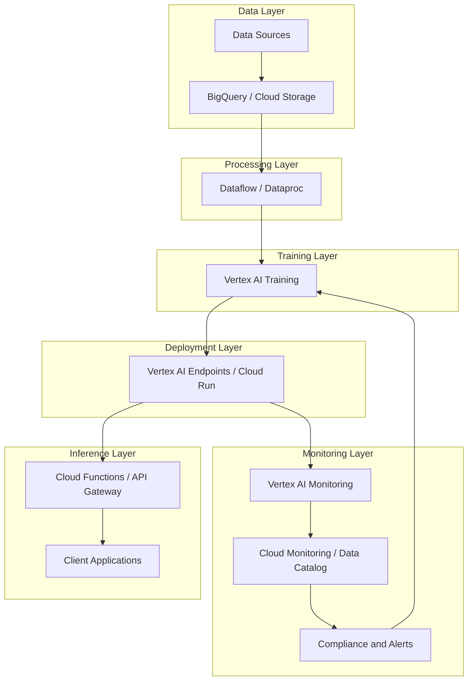
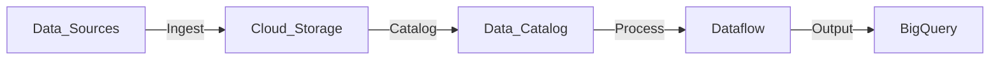
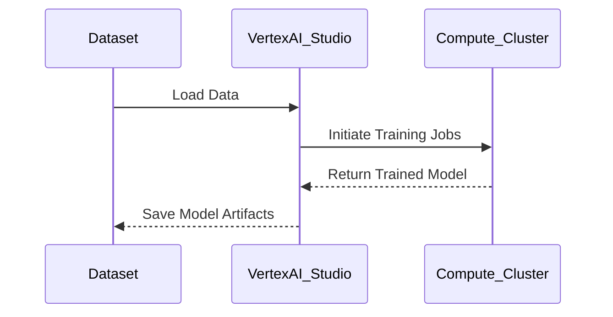
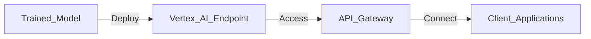
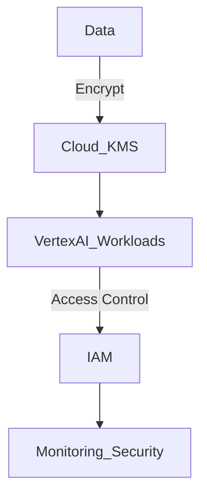
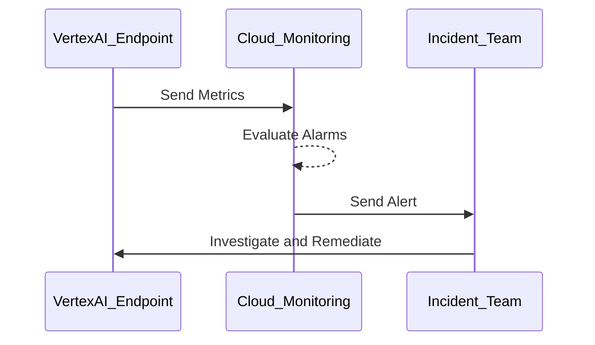
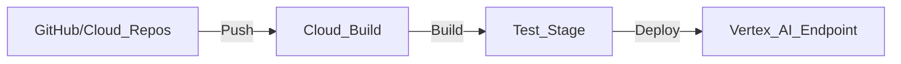

# Google Cloud AI Solutions  

## Introduction  

Google Cloud provides a robust and innovative ecosystem for building, deploying, and managing AI solutions at scale. Known for its pioneering AI technologies, Google Cloud enables organizations to leverage cutting-edge tools, advanced machine learning models, and scalable infrastructure to drive intelligent decision-making, automation, and innovation.  

---

## Google Cloud AI Capabilities Overview  

Google Cloud’s AI services cover every aspect of the AI lifecycle, from data processing and model training to deployment and monitoring. Its platform is designed for developers, data scientists, and enterprises to seamlessly integrate AI into their workflows while ensuring scalability, security, and cost-efficiency.  

| Key Area                  | Google Cloud Services                                                                    | Use Case                                          |
|---------------------------|------------------------------------------------------------------------------------------|--------------------------------------------------|
| **Data Management**       | BigQuery, Cloud Storage, Dataproc, Dataflow                                             | ETL pipelines, data lakes, streaming analytics   |
| **AI/ML Development**     | Vertex AI, TensorFlow, AutoML                                                           | Model development, distributed training, AutoML  |
| **Compute Resources**     | Compute Engine, AI Platform Training, AI Platform GPUs/TPUs, Kubernetes Engine (GKE)    | Scalable compute for training and inference      |
| **Deployment & Inference**| Vertex AI Endpoints, Cloud Functions, Cloud Run                                         | Real-time and batch inference                    |
| **Security & Compliance** | IAM, Cloud KMS, Confidential Computing, Security Command Center                        | Identity management, encryption, and compliance  |
| **Monitoring & Governance**| Vertex AI Model Monitoring, Cloud Monitoring, Data Catalog                              | Model performance tracking, data lineage         |

---

## End-to-End AI Platform Architecture on Google Cloud  

### Architecture Components and Workflow  

Google Cloud integrates its services into a unified platform to support the entire AI lifecycle:  

1. **Data Management**: Use BigQuery and Cloud Storage for secure, scalable data management.  
2. **Data Processing**: Leverage Dataflow and Dataproc for batch and streaming data pipelines.  
3. **Model Training**: Train models with Vertex AI and TensorFlow, utilizing GPUs/TPUs for acceleration.  
4. **Model Deployment**: Deploy models to Vertex AI Endpoints or containerized services like Cloud Run.  
5. **Inference**: Serve predictions via REST APIs or event-driven architecture with Cloud Functions.  
6. **Monitoring and Governance**: Continuously monitor performance and ensure compliance using Vertex AI Monitoring and Data Catalog.  

---

## Building an AI Platform on Google Cloud: Detailed Workflow  

### Data Management and Preprocessing  

Google Cloud provides high-performance services for ingesting, storing, and preparing data.  

- **Data Storage**: Use Cloud Storage for raw and processed data and BigQuery for analytical storage.  
- **Streaming and Batch Processing**: Utilize Dataflow for real-time ETL and Dataproc for distributed batch processing.  
- **Data Cataloging**: Use Data Catalog to maintain metadata and ensure data lineage and compliance.  

---

### Model Development and Training  

Vertex AI provides an integrated environment for model training, combining simplicity with scalability.  

| Feature                  | Benefit                                      |
|--------------------------|----------------------------------------------|
| **Prebuilt Models**      | Access Google’s pretrained models for NLP, vision, and more. |
| **AutoML**               | Automate model training and hyperparameter tuning. |
| **Distributed Training** | Scale training jobs across GPUs and TPUs for faster results. |

---

### Deployment and Inference  

Google Cloud offers multiple options for deploying AI models, ranging from managed endpoints to containerized services.  

| Deployment Type          | Technology                                   | Use Case                    |
|--------------------------|----------------------------------------------|-----------------------------|
| **Managed Endpoints**    | Vertex AI Endpoints                         | Real-time API predictions   |
| **Containerized Services** | Cloud Run                                  | Scalable, serverless inference |
| **Event-Driven Predictions** | Cloud Functions                         | Lightweight, asynchronous tasks |

---

### Security and Compliance  

Google Cloud ensures the security and privacy of AI systems through advanced tools and protocols.  

- **Identity and Access Management**: Enforce least privilege with Cloud IAM.  
- **Data Encryption**: Protect sensitive data with Cloud KMS and default encryption at rest and in transit.  
- **Confidential Computing**: Ensure data security during computation with Confidential VM.  
- **Threat Detection**: Use Security Command Center to detect and mitigate potential vulnerabilities.  

---

### Monitoring and Incident Management  

Google Cloud offers comprehensive monitoring tools to track system performance and ensure reliability.  

| Monitoring Aspect          | Google Cloud Service       | Description                      |
|----------------------------|----------------------------|----------------------------------|
| **Performance Monitoring** | Cloud Monitoring           | Tracks latency, throughput, and errors. |
| **Model Drift Detection**  | Vertex AI Model Monitoring | Identifies data or concept drift. |
| **Compliance Auditing**    | Data Catalog               | Ensures data governance policies are met. |

---

## Infrastructure as Code (IaC) and CI/CD Integration  

Google Cloud supports automated resource provisioning and model deployment through IaC and CI/CD tools.  

### Implementing IaC with Terraform  

- **Template Development**: Define Google Cloud resources in Terraform scripts.  
- **Version Control**: Store templates in GitHub or Cloud Source Repositories.  
- **Automated Deployment**: Use Cloud Build to automate the application of Terraform configurations.  

### CI/CD Pipeline with Cloud Build  

1. **Source Stage**: Store code and configurations in Cloud Source Repositories or GitHub.  
2. **Build Stage**: Use Cloud Build to test and package models.  
3. **Deploy Stage**: Deploy models to Vertex AI Endpoints or Cloud Run.  

---

## Business Readiness for Google Cloud AI Adoption  

### Why Google Cloud for AI?  

1. **State-of-the-Art Models**: Access Google’s pre-trained models and frameworks.  
2. **Cost Efficiency**: Optimize costs with flexible pricing and spot VM instances.  
3. **Global Reach**: Operate AI systems globally with low-latency infrastructure.  
4. **Data Privacy**: Ensure compliance with GDPR, HIPAA, and other regulations.  

### Preparing for Adoption  

| Readiness Factor           | Actions Needed                             |
|----------------------------|--------------------------------------------|
| **Skills Development**     | Train teams with Google Cloud training resources. |
| **Cost Planning**          | Use Google Cloud Pricing Calculator to estimate expenses. |
| **Data Governance**        | Establish robust policies with Data Catalog. |
| **Workflow Integration**   | Align Google Cloud services with existing development practices. |

---

## Best Practices for Google Cloud AI  

1. **Optimize Costs**: Use preemptible VMs and monitor costs with Cloud Billing.  
2. **Secure Resources**: Leverage IAM, encryption, and Confidential Computing.  
3. **Monitor Continuously**: Track performance with Vertex AI Monitoring and Cloud Monitoring.  
4. **Automate Workflows**: Use CI/CD pipelines to streamline development and deployment.  
5. **Leverage Pre-Trained Models**: Save time by integrating Google’s pretrained models into your workflows.  

---

By leveraging Google Cloud’s comprehensive AI tools and adhering to best practices, organizations can create scalable, secure, and intelligent solutions to drive business growth and innovation.  