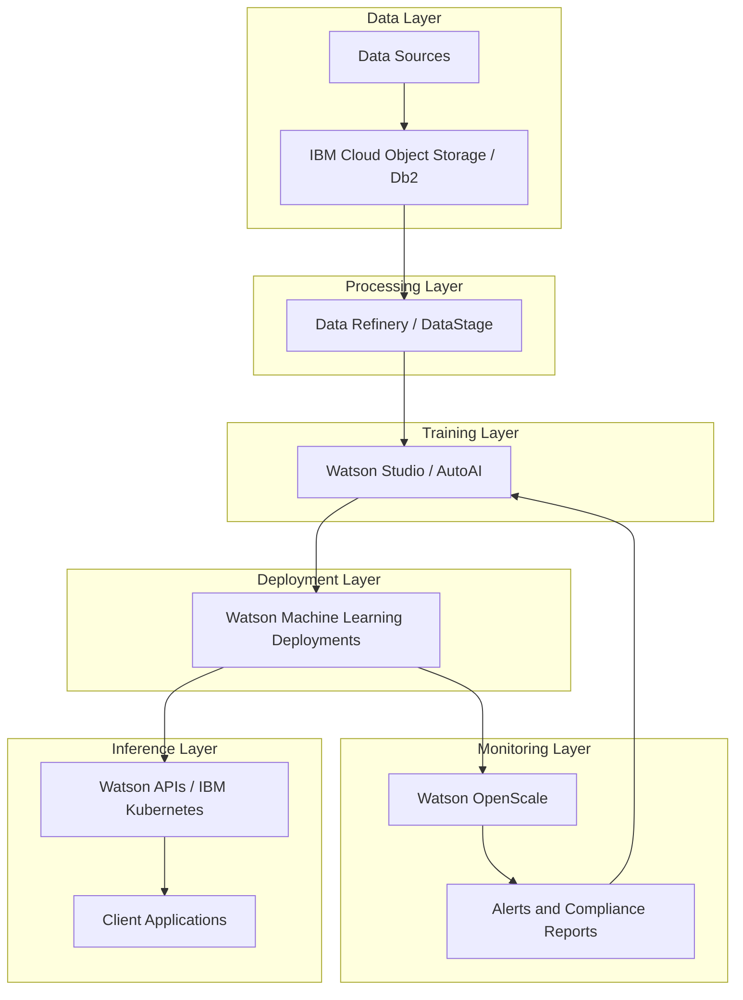
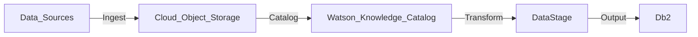
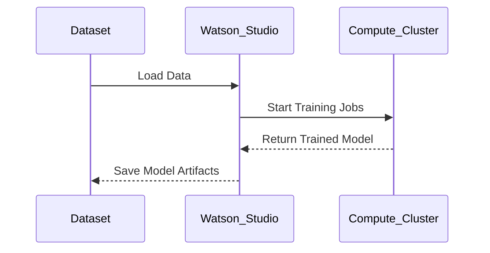
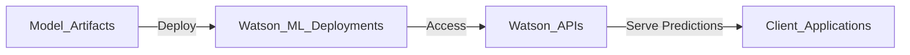
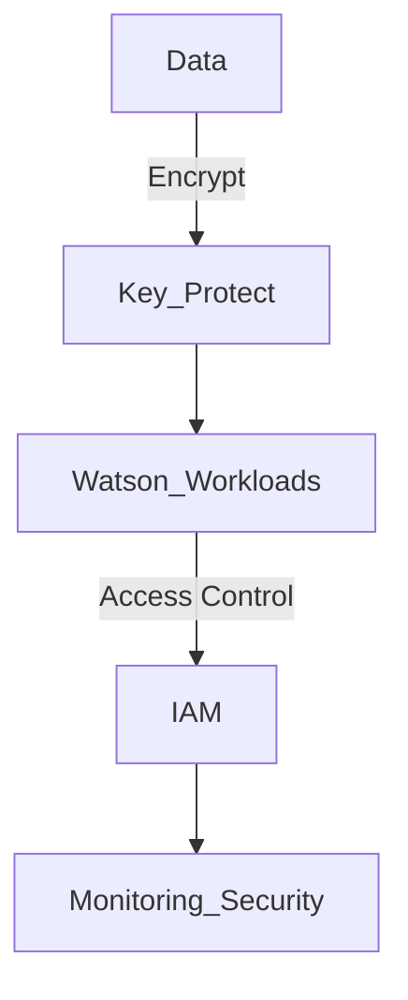
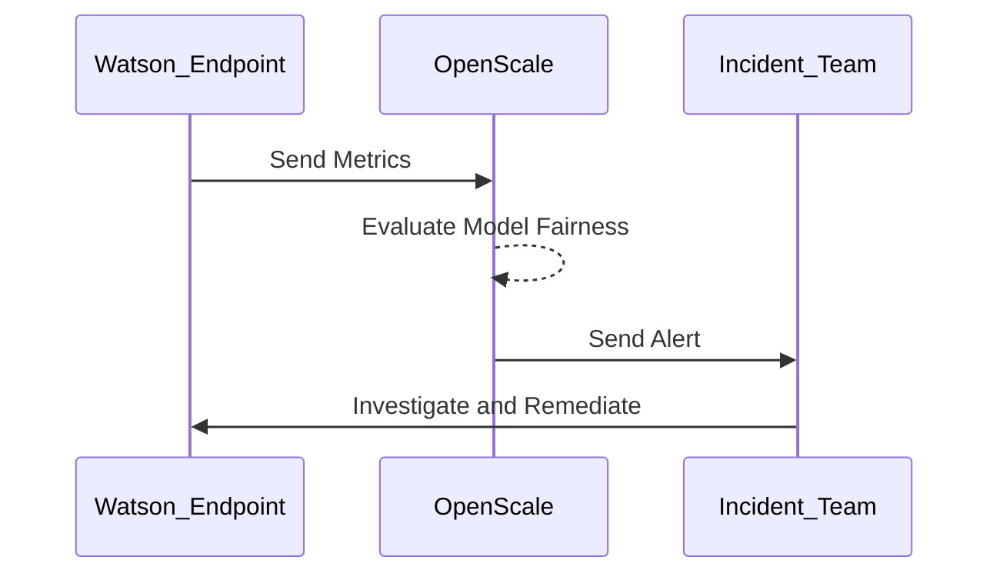
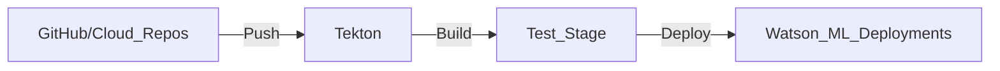

# IBM Watson on Cloud  

## Introduction  

IBM Watson on Cloud is a powerful AI platform designed to enable enterprises to build, deploy, and scale AI-driven applications. By combining Watson’s advanced AI capabilities with IBM’s cloud infrastructure, organizations can harness natural language processing, machine learning, and data analytics to automate processes, derive insights, and innovate at scale. IBM Watson emphasizes security, compliance, and hybrid cloud flexibility, making it a preferred choice for industries with stringent regulatory requirements.  

---

## IBM Watson AI Capabilities Overview  

IBM Watson provides an end-to-end ecosystem of services tailored to the AI lifecycle. It empowers organizations to:  

- **Ingest, process, and manage data** securely across hybrid environments.  
- **Develop and train models** using Watson Studio and AutoAI tools.  
- **Deploy AI models** for scalable real-time and batch inference.  
- **Integrate AI solutions** with existing systems using APIs.  
- **Monitor and govern AI systems** to ensure compliance and performance.  

| Key Area                  | IBM Watson Services                                                                 | Use Case                                           |
|---------------------------|-------------------------------------------------------------------------------------|---------------------------------------------------|
| **Data Management**       | IBM Cloud Object Storage, IBM Db2, DataStage, Data Refinery                         | Data lakes, ETL, and structured data management   |
| **AI/ML Development**     | Watson Studio, Watson Machine Learning, AutoAI                                     | Model training, AutoML, and experimentation       |
| **Compute Resources**     | IBM Cloud Kubernetes Service, Bare Metal Servers, Virtual Servers                  | Scalable compute for training and inference       |
| **Deployment & Inference**| Watson Machine Learning Deployments, Watson APIs                                   | Real-time and batch inference                     |
| **Security & Compliance** | IBM Cloud IAM, Key Protect, IBM Security Advisor                                   | Identity management, encryption, and threat detection |
| **Monitoring & Governance**| Watson OpenScale, Watson Knowledge Catalog                                         | Model monitoring, fairness checks, data lineage   |

---

## End-to-End AI Platform Architecture on IBM Watson  

### Architecture Components and Workflow  

An AI platform built on IBM Watson integrates key services for data processing, model development, deployment, and monitoring:  

1. **Data Management**: Use IBM Cloud Object Storage or Db2 for secure, scalable storage.  
2. **Data Preprocessing**: Clean and prepare data using Data Refinery and DataStage.  
3. **Model Training**: Develop and train models in Watson Studio with built-in or custom algorithms.  
4. **Model Deployment**: Deploy models via Watson Machine Learning Deployments or containerized services.  
5. **Inference and Serving**: Serve predictions using Watson APIs or IBM Kubernetes.  
6. **Monitoring and Governance**: Track fairness, explainability, and performance with Watson OpenScale.  

---

## Building an AI Platform on IBM Watson: Detailed Workflow  

### Data Management and Preprocessing  

IBM Watson provides advanced tools for data ingestion, transformation, and governance.  

- **Data Storage**: Store structured and unstructured data in IBM Cloud Object Storage or Db2.  
- **ETL Pipelines**: Use DataStage for large-scale ETL workflows.  
- **Interactive Data Processing**: Leverage Data Refinery for interactive data cleaning and feature engineering.  

---

### Model Development and Training  

Watson Studio enables collaborative and scalable AI model development with support for AutoAI and custom machine learning pipelines.  

| Feature                  | Benefit                                      |
|--------------------------|----------------------------------------------|
| **AutoAI**               | Automates feature selection, model training, and hyperparameter tuning. |
| **Jupyter Notebooks**    | Provides flexibility for custom code development. |
| **Distributed Training** | Scales across Kubernetes clusters or IBM bare metal servers. |

---

### Deployment and Inference  

IBM Watson offers multiple options for deploying and serving AI models.  

| Deployment Type          | Technology                                   | Use Case                    |
|--------------------------|----------------------------------------------|-----------------------------|
| **Managed Deployment**   | Watson Machine Learning Deployments         | Real-time API predictions   |
| **Containerized Services** | IBM Cloud Kubernetes                       | Scalable, microservices-based inference |
| **Batch Processing**     | Watson APIs                                 | Large-scale batch inference |

---

### Security and Compliance  

Security is a cornerstone of IBM Watson’s AI platform, with advanced tools to ensure data and model protection.  

- **Identity and Access Control**: Manage permissions with IBM Cloud IAM.  
- **Encryption**: Use Key Protect to secure sensitive data and model artifacts.  
- **Compliance**: Leverage Watson OpenScale to enforce fairness, explainability, and regulatory compliance.  

---

### Monitoring and Incident Management  

IBM Watson’s monitoring tools ensure reliable model performance and compliance.  

| Monitoring Aspect          | IBM Watson Service       | Description                      |
|----------------------------|--------------------------|----------------------------------|
| **Performance Monitoring** | Watson OpenScale         | Tracks latency, accuracy, and error rates. |
| **Fairness Detection**     | Watson OpenScale         | Identifies and mitigates model bias. |
| **Compliance Auditing**    | Watson Knowledge Catalog | Ensures data lineage and governance policies. |

---

## Infrastructure as Code (IaC) and CI/CD Integration  

IBM Cloud supports IaC and CI/CD to automate resource provisioning and model deployments.  

### Implementing IaC with IBM Terraform Templates  

- **Template Design**: Define resources like Kubernetes clusters and storage using Terraform scripts.  
- **Version Control**: Store Terraform templates in GitHub or IBM Cloud Repos.  
- **Automated Deployment**: Use IBM Cloud Schematics for applying Terraform configurations.  

### CI/CD Pipeline with Tekton  

1. **Source Stage**: Push code and configurations to IBM Cloud Repos.  
2. **Build Stage**: Use Tekton to test and package models.  
3. **Deploy Stage**: Automate deployment to Watson Machine Learning or Kubernetes.  

---

## Business Readiness for IBM Watson AI  

### Why IBM Watson for AI?  

1. **Enterprise Focus**: Tailored for industries like healthcare, finance, and manufacturing with regulatory requirements.  
2. **Hybrid Cloud Flexibility**: Seamless integration across on-prem, cloud, and multi-cloud environments.  
3. **AI Governance**: Built-in fairness, transparency, and compliance tools.  

### Preparing for Adoption  

| Readiness Factor           | Actions Needed                             |
|----------------------------|--------------------------------------------|
| **Skills Development**     | Train teams with IBM Skills Academy resources. |
| **Cost Planning**          | Use IBM Cloud Pricing Calculator to forecast expenses. |
| **Data Governance**        | Define policies with Watson Knowledge Catalog. |
| **Workflow Integration**   | Align Watson services with existing business processes. |

---

## Best Practices for IBM Watson AI  

1. **Optimize Compute Costs**: Use resource tagging and autoscaling for efficient usage.  
2. **Secure Resources**: Implement IAM policies and encrypt sensitive data.  
3. **Monitor Continuously**: Use Watson OpenScale for real-time fairness and performance tracking.  
4. **Leverage Pre-Trained Models**: Use Watson APIs for tasks like NLP and vision to save development time.  
5. **Automate Workflows**: Use CI/CD pipelines to streamline deployments and updates.  

---

By leveraging IBM Watson’s extensive suite of AI tools and adhering to best practices, organizations can create intelligent, secure, and scalable AI solutions tailored to enterprise needs.  