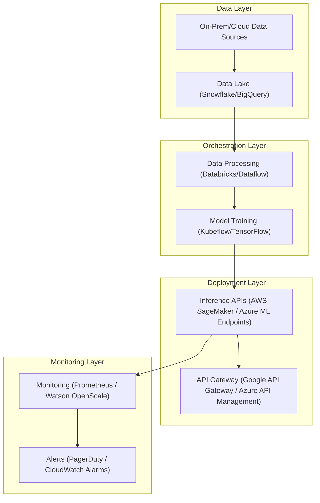
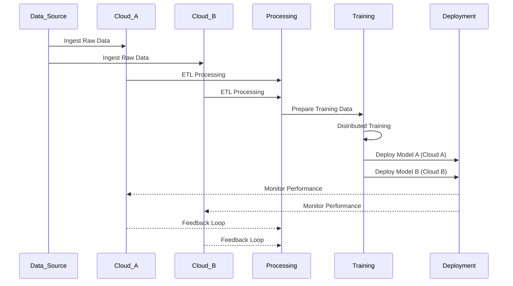
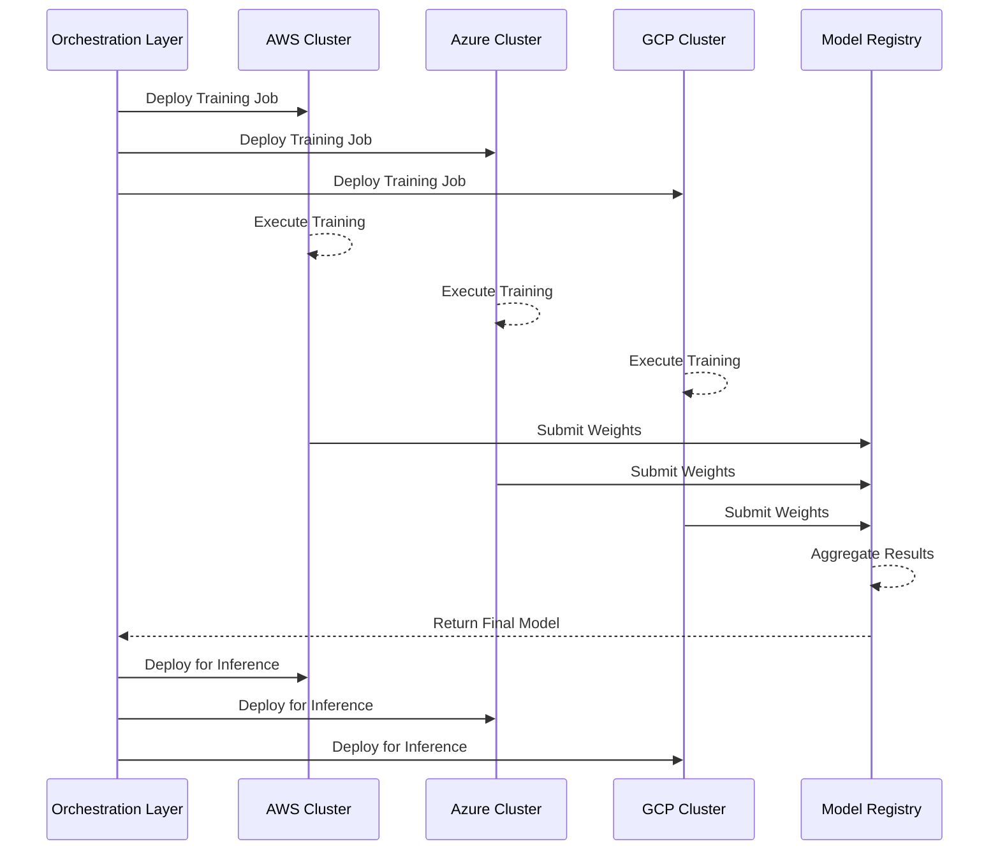
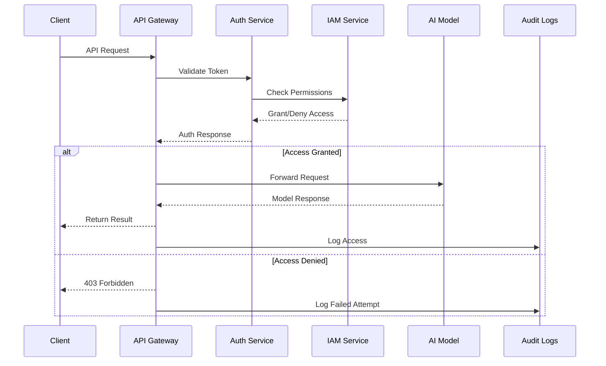
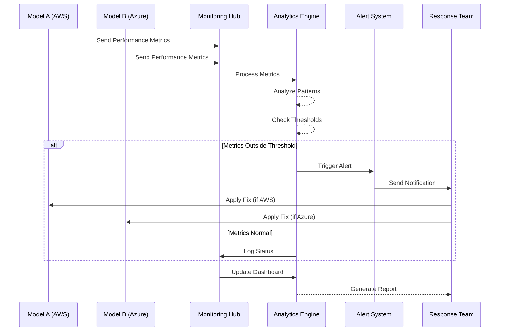
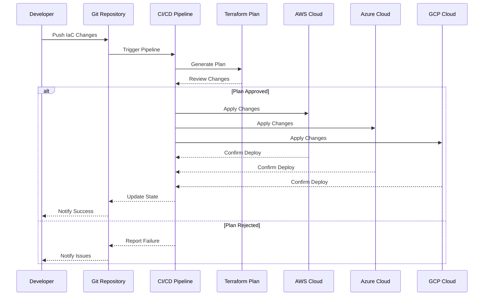

# Multi-Cloud AI Strategies  

## Introduction  

A **Multi-cloud AI strategy** leverages the strengths of multiple cloud providers to build resilient, scalable, and cost-efficient AI solutions. This approach enables enterprises to harness the unique capabilities of different platforms while avoiding vendor lock-in and ensuring flexibility for evolving business needs. Multi-cloud AI architectures address challenges like data locality, compliance requirements, and workload distribution by providing the tools and workflows necessary to operate seamlessly across multiple cloud environments.  

---

## Why Choose a Multi-Cloud AI Strategy?  

### Benefits  

1. **Avoid Vendor Lock-In**: Flexibility to switch or combine providers based on specific needs.  
2. **Leverage Best-in-Class Tools**: Access specialized AI services from different cloud providers, such as Google’s TensorFlow, AWS SageMaker, and Azure Cognitive Services.  
3. **Cost Optimization**: Dynamically allocate workloads to the most cost-effective provider.  
4. **Improved Resilience**: Distribute workloads across providers to ensure uptime and mitigate risks of outages.  
5. **Compliance and Localization**: Meet regional compliance requirements by using multiple data centers.  

---

## Capabilities of a Multi-Cloud AI Platform  

| Capability                  | Description                                                                 | Example                                                                 |
|-----------------------------|-----------------------------------------------------------------------------|-------------------------------------------------------------------------|
| **Data Management**         | Seamlessly move, replicate, or sync data across clouds.                    | Snowflake, Databricks                                                  |
| **Compute Orchestration**   | Run workloads across cloud environments using consistent APIs.             | Kubernetes, Anthos, Azure Arc                                          |
| **Model Training**          | Use distributed training across multi-cloud resources.                     | Horovod on Kubernetes                                                  |
| **Model Deployment**        | Deploy models in a way that supports scaling and failover across clouds.   | Kubeflow Pipelines, SageMaker on Kubernetes                            |
| **Monitoring and Governance** | Track model performance and ensure compliance across providers.            | Prometheus, Grafana, Watson OpenScale                                  |

---

## Challenges and Solutions  

| Challenge                   | Solution                                                                       |
|-----------------------------|-------------------------------------------------------------------------------|
| **Data Movement Costs**     | Minimize cross-cloud data transfer by processing data locally or using CDNs.   |
| **Interoperability**        | Use open-source frameworks like TensorFlow and PyTorch for cross-cloud compatibility. |
| **Security Across Clouds**  | Implement unified identity and access management with tools like IAM or SSO.   |
| **Performance Monitoring**  | Use multi-cloud monitoring tools like Datadog or centralized logging with ELK stack. |
| **Compliance and Governance** | Leverage hybrid platforms for unified governance, such as IBM Cloud Pak or Azure Arc. |

---

## Multi-Cloud AI Architecture  

A multi-cloud AI architecture integrates key components like data pipelines, model training, inference, and monitoring into a unified ecosystem, allowing workloads to operate seamlessly across cloud providers.  

---

## Workflow for a Multi-Cloud AI Platform  

### Data Management and Processing Flow

A comprehensive multi-cloud AI workflow involves data ingestion, processing, training, and deployment across different cloud providers.

This workflow demonstrates:
- Parallel data ingestion across clouds
- Distributed processing and training
- Multi-cloud model deployment
- Performance monitoring
- Continuous feedback loop

### Data Processing Strategy

- **Data Locality**: Process data where it resides to minimize transfer costs
- **Parallel Processing**: Utilize distributed computing across clouds
- **Performance Optimization**: Balance workloads based on cloud-specific strengths

---

### Compute Orchestration  

Deploy workloads dynamically across clouds to optimize performance and costs.  

- **Container Orchestration**: Use Kubernetes or Anthos to manage multi-cloud deployments.  
- **Distributed Training**: Implement Horovod with TensorFlow for multi-cloud GPU/TPU training.  
- **Failover and Load Balancing**: Use multi-cloud load balancers to ensure uptime.  

This sequence shows:
- Parallel training distribution
- Multi-cloud execution
- Model weight aggregation
- Synchronized deployment
- Cross-cloud orchestration flow

---

### Model Deployment  

Deploy models flexibly across clouds to support real-time inference and batch processing.  

| Deployment Type          | Description                                   | Technology                              |
|--------------------------|-----------------------------------------------|-----------------------------------------|
| **Real-Time Deployment** | Expose models as APIs for real-time inference.| Vertex AI Endpoints, SageMaker Endpoints|
| **Batch Processing**     | Perform inference on large datasets.          | Azure Batch AI, Dataproc                |
| **Containerized Models** | Use containers to deploy models on any cloud. | Docker, Kubernetes                      |

---

### Security Across Clouds  

Multi-cloud AI requires unified security policies to protect data and models across environments.  

- **Identity Management**: Use SSO and IAM for consistent user access control  
- **Data Encryption**: Encrypt data at rest and in transit using tools like AWS KMS, Azure Key Vault, or Google Cloud KMS  
- **Secure API Access**: Implement OAuth or API keys for authentication  

The diagram demonstrates:
- Request authentication flow
- Permission validation
- Access control enforcement
- Audit logging
- Error handling

### Monitoring and Governance  

Unified monitoring ensures that AI models deployed across multiple clouds remain performant, compliant, and fair.  

- **Performance Monitoring**: Use Prometheus or Grafana for centralized dashboards.  
- **Governance Tools**: Ensure model explainability and fairness with IBM Watson OpenScale or Azure ML Monitoring.  
- **Alerting and Incident Management**: Implement multi-cloud alerting with PagerDuty or Datadog.  

This enhanced sequence diagram shows:
- Multi-cloud model monitoring
- Centralized metrics processing
- Automated analysis and threshold checks
- Alert routing and response workflow
- Model remediation paths
- Reporting and documentation flow

---

## Infrastructure as Code (IaC) for Multi-Cloud

### Implementing IaC

- **Cross-Cloud Templates**: Use Terraform or Pulumi for defining multi-cloud resources
- **Version Control**: Store IaC configurations in GitHub or GitLab for collaboration
- **Automated Deployments**: Implement CI/CD pipelines for multi-cloud provisioning

### Example IaC Workflow

### Key IaC Components

| Component | Purpose | Tools |
|-----------|---------|-------|
| **Templates** | Define infrastructure | Terraform, Pulumi |
| **State Management** | Track resources | Terraform Cloud, S3 |
| **CI/CD Integration** | Automate deployments | Jenkins, GitHub Actions |
| **Validation** | Check configurations | Checkov, tflint |

---

## Business Readiness for Multi-Cloud AI  

### Preparing for Multi-Cloud  

| Readiness Factor           | Key Steps                                     |
|----------------------------|----------------------------------------------|
| **Skill Development**      | Train teams on Kubernetes, Terraform, and multi-cloud tools. |
| **Cost Management**        | Use tools like CloudHealth to monitor and optimize costs. |
| **Data Strategy**          | Develop policies for data localization and replication. |
| **Governance**             | Implement a centralized governance framework. |

---

## Best Practices for Multi-Cloud AI  

1. **Optimize Workloads**: Match workloads to the strengths of each cloud provider.  
2. **Secure Everywhere**: Implement consistent security policies across environments.  
3. **Monitor Continuously**: Use unified monitoring tools for cross-cloud visibility.  
4. **Standardize IaC**: Use Terraform or similar tools to manage infrastructure consistently.  
5. **Automate Workflows**: Leverage CI/CD pipelines to streamline deployments.  

---

By adopting a well-designed multi-cloud AI strategy, organizations can achieve flexibility, resilience, and innovation at scale while ensuring cost efficiency and compliance.  