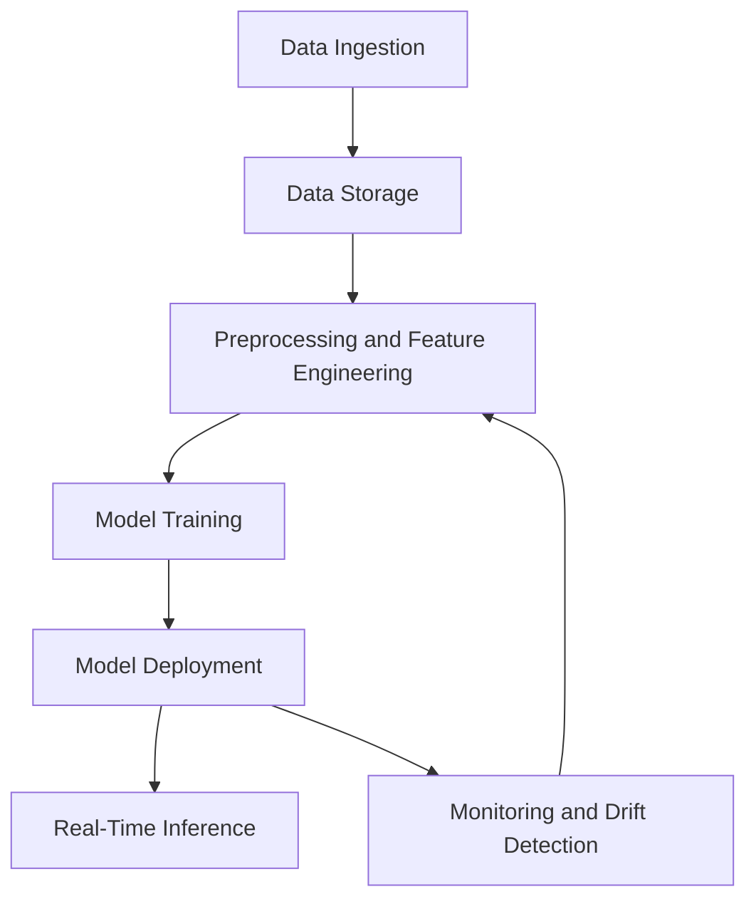
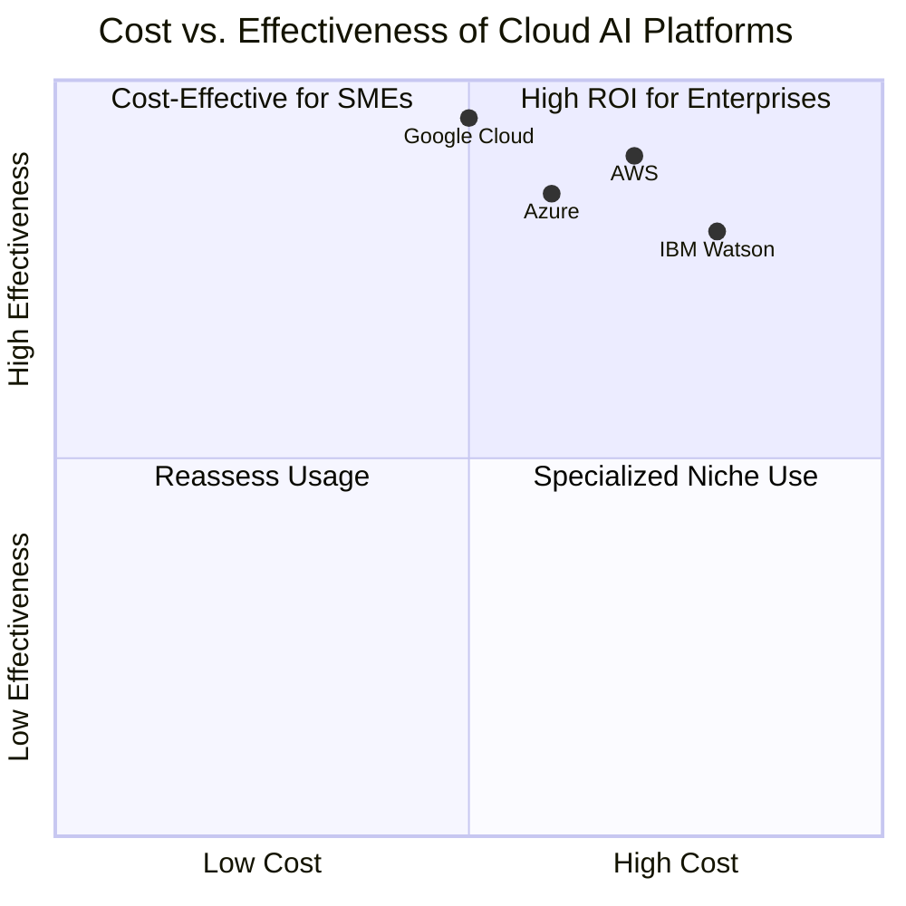
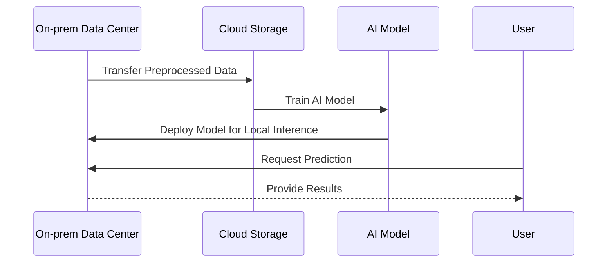
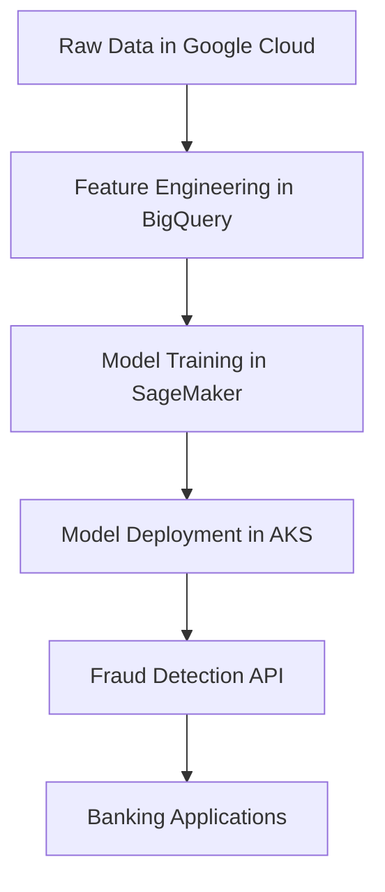

# Cloud Platforms for AI  

Cloud platforms have become indispensable for building, deploying, and scaling AI solutions. A **Cloud AI Platform** integrates various technologies and services to facilitate AI workflows, including data storage, compute resources, model development, deployment, and monitoring. This section provides an overview of leading cloud providers for AI and examines their capabilities, architectures, costs, and interoperability across different cloud and hybrid environments.

---

## What Defines a Cloud AI Platform?  

A **Cloud AI Platform** combines infrastructure, tools, and managed services to support the end-to-end lifecycle of AI solutions. Its primary goals are to simplify development, accelerate deployment, and enable scalability while addressing concerns around data security, compliance, and cost-efficiency.  

### Key Capabilities of a Cloud AI Platform  

| Capability                  | Description                                                                 |
|-----------------------------|-----------------------------------------------------------------------------|
| **Data Management**         | Tools for ingesting, storing, preprocessing, and analyzing data at scale.   |
| **Compute Infrastructure**  | Scalable compute resources, including CPUs, GPUs, and TPUs, for training and inference. |
| **Model Development**       | AI/ML frameworks, managed environments, and AutoML capabilities.           |
| **Deployment and Serving**  | Tools for deploying models as APIs or microservices with low-latency serving.|
| **Monitoring and Governance** | Services for tracking model performance, managing drift, and ensuring compliance.|
| **Integration Options**     | APIs and connectors to integrate with existing systems, whether cloud-native, hybrid, or on-premises.|

---

## Cloud AI Architecture Overview  

A generic Cloud AI architecture typically includes the following layers:  

1. **Data Layer**: Handles data ingestion, preprocessing, and storage.
2. **Compute Layer**: Provides the necessary resources for training and inference.
3. **AI Development Tools**: Includes SDKs, managed services, and frameworks.
4. **Model Deployment and Serving**: Enables scalable, real-time AI service delivery.
5. **Monitoring and Governance**: Tracks performance, ensures compliance, and supports continuous improvement.  

### Cloud AI Workflow  

---

## Comparative Overview of Leading Cloud Platforms  

| Feature/Provider           | **AWS**                     | **Azure**                   | **Google Cloud**            | **IBM Watson**              |
|----------------------------|-----------------------------|-----------------------------|-----------------------------|-----------------------------|
| **Data Management**        | S3, Redshift, Lake Formation | Data Lake, Synapse Analytics | BigQuery, Dataflow          | Cloud Object Storage, Db2   |
| **Compute Resources**      | EC2, SageMaker Notebooks, Inferentia | VMs, AKS, Azure ML Compute  | Vertex AI Workbench, GPUs, TPUs | Watson Studio, Power Systems |
| **AI/ML Tools**            | SageMaker, Rekognition, Polly | Azure ML, Cognitive Services| Vertex AI, AutoML, BigQuery ML | Watson Studio, Watson NLP   |
| **Deployment**             | SageMaker Endpoints         | Azure Kubernetes Service    | Vertex AI Prediction        | Watson APIs                 |
| **Monitoring**             | SageMaker Model Monitor     | Azure Monitor               | Vertex AI Monitoring        | Watson OpenScale            |
| **Hybrid/Edge Support**    | Outposts, IoT Greengrass    | Azure Arc                   | Anthos, IoT Core            | Watson Anywhere             |
| **Ease of Multi-cloud**    | Moderate                    | Moderate                    | High                        | High                        |
| **Cost Effectiveness**     | High scalability but expensive for small workloads. | Flexible, enterprise-friendly.| Cost-effective for large-scale AI workloads.| Specialized for enterprises. |

---

## Cost and Effectiveness  

Cost-effectiveness depends on workload size, duration, and architecture complexity. Key considerations include:  

1. **Data Transfer Costs**: Moving data between regions or providers can incur significant fees.  
2. **Compute Pricing**: GPUs and TPUs can be expensive, particularly for continuous workloads.  
3. **Service Licensing**: Managed services like AutoML and NLP APIs often charge per use or per prediction.  

### Cost vs. Effectiveness  

---

## Interoperability: Cloud, Multi-cloud, and Hybrid  

### Cloud-Native AI  

For workloads entirely within a single provider, integration is seamless. Examples include:  
- Training AI models on **AWS SageMaker** with data stored in **S3**.  
- Using **Azure ML** with data in **Data Lake Storage**.  

---

### Multi-cloud AI  

Multi-cloud strategies involve leveraging services across multiple providers. For example:  
- Using **Google BigQuery** for analytics while deploying models in **Azure Kubernetes Service (AKS)**.  

| Challenge                     | Solution                                   |
|-------------------------------|-------------------------------------------|
| **Data Movement Costs**       | Use connectors like **Databricks** or **Snowflake** for cross-cloud data access.|
| **Model Interoperability**    | Adopt containerized deployments using **Docker** and **Kubernetes**.|
| **Monitoring Across Clouds**  | Employ centralized monitoring tools like **Prometheus** or **Datadog**. |

---

### Hybrid AI  

Hybrid AI supports environments where data resides both on-premises and in the cloud. Key tools include:  

| Provider          | Hybrid Tool/Service               | Description                                   |
|-------------------|------------------------------------|---------------------------------------------|
| **AWS**           | Outposts, Greengrass              | Extends AWS services to on-prem environments.|
| **Azure**         | Azure Arc                         | Manages resources across on-prem and cloud.  |
| **Google Cloud**  | Anthos                            | Enables consistent hybrid and multi-cloud AI.| 
| **IBM**           | Watson Anywhere                   | Deploy Watson AI models across any environment.|

#### Hybrid AI Workflow  

---

## What Makes a Platform a "Cloud AI Platform"?  

A comprehensive **Cloud AI Platform** requires the following technologies and services:  

| Component                | Description                                  | Examples                     |
|--------------------------|----------------------------------------------|------------------------------|
| **Data Storage**         | Secure, scalable storage for structured and unstructured data.| S3, BigQuery, Azure Data Lake.|
| **Compute Resources**    | Scalable compute for training and inference.| GPUs, TPUs, Kubernetes.      |
| **Development Tools**    | Frameworks and SDKs for AI/ML development.  | TensorFlow, PyTorch, AutoML. |
| **Deployment and APIs**  | Tools for deploying and exposing models.    | Kubernetes, API Gateways.    |
| **Monitoring**           | Tools to track and manage model performance.| Prometheus, SageMaker Monitor.|
| **Security and Compliance**| Features for securing data and models while ensuring regulatory compliance.| IAM, VPCs, encryption tools. |

---

## Real-World Use Case: Multi-cloud AI for Fraud Detection  

### Scenario  

A financial organization processes data across different regions, leveraging multiple cloud platforms for AI-based fraud detection:  

1. **Google BigQuery** for analytics and feature engineering.  
2. **AWS SageMaker** for model training.  
3. **Azure Kubernetes Service (AKS)** for deploying models closer to users.  

#### Workflow  

---

## Best Practices for Selecting a Cloud AI Platform  

1. **Evaluate Data Proximity**: Choose platforms that minimize data transfer costs.  
2. **Optimize Compute Costs**: Select appropriate compute resources for your workload.  
3. **Ensure Scalability**: Prioritize platforms with auto-scaling capabilities for growing workloads.  
4. **Focus on Interoperability**: Use containerized deployments for seamless multi-cloud or hybrid workflows.  
5. **Integrate Monitoring**: Employ centralized tools for tracking model performance across environments.  

---

## Next Steps  

Dive deeper into specific cloud AI platforms and strategies:  

1. [AWS AI Services and Architecture](01-AWS-AI-Services-and-Architecture.md): Explore AI services offered by AWS.  
2. [Azure AI Platform](02-Azure-AI-Platform.md): Learn about AI capabilities in Azure.  
3. [Google Cloud AI Solutions](03-Google-Cloud-AI-Solutions.md): Discover AI tools and services in Google Cloud.  
4. [IBM Watson on Cloud](04-IBM-Watson-on-Cloud.md): Understand how IBM Watson facilitates AI deployments.  
5. [Multi-cloud AI Strategies](05-Multi-cloud-AI-Strategies.md): Learn about building robust multi-cloud AI systems.  

By leveraging the right cloud AI platform, organizations can unlock powerful capabilities while optimizing costs and ensuring scalability, flexibility, and compliance.