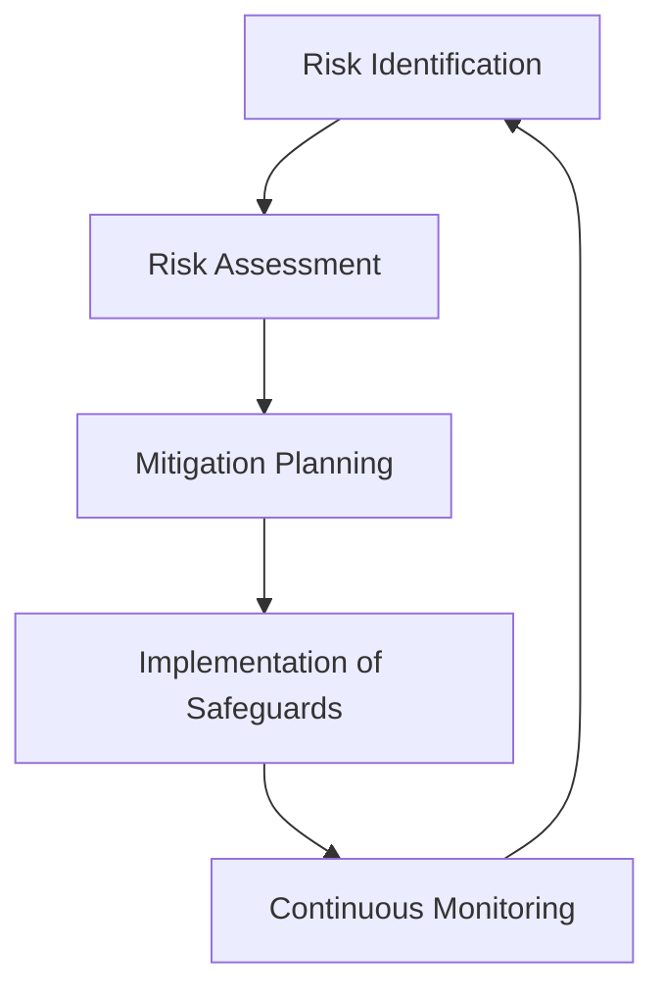
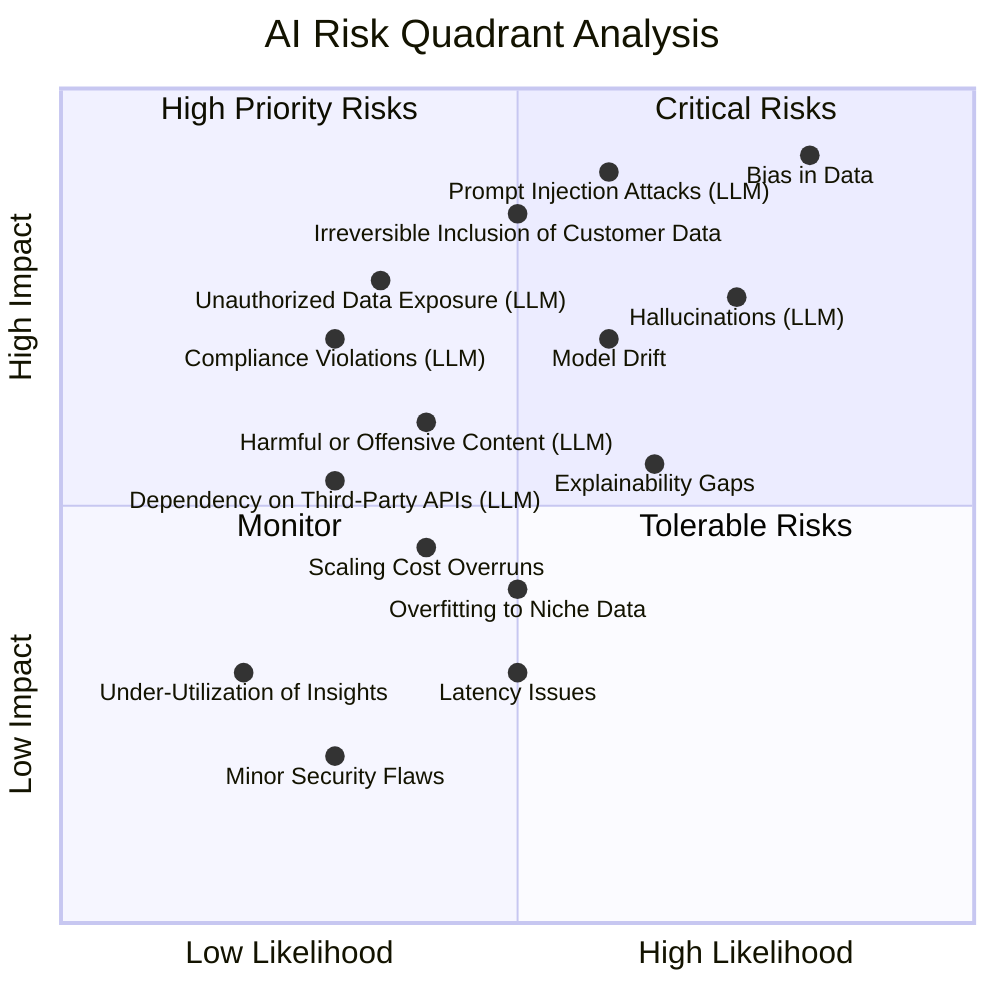
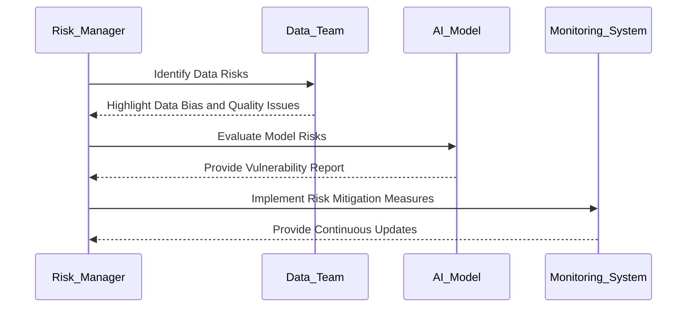
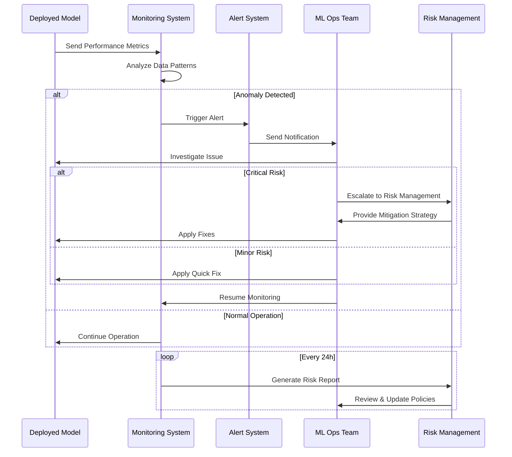

# AI Risk Assessment and Management  

## Introduction  

AI Risk Assessment and Management focuses on identifying, evaluating, and mitigating potential risks associated with AI systems. These risks span technical, operational, ethical, and regulatory domains and can significantly impact the reliability, fairness, and security of AI solutions. A robust risk management framework is essential for deploying trustworthy AI systems that align with business objectives and societal expectations.  

---

## Goals of AI Risk Assessment  

1. **Identify Risks**: Detect potential threats across the AI lifecycle, from data collection to model deployment.  
2. **Evaluate Impact**: Assess the severity and likelihood of risks.  
3. **Mitigate Threats**: Develop strategies to address identified risks effectively.  
4. **Monitor Continuously**: Establish ongoing processes for detecting and responding to emerging risks.  

---

## Common AI Risks  

| Risk Category              | Description                                                                     | Example Scenario                               |
|----------------------------|---------------------------------------------------------------------------------|-----------------------------------------------|
| **Data Risks**             | Issues with data quality, bias, or security.                                   | Biased datasets leading to discriminatory outcomes. |
| **Model Risks**            | Challenges like model drift, overfitting, or adversarial vulnerabilities.      | Models producing incorrect predictions under adversarial input. |
| **Operational Risks**      | Failures in infrastructure, scaling, or integration with existing systems.     | Inference latency during high traffic.        |
| **Ethical Risks**          | Unintended consequences of AI decisions or lack of fairness.                   | AI systems amplifying societal biases.        |
| **Regulatory Risks**       | Non-compliance with data privacy or industry-specific regulations.              | Violating GDPR or HIPAA requirements.         |

---

## AI Risk Management Framework  

An effective AI risk management framework includes the following steps:  

1. **Identify**: Catalog risks across data, model, and operations.  
2. **Assess**: Quantify risk severity and likelihood using defined metrics.  
3. **Mitigate**: Implement safeguards to reduce risks.  
4. **Monitor**: Continuously track risk factors and model performance.  

---

## Quadrant Analysis of AI Risks  

Using a quadrant framework, risks can be categorized based on their **likelihood** and **impact** to prioritize mitigation efforts.  

- **Critical Risks**: Bias in data and adversarial vulnerabilities.  
- **High Priority Risks**: Model drift and operational scaling.  
- **Monitor**: Latency issues and minor anomalies.  
- **Tolerable Risks**: Minor security flaws with low impact.  

---

## Risk Assessment Workflow  

A structured workflow ensures a systematic approach to identifying and managing AI risks.  

### Sequence Workflow  

---

## Tools and Techniques for AI Risk Management  

| Tool/Technique             | Purpose                                                                         | Example Solution                        |
|----------------------------|---------------------------------------------------------------------------------|-----------------------------------------|
| **Bias Detection Tools**   | Identify and measure biases in datasets or models.                             | IBM AI Fairness 360, Google What-If Tool |
| **Model Explainability**   | Understand and interpret model decisions.                                       | SHAP, LIME                              |
| **Adversarial Testing**    | Simulate attacks to evaluate model robustness.                                  | Foolbox, CleverHans                     |
| **Drift Detection**        | Detect changes in data distribution or model performance over time.             | Alibi Detect, Amazon SageMaker Monitor  |
| **Regulatory Compliance**  | Ensure adherence to data privacy and security laws.                             | Azure Purview, BigID                    |

---

## Mitigation Strategies  

### Data Risks  

- **Solution**: Use diverse and representative datasets to reduce bias.  
- **Tools**: Implement data preprocessing pipelines to clean and balance datasets.  

### Model Risks  

- **Solution**: Employ adversarial training and regular model evaluation.  
- **Tools**: Use drift detection and explainability frameworks for ongoing assessments.  

### Operational Risks  

- **Solution**: Ensure scalable infrastructure with redundancy and failover mechanisms.  
- **Tools**: Leverage Kubernetes and autoscaling for robust deployment.  

---

## Monitoring and Continuous Risk Management  

Monitoring is essential for detecting risks that emerge post-deployment.  

- **Performance Metrics**: Monitor accuracy, latency, and throughput.  
- **Incident Management**: Set up alerting systems to notify teams of anomalies.  
- **Regular Audits**: Conduct periodic reviews of data pipelines, models, and compliance adherence.  

The above sequence diagram shows:
- Continuous monitoring of model performance
- Anomaly detection and alert flow
- Risk escalation paths
- Routine reporting cycle
- Team collaboration points

---

## Best Practices  

1. **Holistic Approach**: Address risks across data, model, and infrastructure layers.  
2. **Risk Scoring**: Quantify risks using metrics like impact and likelihood to prioritize efforts.  
3. **Automation**: Use automated tools for monitoring and detecting anomalies.  
4. **Stakeholder Involvement**: Collaborate with data scientists, engineers, and legal teams for comprehensive risk management.  
5. **Proactive Testing**: Simulate edge cases and adversarial scenarios during development.  

---

## Conclusion  

AI Risk Assessment and Management is critical for building resilient and trustworthy AI systems. By systematically identifying, evaluating, and mitigating risks, organizations can ensure their AI solutions are robust, fair, and aligned with regulatory standards.  

---

By implementing robust risk management strategies, organizations can minimize vulnerabilities, maintain compliance, and ensure the success of their AI initiatives.  